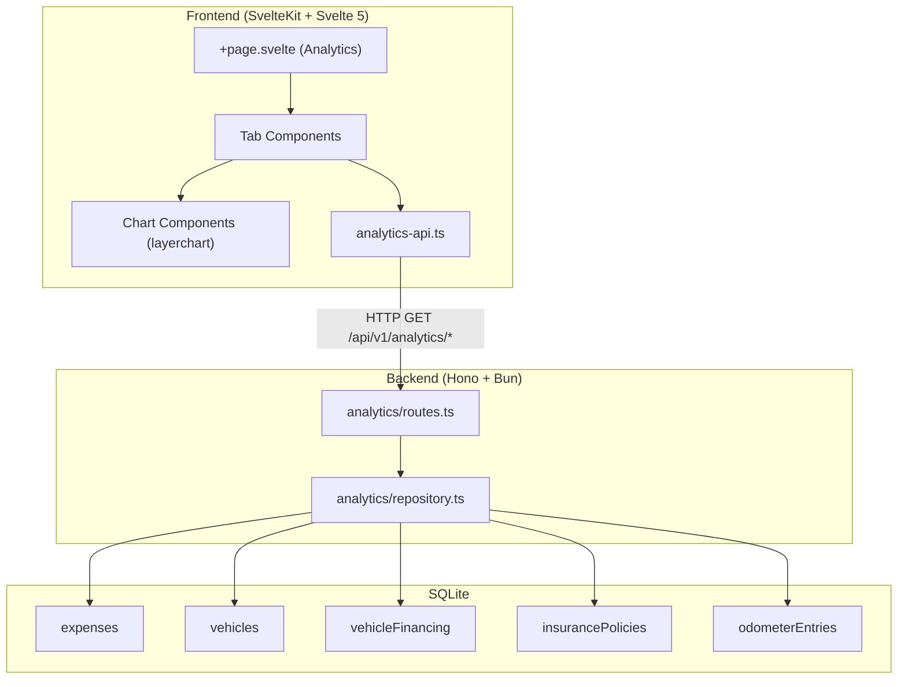
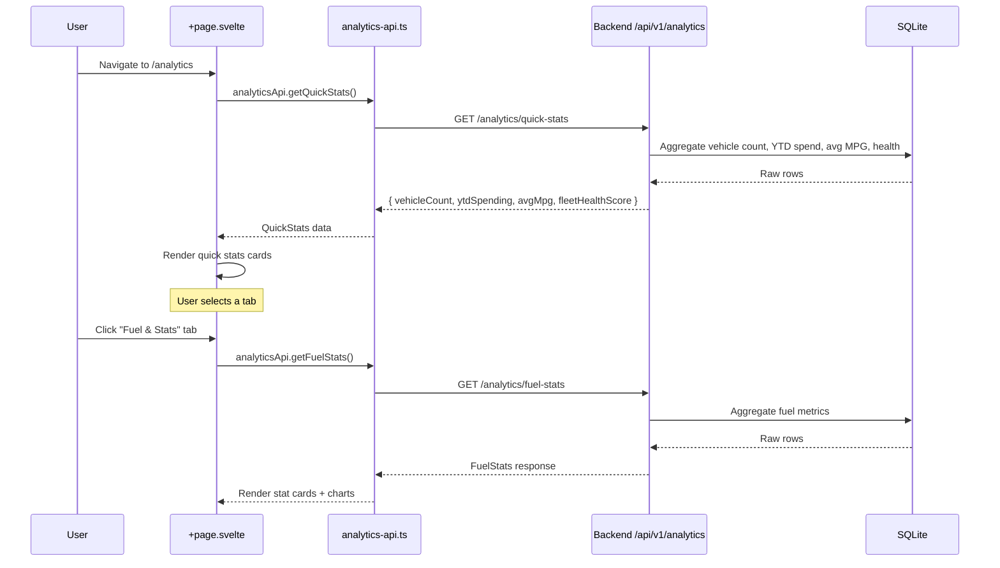
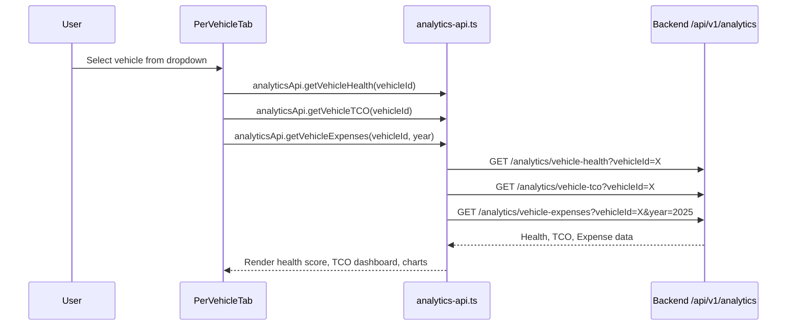

# Design Document: Analytics Page

## Overview

The analytics page is a comprehensive dashboard that provides vehicle owners with deep insights into their fleet's spending, fuel efficiency, financing, insurance, and overall vehicle health. It replaces the current placeholder "Coming Soon" page with a fully data-driven experience powered by new backend API endpoints that aggregate data from the existing `expenses`, `vehicles`, `vehicleFinancing`, `insurancePolicies`, and `odometerEntries` tables.

The page is organized into four tabs (Fuel & Stats, Cross-Vehicle, Per-Vehicle, Year-End Summary) plus always-visible quick stats at the top. The backend will expose a set of analytics-specific endpoints that perform server-side aggregation to minimize payload size and frontend computation. The frontend will use SvelteKit with Svelte 5 runes, shadcn-svelte components, and layerchart for all visualizations.

## Architecture



## Sequence Diagrams

### Page Load Flow



### Per-Vehicle Tab Flow



## Components and Interfaces

### Backend API Endpoints

All endpoints are read-only (GET), require authentication via `requireAuth`, and scope data to the authenticated user. No `changeTracker` middleware is needed since these are pure reads.

#### Endpoint 1: Quick Stats
`GET /api/v1/analytics/quick-stats`

**Purpose**: Powers the always-visible quick stats cards at the top of the page.

**Query Parameters**: `year` (optional, defaults to current year)

**Response**:
```typescript
interface QuickStatsResponse {
  vehicleCount: number;
  ytdSpending: number;
  avgMpg: number | null;
  fleetHealthScore: number;
}
```

#### Endpoint 2: Fuel Stats
`GET /api/v1/analytics/fuel-stats`

**Purpose**: Powers all stat cards and charts in the Fuel & Stats tab.

**Query Parameters**: `year` (optional, defaults to current year), `vehicleId` (optional, filter to one vehicle)

**Response**:
```typescript
interface FuelStatsResponse {
  // Stat cards
  fillups: {
    currentYear: number;
    previousYear: number;
    currentMonth: number;
    previousMonth: number;
  };
  gallons: {
    currentYear: number;
    previousYear: number;
    currentMonth: number;
    previousMonth: number;
  };
  fuelConsumption: {
    avgMpg: number | null;
    bestMpg: number | null;
    worstMpg: number | null;
  };
  fillupDetails: {
    avgVolume: number | null;
    minVolume: number | null;
    maxVolume: number | null;
  };
  averageCost: {
    perFillup: number | null;
    bestCostPerMile: number | null;
    worstCostPerMile: number | null;
    avgCostPerDay: number | null;
  };
  distance: {
    totalMiles: number;
    avgPerDay: number | null;
    avgPerMonth: number | null;
  };
  // Chart data
  monthlyConsumption: Array<{ month: string; mpg: number; gallons: number }>;
  gasPriceHistory: Array<{ date: string; fuelType: string; pricePerGallon: number }>;
  fillupCostByVehicle: Array<{ month: string; vehicleId: string; vehicleName: string; avgCost: number }>;
  odometerProgression: Array<{ month: string; vehicleId: string; vehicleName: string; mileage: number }>;
  costPerMile: Array<{ month: string; vehicleId: string; vehicleName: string; costPerMile: number }>;
}
```

#### Endpoint 3: Advanced Fuel Charts
`GET /api/v1/analytics/fuel-advanced`

**Purpose**: Powers the advanced charts section (maintenance timeline, seasonal efficiency, radar, day-of-week patterns, cost heatmap, fillup intervals).

**Query Parameters**: `year` (optional), `vehicleId` (optional)

**Response**:
```typescript
interface FuelAdvancedResponse {
  maintenanceTimeline: Array<{
    service: string;
    lastServiceDate: string;
    nextDueDate: string;
    daysRemaining: number;
    status: 'good' | 'warning' | 'overdue';
  }>;
  seasonalEfficiency: Array<{
    season: string;
    avgMpg: number;
    fillupCount: number;
  }>;
  vehicleRadar: Array<{
    vehicleId: string;
    vehicleName: string;
    fuelEfficiency: number;    // 0-100 normalized score
    maintenanceCost: number;   // 0-100 (lower cost = higher score)
    reliability: number;       // 0-100 based on maintenance regularity
    annualCost: number;        // 0-100 (lower cost = higher score)
    mileage: number;           // 0-100 normalized
  }>;
  dayOfWeekPatterns: Array<{
    day: string;
    fillupCount: number;
    avgCost: number;
    avgGallons: number;
  }>;
  monthlyCostHeatmap: Array<{
    month: string;
    fuel: number;
    maintenance: number;
    financial: number;
    regulatory: number;
    enhancement: number;
    misc: number;
  }>;
  fillupIntervals: Array<{
    intervalLabel: string;
    count: number;
  }>;
}
```

#### Endpoint 4: Cross-Vehicle Analytics
`GET /api/v1/analytics/cross-vehicle`

**Purpose**: Powers the Cross-Vehicle tab with fleet-wide comparisons.

**Query Parameters**: `year` (optional)

**Response**:
```typescript
interface CrossVehicleResponse {
  monthlyExpenseTrends: Array<{ month: string; amount: number }>;
  expenseByCategory: Array<{
    category: string;
    amount: number;
    percentage: number;
  }>;
  vehicleCostComparison: Array<{
    vehicleId: string;
    vehicleName: string;
    totalCost: number;
    costPerMile: number | null;
  }>;
  fuelEfficiencyComparison: Array<{
    month: string;
    vehicles: Array<{ vehicleId: string; vehicleName: string; mpg: number }>;
  }>;
}
```

#### Endpoint 5: Financing Overview
`GET /api/v1/analytics/financing`

**Purpose**: Powers the financing section within the Cross-Vehicle tab.

**Response**:
```typescript
interface FinancingResponse {
  summary: {
    totalMonthlyPayments: number;
    remainingBalance: number;
    interestPaidYtd: number;
    activeCount: number;
    loanCount: number;
    leaseCount: number;
  };
  vehicleDetails: Array<{
    vehicleId: string;
    vehicleName: string;
    financingType: 'loan' | 'lease' | 'own';
    monthlyPayment: number;
    remainingBalance: number;
    apr: number | null;
    interestPaid: number;
    monthsRemaining: number;
  }>;
  monthlyTimeline: Array<{
    month: string;
    vehicles: Array<{ vehicleId: string; vehicleName: string; amount: number }>;
  }>;
  typeDistribution: Array<{
    type: string;
    value: number;
    count: number;
  }>;
  loanBreakdown: Array<{
    month: string;
    interest: number;
    principal: number;
  }>;
}
```

#### Endpoint 6: Insurance Overview
`GET /api/v1/analytics/insurance`

**Purpose**: Powers the insurance section within the Cross-Vehicle tab.

**Response**:
```typescript
interface InsuranceResponse {
  summary: {
    totalMonthlyPremiums: number;
    totalAnnualPremiums: number;
    activePoliciesCount: number;
  };
  vehicleDetails: Array<{
    vehicleId: string;
    vehicleName: string;
    carrier: string;
    monthlyPremium: number;
    annualPremium: number;
    deductible: number | null;
    coverageType: string | null;
  }>;
  monthlyPremiumTrend: Array<{ month: string; premiums: number }>;
  costByCarrier: Array<{ carrier: string; annualPremium: number; vehicleCount: number }>;
}
```

#### Endpoint 7: Vehicle Health Score
`GET /api/v1/analytics/vehicle-health`

**Purpose**: Powers the health score card in the Per-Vehicle tab.

**Query Parameters**: `vehicleId` (required)

**Response**:
```typescript
interface VehicleHealthResponse {
  vehicleId: string;
  vehicleName: string;
  overallScore: number; // 0-100
  maintenanceRegularity: number; // 0-100, weight: 40%
  mileageIntervalAdherence: number; // 0-100, weight: 35%
  insuranceCoverage: number; // 0-100, weight: 25%
}
```

#### Endpoint 8: Vehicle TCO (Total Cost of Ownership)
`GET /api/v1/analytics/vehicle-tco`

**Purpose**: Powers the TCO dashboard and calculator in the Per-Vehicle tab.

**Query Parameters**: `vehicleId` (required), `year` (optional)

**Response**:
```typescript
interface VehicleTCOResponse {
  vehicleId: string;
  vehicleName: string;
  purchasePrice: number | null;
  financingInterest: number;
  insuranceCost: number;
  fuelCost: number;
  maintenanceCost: number;
  otherCosts: number;
  totalCost: number;
  ownershipMonths: number;
  totalMiles: number;
  costPerMile: number | null;
  costPerMonth: number;
  monthlyTrend: Array<{
    month: string;
    financing: number;
    insurance: number;
    fuel: number;
    maintenance: number;
  }>;
}
```

#### Endpoint 9: Vehicle Expenses
`GET /api/v1/analytics/vehicle-expenses`

**Purpose**: Powers per-vehicle maintenance costs, fuel efficiency, and expense breakdown charts.

**Query Parameters**: `vehicleId` (required), `year` (optional)

**Response**:
```typescript
interface VehicleExpensesResponse {
  maintenanceCosts: Array<{ month: string; cost: number }>;
  fuelEfficiencyAndCost: Array<{ month: string; mpg: number | null; cost: number }>;
  expenseBreakdown: Array<{ category: string; amount: number }>;
}
```

#### Endpoint 10: Year-End Summary
`GET /api/v1/analytics/year-end`

**Purpose**: Powers the Year-End Summary tab.

**Query Parameters**: `year` (required)

**Response**:
```typescript
interface YearEndResponse {
  year: number;
  totalSpent: number;
  categoryBreakdown: Array<{
    category: string;
    amount: number;
    percentage: number;
  }>;
  mpgTrend: Array<{ month: string; mpg: number }>;
  biggestExpense: {
    description: string;
    amount: number;
    date: string;
  } | null;
  previousYearComparison: {
    totalSpent: number;
    percentageChange: number;
  } | null;
  vehicleCount: number;
  totalMiles: number;
  avgMpg: number | null;
  costPerMile: number | null;
}
```

### Frontend Components

#### Component Hierarchy

```
routes/analytics/+page.svelte
├── QuickStats.svelte
├── Tabs (shadcn-svelte)
│   ├── FuelStatsTab.svelte
│   │   ├── ComparisonCard.svelte
│   │   ├── MetricCard.svelte
│   │   ├── FuelioCharts.svelte (layerchart)
│   │   └── AdvancedCharts.svelte (layerchart)
│   ├── CrossVehicleTab.svelte
│   │   ├── ExpenseTrendChart.svelte
│   │   ├── CategoryPieChart.svelte
│   │   ├── VehicleCostComparison.svelte
│   │   ├── FinancingOverview.svelte
│   │   └── InsuranceOverview.svelte
│   ├── PerVehicleTab.svelte
│   │   ├── VehicleSelector.svelte
│   │   ├── VehicleHealthScore.svelte
│   │   ├── TCODashboard.svelte
│   │   ├── TCOCalculator.svelte
│   │   └── VehicleCharts.svelte
│   └── YearEndTab.svelte
│       ├── AnnualReportCard.svelte
│       ├── KeyMetrics.svelte
│       └── YearComparison.svelte
```

**Responsibilities**:
- `+page.svelte`: Orchestrates tab state, loads quick stats on mount, lazy-loads tab data on tab switch
- `QuickStats.svelte`: Displays 4 summary cards (vehicle count, YTD spending, avg MPG, fleet health)
- Tab components: Each tab fetches its own data via `analyticsApi` when activated, manages loading/error states
- Chart components: Receive pre-shaped data as props, render using layerchart (not recharts)
- All components use shadcn-svelte primitives (Card, Badge, Tabs, Select, Progress) and semantic color tokens

## Data Models

### Category Mapping

The Figma uses display labels that must map to the actual expense category enum values:

| Figma Label | DB Category Value | Notes |
|---|---|---|
| Financial | `financial` | Includes financing payments and insurance premiums |
| Fuel & Charging | `fuel` | All fuel and EV charging expenses |
| Maintenance | `maintenance` | Service, repairs, parts |
| Regulatory | `regulatory` | Registration, inspection, taxes |
| Enhancement | `enhancement` | Upgrades, accessories |
| Misc | `misc` | Everything else |

### Derived Metrics (computed server-side)

| Metric | Derivation |
|---|---|
| MPG | `(current.mileage - previous.mileage) / current.fuelAmount` from sequential fuel expenses |
| Gas price/gallon | `expenseAmount / fuelAmount` on fuel category expenses |
| Cost per mile | `totalExpenses / totalMilesDriven` per vehicle |
| Fleet health score | Weighted average of all vehicle health scores |
| Vehicle health score | `maintenanceRegularity * 0.4 + mileageIntervalAdherence * 0.35 + insuranceCoverage * 0.25` |
| Maintenance regularity | Based on time gaps between maintenance expenses vs expected intervals |
| Insurance coverage | 100 if vehicle has active insurance policy, 0 otherwise |
| Interest paid YTD | Sum of `financial` expenses where `isFinancingPayment = true`, minus principal portion |
| Total miles | `max(odometer) - min(odometer)` from odometerEntries, or `max(mileage) - initialMileage` from expenses |

## Key Functions with Formal Specifications

### Repository: `getQuickStats(userId: string, year: number)`

```typescript
async getQuickStats(userId: string, year: number): Promise<QuickStatsData>
```

**Preconditions:**
- `userId` is a valid, non-empty string referencing an existing user
- `year` is a positive integer (e.g. 2024, 2025)

**Postconditions:**
- `vehicleCount >= 0` and equals the count of vehicles owned by the user
- `ytdSpending >= 0` and equals the sum of all expense amounts for the user's vehicles in the given year
- `avgMpg` is null if no fuel efficiency data exists, otherwise a positive number
- `fleetHealthScore` is between 0 and 100 inclusive

### Repository: `getFuelStats(userId: string, year: number, vehicleId?: string)`

```typescript
async getFuelStats(userId: string, year: number, vehicleId?: string): Promise<FuelStatsData>
```

**Preconditions:**
- `userId` is a valid user ID
- `year` is a positive integer
- If `vehicleId` is provided, it must belong to the user

**Postconditions:**
- All count fields (`fillups.currentYear`, etc.) are non-negative integers
- All volume fields (`gallons.*`) are non-negative numbers
- `fuelConsumption.avgMpg` is null or within realistic bounds (5-100 MPG for gas, 1-10 mi/kWh for electric)
- `fillupDetails.minVolume <= fillupDetails.avgVolume <= fillupDetails.maxVolume` when all are non-null
- `monthlyConsumption` has at most 12 entries, one per month
- `gasPriceHistory` entries have `pricePerGallon > 0`

**Loop Invariants:**
- When iterating sequential fuel expenses to compute MPG: all previously computed efficiency points have realistic values

### Repository: `getVehicleHealthScore(userId: string, vehicleId: string)`

```typescript
async getVehicleHealthScore(userId: string, vehicleId: string): Promise<VehicleHealthData>
```

**Preconditions:**
- `userId` is a valid user ID
- `vehicleId` belongs to the user

**Postconditions:**
- `overallScore = round(maintenanceRegularity * 0.4 + mileageIntervalAdherence * 0.35 + insuranceCoverage * 0.25)`
- Each sub-score is between 0 and 100 inclusive
- `insuranceCoverage` is 100 if vehicle has an active insurance policy, 0 otherwise

### Repository: `getYearEndSummary(userId: string, year: number)`

```typescript
async getYearEndSummary(userId: string, year: number): Promise<YearEndData>
```

**Preconditions:**
- `userId` is a valid user ID
- `year` is a positive integer

**Postconditions:**
- `totalSpent >= 0` and equals sum of all expenses for the year
- `categoryBreakdown` percentages sum to approximately 100 (within floating point tolerance)
- `biggestExpense` is null if no expenses exist, otherwise has the highest `expenseAmount` for the year
- If `previousYearComparison` is non-null, `percentageChange = ((totalSpent - previousYearTotal) / previousYearTotal) * 100`
- `mpgTrend` has at most 12 entries

## Algorithmic Pseudocode

### Vehicle Health Score Computation

```typescript
function computeVehicleHealthScore(
  vehicleId: string,
  maintenanceExpenses: Expense[],
  odometerEntries: OdometerEntry[],
  hasActiveInsurance: boolean
): VehicleHealthData {
  // 1. Maintenance Regularity (40% weight)
  // Score based on how regularly maintenance expenses occur
  // Expected: at least one maintenance expense every 90 days
  const maintenanceDates = maintenanceExpenses
    .filter(e => e.category === 'maintenance')
    .map(e => e.date)
    .sort((a, b) => a.getTime() - b.getTime());

  let regularityScore = 100;
  if (maintenanceDates.length < 2) {
    // If fewer than 2 maintenance records, check if vehicle is new (< 90 days old)
    // New vehicles get benefit of the doubt
    regularityScore = maintenanceDates.length === 0 ? 50 : 75;
  } else {
    const gaps: number[] = [];
    for (let i = 1; i < maintenanceDates.length; i++) {
      const daysBetween = (maintenanceDates[i]!.getTime() - maintenanceDates[i-1]!.getTime()) / (1000 * 60 * 60 * 24);
      gaps.push(daysBetween);
    }
    // Penalize for gaps > 90 days
    const overdueGaps = gaps.filter(g => g > 90);
    regularityScore = Math.max(0, 100 - (overdueGaps.length / gaps.length) * 100);
  }

  // 2. Mileage Interval Adherence (35% weight)
  // Check if oil changes happen at proper mileage intervals (~5000 miles)
  const oilChanges = maintenanceExpenses
    .filter(e => e.mileage != null)
    .sort((a, b) => (a.mileage ?? 0) - (b.mileage ?? 0));

  let mileageScore = 100;
  if (oilChanges.length < 2) {
    mileageScore = 50;
  } else {
    const mileageGaps: number[] = [];
    for (let i = 1; i < oilChanges.length; i++) {
      const gap = (oilChanges[i]!.mileage ?? 0) - (oilChanges[i-1]!.mileage ?? 0);
      mileageGaps.push(gap);
    }
    // Ideal interval: 3000-7000 miles. Penalize outside this range.
    const goodIntervals = mileageGaps.filter(g => g >= 3000 && g <= 7000);
    mileageScore = Math.round((goodIntervals.length / mileageGaps.length) * 100);
  }

  // 3. Insurance Coverage (25% weight)
  const insuranceScore = hasActiveInsurance ? 100 : 0;

  // Weighted composite
  const overallScore = Math.round(
    regularityScore * 0.4 + mileageScore * 0.35 + insuranceScore * 0.25
  );

  return { overallScore, maintenanceRegularity: regularityScore, mileageIntervalAdherence: mileageScore, insuranceCoverage: insuranceScore };
}
```

### Maintenance Timeline Estimation

```typescript
function estimateMaintenanceTimeline(
  maintenanceExpenses: Expense[],
  now: Date
): MaintenanceTimelineItem[] {
  // Group maintenance expenses by description/tag to identify service types
  const serviceGroups = new Map<string, Expense[]>();
  for (const expense of maintenanceExpenses) {
    const key = expense.description?.toLowerCase().trim() ?? 'general maintenance';
    const group = serviceGroups.get(key) ?? [];
    group.push(expense);
    serviceGroups.set(key, group);
  }

  const timeline: MaintenanceTimelineItem[] = [];

  for (const [service, expenses] of serviceGroups) {
    if (expenses.length === 0) continue;

    // Sort by date descending to get most recent
    expenses.sort((a, b) => b.date.getTime() - a.date.getTime());
    const lastService = expenses[0]!;

    // Estimate interval from historical data (avg days between services)
    let estimatedIntervalDays = 180; // default 6 months
    if (expenses.length >= 2) {
      const intervals: number[] = [];
      for (let i = 0; i < expenses.length - 1; i++) {
        const days = (expenses[i]!.date.getTime() - expenses[i+1]!.date.getTime()) / (1000 * 60 * 60 * 24);
        if (days > 0) intervals.push(days);
      }
      if (intervals.length > 0) {
        estimatedIntervalDays = Math.round(intervals.reduce((a, b) => a + b, 0) / intervals.length);
      }
    }

    const nextDueDate = new Date(lastService.date.getTime() + estimatedIntervalDays * 24 * 60 * 60 * 1000);
    const daysRemaining = Math.round((nextDueDate.getTime() - now.getTime()) / (1000 * 60 * 60 * 24));

    let status: 'good' | 'warning' | 'overdue' = 'good';
    if (daysRemaining < 0) status = 'overdue';
    else if (daysRemaining < 30) status = 'warning';

    timeline.push({
      service,
      lastServiceDate: lastService.date.toISOString(),
      nextDueDate: nextDueDate.toISOString(),
      daysRemaining,
      status,
    });
  }

  return timeline.sort((a, b) => a.daysRemaining - b.daysRemaining);
}
```

### Fillup Interval Distribution

```typescript
function computeFillupIntervals(
  fuelExpenses: Expense[]
): Array<{ intervalLabel: string; count: number }> {
  // Sort fuel expenses by date
  const sorted = fuelExpenses
    .filter(e => e.category === 'fuel')
    .sort((a, b) => a.date.getTime() - b.date.getTime());

  if (sorted.length < 2) return [];

  // Compute day gaps between consecutive fillups
  const gaps: number[] = [];
  for (let i = 1; i < sorted.length; i++) {
    const days = Math.round(
      (sorted[i]!.date.getTime() - sorted[i-1]!.date.getTime()) / (1000 * 60 * 60 * 24)
    );
    if (days > 0) gaps.push(days);
  }

  // Bucket into intervals
  const buckets = [
    { label: '1-3 days', min: 1, max: 3, count: 0 },
    { label: '4-7 days', min: 4, max: 7, count: 0 },
    { label: '8-14 days', min: 8, max: 14, count: 0 },
    { label: '15-21 days', min: 15, max: 21, count: 0 },
    { label: '22+ days', min: 22, max: Infinity, count: 0 },
  ];

  for (const gap of gaps) {
    const bucket = buckets.find(b => gap >= b.min && gap <= b.max);
    if (bucket) bucket.count++;
  }

  return buckets
    .filter(b => b.count > 0)
    .map(b => ({ intervalLabel: b.label, count: b.count }));
}
```

## Example Usage

### Frontend: Loading Analytics Data

```typescript
// In +page.svelte (using Svelte 5 runes)
import { analyticsApi } from '$lib/services/analytics-api';
import { onMount } from 'svelte';

let quickStats = $state<QuickStatsResponse | null>(null);
let activeTab = $state('fuelio');
let loading = $state(false);
let error = $state<string | null>(null);

onMount(async () => {
  try {
    loading = true;
    quickStats = await analyticsApi.getQuickStats();
  } catch (e) {
    error = 'Failed to load analytics';
  } finally {
    loading = false;
  }
});

// Tab data loaded on tab change via explicit handler
async function handleTabChange(tab: string) {
  activeTab = tab;
  // Each tab component handles its own data loading
}
```

### Backend: Route Handler Pattern

```typescript
// GET /api/v1/analytics/quick-stats
routes.get('/quick-stats', zValidator('query', yearQuerySchema), async (c) => {
  const user = c.get('user');
  const { year } = c.req.valid('query');
  const currentYear = year ?? new Date().getFullYear();

  const data = await analyticsRepository.getQuickStats(user.id, currentYear);
  return c.json({ success: true, data });
});
```

### Frontend: Analytics API Service Extension

```typescript
// analytics-api.ts additions
export const analyticsApi = {
  // ... existing getFuelEfficiency ...

  async getQuickStats(params?: { year?: number }): Promise<QuickStatsResponse> {
    const query = new URLSearchParams();
    if (params?.year) query.set('year', String(params.year));
    const qs = query.toString();
    return apiClient.get<QuickStatsResponse>(
      `/api/v1/analytics/quick-stats${qs ? `?${qs}` : ''}`
    );
  },

  async getFuelStats(params?: { year?: number; vehicleId?: string }): Promise<FuelStatsResponse> {
    const query = new URLSearchParams();
    if (params?.year) query.set('year', String(params.year));
    if (params?.vehicleId) query.set('vehicleId', params.vehicleId);
    const qs = query.toString();
    return apiClient.get<FuelStatsResponse>(
      `/api/v1/analytics/fuel-stats${qs ? `?${qs}` : ''}`
    );
  },

  // Similar pattern for all other endpoints...
};
```

## Correctness Properties

*A property is a characteristic or behavior that should hold true across all valid executions of a system — essentially, a formal statement about what the system should do. Properties serve as the bridge between human-readable specifications and machine-verifiable correctness guarantees.*

### Property 1: Expense sum computation

*For any* user and year, the reported YTD spending (in quick stats or year-end summary) should equal the sum of all expense amounts for that user's vehicles in the given year.

**Validates: Requirements 2.4, 12.2**

### Property 2: Vehicle count computation

*For any* user, the reported vehicle count should equal the number of vehicles owned by that user in the database.

**Validates: Requirement 2.5**

### Property 3: Fleet health score is bounded weighted average

*For any* user with one or more vehicles, the fleet health score should equal the weighted average of all individual vehicle health scores, and the result should be between 0 and 100 inclusive.

**Validates: Requirement 2.6**

### Property 4: Category percentages sum to 100

*For any* non-empty set of expenses, the category breakdown percentages should sum to approximately 100 (within ±0.1 floating-point tolerance).

**Validates: Requirements 6.3, 12.3**

### Property 5: Cost per mile formula

*For any* vehicle or fleet-wide computation, cost per mile should equal total cost divided by total miles when total miles is greater than zero, and null otherwise.

**Validates: Requirements 6.4, 10.3**

### Property 6: Vehicle ownership validation

*For any* per-vehicle analytics endpoint and any vehicle ID that does not belong to the authenticated user, the endpoint should return a 404 error.

**Validates: Requirements 4.3, 9.7, 10.5, 11.3, 13.3**

### Property 7: Year scoping filters correctly

*For any* analytics endpoint that accepts a year parameter, the returned data should only include expenses whose date falls within the specified year.

**Validates: Requirements 2.2, 11.2**

### Property 8: Monthly arrays bounded to 12 entries

*For any* analytics response containing monthly data arrays (monthlyConsumption, mpgTrend, etc.), the array should contain at most 12 entries.

**Validates: Requirements 4.6, 12.7**

### Property 9: All computed scores bounded [0, 100]

*For any* vehicle, all computed scores (health sub-scores, overall health score, and vehicle radar scores) should be between 0 and 100 inclusive.

**Validates: Requirements 9.3, 5.4**

### Property 10: Health score formula

*For any* vehicle, the overall health score should equal `round(maintenanceRegularity × 0.4 + mileageIntervalAdherence × 0.35 + insuranceCoverage × 0.25)`.

**Validates: Requirement 9.2**

### Property 11: Insurance coverage is binary

*For any* vehicle, the insurance coverage sub-score should be 100 when the vehicle has an active insurance policy, and 0 otherwise.

**Validates: Requirement 9.4**

### Property 12: Maintenance regularity penalizes large gaps

*For any* vehicle with maintenance expenses, the maintenance regularity score should decrease as the proportion of gaps exceeding 90 days increases.

**Validates: Requirement 9.5**

### Property 13: Mileage adherence scores good intervals

*For any* vehicle with maintenance expenses that have mileage data, the mileage interval adherence score should increase as the proportion of intervals within 3000-7000 miles increases.

**Validates: Requirement 9.6**

### Property 14: TCO total equals sum of components

*For any* vehicle, the TCO total cost should equal the sum of purchase price, financing interest, insurance cost, fuel cost, maintenance cost, and other costs.

**Validates: Requirement 10.2**

### Property 15: Cost per month formula

*For any* vehicle with positive ownership months, cost per month should equal total cost divided by ownership months.

**Validates: Requirement 10.4**

### Property 16: Fuel volume ordering invariant

*For any* non-empty set of fuel expenses, the fillup details should satisfy `minVolume <= avgVolume <= maxVolume`.

**Validates: Requirement 4.4**

### Property 17: MPG computation from consecutive expenses

*For any* pair of consecutive fuel expenses with valid mileage readings, MPG should equal `(currentMileage - previousMileage) / fuelAmount`.

**Validates: Requirement 4.5**

### Property 18: Gas price always positive

*For any* fuel expense in the gas price history, the price per gallon should be a positive number.

**Validates: Requirement 4.7**

### Property 19: Vehicle ID filtering returns only that vehicle's data

*For any* analytics endpoint that accepts a vehicleId filter, all returned data should pertain exclusively to the specified vehicle.

**Validates: Requirement 4.2**

### Property 20: Maintenance timeline status assignment

*For any* maintenance timeline item, the status should be `overdue` when days remaining is negative, `warning` when days remaining is between 0 and 29 inclusive, and `good` when days remaining is 30 or more.

**Validates: Requirement 5.3**

### Property 21: Fillup interval bucketing completeness

*For any* set of consecutive fuel expenses, the sum of counts across all fillup interval buckets should equal the number of consecutive date gaps (i.e., no data is lost during bucketing).

**Validates: Requirement 5.5**

### Property 22: Heatmap uses valid expense categories

*For any* monthly cost heatmap entry, the category keys should be exactly the six valid values: fuel, maintenance, financial, regulatory, enhancement, and misc.

**Validates: Requirement 5.6**

### Property 23: Unfinanced vehicles classified as own

*For any* vehicle without a financing record, the financing type should be classified as `own`.

**Validates: Requirement 7.4**

### Property 24: Biggest expense is the maximum

*For any* non-empty set of expenses in a given year, the reported biggest expense amount should be greater than or equal to every other expense amount in that year.

**Validates: Requirement 12.4**

### Property 25: Year-over-year percentage change formula

*For any* two consecutive years where the previous year has positive total spending, the percentage change should equal `((currentYearTotal - previousYearTotal) / previousYearTotal) × 100`.

**Validates: Requirement 12.5**

### Property 26: Authentication required on all endpoints

*For any* analytics endpoint, an unauthenticated request should be rejected with an appropriate error status.

**Validates: Requirement 13.1**

### Property 27: User data isolation

*For any* two distinct users, analytics data returned for user A should never contain vehicles or expenses belonging to user B.

**Validates: Requirement 13.2**

### Property 28: Invalid parameters rejected with 400

*For any* analytics endpoint, providing a non-integer year or invalid vehicleId format should result in a 400 error response.

**Validates: Requirements 14.2, 14.3**

## Error Handling

### Error Scenario 1: No Data Available
**Condition**: User has no vehicles or no expenses
**Response**: Return valid response with zero counts, null averages, empty arrays
**Recovery**: Frontend shows empty state with guidance to add vehicles/expenses

### Error Scenario 2: Invalid Vehicle ID
**Condition**: `vehicleId` parameter doesn't belong to the authenticated user
**Response**: Throw `NotFoundError('Vehicle')` — returns 404
**Recovery**: Frontend shows error toast, redirects to analytics home

### Error Scenario 3: Database Query Failure
**Condition**: SQLite query fails (corruption, lock timeout)
**Response**: Repository throws `DatabaseError` with original error as details — returns 500
**Recovery**: Frontend shows retry button, logs error server-side via `logger`

### Error Scenario 4: Invalid Year Parameter
**Condition**: `year` query parameter is not a valid integer
**Response**: Zod validation rejects with 400 error before handler executes
**Recovery**: Frontend defaults to current year if user-provided year is invalid

## Testing Strategy

### Unit Testing Approach

- Repository methods tested with in-memory SQLite (same pattern as existing `fuel-efficiency.property.test.ts`)
- Each aggregation query tested with known seed data to verify correct sums, averages, and groupings
- Edge cases: empty data, single vehicle, single expense, expenses spanning year boundaries

### Property-Based Testing Approach

**Property Test Library**: `fast-check` (already used in the project)

Key properties to test:
- For any set of expenses, `ytdSpending` equals the sum of `expenseAmount` values
- For any set of fuel expenses with valid mileage, computed MPG values are within realistic bounds
- Health score is always between 0-100 regardless of input data
- Category breakdown percentages always sum to ~100% when expenses exist
- TCO cost per mile is always positive when miles > 0
- Fillup interval buckets account for all intervals (no data loss)

### Integration Testing Approach

- End-to-end tests via Playwright verifying:
  - Analytics page loads without errors
  - Quick stats display correct values
  - Tab switching loads appropriate data
  - Vehicle selector in Per-Vehicle tab filters data correctly
  - Charts render without console errors

## Performance Considerations

- All aggregation happens server-side in SQL to minimize data transfer
- Endpoints are scoped by year to limit query scope (no unbounded full-table scans)
- The `monthlyExpenseTrends` endpoint in Cross-Vehicle returns all-time data — consider pagination or limiting to last 36 months if performance degrades
- Odometer progression queries use the indexed `odometer_vehicle_date_idx` index
- Frontend lazy-loads tab data only when the tab is activated (not all at once on page load)
- Consider adding `Cache-Control` headers for analytics responses since data changes infrequently (cache for 60 seconds)

## Security Considerations

- All endpoints require authentication via `requireAuth` middleware
- All queries filter by `userId` to prevent cross-user data access
- Vehicle ownership is verified before returning per-vehicle data
- No write operations — all endpoints are read-only GET requests, so `changeTracker` is not needed
- Query parameters are validated via Zod schemas to prevent injection

## Dependencies

- **Backend**: Existing Drizzle ORM, Hono framework, Zod validation — no new dependencies
- **Frontend**: Existing layerchart, shadcn-svelte, lucide-svelte — no new dependencies
- **Database**: No schema changes required — all data is derived from existing tables (expenses, vehicles, vehicleFinancing, insurancePolicies, insurancePolicyVehicles, odometerEntries)
