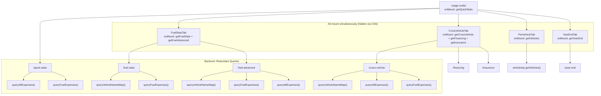
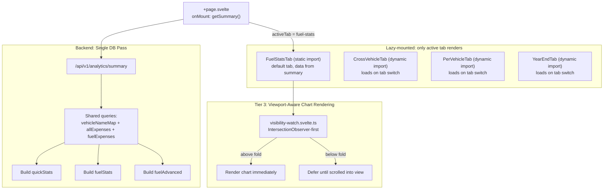
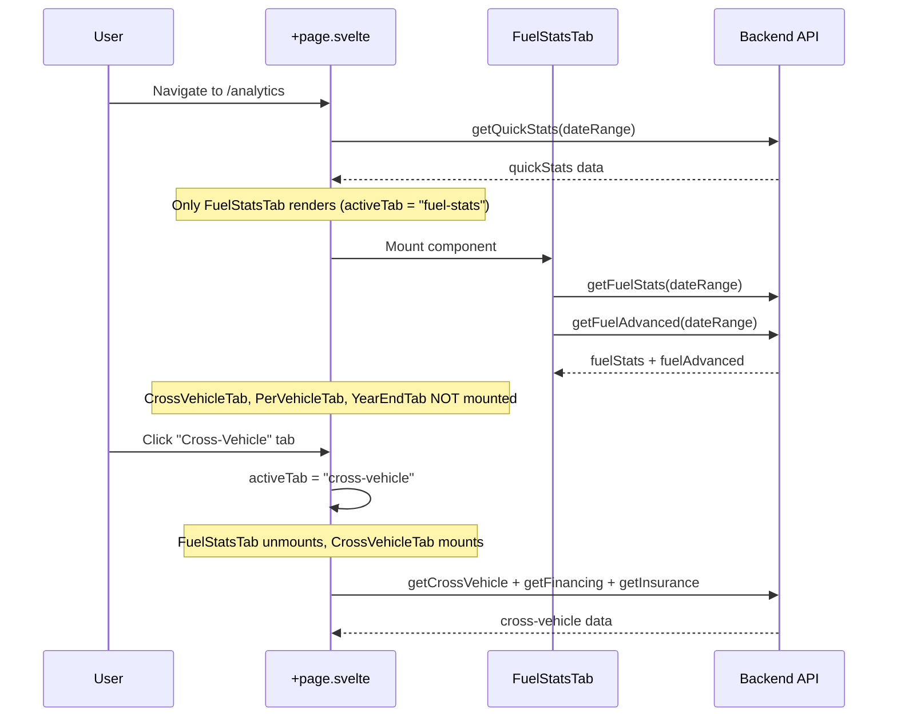
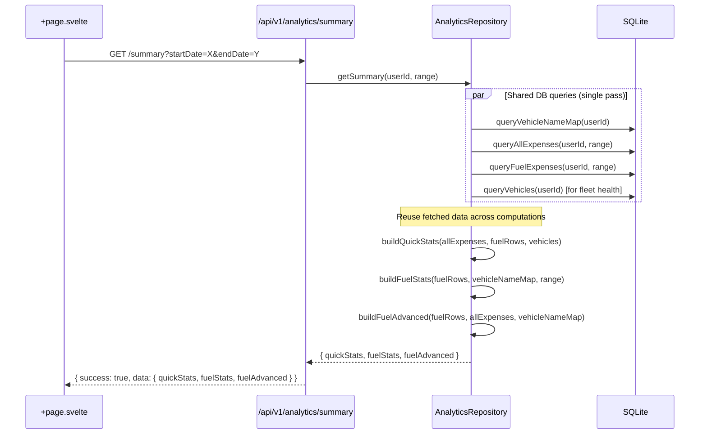
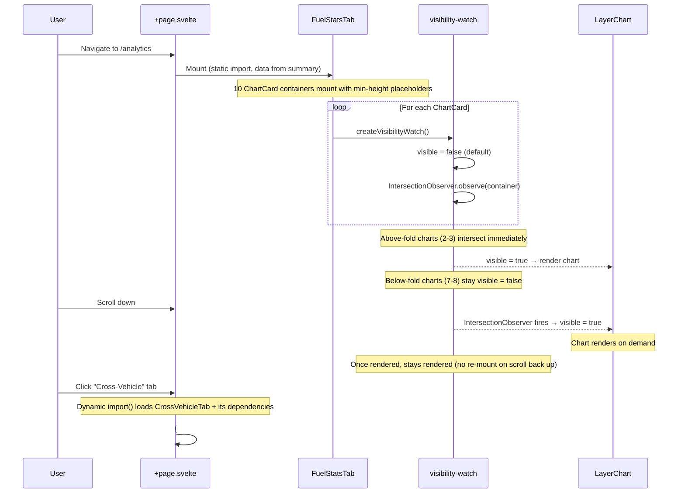

# Design Document: Analytics Performance Optimization

## Overview

The analytics page (`/analytics`) currently suffers from excessive API calls and redundant backend queries. All four tab components (Fuel Stats, Cross-Vehicle, Per-Vehicle, Year-End) mount eagerly due to shadcn-svelte's Tabs implementation (which renders all content in DOM, hidden via CSS). This triggers 8 simultaneous API calls on page load, with the backend independently re-querying the same data (vehicle names, fuel expenses, all expenses) across multiple endpoints.

This design addresses the problem in three tiers: (1) lazy-mount tab content to eliminate wasted API calls from hidden tabs, (2) consolidate the initial page load into a single `/api/v1/analytics/summary` endpoint that shares a single DB pass for common data, and (3) optimize client-side chart rendering by deferring below-fold charts and code-splitting non-default tab components.

## Architecture

### Current Architecture (Before)



**Problem**: 8 API calls on load, with `queryVehicleNameMap()` called 3×, `queryFuelExpenses()` called 4×, and `queryAllExpenses()` called 3× — all for the same user and date range.

### Target Architecture (After All Tiers)



**Result**: 1 API call on initial load. Only above-fold charts render immediately (~2-3 instead of 10). Non-default tab JS is deferred via dynamic imports.


## Sequence Diagrams

### Tier 1: Lazy-Mount Tab Content (Current → Fixed)



### Tier 2: Consolidated Summary Endpoint



### Tier 3: Viewport-Aware Chart Rendering + Dynamic Imports



## Components and Interfaces

### Tier 1: Frontend — Lazy Tab Mounting

**Component**: `frontend/src/routes/analytics/+page.svelte`

**Current behavior**: Uses `<Tabs.Content>` which renders all children in DOM (hidden via CSS `display: none`). Each tab's `onMount` fires immediately.

**New behavior**: Replace `<Tabs.Content>` children with conditional `{#if}` blocks keyed on `activeTab`. Only the active tab's component is in the DOM.

```typescript
// Page state
let activeTab = $state('fuel-stats');

// Track which tabs have been loaded (preserve data on tab switch back)
let loadedTabs = $state(new Set<string>(['fuel-stats']));

// When tab changes, mark it as loaded
$effect(() => {
  loadedTabs.add(activeTab);
});
```

**Responsibilities**:
- Render only the active tab component
- Track previously-loaded tabs to optionally cache their DOM
- Reduce initial API calls from 8 to 3 (quick-stats + fuel-stats + fuel-advanced)

### Tier 2: Backend — Consolidated Summary Endpoint

**Component**: New route `GET /api/v1/analytics/summary`

**Interface**:
```typescript
// Request query params (same dateRangeQuerySchema as existing endpoints)
interface SummaryQuery {
  startDate: number; // unix timestamp (seconds)
  endDate: number;   // unix timestamp (seconds)
}

// Response shape
interface AnalyticsSummaryData {
  quickStats: QuickStatsData;
  fuelStats: FuelStatsData;
  fuelAdvanced: FuelAdvancedData;
}
```

**Responsibilities**:
- Accept date range, authenticate user via `requireAuth`
- Call `analyticsRepository.getSummary()` which runs shared queries once
- Return combined payload in standard `{ success: true, data }` format

### Tier 2: Backend — Repository `getSummary()` Method

**Interface**:
```typescript
class AnalyticsRepository {
  async getSummary(
    userId: string,
    range: DateRange
  ): Promise<AnalyticsSummaryData> {
    // Single pass: query shared data once
    const [vehicleNameMap, vehicleRows, allExpenses, fuelRows, prevYearAgg] = 
      await Promise.all([
        this.queryVehicleNameMap(userId),
        this.queryVehicleRows(userId),
        this.queryAllExpenses(userId, range),
        this.queryFuelExpenses(userId, range),
        this.queryFuelAggregates(userId, prevRange),
      ]);

    // Reuse fetched data for all three computations
    const quickStats = this.buildQuickStatsFromData(vehicleRows, allExpenses, fuelRows);
    const fuelStats = this.buildFuelStatsFromData(fuelRows, vehicleNameMap, range, prevYearAgg);
    const fuelAdvanced = this.buildFuelAdvancedFromData(fuelRows, allExpenses, vehicleNameMap, range);

    return { quickStats, fuelStats, fuelAdvanced };
  }
}
```

**Responsibilities**:
- Execute shared DB queries once via `Promise.all`
- Pass pre-fetched data to computation functions (no re-querying)
- Eliminate redundant calls: `queryVehicleNameMap` 1× (was 3×), `queryFuelExpenses` 1× (was 4×), `queryAllExpenses` 1× (was 3×)

### Tier 2: Frontend — `analyticsApi.getSummary()`

**Interface**:
```typescript
// In analytics-api.ts
interface AnalyticsSummaryResponse {
  quickStats: QuickStatsResponse;
  fuelStats: FuelStatsResponse;
  fuelAdvanced: FuelAdvancedResponse;
}

export const analyticsApi = {
  // ... existing methods unchanged ...

  async getSummary(params: {
    startDate: number;
    endDate: number;
  }): Promise<AnalyticsSummaryResponse> {
    return apiClient.get<AnalyticsSummaryResponse>(
      `/api/v1/analytics/summary${buildQuery({
        startDate: params.startDate,
        endDate: params.endDate,
      })}`
    );
  },
};
```

## Data Models

### New Type: `AnalyticsSummaryResponse` (Frontend)

```typescript
// frontend/src/lib/types.ts
export interface AnalyticsSummaryResponse {
  quickStats: QuickStatsResponse;
  fuelStats: FuelStatsResponse;
  fuelAdvanced: FuelAdvancedResponse;
}
```

No new database tables or schema changes required. All data comes from existing `expenses`, `vehicles`, `vehicle_financing`, `insurance_policies`, and `insurance_policy_vehicles` tables.


## Key Functions with Formal Specifications

### Function 1: `getSummary()` (Repository)

```typescript
async getSummary(userId: string, range: DateRange): Promise<AnalyticsSummaryData>
```

**Preconditions:**
- `userId` is a non-empty string corresponding to an authenticated user
- `range.start < range.end` (valid date range)
- `range.start` and `range.end` are positive integers (unix timestamps in seconds)
- Database connection is available

**Postconditions:**
- Returns `AnalyticsSummaryData` containing `quickStats`, `fuelStats`, and `fuelAdvanced`
- Result is identical to calling `getQuickStats()`, `getFuelStats()`, and `getFuelAdvanced()` independently with the same parameters
- `queryVehicleNameMap()` is called exactly once (not 3×)
- `queryFuelExpenses()` is called exactly once (not 4×)
- `queryAllExpenses()` is called exactly once (not 3×)
- Throws `DatabaseError` on any DB failure

**Loop Invariants:** N/A (parallel queries, no loops)

### Function 2: Lazy Tab Mounting (Frontend)

```typescript
// In +page.svelte — conditional rendering logic
let activeTab = $state('fuel-stats');
```

**Preconditions:**
- `activeTab` is one of `'fuel-stats' | 'cross-vehicle' | 'per-vehicle' | 'year-end'`

**Postconditions:**
- Only the component matching `activeTab` is in the DOM
- Only the active component's `onMount` fires
- Switching tabs destroys the previous component and mounts the new one
- No API calls are made for tabs that are not active

### Function 3: `createVisibilityWatch()` — Viewport-Aware (Tier 3)

```typescript
export function createVisibilityWatch(): VisibilityWatchResult
```

**Preconditions:**
- Called within a Svelte 5 component context (uses `$state` and `$effect`)
- The bound element (`el`) is an HTMLDivElement with a `min-height` set (placeholder sizing)

**Postconditions:**
- `visible` starts as `false` for all elements (not `true` for above-fold elements)
- `visible` flips to `true` only when IntersectionObserver reports the element is intersecting the viewport
- Once `visible` has been `true`, it remains `true` even when scrolled out of view (no re-mount thrashing)
- Elements inside `display: none` containers (hidden tabs) remain `visible = false` via MutationObserver on `hidden` attribute
- Cleanup disconnects both IntersectionObserver and MutationObserver

## Algorithmic Pseudocode

### Algorithm 1: Consolidated Summary — Shared Query Pass

```typescript
// AnalyticsRepository.getSummary()
async getSummary(userId: string, range: DateRange): Promise<AnalyticsSummaryData> {
  try {
    const prevRange: DateRange = {
      start: range.start - (range.end - range.start),
      end: range.start,
    };

    // Step 1: Execute ALL shared queries in parallel (single DB pass)
    const [vehicleNameMap, vehicleRows, allExpenses, fuelRows, prevYearAgg] =
      await Promise.all([
        this.queryVehicleNameMap(userId),
        this.db.select({ id: vehicles.id, currentInsurancePolicyId: vehicles.currentInsurancePolicyId })
          .from(vehicles).where(eq(vehicles.userId, userId)),
        this.queryAllExpenses(userId, range),
        this.queryFuelExpenses(userId, range),
        this.queryFuelAggregates(userId, prevRange),
      ]);

    // Step 2: Sort fuel rows once (reused by quickStats, fuelStats, fuelAdvanced)
    const fuelRowsByVehicle = [...fuelRows].sort((a, b) => {
      if (a.vehicleId !== b.vehicleId) return a.vehicleId.localeCompare(b.vehicleId);
      const aTime = a.date instanceof Date ? a.date.getTime() : Number(a.date);
      const bTime = b.date instanceof Date ? b.date.getTime() : Number(b.date);
      return aTime - bTime;
    });

    // Step 3: Build quickStats from pre-fetched data
    const { mpgValues } = computeMpgAndCostPerMile(fuelRowsByVehicle);
    const avgMpg = mpgValues.length > 0
      ? mpgValues.reduce((a, b) => a + b, 0) / mpgValues.length
      : null;
    const ytdSpending = allExpenses.reduce((sum, e) => sum + e.expenseAmount, 0);
    const fleetHealthScore = vehicleRows.length > 0
      ? await this.computeFleetHealthScore(vehicleRows)
      : 0;

    const quickStats: QuickStatsData = {
      vehicleCount: vehicleRows.length,
      ytdSpending,
      avgMpg,
      fleetHealthScore,
    };

    // Step 4: Build fuelStats from pre-fetched data (same logic as getFuelStats,
    // but using already-fetched fuelRows, vehicleNameMap, prevYearAgg)
    const fuelStats = this.buildFuelStatsFromData(
      fuelRows, fuelRowsByVehicle, vehicleNameMap, range, prevYearAgg
    );

    // Step 5: Build fuelAdvanced from pre-fetched data
    const fuelAdvanced = this.buildFuelAdvancedFromData(
      fuelRows, fuelRowsByVehicle, allExpenses, vehicleNameMap
    );

    return { quickStats, fuelStats, fuelAdvanced };
  } catch (error) {
    logger.error('Failed to compute analytics summary', {
      userId, range,
      error: error instanceof Error ? error.message : String(error),
    });
    throw new DatabaseError('Failed to compute analytics summary', error);
  }
}
```

### Algorithm 2: Lazy Tab Mounting in +page.svelte

```svelte
<!-- Replace Tabs.Content children with conditional rendering -->
<!-- FuelStatsTab: static import (default tab) -->
<!-- Other tabs: dynamic imports (deferred until tab switch) -->
<Tabs.Root bind:value={activeTab}>
  <Tabs.List class="grid w-full grid-cols-2 lg:grid-cols-4">
    <Tabs.Trigger value="fuel-stats">Fuel & Stats</Tabs.Trigger>
    <Tabs.Trigger value="cross-vehicle">Cross-Vehicle</Tabs.Trigger>
    <Tabs.Trigger value="per-vehicle">Per-Vehicle</Tabs.Trigger>
    <Tabs.Trigger value="year-end">Year-End</Tabs.Trigger>
  </Tabs.List>

  {#if activeTab === 'fuel-stats'}
    <FuelStatsTab {fuelStats} {fuelAdvanced} />
  {:else if activeTab === 'cross-vehicle'}
    {#await import('$lib/components/analytics/CrossVehicleTab.svelte') then { default: CrossVehicleTab }}
      <CrossVehicleTab />
    {/await}
  {:else if activeTab === 'per-vehicle'}
    {#await import('$lib/components/analytics/PerVehicleTab.svelte') then { default: PerVehicleTab }}
      <PerVehicleTab />
    {/await}
  {:else if activeTab === 'year-end'}
    {#await import('$lib/components/analytics/YearEndTab.svelte') then { default: YearEndTab }}
      <YearEndTab />
    {/await}
  {/if}
</Tabs.Root>
```

### Algorithm 3: Viewport-Aware Visibility Watch (Tier 3)

```typescript
// visibility-watch.svelte.ts — updated createVisibilityWatch()
export function createVisibilityWatch(): VisibilityWatchResult {
  let el = $state<HTMLDivElement | undefined>();
  let visible = $state(false);
  let hasBeenVisible = false; // sticky flag — once true, never goes back to false
  let mutationObserver: MutationObserver | null = null;
  let intersectionObserver: IntersectionObserver | null = null;

  function cleanup() {
    mutationObserver?.disconnect();
    mutationObserver = null;
    intersectionObserver?.disconnect();
    intersectionObserver = null;
  }

  $effect(() => {
    const node = el;
    if (!node) {
      visible = false;
      return;
    }

    // Start with visible = false (NOT a synchronous offsetParent check).
    // Let IntersectionObserver determine actual viewport intersection.
    visible = false;

    // Watch for `hidden` attribute changes on ancestors (tab switches).
    const hiddenAncestor = findHiddenAncestor(node);
    if (hiddenAncestor) {
      mutationObserver = new MutationObserver(() => {
        // When tab becomes visible, re-check via IO (don't set visible = true directly)
        if (!isElementHidden(node) && hasBeenVisible) {
          visible = true; // Was previously rendered, keep it rendered
        }
      });
      mutationObserver.observe(hiddenAncestor, {
        attributes: true,
        attributeFilter: ['hidden']
      });
    }

    // IntersectionObserver is the primary visibility gate.
    intersectionObserver = new IntersectionObserver(
      (entries) => {
        for (const entry of entries) {
          if (entry.isIntersecting && !isElementHidden(node)) {
            visible = true;
            hasBeenVisible = true; // Sticky: never re-mount on scroll
          }
          // If not intersecting but was previously visible, keep visible = true
          // (hasBeenVisible prevents re-mount thrashing on scroll)
        }
      },
      { threshold: 0 }
    );
    intersectionObserver.observe(node);

    return () => cleanup();
  });

  return {
    get el() { return el; },
    set el(v) { el = v; },
    get visible() { return visible; },
    destroy() { cleanup(); }
  };
}
```

## Example Usage

### Frontend: Page Load with Summary Endpoint (Tier 1 + 2)

```typescript
// +page.svelte <script>
import { analyticsApi, getDefaultDateRange } from '$lib/services/analytics-api';
import type { AnalyticsSummaryResponse } from '$lib/types';

let summary = $state<AnalyticsSummaryResponse | null>(null);
let isLoading = $state(true);
let error = $state<string | null>(null);
let activeTab = $state('fuel-stats');

async function loadSummary() {
  try {
    isLoading = true;
    error = null;
    summary = await analyticsApi.getSummary(getDefaultDateRange());
  } catch (e) {
    error = e instanceof Error ? e.message : 'Failed to load analytics';
  } finally {
    isLoading = false;
  }
}

// Derived data for quick stats and default tab
let quickStats = $derived(summary?.quickStats ?? null);
let fuelStats = $derived(summary?.fuelStats ?? null);
let fuelAdvanced = $derived(summary?.fuelAdvanced ?? null);

onMount(() => {
  loadSummary();
});
```

### Frontend: FuelStatsTab Receiving Data as Props (Tier 2)

```typescript
// FuelStatsTab.svelte — accepts pre-loaded data OR loads its own
let { fuelStats = null, fuelAdvanced = null }: {
  fuelStats?: FuelStatsResponse | null;
  fuelAdvanced?: FuelAdvancedResponse | null;
} = $props();

let localFuelStats = $state<FuelStatsResponse | null>(null);
let localFuelAdvanced = $state<FuelAdvancedResponse | null>(null);

// Use prop data if available, otherwise load independently
let effectiveFuelStats = $derived(fuelStats ?? localFuelStats);
let effectiveFuelAdvanced = $derived(fuelAdvanced ?? localFuelAdvanced);

onMount(() => {
  // Only fetch if parent didn't provide data
  if (!fuelStats || !fuelAdvanced) {
    loadData();
  }
});
```

### Backend: Route Handler (Tier 2)

```typescript
// routes.ts — new summary endpoint
routes.get('/summary', zValidator('query', dateRangeQuerySchema), async (c) => {
  const user = c.get('user');
  const { startDate, endDate } = c.req.valid('query');
  const data = await analyticsRepository.getSummary(user.id, { start: startDate, end: endDate });
  return c.json({ success: true, data });
});
```


## Correctness Properties

*A property is a characteristic or behavior that should hold true across all valid executions of a system — essentially, a formal statement about what the system should do. Properties serve as the bridge between human-readable specifications and machine-verifiable correctness guarantees.*

### Property 1: Lazy mount exclusivity

*For any* valid tab value in the set {fuel-stats, cross-vehicle, per-vehicle, year-end}, when that tab is the active tab, only that tab's component is present in the DOM, and no other tab components exist or produce side effects (API calls, DOM nodes).

**Validates: Requirements 1.1, 1.2, 1.3**

### Property 2: Summary data equivalence

*For any* valid user and date range, calling `getSummary(userId, range)` produces quickStats, fuelStats, and fuelAdvanced values that are identical to calling `getQuickStats(userId, range)`, `getFuelStats(userId, range)`, and `getFuelAdvanced(userId, range)` independently.

**Validates: Requirements 3.1, 3.2, 3.3**

### Property 3: Shared query deduplication

*For any* valid request to the Summary_Endpoint, each shared database query (vehicleNameMap, allExpenses, fuelExpenses) is executed exactly once, regardless of how many computations consume that data.

**Validates: Requirement 2.2**

### Property 4: Prop-driven data skip

*For any* valid fuelStats and fuelAdvanced data passed as props to FuelStatsTab, the component uses the prop data directly and makes zero API calls to the fuel-stats or fuel-advanced endpoints.

**Validates: Requirement 5.1**

### Property 5: Invalid date range rejection

*For any* invalid date range (negative timestamps, start >= end, non-numeric values), the Summary_Endpoint rejects the request with a validation error and does not execute any database queries.

**Validates: Requirement 6.2**

### Property 6: Non-default tab individual loading

*For any* tab other than fuel-stats, when that tab becomes the active tab, the Tab_Component loads its data from the existing individual endpoints rather than the summary endpoint.

**Validates: Requirement 8.2**

### Property 7: Viewport-deferred chart rendering

*For any* ChartCard element that is below the viewport fold on initial render, `visible` remains `false` until the element enters the viewport via scrolling. No LayerChart SVG is rendered for below-fold charts until intersection occurs.

**Validates: Tier 3 — viewport-aware rendering**

### Property 8: Sticky visibility (no re-mount thrashing)

*For any* ChartCard element where `visible` has been `true` at least once, `visible` remains `true` even when the element is scrolled out of the viewport. Charts are never unmounted and re-mounted due to scrolling.

**Validates: Tier 3 — render stability**

### Property 9: Dynamic import isolation

*For any* non-default tab (cross-vehicle, per-vehicle, year-end), the tab's JS module and its dependencies (layerchart chunks, d3 modules) are not loaded until the user switches to that tab. Only FuelStatsTab is statically imported.

**Validates: Tier 3 — code splitting**

## Error Handling

### Error Scenario 1: Summary Endpoint DB Failure

**Condition**: Any of the parallel queries in `getSummary()` throws (e.g., DB connection lost)
**Response**: `Promise.all` rejects, caught by try/catch. Logs error via `logger.error()`. Throws `DatabaseError('Failed to compute analytics summary', originalError)`.
**Recovery**: Global error handler returns `{ success: false, error: { code: 'DATABASE_ERROR', message: '...' } }` with HTTP 500. Frontend shows error state with retry button.

### Error Scenario 2: Summary Endpoint Not Available (Graceful Degradation)

**Condition**: Frontend calls `getSummary()` but backend hasn't been updated yet (rolling deploy)
**Response**: API returns 404
**Recovery**: Frontend falls back to individual endpoint calls (existing behavior). The `getSummary()` method in `analytics-api.ts` can catch 404 and fall back:

```typescript
async getSummary(params: { startDate: number; endDate: number }): Promise<AnalyticsSummaryResponse> {
  try {
    return await apiClient.get<AnalyticsSummaryResponse>(
      `/api/v1/analytics/summary${buildQuery(params)}`
    );
  } catch (e) {
    // Fallback: call individual endpoints (backward compatibility)
    const [quickStats, fuelStats, fuelAdvanced] = await Promise.all([
      this.getQuickStats(params),
      this.getFuelStats(params),
      this.getFuelAdvanced(params),
    ]);
    return { quickStats, fuelStats, fuelAdvanced };
  }
}
```

## Testing Strategy

### Unit Testing Approach

- **`getSummary()` repository method**: Mock DB queries, verify output matches independent `getQuickStats` + `getFuelStats` + `getFuelAdvanced` calls
- **`buildFuelStatsFromData()` / `buildFuelAdvancedFromData()`**: Verify these produce identical output to the existing `getFuelStats()` / `getFuelAdvanced()` methods when given the same input data

### Property-Based Testing Approach

**Property Test Library**: fast-check (already used in the project)

- **Summary equivalence**: `∀ userId, range: getSummary(userId, range).quickStats === getQuickStats(userId, range)` (integration-level property test against test DB)

### Integration Testing Approach

- **End-to-end page load**: Verify analytics page loads with single `/summary` call (check network tab)
- **Tab switching**: Verify lazy mount — switching to Cross-Vehicle tab triggers its API calls, switching back doesn't re-trigger Fuel Stats calls
- **Backward compatibility**: Existing individual endpoints (`/quick-stats`, `/fuel-stats`, etc.) continue to work unchanged
- **Viewport-deferred rendering**: Verify that below-fold charts in the Fuel & Stats tab are not rendered until scrolled into view (check DOM for absence of `<svg>` elements in below-fold ChartCard containers)
- **Dynamic import loading**: Verify that switching to Cross-Vehicle tab triggers a network request for the chunk, and subsequent switches reuse the cached module
- **Sticky visibility**: Scroll a chart into view, scroll it back out, verify the chart SVG remains in the DOM (not unmounted)

## Performance Considerations

### Tier 1 Impact (Lazy Mount)
- **Before**: 8 API calls on page load
- **After**: 3 API calls (quick-stats + fuel-stats + fuel-advanced for default tab)
- **Savings**: 5 fewer HTTP round-trips, ~60% reduction in initial network requests
- **No backend changes required**

### Tier 2 Impact (Consolidated Endpoint)
- **Before**: 3 API calls with redundant DB queries (vehicleNameMap 3×, fuelExpenses 3×, allExpenses 2×)
- **After**: 1 API call, each shared query runs exactly once
- **Savings**: 2 fewer HTTP round-trips + ~5 fewer DB queries per page load
- **Estimated DB query reduction**: From ~11 queries to ~5 queries for initial load

### Tier 3 Impact (Viewport-Aware Rendering + Dynamic Imports)
- **Before**: 10 LayerChart instances render simultaneously in Fuel & Stats tab (~1,546ms, 188 SVGs)
- **After**: Only 2-3 above-fold charts render on initial load (~300-400ms), rest deferred until scroll
- **JS module savings**: ~58 fewer modules loaded on initial navigation (deferred via dynamic imports for non-default tabs)
- **Trade-off**: First tab switch to a non-default tab incurs ~200ms dynamic import cost (cached after first load)

### Combined Impact
| Metric | Before | After Tier 1 | After Tier 2 | After Tier 3 |
|--------|--------|-------------|-------------|-------------|
| Initial API calls | 8 | 3 | 1 | 1 |
| Initial DB queries | ~20 | ~11 | ~5 | ~5 |
| Charts rendered on page load | 10 | 10 | 10 | 2-3 (above fold) |
| Fuel & Stats render time | ~1,546ms | ~1,546ms | ~1,546ms | ~300-400ms |
| JS modules loaded on navigation | ~198 | ~198 | ~198 | ~140 (defer tab modules) |
| Tab switch API calls | 0 (already loaded) | 1-3 (lazy load) | 1-3 | 1-3 |
| Tab switch JS cost (first time) | 0 | 0 | 0 | ~200ms (dynamic import) |

## Security Considerations

- **Auth enforcement**: The new `/summary` endpoint uses `requireAuth` middleware, same as all existing analytics endpoints.
- **No new attack surface**: The consolidated endpoint returns the same data as existing endpoints, just combined. No new data exposure.

## Dependencies

### Existing (No New Dependencies)
- **Hono** — HTTP framework (route handler)
- **Drizzle ORM** — Database queries (repository)
- **Zod** — Request validation (query params)
- **SvelteKit + Svelte 5** — Frontend framework (lazy mount, props)
- **shadcn-svelte Tabs** — Tab UI (trigger-only usage after lazy mount)
- **fast-check** — Property-based testing

### New Code (No External Packages)
- `getSummary()` repository method — uses existing query helpers
- `analyticsApi.getSummary()` — uses existing `apiClient`
- `AnalyticsSummaryResponse` type — extends existing response types
