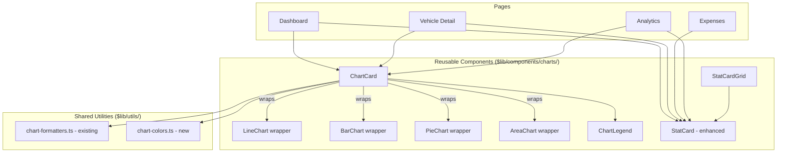
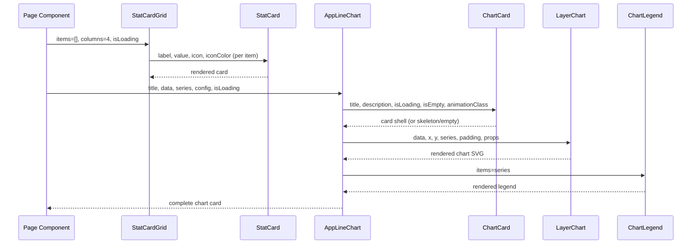

# Design Document: Chart & Stat Card Consolidation

## Overview

The VROOM app has charts and stat cards scattered across 15+ files with significant code duplication. Each page (Dashboard, Vehicle Detail, Expenses, Analytics) builds its own chart wrappers and stat card markup from scratch, leading to inconsistent styling, duplicated boilerplate (loading/error/empty states, legends, animations), and high maintenance cost.

This feature consolidates all chart and stat card patterns into a reusable component library under `$lib/components/charts/`, providing a small set of composable, consistently-styled components that every page can use. The existing three chart components (`CategoryPieChart`, `ExpenseTrendChart`, `FuelEfficiencyTrendChart`) are a good start but only cover 3 of the 7+ chart types used across the app.

## Current Inventory

### Chart Types Found

| Chart Type | Layerchart Component | Locations | Count |
|---|---|---|---|
| Line Chart | `LineChart` | Dashboard trends, FuelCharts (5 charts), CrossVehicleTab (fuel eff, premiums), PerVehicleTab (fuel eff & cost), YearEndTab (MPG trend) | ~12 |
| Bar Chart | `BarChart` | AdvancedCharts (seasonal, day-of-week, heatmap, intervals), CrossVehicleTab (vehicle cost, loan breakdown), PerVehicleTab (maintenance), FinancingCharts (amortization) | ~8 |
| Pie Chart | `PieChart` | Dashboard category, CrossVehicleTab (expense cat, financing type), PerVehicleTab (TCO breakdown, expense breakdown), YearEndTab (category) | ~6 |
| Area Chart | `AreaChart` | FuelCharts (odometer), PerVehicleTab (TCO trend) | ~2 |
| Radar Chart | `LineChart` (radial) | AdvancedCharts (vehicle comparison) | 1 |

### Stat Card Patterns Found

| Pattern | Location | Description |
|---|---|---|
| Icon + Label + Value grid | `DashboardStatsCards` | 4-card grid with colored icon badges |
| Inline stat cards | Expenses page (`statCards` array) | Same pattern as dashboard, built inline |
| Simple stat card | `stat-card.svelte` | Label + value + optional unit |
| Dual stat card | `stat-card-dual.svelte` | Two metrics side-by-side with divider |
| Icon-right stat card | `QuickStats` (analytics) | Label + value with icon on right side |
| Metric card with subtitle | `PaymentMetricsGrid` | Value + subtitle + colored icon badge |
| Financing summary cards | `FinancingSummaryHeader` | Same as metric card pattern |
| Inline summary cards | `CrossVehicleTab` (financing, insurance) | Raw Card.Root with label/value/unit |
| Year-end metric cards | `YearEndTab` | Icon + label + large value + comparison |
| TCO summary cards | `PerVehicleTab` | Simple border box with label + value |
| Insurance analysis cards | `CrossVehicleTab` | Colored background cards with label/value/subtitle |

### Duplicated Patterns

1. **Chart card wrapper**: Every chart wraps in `Card.Root > Card.Header > Card.Content` with title/description, loading skeleton, error state, empty state — duplicated 25+ times
2. **Chart legend**: Manual legend markup with colored dots — duplicated 15+ times
3. **Animation directive**: `use:animateOnView` with CSS class — applied individually everywhere
4. **Chart config boilerplate**: `ChartConfig` objects and series arrays — rebuilt per chart
5. **Category color/label maps**: `categoryColors` and `categoryLabels` objects — duplicated in 4 files
6. **Stat card with icon badge**: The icon + label + value + colored background pattern — 5+ different implementations

## Architecture



## Components and Interfaces

### Component 1: ChartCard

**Purpose**: Universal wrapper for any chart. Handles the Card shell, title/description, loading skeleton, error state, empty state, and animation. Eliminates the most-duplicated pattern in the codebase.

```typescript
interface ChartCardProps {
  /** Chart title displayed in CardHeader */
  title: string;
  /** Optional description below title */
  description?: string;
  /** Loading state — shows skeleton */
  isLoading?: boolean;
  /** Error message — shows error empty state */
  error?: string | null;
  /** Whether data is empty — shows empty state */
  isEmpty?: boolean;
  /** Empty state title */
  emptyTitle?: string;
  /** Empty state description */
  emptyDescription?: string;
  /** Chart height in pixels */
  height?: number;
  /** Optional icon snippet rendered in header */
  icon?: Snippet;
  /** Animation class for animateOnView */
  animationClass?: 'chart-line-animated' | 'chart-bar-animated' | 'chart-pie-animated';
  /** Additional CSS classes on the Card.Root */
  class?: string;
  /** The chart content — rendered via children snippet */
  children: Snippet;
}
```

**Responsibilities**:
- Render Card.Root > Card.Header (title, description, icon) > Card.Content
- Show Skeleton when `isLoading`
- Show EmptyState when `error` or `isEmpty`
- Apply `use:animateOnView` with the specified animation class
- Provide consistent height container

### Component 2: ChartLegend

**Purpose**: Reusable legend component for charts. Currently duplicated 15+ times with identical markup.

```typescript
interface LegendItem {
  key: string;
  label: string;
  color: string;
}

interface ChartLegendProps {
  /** Legend items to display */
  items: LegendItem[];
  /** Accessible label for the legend list */
  ariaLabel?: string;
  /** Additional CSS classes */
  class?: string;
}
```

**Responsibilities**:
- Render a flex-wrap list of colored dot + label pairs
- Use proper ARIA roles (list/listitem)
- Support both chart series legends and category legends

### Component 3: StatCard (enhanced)

**Purpose**: Replace all 6+ stat card variants with a single flexible component. Extends the existing `stat-card.svelte` with icon support, color theming, trend indicators, and secondary metrics.

```typescript
interface StatCardProps {
  /** Primary metric label */
  label: string;
  /** Primary metric value (pre-formatted string) */
  value: string | number;
  /** Optional unit text below value */
  unit?: string;
  /** Optional Lucide icon component */
  icon?: Component;
  /** Semantic color token for icon (e.g., 'primary', 'chart-1', 'chart-2') */
  iconColor?: string;
  /** Optional secondary metric label */
  secondaryLabel?: string;
  /** Optional secondary metric value */
  secondaryValue?: string | number;
  /** Optional secondary unit */
  secondaryUnit?: string;
  /** Optional subtitle/description below value */
  subtitle?: string;
  /** Loading state — shows skeleton */
  isLoading?: boolean;
  /** Additional CSS classes */
  class?: string;
}
```

**Responsibilities**:
- Render a Card with label, value, optional icon with colored background badge
- Support single-metric and dual-metric layouts (replaces `stat-card-dual.svelte`)
- Show loading skeleton when `isLoading`
- Use semantic color tokens for icon backgrounds (`bg-{iconColor}/10`, `text-{iconColor}`)

### Component 4: StatCardGrid

**Purpose**: Render a responsive grid of stat cards from a data array. Replaces the repeated grid + loop pattern found in Dashboard, Expenses, Analytics, Financing, and Insurance sections.

```typescript
interface StatCardItem {
  label: string;
  value: string | number;
  unit?: string;
  icon?: Component;
  iconColor?: string;
  subtitle?: string;
  secondaryLabel?: string;
  secondaryValue?: string | number;
  secondaryUnit?: string;
}

interface StatCardGridProps {
  /** Array of stat card data */
  items: StatCardItem[];
  /** Number of columns at lg breakpoint (default: items.length or 4) */
  columns?: 2 | 3 | 4;
  /** Loading state — shows skeleton cards */
  isLoading?: boolean;
  /** Additional CSS classes on the grid container */
  class?: string;
}
```

**Responsibilities**:
- Render a responsive grid (`grid-cols-2 lg:grid-cols-{columns}`)
- Map each item to a `StatCard` component
- Show skeleton placeholders when loading


### Component 5: Typed Chart Wrappers

**Purpose**: Thin wrappers around layerchart's `LineChart`, `BarChart`, `PieChart`, and `AreaChart` that integrate with `ChartCard` and `ChartLegend`, providing sensible defaults from `chart-formatters.ts`.

These are NOT new components replacing the layerchart primitives. They are convenience wrappers that combine `ChartCard` + `Chart.Container` + the layerchart component + `ChartLegend` + tooltip into a single composable unit.

```typescript
// AppLineChart — wraps LineChart with card, legend, tooltip
interface AppLineChartProps {
  title: string;
  description?: string;
  data: Record<string, unknown>[];
  x: string;
  y: string | string[];
  series: LegendItem[];
  config: ChartConfig;
  isLoading?: boolean;
  error?: string | null;
  icon?: Snippet;
  height?: number;
  /** Override x-axis props (default: monthlyXAxisProps) */
  xAxisProps?: Record<string, unknown>;
  /** Override y-axis format (default: formatCurrencyAxis) */
  yAxisFormat?: (v: number) => string;
  /** Additional line props */
  lineProps?: Record<string, unknown>;
  class?: string;
}

// AppBarChart — wraps BarChart with card, legend, tooltip
interface AppBarChartProps {
  title: string;
  description?: string;
  data: Record<string, unknown>[];
  x: string;
  y: string | string[];
  series: LegendItem[];
  config: ChartConfig;
  isLoading?: boolean;
  error?: string | null;
  icon?: Snippet;
  height?: number;
  orientation?: 'vertical' | 'horizontal';
  seriesLayout?: 'grouped' | 'stack';
  xAxisProps?: Record<string, unknown>;
  yAxisFormat?: (v: number) => string;
  class?: string;
}

// AppPieChart — wraps PieChart with card, legend, tooltip
interface AppPieChartProps {
  title: string;
  description?: string;
  data: Array<{ key: string; label: string; value: number; color: string; percentage?: number }>;
  isLoading?: boolean;
  error?: string | null;
  icon?: Snippet;
  /** Show legend list with amounts (default: true) */
  showLegend?: boolean;
  class?: string;
}

// AppAreaChart — wraps AreaChart with card, legend, tooltip
interface AppAreaChartProps {
  title: string;
  description?: string;
  data: Record<string, unknown>[];
  x: string;
  y: string[];
  series: LegendItem[];
  config: ChartConfig;
  isLoading?: boolean;
  error?: string | null;
  icon?: Snippet;
  height?: number;
  seriesLayout?: 'default' | 'stack';
  xAxisProps?: Record<string, unknown>;
  yAxisFormat?: (v: number) => string;
  class?: string;
}
```

**Responsibilities**:
- Compose `ChartCard` + `Chart.Container` + layerchart component + `ChartLegend`
- Apply shared defaults: `CHART_PADDING`, `TREND_LINE_PROPS`, `monthlyXAxisProps`
- Apply `use:animateOnView` with the correct animation class per chart type
- Import the correct CSS animation file
- Render `Chart.Tooltip` snippet

## Data Models

### Shared Chart Color Constants

A new utility file `$lib/utils/chart-colors.ts` consolidates the duplicated category color/label maps.

```typescript
// $lib/utils/chart-colors.ts

/** Semantic chart color CSS custom properties */
export const CHART_COLORS = [
  'var(--chart-1)',
  'var(--chart-2)',
  'var(--chart-3)',
  'var(--chart-4)',
  'var(--chart-5)',
] as const;

/** Category → chart color mapping (used by pie charts, heatmaps, legends) */
export const CATEGORY_COLORS: Record<string, string> = {
  fuel: 'var(--chart-1)',
  maintenance: 'var(--chart-2)',
  financial: 'var(--chart-3)',
  regulatory: 'var(--chart-4)',
  enhancement: 'var(--chart-5)',
  misc: 'var(--primary)',
};

/** Category → display label mapping */
export const CATEGORY_LABELS: Record<string, string> = {
  fuel: 'Fuel',
  maintenance: 'Maintenance',
  financial: 'Financial',
  regulatory: 'Regulatory',
  enhancement: 'Enhancement',
  misc: 'Misc',
};

/** Assign colors to a dynamic list of series (e.g., vehicle names) */
export function assignSeriesColors(keys: string[]): Array<{ key: string; color: string }> {
  return keys.map((key, i) => ({
    key,
    color: CHART_COLORS[i % CHART_COLORS.length],
  }));
}

/** Build a ChartConfig from a series array */
export function buildChartConfig(
  series: Array<{ key: string; label: string; color: string }>
): Record<string, { label: string; color: string }> {
  const config: Record<string, { label: string; color: string }> = {};
  for (const s of series) {
    config[s.key] = { label: s.label, color: s.color };
  }
  return config;
}
```

**Validation Rules**:
- Category keys must match the enum: `fuel`, `maintenance`, `financial`, `regulatory`, `enhancement`, `misc`
- Colors must use CSS custom properties (`var(--chart-N)` or `var(--primary)`), never hex values

## Main Algorithm/Workflow



## Key Functions with Formal Specifications

### Function: buildSeriesFromKeys

```typescript
function buildSeriesFromKeys(
  keys: string[],
  labels?: Record<string, string>
): Array<{ key: string; label: string; color: string }>
```

**Preconditions:**
- `keys` is a non-empty array of unique strings
- `labels` (if provided) maps keys to display names

**Postconditions:**
- Returns array of same length as `keys`
- Each item has a color from `CHART_COLORS` (cycling if keys.length > 5)
- Labels default to the key string if not in `labels` map

### Function: buildCategoryPieData

```typescript
function buildCategoryPieData(
  breakdown: Array<{ category: string; amount: number }>,
  total?: number
): Array<{ key: string; label: string; value: number; color: string; percentage: number }>
```

**Preconditions:**
- `breakdown` contains valid category keys matching the enum
- All `amount` values are non-negative numbers

**Postconditions:**
- Returns array with `color` from `CATEGORY_COLORS` and `label` from `CATEGORY_LABELS`
- `percentage` is calculated as `(amount / total) * 100`
- If `total` is not provided, it's computed as the sum of all amounts
- Items with `amount === 0` are excluded

## Algorithmic Pseudocode

### Chart Card Rendering Algorithm

```typescript
// ChartCard.svelte render logic
function renderChartCard(props: ChartCardProps): void {
  // 1. Always render Card.Root with optional class
  // 2. Render Card.Header with title, description, optional icon

  if (props.isLoading) {
    // Render Skeleton with specified height
    return;
  }

  if (props.error) {
    // Render EmptyState with error message
    return;
  }

  if (props.isEmpty) {
    // Render EmptyState with emptyTitle/emptyDescription
    return;
  }

  // 3. Render Card.Content with animateOnView directive
  // 4. Render children snippet (the actual chart)
}
```

### StatCard Variant Selection

```typescript
// StatCard.svelte layout logic
function determineLayout(props: StatCardProps): 'simple' | 'icon' | 'dual' {
  if (props.secondaryLabel && props.secondaryValue !== undefined) {
    return 'dual';  // Two metrics side-by-side with divider
  }
  if (props.icon) {
    return 'icon';  // Icon badge on right, value on left
  }
  return 'simple';  // Just label + value + optional unit
}
```

## Example Usage

### Dashboard Page (Before → After)

```svelte
<!-- BEFORE: 15 lines of boilerplate per chart -->
<Card.Root>
  <Card.Header>
    <div class="flex items-center justify-between">
      <div>
        <Card.Title>Monthly Expense Trends</Card.Title>
        <Card.Description>Spending over time</Card.Description>
      </div>
    </div>
  </Card.Header>
  <Card.Content>
    {#if isLoading}
      <Skeleton class="h-[300px] w-full" />
    {:else if data.length > 0}
      <Chart.Container config={chartConfig} class="h-[300px] w-full">
        <LineChart {data} x="date" y="amount" ... />
      </Chart.Container>
    {:else}
      <EmptyState>...</EmptyState>
    {/if}
  </Card.Content>
</Card.Root>

<!-- AFTER: Single component call -->
<AppLineChart
  title="Monthly Expense Trends"
  description="Spending over time"
  data={trendChartData}
  x="date"
  y="amount"
  series={[{ key: 'amount', label: 'Amount', color: 'var(--primary)' }]}
  config={{ amount: { label: 'Amount', color: 'var(--primary)' } }}
  {isLoading}
/>
```

### Stat Cards (Before → After)

```svelte
<!-- BEFORE: Manual grid + loop in every page -->
<div class="grid grid-cols-2 lg:grid-cols-4 gap-4">
  {#each stats as stat}
    <Card><CardContent class="p-4 sm:p-6">
      <div class="flex items-center gap-2">
        <div class="p-2 rounded-xl {stat.bgColor}">
          <stat.icon class="h-4 w-4 {stat.color}" />
        </div>
        <p class="text-xs text-muted-foreground">{stat.label}</p>
      </div>
      <p class="text-xl font-bold mt-2">{stat.value}</p>
    </CardContent></Card>
  {/each}
</div>

<!-- AFTER: Single component call -->
<StatCardGrid
  items={[
    { label: 'Total Vehicles', value: '3', icon: Car, iconColor: 'primary' },
    { label: 'Total Expenses', value: '$12,450', icon: DollarSign, iconColor: 'chart-1' },
    { label: 'Monthly Average', value: '$1,038', icon: TrendingUp, iconColor: 'chart-2' },
    { label: 'Active Financing', value: '1', icon: CreditCard, iconColor: 'chart-5' },
  ]}
  columns={4}
  {isLoading}
/>
```

## Correctness Properties

*A property is a characteristic or behavior that should hold true across all valid executions of a system — essentially, a formal statement about what the system should do. Properties serve as the bridge between human-readable specifications and machine-verifiable correctness guarantees.*

### Property 1: ChartCard state exclusivity

*For any* combination of `isLoading`, `error`, and `isEmpty` props, ChartCard renders exactly one of: a Skeleton placeholder (when loading), an error EmptyState (when error is non-null), an empty EmptyState (when isEmpty and not loading/error), or the chart content (when none of the above). The rendered state must exclude all other states' content.

**Validates: Requirements 1.1, 1.2, 2.1, 2.2, 2.3, 3.1, 3.2**

### Property 2: ChartCard structural completeness

*For any* ChartCard with a title, optional description, optional class, and optional height, the rendered card contains the title in the header, applies the custom class to Card.Root, and sets the content container to the specified height.

**Validates: Requirements 4.1, 4.3, 4.4**

### Property 3: ChartLegend count and accessibility

*For any* non-empty array of LegendItem objects, ChartLegend renders exactly as many colored dot + label pairs as items in the array, using `role="list"` on the container and `role="listitem"` on each entry, with the `aria-label` attribute set when provided.

**Validates: Requirements 5.1, 5.2, 5.3, 17.1**

### Property 4: StatCard content rendering

*For any* StatCard props containing label, value, and any combination of optional fields (unit, subtitle, icon, iconColor, secondaryLabel, secondaryValue), the rendered output contains all provided fields. When an icon is provided, a colored badge using `bg-{iconColor}/10` and `text-{iconColor}` is rendered. When both secondaryLabel and secondaryValue are provided, a dual-metric layout with a divider is rendered.

**Validates: Requirements 6.1, 6.2, 6.3, 6.4, 6.5, 6.6**

### Property 5: StatCard loading exclusivity

*For any* StatCard configuration, when `isLoading` is true, skeleton placeholders are rendered and the actual metric data (label, value, icon) is not rendered.

**Validates: Requirements 7.1, 7.2**

### Property 6: StatCardGrid count preservation

*For any* array of StatCardItem objects, StatCardGrid renders exactly one StatCard per item. When `isLoading` is true, all rendered StatCards show skeleton placeholders.

**Validates: Requirements 8.1, 8.3**

### Property 7: StatCardGrid responsive columns

*For any* valid `columns` prop value (2, 3, or 4), StatCardGrid applies the corresponding grid column class. When `columns` is not provided, the grid defaults to 4 columns or the item count if fewer than 4.

**Validates: Requirements 8.2, 8.4**

### Property 8: Category maps completeness

*For any* value in the Category_Enum set (fuel, maintenance, financial, regulatory, enhancement, misc), both `CATEGORY_COLORS` and `CATEGORY_LABELS` contain an entry for that value, and the key sets of both maps equal exactly the Category_Enum set. All color values use CSS custom property syntax (`var(--...)`).

**Validates: Requirements 11.1, 11.2, 11.4**

### Property 9: assignSeriesColors length and order preservation

*For any* array of string keys, `assignSeriesColors` returns an array of the same length where output[i].key equals input[i] and every color is a valid entry from CHART_COLORS, cycling via modular indexing when keys exceed 5.

**Validates: Requirements 12.1, 12.3**

### Property 10: buildChartConfig structure preservation

*For any* array of series objects with key, label, and color, `buildChartConfig` returns a record with exactly one entry per input item, where each key maps to the corresponding label and color.

**Validates: Requirements 13.1, 13.2**

### Property 11: buildCategoryPieData correctness

*For any* valid breakdown array of category/amount pairs with non-negative amounts, `buildCategoryPieData` returns items with colors from CATEGORY_COLORS and labels from CATEGORY_LABELS, excludes zero-amount items, calculates percentages using the provided total (or the computed sum), and the output percentages sum to approximately 100 within floating-point tolerance.

**Validates: Requirements 14.1, 14.2, 14.3, 14.4, 14.5**

### Property 12: Category key fallback safety

*For any* string not in the Category_Enum set, looking up the color falls back to `var(--primary)` and looking up the label falls back to the raw key string, ensuring no crash on unknown categories.

**Validates: Requirements 15.1, 15.2**

### Property 13: Typed chart wrapper state delegation

*For any* typed chart wrapper (AppLineChart, AppBarChart, AppPieChart, AppAreaChart) receiving `isLoading`, `error`, or empty data props, the wrapper delegates state handling to ChartCard, producing the same loading/error/empty behavior as ChartCard directly.

**Validates: Requirements 9.5**

## Error Handling

### Error Scenario 1: Chart Data Fetch Failure

**Condition**: API call fails while loading chart data
**Response**: Parent page catches error, passes `error` string prop to chart component
**Recovery**: Chart component shows EmptyState with error message; page may show a Retry button

### Error Scenario 2: Empty Data Set

**Condition**: API returns successfully but with zero data points
**Response**: Chart component detects `data.length === 0` (or `isEmpty` prop), shows empty EmptyState
**Recovery**: EmptyState shows contextual message (e.g., "Add expenses to see trends")

### Error Scenario 3: Invalid Category Key

**Condition**: Data contains a category key not in the enum
**Response**: `CATEGORY_COLORS` and `CATEGORY_LABELS` fall back to `var(--primary)` and the raw key string
**Recovery**: Chart still renders; no crash

## Testing Strategy

### Unit Testing Approach

- Test `buildCategoryPieData` with various inputs (empty, single category, all categories, zero amounts)
- Test `assignSeriesColors` with 1, 5, and 7+ keys to verify cycling
- Test `buildChartConfig` produces correct structure
- Test `buildSeriesFromKeys` with and without label overrides

### Property-Based Testing Approach

**Property Test Library**: fast-check

- For `assignSeriesColors`: ∀ string array of length N, output has length N and all colors are from `CHART_COLORS`
- For `buildCategoryPieData`: ∀ valid breakdown, sum of percentages ≈ 100 (within floating point tolerance)

### Component Testing Approach

- Test `ChartCard` renders skeleton when `isLoading=true`
- Test `ChartCard` renders error state when `error` is set
- Test `ChartCard` renders empty state when `isEmpty=true`
- Test `ChartCard` renders children when data is available
- Test `StatCard` renders icon badge when `icon` prop is provided
- Test `StatCard` renders dual layout when secondary props are provided
- Test `StatCardGrid` renders correct number of cards
- Test `ChartLegend` renders correct number of items with proper ARIA roles

## Performance Considerations

- Chart wrapper components add minimal overhead (one extra Svelte component boundary per chart)
- The `animateOnView` directive is already used everywhere; consolidation doesn't change its behavior
- Large datasets in `AdvancedCharts` already implement sampling (MAX_CHART_POINTS = 100); this is preserved
- `ChartConfig` objects are `$derived` to avoid unnecessary recalculation

## Security Considerations

- No security implications — this is a pure frontend UI refactor
- No new API calls or data handling changes
- All data continues to flow through existing authenticated API services

## Dependencies

- `layerchart` — existing chart library (no change)
- `$lib/components/ui/chart` — existing shadcn chart primitives (no change)
- `$lib/components/ui/card` — existing shadcn card primitives (no change)
- `$lib/components/ui/skeleton` — existing shadcn skeleton (no change)
- `$lib/components/common/empty-state.svelte` — existing empty state component (no change)
- `$lib/utils/chart-formatters.ts` — existing chart utilities (no change, extended usage)
- `$lib/utils/animate-on-view.ts` — existing animation utility (no change)
- `d3-scale`, `d3-shape` — existing d3 dependencies used by layerchart (no change)

## Migration Strategy

The migration is incremental and non-breaking:

1. **Phase 1**: Create the new components (`ChartCard`, `ChartLegend`, `StatCard`, `StatCardGrid`, chart wrappers, `chart-colors.ts`)
2. **Phase 2**: Migrate the existing 3 chart components (`CategoryPieChart`, `ExpenseTrendChart`, `FuelEfficiencyTrendChart`) to use `ChartCard` internally — their external API stays the same
3. **Phase 3**: Migrate `DashboardStatsCards` and `QuickStats` to use `StatCardGrid`
4. **Phase 4**: Migrate `FinancingSummaryHeader` and `PaymentMetricsGrid` to use `StatCard`/`StatCardGrid`
5. **Phase 5**: Migrate analytics tab components (`CrossVehicleTab`, `PerVehicleTab`, `YearEndTab`) to use the new chart wrappers — these have the most inline charts
6. **Phase 6**: Migrate `FuelCharts` and `AdvancedCharts` to use the new chart wrappers
7. **Phase 7**: Remove duplicated category color/label maps from individual files, use `chart-colors.ts`
8. **Phase 8**: Clean up — remove `stat-card.svelte` and `stat-card-dual.svelte` after all consumers migrate to the new `StatCard`

Each phase can be validated independently. Existing tests continue to pass because external component APIs don't change until the final cleanup phase.
