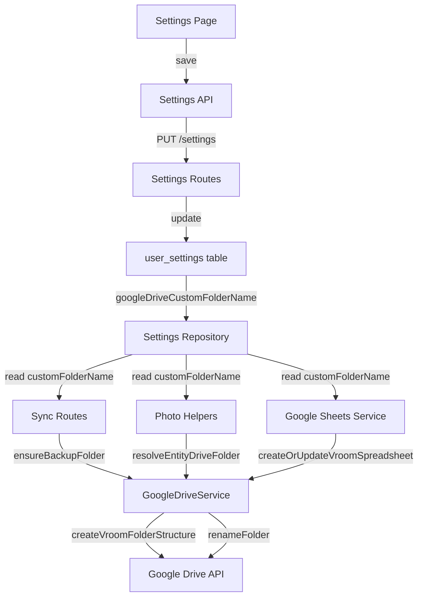
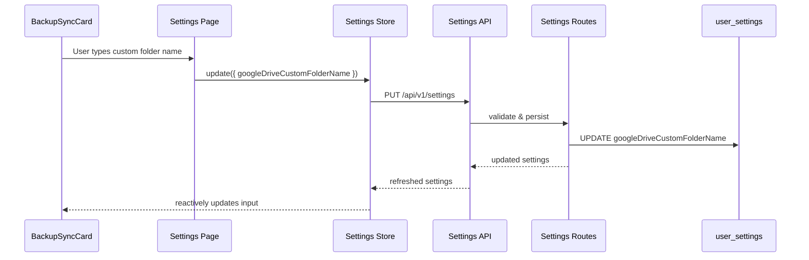

# Design Document: Custom Drive Folder Name

## Overview

Currently, the Google Drive folder name is hardcoded as `VROOM Car Tracker - {userName}` in `GoogleDriveService.createVroomFolderStructure()`. This feature adds a user setting that allows customizing the root folder name used when creating the VROOM folder structure in Google Drive.

The custom folder name is stored in `user_settings` and threaded through all callers of `createVroomFolderStructure`. When the setting is empty or null, the system falls back to the existing default name. When a folder already exists (tracked by `googleDriveBackupFolderId`), the existing folder continues to be used — the custom name only applies when creating new folder structures. An optional rename API call provides better UX by renaming the existing Drive folder to match the new setting.

## Architecture





## Components and Interfaces

### Component 1: Database Schema Extension

**Purpose**: Store the custom folder name preference per user.

```typescript
// Addition to userSettings table in backend/src/db/schema.ts
googleDriveCustomFolderName: text('google_drive_custom_folder_name'),
```

**Responsibilities**:
- Persist the user's preferred Drive folder name
- Nullable — null/empty means use default name

### Component 2: GoogleDriveService Changes

**Purpose**: Accept a resolved folder name instead of computing it internally.

**Current Interface**:
```typescript
async createVroomFolderStructure(userName: string): Promise<FolderStructure>
```

**New Interface**:
```typescript
async createVroomFolderStructure(folderName: string): Promise<FolderStructure>
```

The parameter semantics change from `userName` (used to build the name internally) to `folderName` (the final resolved name). All callers resolve the name before calling.

**New Method**:
```typescript
async renameFolder(folderId: string, newName: string): Promise<void>
```

**Responsibilities**:
- Create folder structure using the provided name directly
- Rename existing folders via the Drive API

### Component 3: Folder Name Resolution Utility

**Purpose**: Centralize the logic for resolving the effective folder name.

```typescript
// backend/src/api/sync/folder-name.ts
function resolveVroomFolderName(
  customName: string | null | undefined,
  displayName: string
): string
```

**Responsibilities**:
- Return `customName.trim()` if non-empty
- Fall back to `VROOM Car Tracker - {displayName}` otherwise
- Single source of truth — all callers use this

### Component 4: BackupSyncCard UI Extension

**Purpose**: Add a text input for the custom folder name in the Google Drive backup section.

**New Prop**:
```typescript
googleDriveCustomFolderName: string;  // bindable
```

**Responsibilities**:
- Show text input when Google Drive backup is enabled
- Display placeholder with default name pattern
- Show validation error for invalid characters (`/`, `\`)
- Show helper text explaining behavior

## Data Models

### user_settings Table Addition

```typescript
// New column
googleDriveCustomFolderName: text('google_drive_custom_folder_name')  // nullable
```

**Validation Rules**:
- Max 255 characters
- Must not contain `/` or `\` (Google Drive restriction)
- Leading/trailing whitespace trimmed
- Empty string treated as null (use default)

### Frontend UserSettings Type Addition

```typescript
// Addition to UserSettings interface in frontend/src/lib/types.ts
googleDriveCustomFolderName?: string;
```

## Key Functions with Formal Specifications

### Function 1: resolveVroomFolderName()

```typescript
function resolveVroomFolderName(
  customName: string | null | undefined,
  displayName: string
): string
```

**Preconditions:**
- `displayName` is a non-empty string

**Postconditions:**
- Returns a non-empty string
- If `customName` is non-null, non-empty after trim → returns `customName.trim()`
- If `customName` is null, undefined, or empty after trim → returns `VROOM Car Tracker - ${displayName}`
- Return value never contains leading/trailing whitespace

### Function 2: GoogleDriveService.renameFolder()

```typescript
async renameFolder(folderId: string, newName: string): Promise<void>
```

**Preconditions:**
- `folderId` is a valid Google Drive file ID
- `newName` is a non-empty string, max 255 chars, no `/` or `\`
- Caller has write access to the folder

**Postconditions:**
- The folder's name in Google Drive is updated to `newName`
- Throws if folder doesn't exist or access is denied

### Function 3: createVroomFolderStructure() (updated)

```typescript
async createVroomFolderStructure(folderName: string): Promise<FolderStructure>
```

**Preconditions:**
- `folderName` is a non-empty string (already resolved by caller)

**Postconditions:**
- If a folder with `folderName` exists in Drive → reuses it
- If no folder exists → creates it with subfolders (Receipts, Maintenance Records, Vehicle Photos, Backups)
- Returns the complete folder structure

## Algorithmic Pseudocode

### Folder Name Resolution on Save

```pascal
ALGORITHM handleSettingsSave(userId, customFolderName, displayName, settings)
INPUT: userId, customFolderName (string | null), displayName, current settings
OUTPUT: updated settings persisted

BEGIN
  // Step 1: Validate the custom folder name
  IF customFolderName IS NOT NULL AND customFolderName.trim() IS NOT EMPTY THEN
    ASSERT NOT contains(customFolderName, '/') AND NOT contains(customFolderName, '\')
    ASSERT length(customFolderName.trim()) <= 255
  END IF

  // Step 2: Persist the setting
  UPDATE user_settings SET googleDriveCustomFolderName = customFolderName WHERE userId = userId

  // Step 3: Optionally rename existing Drive folder
  IF settings.googleDriveBackupFolderId IS NOT NULL THEN
    resolvedName ← resolveVroomFolderName(customFolderName, displayName)
    TRY
      // Find the main folder (parent of backups folder)
      mainFolderId ← getParentFolder(settings.googleDriveBackupFolderId)
      renameFolder(mainFolderId, resolvedName)
    CATCH error
      // Log warning but don't fail the save — rename is best-effort
      LOG warning "Failed to rename Drive folder" error
    END TRY
  END IF

  RETURN updatedSettings
END
```

### Folder Structure Creation Flow (Updated)

```pascal
ALGORITHM ensureBackupFolder(userId, displayName, settings)
INPUT: userId, displayName, current user settings
OUTPUT: valid backup folder ID and drive service

BEGIN
  driveService ← getDriveServiceForUser(userId)
  storedFolderId ← settings.googleDriveBackupFolderId

  // Step 1: Check if stored folder still exists
  IF storedFolderId IS NOT NULL AND folderExists(storedFolderId) THEN
    RETURN { folderId: storedFolderId, driveService }
  END IF

  // Step 2: Resolve the folder name from settings
  folderName ← resolveVroomFolderName(settings.googleDriveCustomFolderName, displayName)

  // Step 3: Create folder structure with resolved name
  folderStructure ← driveService.createVroomFolderStructure(folderName)
  newFolderId ← folderStructure.subFolders.backups.id

  // Step 4: Persist the new folder ID
  updateBackupFolderId(userId, newFolderId)

  RETURN { folderId: newFolderId, driveService }
END
```

## Example Usage

```typescript
// Backend: resolving folder name before creating structure
import { resolveVroomFolderName } from './folder-name';

const settings = await settingsRepository.getOrCreate(userId);
const folderName = resolveVroomFolderName(
  settings.googleDriveCustomFolderName,
  user.displayName
);
const structure = await driveService.createVroomFolderStructure(folderName);

// Backend: renaming existing folder when setting changes
if (settings.googleDriveBackupFolderId) {
  const newName = resolveVroomFolderName(customFolderName, user.displayName);
  try {
    const metadata = await driveService.getFileMetadata(settings.googleDriveBackupFolderId);
    if (metadata.parents?.[0]) {
      // The backup folder's parent is the main VROOM folder
      // But we actually need the main folder ID — stored separately or derived
    }
    // Simpler: find the main folder by current name, then rename
    await driveService.renameFolder(mainFolderId, newName);
  } catch {
    logger.warn('Best-effort folder rename failed');
  }
}
```

```svelte
<!-- Frontend: BackupSyncCard folder name input -->
{#if googleDriveBackupEnabled}
  <div class="space-y-2 pl-6">
    <Label for="folder-name">Google Drive folder name</Label>
    <Input
      id="folder-name"
      bind:value={googleDriveCustomFolderName}
      placeholder="VROOM Car Tracker - {settings?.userId ? '...' : 'Your Name'}"
    />
    <p class="text-xs text-muted-foreground">
      Leave empty to use the default name
    </p>
  </div>
{/if}
```

## Correctness Properties

*A property is a characteristic or behavior that should hold true across all valid executions of a system — essentially, a formal statement about what the system should do. Properties serve as the bridge between human-readable specifications and machine-verifiable correctness guarantees.*

### Property 1: Custom name passthrough with trimming

*For any* non-empty-after-trim string `s` and any display name, `resolveVroomFolderName(s, displayName)` should return `s.trim()` — the trimmed custom name, independent of the display name.

**Validates: Requirements 1.1, 1.4**

### Property 2: Empty input fallback to default name

*For any* input that is null, undefined, empty string, or composed entirely of whitespace characters, and *for any* non-empty display name, `resolveVroomFolderName(input, displayName)` should return `VROOM Car Tracker - {displayName}`.

**Validates: Requirements 1.2, 1.3**

### Property 3: Folder name validation correctness

*For any* string, the validation layer should accept the string if and only if the string contains no `/` or `\` characters and has a length of 255 characters or fewer. All other strings should be rejected.

**Validates: Requirements 2.1, 2.2, 2.3**

### Property 4: Settings persistence round-trip

*For any* valid custom folder name, saving the value via the Settings API and then loading settings should return the same custom folder name value.

**Validates: Requirements 3.1, 3.3**

## Error Handling

### Error Scenario 1: Invalid Characters in Folder Name

**Condition**: User enters a folder name containing `/` or `\`
**Response**: Zod validation rejects the input with a 400 error; frontend shows inline validation error
**Recovery**: User corrects the name and re-saves

### Error Scenario 2: Drive Folder Rename Fails

**Condition**: User changes folder name but the Drive API rename call fails (permissions, network, etc.)
**Response**: The setting is still saved. A warning is logged. The existing folder continues to work with its old name.
**Recovery**: Next time a new folder structure is created (e.g., folder deleted), it will use the new custom name.

### Error Scenario 3: Folder Name Too Long

**Condition**: User enters a name exceeding 255 characters
**Response**: Zod validation rejects with 400; frontend can also enforce maxlength on the input
**Recovery**: User shortens the name

## Testing Strategy

### Unit Testing Approach

- `resolveVroomFolderName`: Test null, undefined, empty string, whitespace-only, valid custom name, trimming behavior
- Validation schema: Test rejection of `/`, `\`, strings > 255 chars, acceptance of valid names
- Migration test: Verify new column exists, seed data survives migration

### Property-Based Testing Approach

**Property Test Library**: fast-check

- For any non-empty trimmed string without `/` or `\` and length ≤ 255, `resolveVroomFolderName(s, displayName)` returns `s.trim()`
- For any null/undefined/empty/whitespace-only input, `resolveVroomFolderName(s, displayName)` returns the default pattern

### Integration Testing Approach

- Settings round-trip: Save custom folder name → reload settings → verify persisted
- Backup flow: Set custom name → trigger backup → verify folder created with custom name (mocked Drive API)

## Security Considerations

- The folder name is user-provided input — it must be sanitized/validated before being passed to the Google Drive API
- Zod validation on the backend prevents injection of special characters
- The name is only used as a Google Drive folder name, not in file paths or shell commands, limiting attack surface

## Dependencies

- Existing: `googleapis` (Google Drive API for rename), `drizzle-orm` (schema migration), `zod` (validation)
- No new external dependencies required
