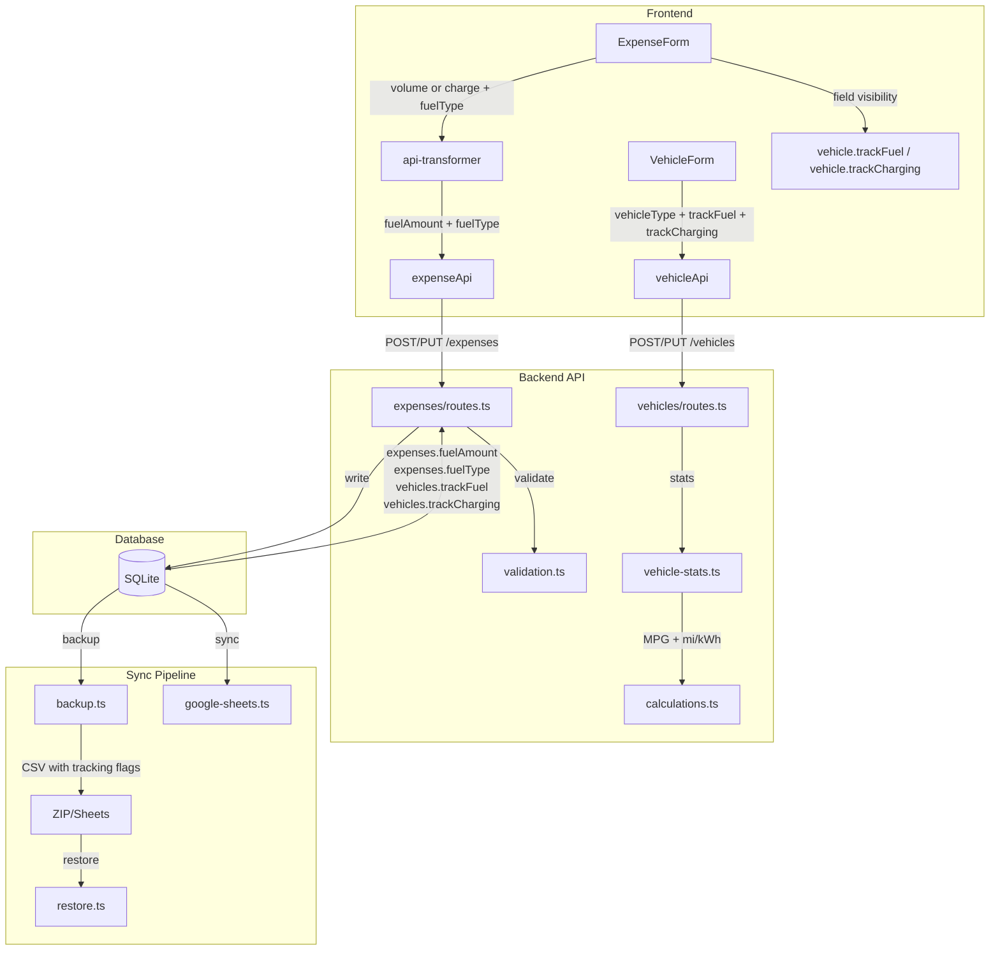
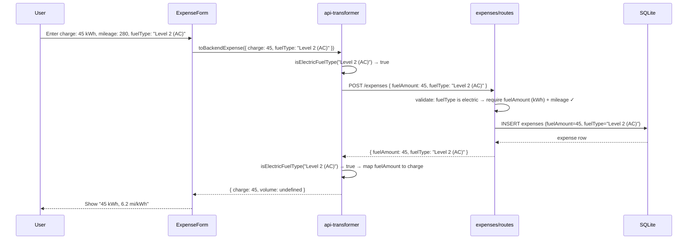
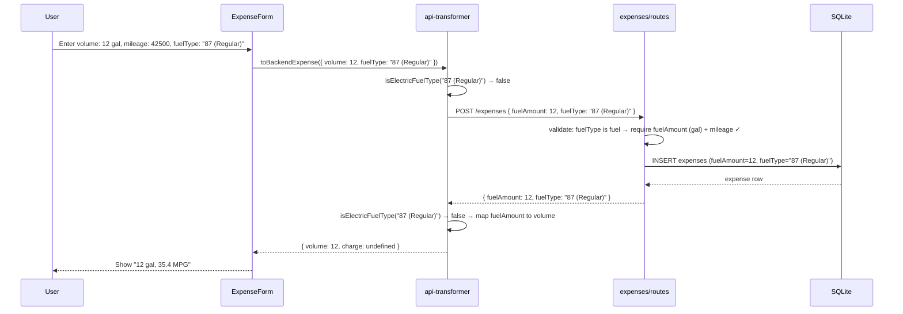
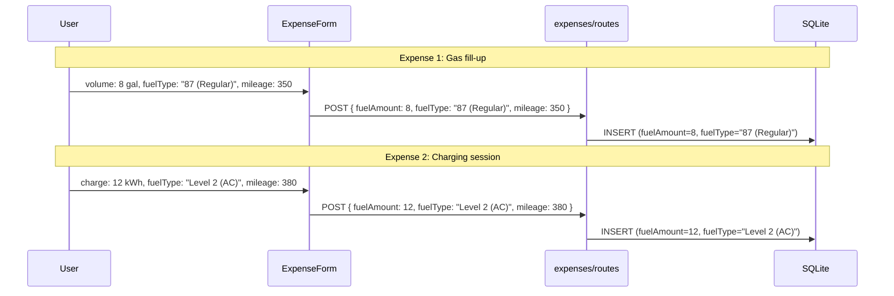
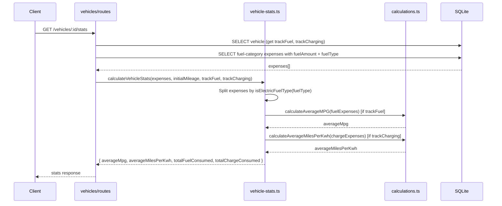

# Design Document: EV Charging Support

## Overview

The VROOM car tracker application has partial EV/PHEV support scaffolded across the frontend and backend, but critical gaps prevent it from actually working end-to-end. The VehicleForm never submits `vehicleType`, backend stats and calculations are gas-only, and the API transformer guesses whether `fuelAmount` means gallons or kWh based on vehicle type — which is fragile and breaks for vehicles that log both fuel and charging expenses.

This design addresses six core problems: (1) fixing VehicleForm to submit `vehicleType`, (2) adding `trackFuel` and `trackCharging` boolean flags to the vehicles table so energy tracking UI is decoupled from `vehicleType`, (3) using the existing `fuelType` field as the discriminator between fuel and charging expenses (no new expense columns), (4) extending backend stats and calculations for electric efficiency, (5) updating the API transformer to use `fuelType` instead of `vehicleType` for mapping, and (6) making the "fuel" category label EV-aware.

The key design decisions are:

- **`fuelType` is the discriminator.** The existing free-text `fuelType` column already stores octane ratings like `'87 (Regular)'` and `'Diesel'`. We extend it to also support electric charging types: `'Level 1 (Home)'`, `'Level 2 (AC)'`, `'DC Fast Charging'`, `'Electric'`. When `fuelType` indicates an electric type, `fuelAmount` means kWh instead of gallons/liters.
- **Each expense is fuel OR charging, never both.** A single expense row is either a fuel fill-up or a charging session. PHEV owners log two separate expenses. The `fuelType` value determines which type it is.
- **`vehicleType` is informational only.** It does NOT drive validation or gate what expense types are allowed.
- **`trackFuel` / `trackCharging` control UI, not validation.** Two new boolean columns on the vehicles table control which options appear in the expense form. Users can override freely.
- **No new expense columns.** The existing `fuelAmount` column stores both gallons/liters (for fuel) and kWh (for charging). No `chargeAmount` column is added.

The approach is additive and backward-compatible. No existing data is modified — all current expenses have fuel-type `fuelType` values and their `fuelAmount` values remain as gallons/liters.

## Architecture




## Sequence Diagrams

### Creating an EV Charging Expense



### Creating a Gas Fuel Expense



### PHEV Owner Logging Both Types (Separate Expenses)



### Vehicle Stats Calculation



## Components and Interfaces

### Component 1: Electric Fuel Type Helper

**Purpose**: Centralized helper to determine whether a `fuelType` value indicates an electric charging type. Used across transformer, validation, stats, and UI.

**Interface**:
```typescript
// Shared constant — used by both frontend and backend
const ELECTRIC_FUEL_TYPES = ['Electric', 'Level 1 (Home)', 'Level 2 (AC)', 'DC Fast Charging'] as const;

export function isElectricFuelType(fuelType: string | null): boolean {
  return fuelType !== null && ELECTRIC_FUEL_TYPES.includes(fuelType as any);
}
```

**Responsibilities**:
- Single source of truth for what constitutes an electric fuel type
- Used by `api-transformer.ts` to decide `fuelAmount` → `volume` vs `charge` mapping
- Used by `vehicle-stats.ts` to split expenses into fuel vs charge groups
- Used by `validation.ts` to determine which fields are required
- Used by frontend expense form to show appropriate fields

### Component 2: Database Schema (vehicles table — tracking flags)

**Purpose**: Decouple energy tracking UI from `vehicleType` by adding explicit boolean flags that users can override.

**Interface**:
```typescript
// backend/src/db/schema.ts — vehicles table additions
export const vehicles = sqliteTable('vehicles', {
  // ... existing columns ...
  vehicleType: text('vehicle_type').notNull().default('gas'), // Informational only — does NOT drive behavior
  trackFuel: integer('track_fuel', { mode: 'boolean' }).notNull().default(true),      // NEW
  trackCharging: integer('track_charging', { mode: 'boolean' }).notNull().default(false), // NEW
  // ... rest unchanged ...
});
```

**Responsibilities**:
- `trackFuel`: Controls whether fuel fields (volume/fuelAmount with gas fuelTypes) are shown in the expense form
- `trackCharging`: Controls whether charge fields (charge/fuelAmount with electric fuelTypes) are shown in the expense form
- Defaults are set based on `vehicleType` at creation time (gas→trackFuel only, electric→trackCharging only, hybrid→both)
- Users can override these independently of `vehicleType`
- `vehicleType` remains as informational/display field only
- These flags control UI visibility, NOT hard validation constraints

### Component 3: API Transformer

**Purpose**: Map between frontend `volume`/`charge` fields and backend `fuelAmount` field using `fuelType` as the discriminator.

**Interface**:
```typescript
// frontend/src/lib/services/api-transformer.ts
export interface BackendExpenseRequest {
  // ... existing fields ...
  fuelAmount?: number;    // Maps from frontend volume OR charge
  fuelType?: string;      // Discriminator: electric types → charge, others → volume
}

export interface BackendExpenseResponse {
  // ... existing fields ...
  fuelAmount?: number;    // Maps to frontend volume OR charge based on fuelType
  fuelType?: string;      // Discriminator for mapping direction
}

// toBackendExpense: volume → fuelAmount (fuel types), charge → fuelAmount (electric types)
export function toBackendExpense(
  frontendExpense: Partial<Expense> & { vehicleId: string; category: string; amount: number }
): BackendExpenseRequest;

// fromBackendExpense: uses fuelType to decide fuelAmount → volume or fuelAmount → charge
// No longer needs vehicleType parameter
export function fromBackendExpense(backendExpense: BackendExpenseResponse): Expense;
```

**Responsibilities**:
- `toBackendExpense`: Maps `volume` → `fuelAmount` (unchanged from current behavior for fuel), maps `charge` → `fuelAmount` (for electric)
- `fromBackendExpense`: Uses `isElectricFuelType(fuelType)` to decide mapping direction:
  - Electric fuelType → `fuelAmount` maps to `charge`
  - Non-electric fuelType → `fuelAmount` maps to `volume`
- Remove `vehicleType` parameter from `fromBackendExpense` — `fuelType` is the discriminator now
- Remove `vehicleTypeMap` from `fromBackendExpenses` batch function

### Component 4: VehicleForm Submission Fix

**Purpose**: Include `vehicleType`, `trackFuel`, and `trackCharging` in the vehicle create/update payload. Show toggle switches for energy tracking preferences.

**Interface**:
```typescript
// In VehicleForm.svelte handleSubmit()
const vehicleData = {
  make: vehicleForm.make,
  model: vehicleForm.model,
  year: vehicleForm.year,
  vehicleType: vehicleForm.vehicleType,      // NEW — was missing from submission
  trackFuel: vehicleForm.trackFuel,           // NEW
  trackCharging: vehicleForm.trackCharging,   // NEW
  // ... rest unchanged
};
```

**Responsibilities**:
- Submit `vehicleType`, `trackFuel`, and `trackCharging` fields on both create and update
- Show toggle switches for "Track fuel costs" and "Track charging costs"
- When `vehicleType` changes, auto-set defaults (gas→fuel only, electric→charging only, hybrid→both) but allow user override
- The form already has a `vehicleType` selector in state — just needs to include it in the payload along with the new flags

### Component 5: Backend Vehicle Stats

**Purpose**: Calculate electric efficiency metrics alongside fuel efficiency, splitting expenses by `fuelType`.

**Interface**:
```typescript
// backend/src/utils/vehicle-stats.ts
export interface FuelExpense {
  id: string;
  mileage: number | null;
  fuelAmount: number | null;
  fuelType: string | null;    // Used to split fuel vs charge expenses
  date: Date;
  expenseAmount: number;
  missedFillup: boolean;
}

export function calculateVehicleStats(
  fuelExpenses: FuelExpense[],
  initialMileage: number,
  trackFuel: boolean,       // NEW
  trackCharging: boolean    // NEW
): VehicleStats;
```

**Responsibilities**:
- Use `isElectricFuelType(expense.fuelType)` to split expenses into fuel-group and charge-group
- `totalFuelConsumed`: sum of `fuelAmount` for non-electric fuelType expenses
- `totalChargeConsumed`: sum of `fuelAmount` for electric fuelType expenses
- If `trackFuel` is true: calculate `averageMpg` from fuel-group expenses; if false: `averageMpg = null`
- If `trackCharging` is true: calculate `averageMilesPerKwh` from charge-group expenses; if false: `averageMilesPerKwh = null`

### Component 6: Backend Calculations

**Purpose**: Add electric efficiency calculation functions alongside existing fuel calculations.

**Interface**:
```typescript
// backend/src/utils/calculations.ts
export function calculateMilesPerKwh(miles: number, kwh: number): number;
export function calculateAverageMilesPerKwh(chargeExpenses: Expense[]): number | null;
```

**Responsibilities**:
- `calculateMilesPerKwh`: Simple division with zero-guard, mirrors `calculateMPG`
- `calculateAverageMilesPerKwh`: Sequential charge expense analysis, mirrors `calculateAverageMPG`
- Filter out unrealistic values (e.g., > 10 mi/kWh)

### Component 7: Backend Validation

**Purpose**: Validate fuel expenses based on `fuelType` — require `fuelAmount` and `mileage` for all fuel-category expenses regardless of whether it's fuel or charging.

**Interface**:
```typescript
// backend/src/utils/validation.ts
export function validateFuelExpenseData(
  category: string,
  mileage: number | null | undefined,
  fuelAmount: number | null | undefined,
  fuelType: string | null | undefined
): void;
```

**Responsibilities**:
- If `category !== 'fuel'`: no validation (returns void)
- If `category === 'fuel'` and `fuelType` indicates electric: require `fuelAmount` (kWh) and `mileage`
- If `category === 'fuel'` and `fuelType` indicates fuel: require `fuelAmount` (gallons/liters) and `mileage`
- No `vehicleType`-based validation — the `fuelType` value on the expense itself is the discriminator
- `trackFuel`/`trackCharging` are NOT used for validation — they only control UI visibility

### Component 8: Expense Category Labels

**Purpose**: Make the "fuel" category label EV-aware.

**Interface**:
```typescript
// backend/src/db/types.ts
export const EXPENSE_CATEGORY_LABELS: Record<ExpenseCategory, string> = {
  fuel: 'Fuel & Charging',  // Changed from 'Fuel'
  // ... rest unchanged
};

export const EXPENSE_CATEGORY_DESCRIPTIONS: Record<ExpenseCategory, string> = {
  fuel: 'Fuel, gas, and electric charging costs',  // Changed
  // ... rest unchanged
};
```

### Component 9: Expense Form Energy Mode Toggle

**Purpose**: Provide a toggle in the `FuelFieldsSection` that switches between fuel mode and charging mode, changing the dropdown options, input field, unit labels, and efficiency display accordingly.

**UX Behavior**:

When a vehicle has both `trackFuel=true` and `trackCharging=true`, the fuel details section shows a segmented toggle at the top:

```
┌─────────────────────────────────────────────┐
│  ⛽ Fuel Details                             │
│                                              │
│  [ ⛽ Fuel ]  [ ⚡ Charging ]    ← toggle    │
│                                              │
│  Gallons (US) *          ← changes to kWh   │
│  ┌──────────────┐                            │
│  │ 0.000        │                            │
│  └──────────────┘                            │
│                                              │
│  Fuel Type / Octane      ← changes to       │
│  ┌──────────────────┐      Charging Type     │
│  │ 87 (Regular)    ▼│                        │
│  └──────────────────┘                        │
│                                              │
│  ☐ Missed previous fill-up                   │
└─────────────────────────────────────────────┘
```

When toggled to Charging mode:

```
┌─────────────────────────────────────────────┐
│  ⚡ Charging Details                         │
│                                              │
│  [ ⛽ Fuel ]  [ ⚡ Charging ]    ← active    │
│                                              │
│  kWh *                   ← was Gallons       │
│  ┌──────────────┐                            │
│  │ 0.00         │                            │
│  └──────────────┘                            │
│                                              │
│  Charging Type           ← was Fuel Type     │
│  ┌──────────────────┐                        │
│  │ Level 2 (AC)    ▼│                        │
│  └──────────────────┘                        │
│                                              │
│  ☐ Missed previous fill-up                   │
└─────────────────────────────────────────────┘
```

**Toggle Visibility Rules**:
- If vehicle has only `trackFuel=true`: no toggle shown, fuel mode is the only mode (current behavior)
- If vehicle has only `trackCharging=true`: no toggle shown, charging mode is the only mode
- If vehicle has both `trackFuel=true` and `trackCharging=true`: toggle is shown, user picks per-expense
- Default mode when both are enabled: fuel (matches existing behavior for gas vehicles)

**Mode Switching Behavior**:
- When switching from fuel → charging: clear `volume` and `fuelType`, set `fuelType` to `'Electric'` as default, show kWh input
- When switching from charging → fuel: clear `charge` and `fuelType`, show volume input and fuel type dropdown
- The toggle sets an `energyMode` state (`'fuel' | 'charging'`) that drives which fields and options are rendered
- On edit: `energyMode` is derived from the existing expense's `fuelType` using `isElectricFuelType()`

**Dropdown Options by Mode**:
- Fuel mode: `'87 (Regular)'`, `'89 (Mid-Grade)'`, `'91 (Premium)'`, `'93 (Super Premium)'`, `'Diesel'`, `'Ethanol-Free'`, `'Other (Custom)'`
- Charging mode: `'Level 1 (Home)'`, `'Level 2 (AC)'`, `'DC Fast Charging'`, `'Electric'`

**Input Field by Mode**:
- Fuel mode: volume input with `getVolumeUnitLabel(volumeUnit)` label (e.g., "Gallons (US)")
- Charging mode: charge input with `getChargeUnitLabel(chargeUnit)` label (e.g., "kWh")

**Efficiency Display by Mode**:
- Fuel mode: shows calculated MPG with `getFuelEfficiencyLabel()`
- Charging mode: shows calculated mi/kWh with `getElectricEfficiencyLabel()`

**Price-per-unit Display by Mode**:
- Fuel mode: "Price per gal: $X.XXX"
- Charging mode: "Price per kWh: $X.XXX"

**Section Header by Mode**:
- Fuel mode: ⛽ "Fuel Details"
- Charging mode: ⚡ "Charging Details"

**Interface**:
```typescript
// FuelFieldsSection.svelte props — updated
interface Props {
  trackFuel: boolean;           // NEW — from vehicle
  trackCharging: boolean;       // NEW — from vehicle
  volume: string;
  charge: string;
  fuelType: string;
  missedFillup: boolean;
  amount: string;
  volumeUnit: VolumeUnit;
  chargeUnit: ChargeUnit;
  distanceUnit: DistanceUnit;
  calculatedMpg: number | null;
  calculatedEfficiency: number | null;
  showMpgCalculation: boolean;
  errors: Record<string, string | undefined>;
  touched: Record<string, boolean>;
  onBlur: (_field: string) => void;
  onMileageChange: () => void;
}
```

**Implementation Notes**:
- Use shadcn-svelte `Tabs` or a simple two-button segmented control for the toggle (check registry first)
- The `energyMode` state is internal to `FuelFieldsSection` — derived from props on mount/edit, toggled by user on create
- Remove the old `vehicleType` prop — replace with `trackFuel`/`trackCharging`
- The old `showVolumeField`/`showChargeField` derived values are replaced by `energyMode`

## Data Models

### Vehicles Table (After Migration)

```typescript
interface VehicleRow {
  // ... existing columns ...
  vehicleType: string;          // 'gas' | 'electric' | 'hybrid' — informational only
  trackFuel: boolean;           // NEW — controls fuel field visibility in expense form
  trackCharging: boolean;       // NEW — controls charge field visibility in expense form
  // ... rest unchanged ...
}
```

**Default Logic** (applied at creation time, user-overridable):
- `vehicleType === 'gas'` → `trackFuel=true`, `trackCharging=false`
- `vehicleType === 'electric'` → `trackFuel=false`, `trackCharging=true`
- `vehicleType === 'hybrid'` → `trackFuel=true`, `trackCharging=true`

### Expenses Table (NO Changes)

The existing expenses table is unchanged. The `fuelAmount` column stores both gallons/liters and kWh — the `fuelType` value determines interpretation.

```typescript
interface ExpenseRow {
  id: string;
  vehicleId: string;
  category: string;
  tags: string[] | null;
  date: Date;
  mileage: number | null;
  description: string | null;
  receiptUrl: string | null;
  expenseAmount: number;
  fuelAmount: number | null;      // Gallons/liters (fuel types) OR kWh (electric types)
  fuelType: string | null;        // Discriminator: determines how to interpret fuelAmount
  isFinancingPayment: boolean;
  missedFillup: boolean;
  expenseGroupId: string | null;
  insurancePolicyId: string | null;
  insuranceTermId: string | null;
  createdAt: Date;
  updatedAt: Date;
}
```

**fuelType Values**:
- Fuel types (fuelAmount = gallons/liters): `'87 (Regular)'`, `'89 (Mid-Grade)'`, `'91 (Premium)'`, `'93 (Premium+)'`, `'Diesel'`, or any non-electric string
- Electric types (fuelAmount = kWh): `'Electric'`, `'Level 1 (Home)'`, `'Level 2 (AC)'`, `'DC Fast Charging'`

**Validation Rules**:
- When `category === 'fuel'` and `fuelType` is electric: `fuelAmount` (kWh) must be > 0, `mileage` required
- When `category === 'fuel'` and `fuelType` is non-electric: `fuelAmount` (gallons/liters) must be > 0, `mileage` required
- Non-fuel categories: no energy data required (unchanged)

### Migration SQL

```sql
-- Add tracking flags to vehicles table
ALTER TABLE vehicles ADD COLUMN track_fuel INTEGER NOT NULL DEFAULT 1;
ALTER TABLE vehicles ADD COLUMN track_charging INTEGER NOT NULL DEFAULT 0;
```

### Data Migration (in same migration file)

```sql
-- Set tracking flags based on existing vehicleType values
UPDATE vehicles SET track_charging = 1 WHERE vehicle_type = 'electric';
UPDATE vehicles SET track_fuel = 0 WHERE vehicle_type = 'electric';
UPDATE vehicles SET track_charging = 1 WHERE vehicle_type = 'hybrid';
-- gas vehicles already have correct defaults (track_fuel=1, track_charging=0)
```

No expense data migration is needed — existing expenses all have fuel-type `fuelType` values and their `fuelAmount` values are already correct as gallons/liters.


## Key Functions with Formal Specifications

### Function 1: isElectricFuelType()

```typescript
function isElectricFuelType(fuelType: string | null): boolean
```

**Preconditions:**
- `fuelType` may be null, undefined-coerced-to-null, or any string

**Postconditions:**
- Returns `true` if and only if `fuelType` is one of: `'Electric'`, `'Level 1 (Home)'`, `'Level 2 (AC)'`, `'DC Fast Charging'`
- Returns `false` for `null`
- Returns `false` for all existing fuel-type strings (`'87 (Regular)'`, `'Diesel'`, etc.)
- Pure function with no side effects

### Function 2: toBackendExpense()

```typescript
function toBackendExpense(
  frontendExpense: Partial<Expense> & { vehicleId: string; category: string; amount: number }
): BackendExpenseRequest
```

**Preconditions:**
- `frontendExpense.vehicleId` is non-empty string
- `frontendExpense.category` is valid expense category
- `frontendExpense.amount` is positive number

**Postconditions:**
- If `frontendExpense.volume` is defined and non-null → `result.fuelAmount === frontendExpense.volume`
- If `frontendExpense.charge` is defined and non-null → `result.fuelAmount === frontendExpense.charge`
- `volume` and `charge` are mutually exclusive on a single expense — only one maps to `fuelAmount`
- `result.fuelType` is preserved from input
- `result.expenseAmount === frontendExpense.amount`

### Function 3: fromBackendExpense()

```typescript
function fromBackendExpense(backendExpense: BackendExpenseResponse): Expense
```

**Preconditions:**
- `backendExpense` has valid `id`, `vehicleId`, `category`, `expenseAmount`

**Postconditions:**
- If `isElectricFuelType(backendExpense.fuelType)` is true and `backendExpense.fuelAmount` is non-null → `result.charge === backendExpense.fuelAmount` and `result.volume` is undefined
- If `isElectricFuelType(backendExpense.fuelType)` is false and `backendExpense.fuelAmount` is non-null → `result.volume === backendExpense.fuelAmount` and `result.charge` is undefined
- No `vehicleType` parameter needed — `fuelType` is the sole discriminator
- Deterministic: same input always produces same output

### Function 4: calculateVehicleStats()

```typescript
function calculateVehicleStats(
  fuelExpenses: FuelExpense[],
  initialMileage: number,
  trackFuel: boolean,
  trackCharging: boolean
): VehicleStats
```

**Preconditions:**
- `initialMileage >= 0`
- `fuelExpenses` sorted by date ascending
- Each expense has valid `date` and `expenseAmount`

**Postconditions:**
- Expenses are split using `isElectricFuelType(expense.fuelType)`
- `result.totalFuelConsumed === sum of fuelAmount for non-electric fuelType expenses`
- `result.totalChargeConsumed === sum of fuelAmount for electric fuelType expenses`
- If `trackFuel` is false: `result.averageMpg === null`
- If `trackCharging` is false: `result.averageMilesPerKwh === null`
- If both flags are true: both metrics calculated independently from their respective expense groups
- If neither flag is true: both metrics are null
- `result.totalMileage >= 0`

### Function 5: calculateMilesPerKwh()

```typescript
function calculateMilesPerKwh(miles: number, kwh: number): number
```

**Preconditions:**
- `miles` and `kwh` are finite numbers

**Postconditions:**
- If `kwh > 0`: `result === miles / kwh`
- If `kwh <= 0`: `result === 0`
- Result is never NaN or Infinity

### Function 6: calculateAverageMilesPerKwh()

```typescript
function calculateAverageMilesPerKwh(chargeExpenses: Expense[]): number | null
```

**Preconditions:**
- `chargeExpenses` contains only expenses where `isElectricFuelType(fuelType)` is true
- Expenses are sortable by date

**Postconditions:**
- If fewer than 2 expenses with mileage: `result === null`
- If valid pairs exist: `result > 0 && result < 10` (realistic EV range)
- Pairs with `missedFillup` are excluded
- Result is the arithmetic mean of valid per-segment efficiencies

### Function 7: validateFuelExpenseData()

```typescript
function validateFuelExpenseData(
  category: string,
  mileage: number | null | undefined,
  fuelAmount: number | null | undefined,
  fuelType: string | null | undefined
): void
```

**Preconditions:**
- `category` is a valid expense category string

**Postconditions:**
- If `category !== 'fuel'`: no error thrown (returns void)
- If `category === 'fuel'` and `isElectricFuelType(fuelType)`: throws if `!fuelAmount || !mileage`
- If `category === 'fuel'` and `!isElectricFuelType(fuelType)`: throws if `!fuelAmount || !mileage`
- In both fuel sub-cases the requirement is the same: `fuelAmount` and `mileage` are required for fuel-category expenses
- Error messages differ to provide context: "require charge amount (kWh)" vs "require fuel amount"

## Example Usage

### Creating an Electric Vehicle

```typescript
// Frontend: VehicleForm.svelte handleSubmit()
const vehicleData = {
  make: 'Tesla',
  model: 'Model 3',
  year: 2024,
  vehicleType: 'electric',       // Informational — now actually submitted
  trackFuel: false,               // Default for EV — user can override
  trackCharging: true,            // Default for EV — user can override
  licensePlate: 'EV-1234',
  initialMileage: 0
};
const vehicle = await vehicleApi.createVehicle(vehicleData);
// vehicle.trackFuel === false ✓
// vehicle.trackCharging === true ✓
// Expense form will show charging fields, not fuel fields
```

### Logging a Charging Session

```typescript
// Frontend: ExpenseForm submits
const expenseData = {
  vehicleId: vehicle.id,
  category: 'fuel',
  amount: 12.50,                    // Cost
  charge: 45,                       // 45 kWh — frontend field
  fuelType: 'Level 2 (AC)',         // Electric type → fuelAmount means kWh
  mileage: 15280,
  date: '2024-01-15',
  tags: ['charging', 'home']
};

// Transformer maps charge → fuelAmount
const backendPayload = toBackendExpense(expenseData);
// backendPayload.fuelAmount === 45
// backendPayload.fuelType === 'Level 2 (AC)'

// API response maps fuelAmount → charge (because fuelType is electric)
const response = await expenseApi.createExpense(backendPayload);
const expense = fromBackendExpense(response);
// expense.charge === 45
// expense.volume === undefined
```

### PHEV Owner Logging Both Types (Separate Expenses)

```typescript
// Vehicle has trackFuel=true, trackCharging=true (hybrid defaults)

// Expense 1: Gas fill-up
const gasExpense = {
  vehicleId: phevVehicle.id,
  category: 'fuel',
  amount: 35.00,
  volume: 8.5,                      // 8.5 gallons
  fuelType: '87 (Regular)',          // Fuel type → fuelAmount means gallons
  mileage: 42500,
  date: '2024-01-20'
};
// backend stores: fuelAmount=8.5, fuelType='87 (Regular)'

// Expense 2: Charging session (separate expense)
const chargeExpense = {
  vehicleId: phevVehicle.id,
  category: 'fuel',
  amount: 4.50,
  charge: 12,                        // 12 kWh
  fuelType: 'Level 2 (AC)',          // Electric type → fuelAmount means kWh
  mileage: 42530,
  date: '2024-01-21'
};
// backend stores: fuelAmount=12, fuelType='Level 2 (AC)'
```

### Vehicle with Custom Tracking Overrides

```typescript
// A gas car owner who also installed a home charger (e.g., PHEV conversion)
// vehicleType stays 'gas' for display, but user enables charging tracking
const vehicleData = {
  make: 'Toyota',
  model: 'Prius',
  year: 2020,
  vehicleType: 'gas',        // Informational — stays as 'gas'
  trackFuel: true,            // Still tracks fuel
  trackCharging: true,        // User opted in to charging tracking too
};
const vehicle = await vehicleApi.updateVehicle(vehicleId, vehicleData);
// Now the expense form shows both fuel and charge field options
```

### Vehicle Stats with Electric Metrics

```typescript
// Backend: calculateVehicleStats splits expenses by fuelType
const stats = calculateVehicleStats(expenses, 0, true, true);
// Internally: fuel expenses = those with non-electric fuelType
//             charge expenses = those with electric fuelType
// stats.totalFuelConsumed === 85.2    (gallons — sum of fuelAmount for fuel-type expenses)
// stats.totalChargeConsumed === 120.5 (kWh — sum of fuelAmount for electric-type expenses)
// stats.averageMpg === 38.5           (from fuel-type expenses only)
// stats.averageMilesPerKwh === 3.8    (from electric-type expenses only)

// For a vehicle that only tracks charging
const evStats = calculateVehicleStats(expenses, 0, false, true);
// evStats.averageMpg === null
// evStats.averageMilesPerKwh === 3.8
```

## Correctness Properties

*A property is a characteristic or behavior that should hold true across all valid executions of a system — essentially, a formal statement about what the system should do. Properties serve as the bridge between human-readable specifications and machine-verifiable correctness guarantees.*

### Property 1: Transformer round-trip preservation

*For any* valid expense with a volume value and a non-electric fuelType, or a charge value and an electric fuelType, `fromBackendExpense(toBackendExpense(expense))` preserves the energy value — if the input had volume=X the output has volume=X, if the input had charge=Y the output has charge=Y.

**Validates: Requirements 2.1, 2.2, 2.3, 2.7**

### Property 2: fuelType-based mutual exclusivity

*For any* expense returned by `fromBackendExpense`, exactly one of `volume` or `charge` is defined (not both), determined solely by whether `isElectricFuelType(fuelType)` returns true or false.

**Validates: Requirements 2.5, 2.6**

### Property 3: isElectricFuelType consistency

*For any* string in ELECTRIC_FUEL_TYPES, `isElectricFuelType` returns true. *For any* string not in ELECTRIC_FUEL_TYPES (including null), `isElectricFuelType` returns false. Same input always produces same output.

**Validates: Requirements 8.2, 8.3, 8.4**

### Property 4: Stats totals partition by fuelType

*For any* list of fuel-category expenses, `totalFuelConsumed` equals the sum of `fuelAmount` for expenses where `isElectricFuelType(fuelType)` is false, and `totalChargeConsumed` equals the sum of `fuelAmount` for expenses where `isElectricFuelType(fuelType)` is true.

**Validates: Requirements 4.1, 4.6, 4.7**

### Property 5: Stats tracking flag gating

*For any* list of expenses and tracking flag combination, the Stats_Calculator returns non-null `averageMpg` only when `trackFuel=true` and non-null `averageMilesPerKwh` only when `trackCharging=true`. When a flag is false, the corresponding metric is null regardless of available expense data.

**Validates: Requirements 4.2, 4.3, 4.4, 4.5**

### Property 6: Tracking flag independence from vehicleType

*For any* combination of vehicleType, trackFuel, and trackCharging values, the system persists all three independently — a gas vehicle can have trackCharging=true and an electric vehicle can have trackFuel=true.

**Validates: Requirements 1.3, 3.6**

### Property 7: Vehicle form persistence round-trip

*For any* valid vehicle data submitted through the VehicleForm (including vehicleType, trackFuel, and trackCharging), creating or updating the vehicle and then reading it back returns the same values for all three fields.

**Validates: Requirements 3.3, 3.5**

### Property 8: fuelType-based validation

*For any* fuel-category expense, the Validator requires fuelAmount and mileage to be present regardless of whether the fuelType is electric or non-electric. The error message differs based on fuelType (charge vs fuel terminology), but the validation rule is the same. *For any* non-fuel-category expense, validation passes without requiring energy data.

**Validates: Requirements 5.1, 5.2, 5.3, 5.5, 5.6**

### Property 9: Backup round-trip for tracking flags

*For any* vehicle with trackFuel and trackCharging values, a full backup then restore cycle preserves those values with no data loss or type coercion errors.

**Validates: Requirements 6.1, 6.2**

### Property 10: Expense form field switching by fuelType

*For any* fuelType selection in the expense form, if `isElectricFuelType(fuelType)` is true the form shows a charge input (kWh), and if false the form shows a volume input (gallons/liters). The two are never shown simultaneously for a single expense.

**Validates: Requirements 9.4, 9.5**

### Property 11: Migration default-setting by vehicleType

*For any* existing vehicle in the database at migration time, the migration sets trackFuel and trackCharging based on vehicleType: gas → trackFuel=true/trackCharging=false, electric → trackFuel=false/trackCharging=true, hybrid → both true.

**Validates: Requirement 1.2**

## Error Handling

### Error Scenario 1: EV Expense Missing Charge Data

**Condition**: User submits a fuel-category expense with an electric `fuelType` (e.g., `'Level 2 (AC)'`) but without `fuelAmount`
**Response**: `ValidationError` with message "Charging expenses require charge amount (kWh) and mileage data"
**Recovery**: Frontend form validation catches this before submission

### Error Scenario 2: Migration on Existing Data

**Condition**: Migration runs on a database with existing vehicles
**Response**: Data migration SQL sets `trackFuel`/`trackCharging` flags based on `vehicleType`. No expense data is modified.
**Recovery**: Idempotent — running migration twice has no effect (second run finds no rows to update since flags are already set)

### Error Scenario 3: Old Backup Restore (Pre-tracking flags)

**Condition**: User restores a backup created before the `trackFuel`/`trackCharging` columns existed
**Response**: `coerceRow()` handles missing columns gracefully — `trackFuel` defaults to `true` (schema default), `trackCharging` defaults to `false` (schema default) for `NOT NULL` boolean columns
**Recovery**: No special handling needed. The columns have defaults, so old backups without them restore cleanly.

### Error Scenario 4: Unknown fuelType Value

**Condition**: User enters a custom `fuelType` string that isn't in the known electric or fuel lists (e.g., `'E85'`, `'Biodiesel'`)
**Response**: `isElectricFuelType` returns `false` — the expense is treated as a fuel expense. `fuelAmount` maps to `volume`.
**Recovery**: This is correct behavior — any unknown `fuelType` defaults to fuel interpretation. Only the four explicitly defined electric types trigger charge interpretation.

### Error Scenario 5: Expense with null fuelType

**Condition**: A fuel-category expense has `fuelType = null` (user didn't select a fuel type)
**Response**: `isElectricFuelType(null)` returns `false` — treated as fuel. `fuelAmount` maps to `volume`.
**Recovery**: Correct default behavior. Existing expenses without `fuelType` set continue to work as fuel expenses.

## Testing Strategy

### Unit Testing Approach

- `isElectricFuelType()`: Returns true for all four electric types, false for fuel types, false for null, false for empty string, false for unknown strings
- `calculateMilesPerKwh()`: Zero kWh returns 0, positive values return correct ratio
- `calculateAverageMilesPerKwh()`: Less than 2 expenses returns null, filters unrealistic values, skips missed fillups
- `validateFuelExpenseData()`: Fuel category with electric fuelType requires fuelAmount + mileage, fuel category with gas fuelType requires fuelAmount + mileage, non-fuel categories pass without energy data
- `toBackendExpense()` / `fromBackendExpense()`: Round-trip preservation for fuel expenses, charge expenses, and non-fuel expenses

### Property-Based Testing Approach

**Property Test Library**: fast-check

- **Transformer round-trip**: For any valid expense with arbitrary volume or charge value and matching fuelType, `fromBackendExpense(toBackendExpense(expense))` preserves the energy field
- **isElectricFuelType consistency**: For any string in ELECTRIC_FUEL_TYPES, `isElectricFuelType` returns true. For any string NOT in ELECTRIC_FUEL_TYPES, it returns false.
- **Stats totals**: For any list of expenses, `totalFuelConsumed + totalChargeConsumed` equals the sum of all `fuelAmount` values (split by fuelType)
- **Efficiency bounds**: For any valid expense sequence, calculated MPG is in (0, 150) and mi/kWh is in (0, 10)
- **Mutual exclusivity**: For any expense returned by `fromBackendExpense`, exactly one of `volume` or `charge` is set (not both), determined solely by `fuelType`

### Integration Testing Approach

- Migration test: Apply migration to in-memory SQLite, verify `track_fuel` and `track_charging` columns exist on vehicles table, verify data migration sets flags correctly for electric/hybrid/gas vehicles
- Backup round-trip test: Create backup with `trackFuel` and `trackCharging` data, restore, verify values match
- API test: POST expense with electric fuelType and fuelAmount, GET it back, verify `fromBackendExpense` maps to `charge`

## Performance Considerations

- No new columns on the expenses table — zero migration cost for expense data
- The `trackFuel` and `trackCharging` columns are NOT NULL booleans with defaults — negligible storage overhead, no index needed since they're only read per-vehicle
- `isElectricFuelType` is an O(1) array inclusion check — negligible overhead even when called per-expense
- Stats calculation adds one additional pass through expenses to split by fuelType and sum charge amounts — O(n) where n is number of fuel expenses, negligible

## Security Considerations

- No new authentication or authorization surfaces — `trackFuel`/`trackCharging` follow the same ownership validation as other vehicle fields
- Input validation: `trackFuel`/`trackCharging` validated as booleans via Zod schema
- `fuelType` is already validated as a string with max length — no additional validation needed for the new electric type values (they're just string values in the existing field)
- No new user-facing endpoints — changes are to existing expense CRUD, vehicle CRUD, and vehicle stats endpoints

## Dependencies

- **Drizzle ORM**: Schema change + migration generation (`bun run db:generate`) for the two new vehicle columns
- **drizzle-zod**: Updated insert schema automatically picks up new `trackFuel`/`trackCharging` columns
- **fast-check**: Property-based tests for transformer round-trip, isElectricFuelType, and stats calculations
- No new external dependencies required
