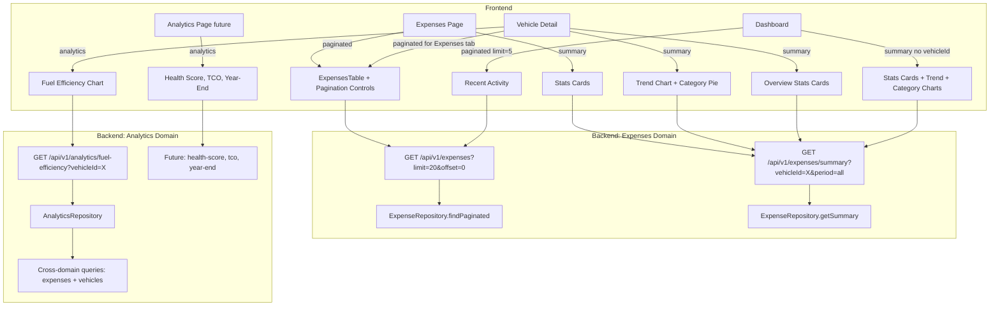
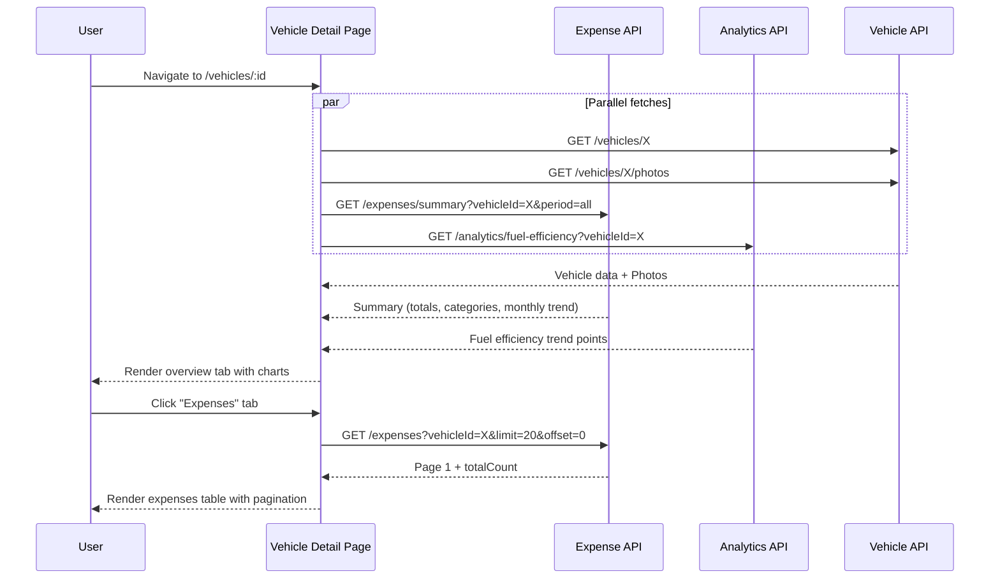

# Design Document: Expense Pagination, Summary & Analytics

## Overview

Three complementary changes: (1) push expense list pagination to SQL with `LIMIT`/`OFFSET` and `totalCount`, (2) add a lean `/expenses/summary` endpoint for basic aggregations (totals, category breakdown, monthly trend), and (3) create a new analytics domain with `/analytics/fuel-efficiency` for computed fuel efficiency trends. The expense summary stays focused on SQL aggregates. The analytics domain owns cross-domain computations and derived insights — fuel efficiency now, with health scores, TCO, and year-end summaries planned later.

## Architecture



## Sequence Diagrams

### Vehicle Detail Page Load



## Components and Interfaces

### Component 1: ExpenseRepository.findPaginated

**Purpose**: Replaces `find()`. Returns a page of expenses plus `totalCount`, with all filtering in SQL.

**Interface**:
```typescript
interface PaginatedExpenseFilters extends ExpenseFilters {
  limit?: number;
  offset?: number;
  tags?: string[];
}

interface PaginatedResult<T> {
  data: T[];
  totalCount: number;
}

async findPaginated(filters: PaginatedExpenseFilters): Promise<PaginatedResult<Expense>>
```

### Component 2: ExpenseRepository.getSummary

**Purpose**: Returns basic SQL aggregations for stats cards and charts. No derived computations — just GROUP BY results.

**Interface**:
```typescript
interface ExpenseSummaryFilters {
  userId: string;
  vehicleId?: string;
  period?: '7d' | '30d' | '90d' | '1y' | 'all';
}

interface ExpenseSummary {
  totalAmount: number;
  expenseCount: number;
  monthlyAverage: number;
  recentAmount: number;
  categoryBreakdown: Array<{ category: string; amount: number; count: number }>;
  monthlyTrend: Array<{ period: string; amount: number; count: number }>;
}

async getSummary(filters: ExpenseSummaryFilters): Promise<ExpenseSummary>
```

### Component 3: Analytics domain (`backend/src/api/analytics/`)

**Purpose**: New domain for cross-domain computed insights. Starts with fuel efficiency, extensible to health scores, TCO, year-end summaries.

**Interface**:
```typescript
// routes.ts — GET /api/v1/analytics/fuel-efficiency?vehicleId=X
// Response: { success: true, data: { fuelEfficiencyTrend: FuelEfficiencyPoint[] } }

// repository.ts
interface FuelEfficiencyPoint {
  date: string;
  efficiency: number;
  mileage: number;
}

class AnalyticsRepository {
  async getFuelEfficiencyTrend(userId: string, vehicleId?: string): Promise<FuelEfficiencyPoint[]>
}
```

**Responsibilities**:
- Query fuel expenses with mileage across vehicles (joins expenses + vehicles for ownership)
- Compute efficiency from sequential rows (same logic as frontend `prepareFuelEfficiencyData`)
- Skip missed fillups, filter unrealistic values
- Return all-time data (no period filtering)

### Component 4: Updated GET /api/v1/expenses route

**Interface**:
```typescript
// GET /api/v1/expenses?vehicleId=X&limit=20&offset=0
// Response:
{
  success: true,
  data: Expense[],
  totalCount: number,
  limit: number,
  offset: number,
  hasMore: boolean
}
```

### Component 5: GET /api/v1/expenses/summary route

**Interface**:
```typescript
// GET /api/v1/expenses/summary?vehicleId=X&period=all
// Response:
{
  success: true,
  data: ExpenseSummary
}
```

### Component 6: Frontend service updates

**Interface**:
```typescript
// expense-api.ts — updated
async getExpensesByVehicle(vehicleId, params?): Promise<PaginatedExpenseResponse>
async getAllExpenses(params?): Promise<PaginatedExpenseResponse>
async getExpenseSummary(params?): Promise<ExpenseSummary>

// analytics-api.ts — new service
async getFuelEfficiency(params?): Promise<{ fuelEfficiencyTrend: FuelEfficiencyPoint[] }>
```

### Component 7: ExpensesTable pagination mode

**Interface**:
```typescript
interface Props {
  // ... existing props ...
  totalCount?: number;
  currentOffset?: number;
  pageSize?: number;
  isLoadingPage?: boolean;
  onPageChange?: (offset: number) => void;
}
```

## Algorithmic Pseudocode

### findPaginated Algorithm

```typescript
async findPaginated(filters: PaginatedExpenseFilters): Promise<PaginatedResult<Expense>> {
  const limit = Math.min(filters.limit ?? CONFIG.pagination.defaultPageSize, CONFIG.pagination.maxPageSize);
  const offset = filters.offset ?? 0;

  const conditions: SQL[] = [];
  if (filters.vehicleId) conditions.push(eq(expenses.vehicleId, filters.vehicleId));
  if (filters.category) conditions.push(eq(expenses.category, filters.category));
  if (filters.startDate) conditions.push(gte(expenses.date, filters.startDate));
  if (filters.endDate) conditions.push(lte(expenses.date, filters.endDate));

  if (filters.tags?.length) {
    for (const tag of filters.tags) {
      conditions.push(sql`EXISTS (SELECT 1 FROM json_each(${expenses.tags}) WHERE json_each.value = ${tag})`);
    }
  }

  // Always join with vehicles for userId ownership
  const baseWhere = and(eq(vehicles.userId, filters.userId), ...conditions);

  const [countResult] = await db
    .select({ count: sql<number>`count(*)` })
    .from(expenses).innerJoin(vehicles, eq(expenses.vehicleId, vehicles.id))
    .where(baseWhere);

  const data = await db
    .select({ expenses })
    .from(expenses).innerJoin(vehicles, eq(expenses.vehicleId, vehicles.id))
    .where(baseWhere)
    .orderBy(desc(expenses.date)).limit(limit).offset(offset);

  return { data: data.map(r => r.expenses), totalCount: countResult?.count ?? 0 };
}
```

### getSummary Algorithm

```typescript
async getSummary(filters: ExpenseSummaryFilters): Promise<ExpenseSummary> {
  const periodConditions = buildPeriodConditions(filters);

  const [totals, categoryBreakdown, monthlyTrend, recentTotals] = await Promise.all([
    // Total amount and count
    db.select({
      totalAmount: sql<number>`COALESCE(SUM(expense_amount), 0)`,
      expenseCount: sql<number>`count(*)`,
    }).from(expenses).innerJoin(vehicles, ...).where(periodConditions),

    // Category breakdown
    db.select({
      category: expenses.category,
      amount: sql<number>`SUM(expense_amount)`,
      count: sql<number>`count(*)`,
    }).from(expenses).innerJoin(vehicles, ...).where(periodConditions)
      .groupBy(expenses.category),

    // Monthly trend
    db.select({
      period: sql<string>`strftime('%Y-%m', date)`,
      amount: sql<number>`SUM(expense_amount)`,
      count: sql<number>`count(*)`,
    }).from(expenses).innerJoin(vehicles, ...).where(periodConditions)
      .groupBy(sql`strftime('%Y-%m', date)`)
      .orderBy(sql`strftime('%Y-%m', date)`),

    // Recent amount (last 30 days, always computed regardless of period)
    db.select({
      amount: sql<number>`COALESCE(SUM(expense_amount), 0)`,
    }).from(expenses).innerJoin(vehicles, ...)
      .where(and(eq(vehicles.userId, filters.userId),
        filters.vehicleId ? eq(expenses.vehicleId, filters.vehicleId) : undefined,
        gte(expenses.date, thirtyDaysAgo))),
  ]);

  return {
    totalAmount: totals[0]?.totalAmount ?? 0,
    expenseCount: totals[0]?.expenseCount ?? 0,
    monthlyAverage: monthlyTrend.length > 0
      ? (totals[0]?.totalAmount ?? 0) / monthlyTrend.length : 0,
    recentAmount: recentTotals[0]?.amount ?? 0,
    categoryBreakdown,
    monthlyTrend,
  };
}
```

### getFuelEfficiencyTrend Algorithm (Analytics)

```typescript
async getFuelEfficiencyTrend(userId: string, vehicleId?: string): Promise<FuelEfficiencyPoint[]> {
  // Fetch all fuel expenses with mileage, ordered by date
  const fuelExpenses = await db.select()
    .from(expenses).innerJoin(vehicles, eq(expenses.vehicleId, vehicles.id))
    .where(and(
      eq(vehicles.userId, userId),
      vehicleId ? eq(expenses.vehicleId, vehicleId) : undefined,
      eq(expenses.category, 'fuel'),
      isNotNull(expenses.mileage),
    ))
    .orderBy(asc(expenses.date));

  // Compute efficiency from sequential pairs
  const points: FuelEfficiencyPoint[] = [];
  for (let i = 1; i < fuelExpenses.length; i++) {
    const current = fuelExpenses[i];
    const previous = fuelExpenses[i - 1];

    if (current.missedFillup || previous.missedFillup) continue;
    if (!current.mileage || !previous.mileage) continue;

    const milesDriven = current.mileage - previous.mileage;
    if (milesDriven <= 0 || milesDriven > 1000) continue;

    if (current.fuelAmount && current.fuelAmount > 0) {
      const efficiency = milesDriven / current.fuelAmount;
      if (efficiency >= 5 && efficiency <= 100) {
        points.push({ date: current.date, efficiency, mileage: current.mileage });
      }
    }
  }
  return points;
}
```

## Correctness Properties

### Property 1: Pagination Completeness
Iterating all pages yields exactly `totalCount` unique expenses with no duplicates.

### Property 2: TotalCount Accuracy
`totalCount` equals the number of matching expenses regardless of `limit`/`offset`.

### Property 3: HasMore Correctness
`hasMore` is `true` iff `offset + data.length < totalCount`.

### Property 4: Limit Clamping
Actual limit = `min(requested, maxPageSize)`, defaulting to `defaultPageSize`.

### Property 5: Tag Filter SQL Equivalence
SQL-filtered results equal JS `expense.tags.includes(tag)` filtering.

### Property 6: Summary Consistency
`summary.totalAmount` equals sum of `categoryBreakdown[].amount`; `summary.expenseCount` equals sum of `categoryBreakdown[].count`.

### Property 7: Fuel Efficiency Equivalence
Server-side `fuelEfficiencyTrend` produces identical points to frontend `prepareFuelEfficiencyData` for the same input.

## Error Handling

### Error Scenario 1: Invalid Pagination Parameters
Zod validation rejects with 400.

### Error Scenario 2: Offset Beyond Total
Returns `{ data: [], totalCount: N, hasMore: false }`.

### Error Scenario 3: Database Error
`DatabaseError` → global handler → 500.

### Error Scenario 4: Invalid Period/VehicleId
Zod validation rejects with 400. Non-owned vehicleId returns 404.
