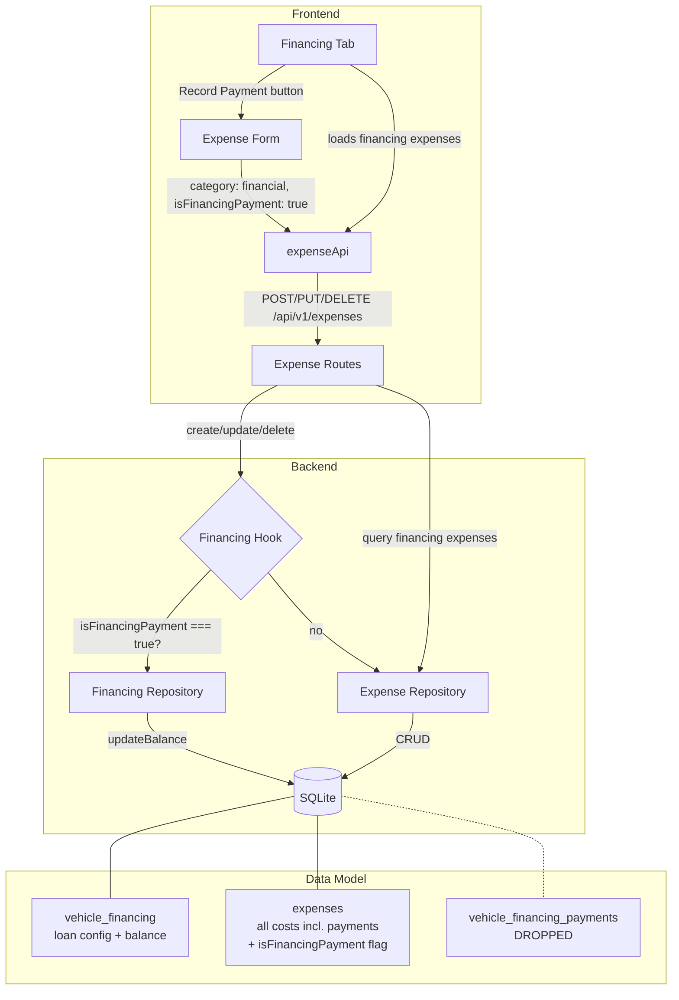
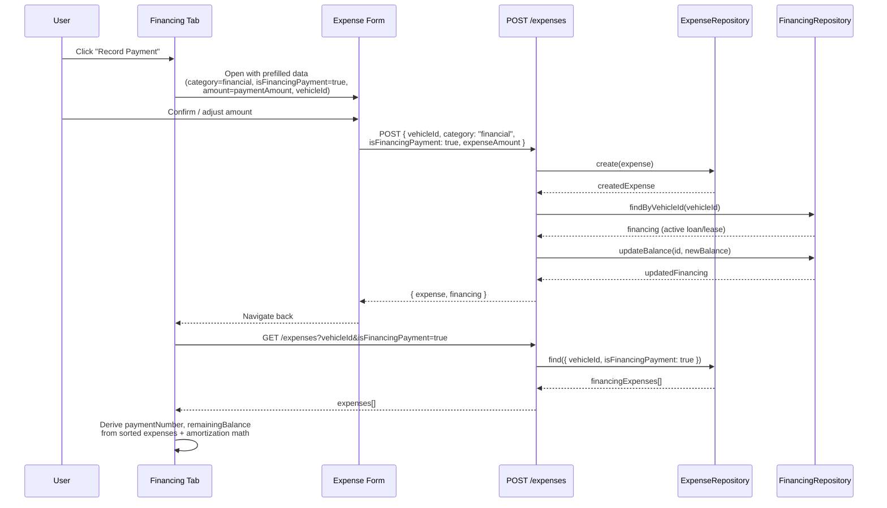
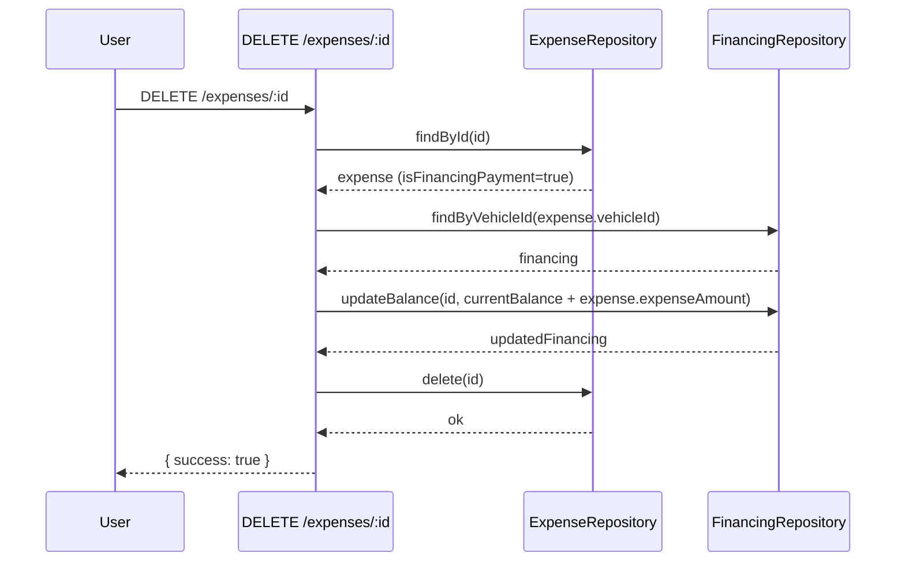
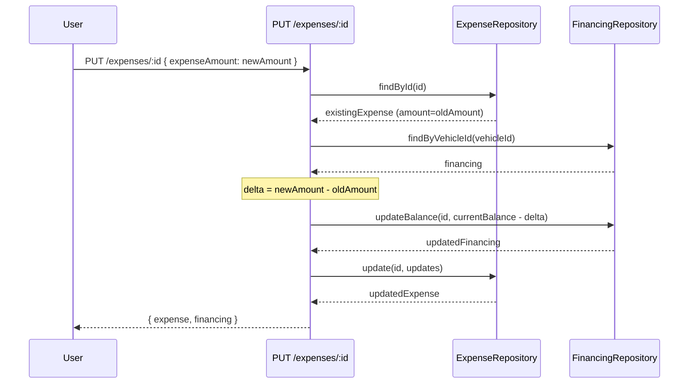

# Design Document: Financing-Expense Unification

## Overview

VROOM currently maintains two disconnected systems for tracking vehicle costs: an `expenses` table (with categories like `financial`) and a separate `vehicle_financing_payments` table for loan/lease payments. This creates data silos — financing payments don't appear in expense totals, analytics, or charts, and users have no UI to record financing payments.

This feature eliminates the `vehicle_financing_payments` table entirely and makes financing payments a special type of expense. When a user creates an expense with `category: 'financial'` and checks the "Apply as payment towards financing" checkbox, the system sets `isFinancingPayment = true` and automatically updates the vehicle's financing balance. Payment history, principal/interest breakdowns, and amortization data are all derived from the expense list combined with the existing `financing-calculations.ts` math. The `vehicle_financing` table (loan/lease configuration) remains unchanged.

The boolean flag approach is cleaner than tag-based detection: no magic tag conventions, explicit user intent via a checkbox, and simpler backend detection (`expense.isFinancingPayment === true` instead of parsing tags). Tags remain fully flexible for user-defined categorization.

The result: a single entry point for all vehicle costs, financing payments that automatically appear in analytics and charts, and a simpler data model with less code to maintain.

## Architecture



## Sequence Diagrams

### Recording a Financing Payment (via Expense Creation)



### Deleting a Financing Payment (Balance Reversal)



### Updating a Financing Payment (Balance Delta)



## Components and Interfaces

### Component 1: Financing-Aware Expense Routes (Backend)

**Purpose**: Intercept expense create/update/delete operations and adjust the vehicle's financing balance when the expense is a financing payment.

**Interface**:
```typescript
// Helper to detect if an expense is a financing payment
function isFinancingExpense(expense: { isFinancingPayment?: boolean }): boolean;

// Hook that runs after expense creation
async function handleFinancingOnCreate(expense: Expense): Promise<VehicleFinancing | null>;

// Hook that runs before expense deletion
async function handleFinancingOnDelete(expense: Expense): Promise<VehicleFinancing | null>;

// Hook that runs on expense update (computes balance delta)
async function handleFinancingOnUpdate(
  existingExpense: Expense,
  updatedExpense: Partial<NewExpense>
): Promise<VehicleFinancing | null>;
```

**Responsibilities**:
- Detect financing payments by checking `expense.isFinancingPayment === true`
- On create: subtract `expenseAmount` from `currentBalance`, mark financing complete if balance ≤ 0
- On delete: add back `expenseAmount` to `currentBalance`, reactivate financing if it was auto-completed
- On update: compute delta between old and new amount, adjust balance accordingly
- Validate that the vehicle has active financing before adjusting balance
- Return updated financing data in the API response for frontend state sync

### Component 2: Financing Expense Query Methods (Backend)

**Purpose**: Provide efficient queries for financing expenses filtered by vehicle using the `isFinancingPayment` boolean flag.

**Interface**:
```typescript
// Added to ExpenseRepository
interface ExpenseRepository {
  // Existing methods...

  // New: Find financing expenses for a vehicle (for financing tab)
  findFinancingByVehicleId(
    vehicleId: string
  ): Promise<Expense[]>;
}
```

**Responsibilities**:
- Query expenses with `isFinancingPayment = true` for a given vehicle
- Return sorted by date ascending (oldest first) for payment number derivation
- Used by the financing tab to display payment history

### Component 3: Derived Payment View (Frontend)

**Purpose**: Transform raw `Expense[]` (filtered by `isFinancingPayment === true`) into the payment history view with derived `paymentNumber` and `remainingBalance`.

**Interface**:
```typescript
// Derived payment entry for display (computed from Expense + financing config)
interface DerivedPaymentEntry {
  expense: Expense;              // The underlying expense
  paymentNumber: number;         // Derived from position in sorted list
  remainingBalance: number;      // Derived: originalAmount - cumulative payments
  principalAmount: number;       // From amortization schedule for this payment number
  interestAmount: number;        // From amortization schedule for this payment number
  paymentType: 'standard' | 'extra'; // Inferred from amount vs scheduled payment
}

// Utility function to derive payment entries from expenses
function derivePaymentEntries(
  expenses: Expense[],
  financing: VehicleFinancing
): DerivedPaymentEntry[];
```

**Responsibilities**:
- Sort financing expenses (where `isFinancingPayment === true`) by date ascending
- Assign sequential `paymentNumber` starting from 1
- Calculate cumulative `remainingBalance` by subtracting each payment from `originalAmount`
- Look up `principalAmount` and `interestAmount` from the amortization schedule (already computed by `financing-calculations.ts`)
- Detect extra payments by comparing amount to scheduled `paymentAmount` (i.e., `expense.expenseAmount > financing.paymentAmount`)

### Component 4: Updated Financing Tab (Frontend)

**Purpose**: Replace the current payment-loading flow with expense-based data loading.

**Interface**:
```typescript
// Props for updated financing components
interface PaymentHistoryProps {
  payments: DerivedPaymentEntry[];  // Was: VehicleFinancingPayment[]
  financing: VehicleFinancing;
}

interface FinancingChartsProps {
  financing: VehicleFinancing;
  payments: DerivedPaymentEntry[];  // Was: VehicleFinancingPayment[]
  amortizationSchedule?: AmortizationEntry[];
}

interface NextPaymentCardProps {
  financing: VehicleFinancing;
  lastPayment?: DerivedPaymentEntry;  // Was: VehicleFinancingPayment
}
```

**Responsibilities**:
- Load financing expenses via `expenseApi.getExpensesByVehicle()` filtered to `isFinancingPayment === true`
- Derive payment entries using `derivePaymentEntries()`
- Pass derived data to existing financing components (with updated prop types)
- Add "Record Payment" button that navigates to expense form with prefilled data (including `isFinancingPayment: true`)
- Remove `vehicleApi.getFinancingPayments()` call

## Data Models

### Model 1: Expense (schema change: new `isFinancingPayment` column)

```typescript
// Expense schema — new isFinancingPayment boolean column added
interface Expense {
  id: string;
  vehicleId: string;
  category: string;           // 'financial' for financing payments
  tags: string[];              // User-defined tags (not used for financing detection)
  date: Date;
  expenseAmount: number;       // The payment amount
  isFinancingPayment: boolean; // true if this expense is a financing payment
  mileage?: number;
  description?: string;
  receiptUrl?: string;
  fuelAmount?: number;
  fuelType?: string;
  createdAt: Date;
  updatedAt: Date;
}
```

**Backend Schema Addition**:
```typescript
// In expenses table definition (schema.ts)
isFinancingPayment: integer('is_financing_payment', { mode: 'boolean' }).notNull().default(false),
```

**Frontend Form Behavior**:
- When `category === 'financial'` AND the vehicle has active financing, a checkbox appears: "Apply as payment towards financing"
- If checked, `isFinancingPayment: true` is sent to the backend
- When recording a payment from the financing tab, the form is pre-filled with `isFinancingPayment: true`
- Tags remain fully user-defined and flexible — they are NOT used for financing detection

**Validation Rules**:
- When `isFinancingPayment === true`, vehicle must have active financing
- `expenseAmount` must be positive
- Cannot create a financing payment that would make balance negative (clamped to 0)

### Model 2: VehicleFinancing (unchanged)

```typescript
// No schema changes — balance tracking continues via currentBalance field
interface VehicleFinancing {
  id: string;
  vehicleId: string;
  financingType: 'loan' | 'lease' | 'own';
  provider: string;
  originalAmount: number;
  currentBalance: number;    // Updated by financing hooks on expense CRUD
  apr?: number;
  termMonths: number;
  startDate: Date;
  paymentAmount: number;
  paymentFrequency: 'monthly' | 'bi-weekly' | 'weekly' | 'custom';
  paymentDayOfMonth?: number;
  paymentDayOfWeek?: number;
  residualValue?: number;
  mileageLimit?: number;
  excessMileageFee?: number;
  isActive: boolean;
  endDate?: Date;
  createdAt: Date;
  updatedAt: Date;
}
```

### Model 3: VehicleFinancingPayments (DROPPED)

```typescript
// This table will be removed. No data migration needed (app is not in production).
// Simply drop the table and remove all references to it in schema, repository, routes, and types.
```


## Key Functions with Formal Specifications

### Function 1: isFinancingExpense()

```typescript
function isFinancingExpense(expense: { isFinancingPayment?: boolean }): boolean
```

**Preconditions:**
- `expense` is a valid object

**Postconditions:**
- Returns `true` if and only if `expense.isFinancingPayment === true`
- No side effects

**Loop Invariants:** N/A

### Function 2: handleFinancingOnCreate()

```typescript
async function handleFinancingOnCreate(expense: Expense): Promise<VehicleFinancing | null>
```

**Preconditions:**
- `expense` is a valid, already-persisted expense record
- `expense.expenseAmount > 0`

**Postconditions:**
- If `expense.isFinancingPayment !== true` → returns `null`, no balance change
- If vehicle has no active financing → returns `null`, no balance change
- If vehicle has active financing → `financing.currentBalance` is decreased by `expense.expenseAmount`
- New balance is clamped to `max(0, currentBalance - expenseAmount)`
- If new balance ≤ 0.01 → financing is marked as completed (`isActive = false`, `endDate = expense.date`)
- Returns the updated `VehicleFinancing` record

**Loop Invariants:** N/A

### Function 3: handleFinancingOnDelete()

```typescript
async function handleFinancingOnDelete(expense: Expense): Promise<VehicleFinancing | null>
```

**Preconditions:**
- `expense` is a valid expense record that is about to be deleted
- `expense.expenseAmount > 0`

**Postconditions:**
- If `expense.isFinancingPayment !== true` → returns `null`, no balance change
- If vehicle has no financing record → returns `null`
- `financing.currentBalance` is increased by `expense.expenseAmount`
- New balance does not exceed `financing.originalAmount`
- If financing was auto-completed (balance was 0) and is now > 0 → reactivate (`isActive = true`, `endDate = null`)
- Returns the updated `VehicleFinancing` record

**Loop Invariants:** N/A

### Function 4: handleFinancingOnUpdate()

```typescript
async function handleFinancingOnUpdate(
  existingExpense: Expense,
  updateData: Partial<NewExpense>
): Promise<VehicleFinancing | null>
```

**Preconditions:**
- `existingExpense` is the current state of the expense before update
- `updateData` contains the fields being changed

**Postconditions:**
- Determines if the expense was/is/becomes a financing expense (before and after update)
- Case 1: Was financing (`existing.isFinancingPayment`), still financing → adjust balance by delta (`newAmount - oldAmount`)
- Case 2: Was financing, no longer financing (`isFinancingPayment` changed to false) → reverse: add back `oldAmount`
- Case 3: Was not financing, now is financing (`isFinancingPayment` changed to true) → apply: subtract `newAmount`
- Case 4: Was not financing, still not financing → returns `null`
- Balance is clamped to `[0, originalAmount]`
- Returns updated `VehicleFinancing` or `null`

**Loop Invariants:** N/A

### Function 5: derivePaymentEntries()

```typescript
function derivePaymentEntries(
  expenses: Expense[],
  financing: VehicleFinancing
): DerivedPaymentEntry[]
```

**Preconditions:**
- `expenses` contains only expenses with `isFinancingPayment === true` for the given vehicle
- `financing` is a valid `VehicleFinancing` record
- `financing.originalAmount > 0`

**Postconditions:**
- Returns array sorted by `expense.date` ascending
- Each entry has `paymentNumber` = 1-based index in sorted order
- Each entry has `remainingBalance` = `originalAmount - sum(expenseAmount for entries 1..n)`
- `remainingBalance` is clamped to `max(0, computed)`
- For loans with APR > 0: `principalAmount` and `interestAmount` are looked up from amortization schedule
- For leases or loans without APR: `principalAmount = expenseAmount`, `interestAmount = 0`
- `paymentType` is `'extra'` if `expense.expenseAmount > financing.paymentAmount`, otherwise `'standard'`
- Length of result equals length of input `expenses`

**Loop Invariants:**
- After processing entry `i`: `cumulativeSum = sum(expenses[0..i].expenseAmount)`
- `remainingBalance[i] = max(0, originalAmount - cumulativeSum)`


## Algorithmic Pseudocode

### Financing-Aware Expense Creation

```typescript
// Inside POST /api/v1/expenses route handler, after expense is created
async function postExpenseCreate(createdExpense: Expense): Promise<VehicleFinancing | null> {
  // Step 1: Check if this is a financing expense
  if (!createdExpense.isFinancingPayment) {
    return null;
  }

  // Step 2: Look up active financing for the vehicle
  const financing = await financingRepository.findByVehicleId(createdExpense.vehicleId);
  if (!financing || !financing.isActive) {
    return null; // No active financing — expense is just a regular financial expense
  }

  // Step 3: Calculate new balance
  const newBalance = Math.max(0, financing.currentBalance - createdExpense.expenseAmount);

  // Step 4: Update balance
  const updated = await financingRepository.updateBalance(financing.id, newBalance);

  // Step 5: Auto-complete if paid off
  if (newBalance <= 0.01) {
    await financingRepository.markAsCompleted(financing.id, createdExpense.date);
  }

  return updated;
}
```

### Financing-Aware Expense Deletion

```typescript
// Inside DELETE /api/v1/expenses/:id route handler, before expense is deleted
async function preExpenseDelete(expense: Expense): Promise<VehicleFinancing | null> {
  if (!expense.isFinancingPayment) {
    return null;
  }

  const financing = await financingRepository.findByVehicleId(expense.vehicleId);
  if (!financing) {
    return null;
  }

  // Reverse the balance change
  const newBalance = Math.min(
    financing.originalAmount,
    financing.currentBalance + expense.expenseAmount
  );
  const updated = await financingRepository.updateBalance(financing.id, newBalance);

  // Reactivate if it was auto-completed and balance is now > 0
  if (!financing.isActive && newBalance > 0.01) {
    await financingRepository.update(financing.id, {
      isActive: true,
      endDate: null
    });
  }

  return updated;
}
```

### Financing-Aware Expense Update

```typescript
// Inside PUT /api/v1/expenses/:id route handler
async function onExpenseUpdate(
  existing: Expense,
  updateData: Partial<NewExpense>
): Promise<VehicleFinancing | null> {
  const wasFin = existing.isFinancingPayment === true;
  const isFin = updateData.isFinancingPayment ?? existing.isFinancingPayment ?? false;

  if (!wasFin && !isFin) return null; // No financing involvement

  const financing = await financingRepository.findByVehicleId(existing.vehicleId);
  if (!financing) return null;

  const oldAmount = existing.expenseAmount;
  const newAmount = updateData.expenseAmount ?? oldAmount;

  let balanceDelta = 0;

  if (wasFin && isFin) {
    // Case 1: Still a financing expense — adjust by amount delta
    balanceDelta = oldAmount - newAmount; // positive = balance increases (amount decreased)
  } else if (wasFin && !isFin) {
    // Case 2: Was financing, no longer — reverse the original deduction
    balanceDelta = oldAmount;
  } else if (!wasFin && isFin) {
    // Case 3: Became a financing expense — apply the deduction
    balanceDelta = -newAmount;
  }

  const newBalance = Math.max(
    0,
    Math.min(financing.originalAmount, financing.currentBalance + balanceDelta)
  );

  const updated = await financingRepository.updateBalance(financing.id, newBalance);

  // Handle auto-complete / reactivate
  if (newBalance <= 0.01 && financing.isActive) {
    const expenseDate = updateData.date ?? existing.date;
    await financingRepository.markAsCompleted(financing.id, expenseDate);
  } else if (newBalance > 0.01 && !financing.isActive) {
    await financingRepository.update(financing.id, { isActive: true, endDate: null });
  }

  return updated;
}
```

### Derive Payment Entries (Frontend)

```typescript
function derivePaymentEntries(
  expenses: Expense[],
  financing: VehicleFinancing
): DerivedPaymentEntry[] {
  // Sort by date ascending for sequential numbering
  const sorted = [...expenses].sort(
    (a, b) => new Date(a.date).getTime() - new Date(b.date).getTime()
  );

  // Pre-compute amortization schedule for principal/interest lookup
  const schedule = calculateAmortizationSchedule(financing, sorted.length);

  let cumulativeAmount = 0;
  return sorted.map((expense, index) => {
    cumulativeAmount += expense.amount;
    const paymentNumber = index + 1;
    const remainingBalance = Math.max(0, financing.originalAmount - cumulativeAmount);

    // Look up principal/interest from amortization schedule
    const scheduleEntry = schedule[index];
    const isLoanWithApr = financing.financingType === 'loan'
      && financing.apr != null && financing.apr > 0;

    const principalAmount = isLoanWithApr && scheduleEntry
      ? scheduleEntry.principalAmount
      : expense.amount;
    const interestAmount = isLoanWithApr && scheduleEntry
      ? scheduleEntry.interestAmount
      : 0;

    // Detect extra payments by comparing amount to scheduled payment
    const isExtra = expense.expenseAmount > financing.paymentAmount;

    return {
      expense,
      paymentNumber,
      remainingBalance,
      principalAmount,
      interestAmount,
      paymentType: isExtra ? 'extra' as const : 'standard' as const,
    };
  });
}
```

## Example Usage

### Backend: Creating a Loan Payment via Expense API

```typescript
// POST /api/v1/expenses
// Request body:
{
  vehicleId: "clx1abc123",
  category: "financial",
  isFinancingPayment: true,
  expenseAmount: 450.00,
  date: "2024-07-15T00:00:00.000Z",
  description: "July loan payment"
}

// Response (201):
{
  success: true,
  data: {
    expense: {
      id: "clx2def456",
      vehicleId: "clx1abc123",
      category: "financial",
      tags: [],
      isFinancingPayment: true,
      expenseAmount: 450.00,
      date: "2024-07-15T00:00:00.000Z",
      description: "July loan payment",
      // ...timestamps
    },
    financing: {
      id: "clx0fin789",
      currentBalance: 18550.00,  // was 19000, reduced by 450
      isActive: true,
      // ...other fields
    }
  }
}
```

### Frontend: Financing Tab Loading Financing Expenses

```typescript
// In vehicles/[id]/+page.svelte — financing tab data loading
import { expenseApi } from '$lib/services/expense-api';
import { derivePaymentEntries } from '$lib/utils/financing-calculations';

async function loadFinancingPayments() {
  if (!vehicle?.financing?.isActive) return;

  const allExpenses = await expenseApi.getExpensesByVehicle(vehicleId, vehicle.vehicleType);

  // Filter to financing expenses using the boolean flag
  const financingExpenses = allExpenses.filter(
    (e) => e.isFinancingPayment === true
  );

  // Derive payment entries with numbering and balances
  derivedPayments = derivePaymentEntries(financingExpenses, vehicle.financing);
}
```

### Frontend: "Record Payment" Button Navigation

```typescript
// In the financing tab, the "Record Payment" button navigates to the expense form
// with prefilled data via URL params
const recordPaymentHref = $derived(
  `/expenses/new?vehicleId=${vehicleId}`
  + `&category=financial`
  + `&isFinancingPayment=true`
  + `&amount=${vehicle?.financing?.paymentAmount ?? ''}`
  + `&returnTo=/vehicles/${vehicleId}`
);
```

## Correctness Properties

*A property is a characteristic or behavior that should hold true across all valid executions of a system — essentially, a formal statement about what the system should do. Properties serve as the bridge between human-readable specifications and machine-verifiable correctness guarantees.*

### Property 1: Balance Consistency

*For any* vehicle with active financing and any set of financing expenses (where `isFinancingPayment === true`), the financing `currentBalance` should equal `originalAmount` minus the sum of all financing expense amounts for that vehicle.

**Validates: Requirements 3.1, 4.1, 5.1, 5.5, 7.2**

### Property 2: Create-Delete Symmetry

*For any* financing expense with a positive amount, creating the expense and then immediately deleting it should restore the financing `currentBalance` to its value before creation (clamped to the valid range `[0, originalAmount]`).

**Validates: Requirements 3.1, 3.2, 4.1, 4.2**

### Property 3: Update Delta Correctness

*For any* financing expense updated from amount `a1` to `a2`, the balance change should equal `a1 - a2`, and the new balance should equal `clamp(oldBalance + (a1 - a2), 0, originalAmount)`. This includes flag transitions: toggling `isFinancingPayment` from true to false should reverse the original deduction, and toggling from false to true should apply a new deduction.

**Validates: Requirements 5.1, 5.2, 5.3, 5.5**

### Property 4: Payment Number Monotonicity and Remaining Balance

*For any* list of financing expenses sorted by date ascending, `derivePaymentEntries` should produce entries where `paymentNumber` equals the 1-based index, and `remainingBalance` is non-increasing across sequential entries (assuming all payment amounts are positive).

**Validates: Requirements 7.1, 7.2**

### Property 5: Non-Financing Expense Isolation

*For any* expense where `isFinancingPayment` is `false`, `undefined`, or `null`, creating, updating, or deleting that expense should not change any `vehicleFinancing.currentBalance`.

**Validates: Requirements 3.5, 4.4, 5.4**

### Property 6: Financing Active Status Consistency

*For any* vehicle financing, if the `currentBalance` is at or below 0.01 after a payment, the financing should be marked inactive (`isActive = false`). Conversely, if a deletion restores the balance above 0.01 on a previously auto-completed financing, the financing should be reactivated (`isActive = true`, `endDate = null`).

**Validates: Requirements 3.3, 4.3**

### Property 7: Financing Expense Query Correctness

*For any* set of expenses belonging to a vehicle, querying financing expenses should return exactly those expenses where `isFinancingPayment === true` and `vehicleId` matches, sorted by date in ascending order.

**Validates: Requirements 6.1, 6.2**

### Property 8: Financing Payment Validation

*For any* expense creation request with `isFinancingPayment === true` where the vehicle has no active financing, the request should be rejected with a validation error and no expense should be created.

**Validates: Requirement 3.4**

### Property 9: Payment Type Classification

*For any* derived payment entry, if the expense's `expenseAmount` exceeds the financing's `paymentAmount`, the payment type should be `extra`; otherwise it should be `standard`.

**Validates: Requirement 7.5**

### Property 10: Principal and Interest Derivation

*For any* derived payment entry on a loan with APR greater than zero, the `principalAmount` and `interestAmount` should match the corresponding values from the amortization schedule for that payment number. For leases or loans without APR, `principalAmount` should equal the expense amount and `interestAmount` should be zero.

**Validates: Requirements 7.3, 7.4**

## Error Handling

### Error Scenario 1: Expense Created with isFinancingPayment but No Active Financing

**Condition**: User creates an expense with `isFinancingPayment: true` but the vehicle has no active financing (or no financing at all).
**Response**: Validation rejects the request. The backend returns an error indicating the vehicle has no active financing. The expense is NOT created.
**Recovery**: User can uncheck the "Apply as payment towards financing" checkbox and create the expense as a regular financial expense.

### Error Scenario 2: Payment Would Exceed Remaining Balance

**Condition**: User creates a financing expense with `expenseAmount > financing.currentBalance`.
**Response**: The balance is clamped to 0 (not negative). The financing is marked as completed. The full expense amount is recorded.
**Recovery**: If the user made an error, they can edit or delete the expense, which will reverse/adjust the balance.

### Error Scenario 3: Concurrent Balance Updates

**Condition**: Two financing expenses are created simultaneously for the same vehicle.
**Response**: SQLite's serialized writes prevent true concurrency issues. The second write will see the balance after the first write. In a multi-process scenario, the balance could be slightly off.
**Recovery**: A "recalculate balance" admin action could recompute `currentBalance` from the expense history. This is a future enhancement, not part of this feature.

### Error Scenario 4: Expense isFinancingPayment Flag Changed

**Condition**: User edits an existing financing expense and unchecks the "Apply as payment towards financing" checkbox (changing `isFinancingPayment` from `true` to `false`).
**Response**: The update handler detects the transition (was financing → no longer financing) and reverses the balance deduction, adding back the original amount.
**Recovery**: Automatic — the balance is correctly adjusted on every update.

## Testing Strategy

### Unit Testing Approach

- `isFinancingExpense()` — test with `isFinancingPayment: true`, `false`, `undefined`, and `null`
- `derivePaymentEntries()` — test with empty list, single payment, multiple payments, extra payments (amount > scheduled), loans with/without APR, leases
- Balance clamping logic — test edge cases (payment > balance, payment exactly equals balance, zero-amount edge)
- Update delta calculation — test all four cases (was/is `isFinancingPayment` combinations)

### Property-Based Testing Approach

**Property Test Library**: fast-check (already used in the project's Vitest setup)

- Generate random sequences of create/delete operations and verify balance consistency (Property 1)
- Generate random create-then-delete pairs and verify symmetry (Property 2)
- Generate random expense amounts and verify balance stays in `[0, originalAmount]` range
- Generate random expense lists and verify `derivePaymentEntries` produces monotonically numbered, non-increasing balance entries (Property 4)

### Integration Testing Approach

- Full API flow: create financing → create expense with `isFinancingPayment: true` → verify balance updated → delete expense → verify balance restored
- Frontend component tests: mount `PaymentHistory` with derived payment entries → verify rendering matches expected output

## Performance Considerations

- The financing hook adds 1-2 extra DB queries per expense CRUD operation (find financing, update balance). This is negligible for single-record operations.
- The `derivePaymentEntries()` function runs on the frontend and is O(n) where n = number of financing payments. For typical vehicles (< 100 payments), this is instant. The existing virtual scrolling in `PaymentHistory.svelte` handles large lists.
- Querying financing expenses by vehicle uses the existing `expenses` table index on `vehicleId`. The `isFinancingPayment` boolean filter is applied at the DB level (`WHERE is_financing_payment = 1`), which is more efficient than the previous approach of filtering tags in application code.


## Security Considerations

- All financing balance updates go through the existing `requireAuth` middleware — no new auth surface.
- The financing hook validates vehicle ownership implicitly (the expense route already verifies the user owns the vehicle).
- Balance manipulation is server-side only — the frontend sends a normal expense creation request and the backend decides whether to adjust the balance.

## Dependencies

- **Existing**: Drizzle ORM, Hono, Zod, `financing-calculations.ts` (amortization math)
- **No new dependencies** — this feature reuses existing infrastructure
- **Removed**: `vehicle_financing_payments` table, `VehicleFinancingPayment` / `FinancingPayment` types (frontend), `getFinancingPayments` API method, payment-specific routes in `financing/routes.ts` and `vehicles/routes.ts`, `FINANCING_TAGS` constant and tag-based detection logic
