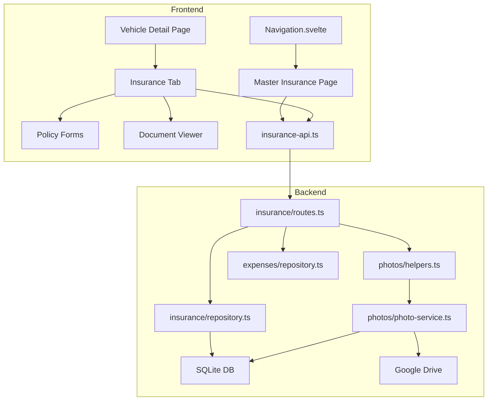

# Design Document: Insurance Management

## Overview

This design replaces the existing single-row-per-policy insurance system with a multi-term, multi-vehicle insurance management module. The current `insurance_policies` table (one policy per vehicle, flat fields) is replaced by a new schema where a single policy row represents an ongoing relationship with an insurer, stores renewal history as a `terms` JSON array of `PolicyTerm` objects, and links to one or more vehicles via an `insurance_policy_vehicles` junction table.

The module spans five subsystems:

1. **Policy_Manager** — CRUD for policies and terms, schema migration, vehicle association management, denormalized field syncing
2. **Document_Store** — Extends the existing polymorphic photo system to support `insurance_policy` entity type with PDF support
3. **Insurance_Dashboard** — New "Insurance" tab on the vehicle detail page showing policies, terms, documents, and expiring-soon alerts
4. **Master_Insurance_Page** — Top-level `/insurance` route in the main navigation showing all policies across all vehicles
5. **Expense_Linker** — Auto-generates `financial`/`insurance` expenses when terms with `financeDetails.totalCost` are added

## Architecture



### Data Flow

1. **Policy Creation**: Frontend form → `POST /api/v1/insurance` → validate vehicles belong to user → insert policy row + junction rows → sync `currentTermStart`/`currentTermEnd` from latest term → update `currentInsurancePolicyId` on vehicles → auto-create expense if term has `totalCost` → return policy
2. **Term Addition**: Frontend form → `POST /api/v1/insurance/:id/terms` → validate term dates/amounts → append to `terms` JSON → re-sync denormalized columns → auto-create expense → return updated policy
3. **Document Upload**: Frontend → `POST /api/v1/photos/insurance_policy/:policyId` → `validateEntityOwnership` checks user owns a vehicle linked to policy → upload to `VROOM/{userName}/Insurance Documents/` → store photo record
4. **Dashboard Load**: Frontend → `GET /api/v1/insurance/vehicles/:vehicleId/policies` → join through junction table → return policies with terms, expiration alerts

## Components and Interfaces

### Backend Components

#### 1. Database Schema Changes (`backend/src/db/schema.ts`)

**Replace** the existing `insurancePolicies` table and **add** `insurancePolicyVehicles` junction table. **Add** `currentInsurancePolicyId` to `vehicles`. **Add** `insurancePolicyId` and `insuranceTermId` to `expenses`.

#### 2. Insurance Repository (`backend/src/api/insurance/repository.ts`)

New repository replacing the existing one. Does not extend `BaseRepository` because the multi-table operations (junction table, vehicle updates, expense creation) require custom transaction-based methods.

**Methods:**
- `create(data, userId)` — Insert policy + junction rows + sync denormalized fields + create expense, all in a transaction
- `findById(id)` — Single policy with parsed terms
- `findByVehicleId(vehicleId)` — All policies for a vehicle via junction join
- `findByUserId(userId)` — All policies for a user via vehicle → junction join
- `update(id, data, userId)` — Update policy fields, re-sync vehicle associations, re-sync denormalized fields
- `addTerm(policyId, term, userId)` — Append term to JSON array, sync denormalized columns, create expense
- `updateTerm(policyId, termId, termData, userId)` — Update a specific term in the JSON array, re-sync denormalized columns
- `delete(id, userId)` — Delete policy (cascade handles junction), clear `currentInsurancePolicyId` on vehicles, nullify expense FKs
- `findExpiringPolicies(userId, daysFromNow)` — Active policies where `currentTermEnd` is within N days

#### 3. Insurance Routes (`backend/src/api/insurance/routes.ts`)

Replace existing routes with:

| Method | Path | Description |
|--------|------|-------------|
| `GET` | `/api/v1/insurance` | Get all policies for the authenticated user |
| `POST` | `/api/v1/insurance` | Create policy with initial term and vehicle IDs |
| `GET` | `/api/v1/insurance/:id` | Get single policy |
| `PUT` | `/api/v1/insurance/:id` | Update policy (company, isActive, notes, vehicleIds) |
| `DELETE` | `/api/v1/insurance/:id` | Delete policy |
| `POST` | `/api/v1/insurance/:id/terms` | Add a new term |
| `PUT` | `/api/v1/insurance/:id/terms/:termId` | Update a term |
| `GET` | `/api/v1/insurance/vehicles/:vehicleId/policies` | Get all policies for a vehicle |
| `GET` | `/api/v1/insurance/expiring-soon` | Get expiring policies for user |

#### 4. Photo System Extensions (`backend/src/api/photos/helpers.ts`)

- **`validateEntityOwnership`**: Add `insurance_policy` case — look up policy, join to junction table, verify user owns at least one linked vehicle
- **`resolveEntityDriveFolder`**: Add `insurance_policy` case — create/find `VROOM/{userName}/Insurance Documents/` folder (flat, not per-vehicle)
- **`ALLOWED_MIME_TYPES`** in `photo-service.ts`: Add `application/pdf` to the allowed list
- **`PhotoEntityType`** in `schema.ts`: Add `'insurance_policy'` to the union type

#### 5. Validation Updates (`backend/src/utils/validation.ts`)

- **`validateInsuranceOwnership`**: Rewrite to use junction table instead of direct `vehicleId` FK. Query policy → junction → vehicles → check userId.
- Add Zod schemas for `PolicyTerm`, `PolicyDetails`, `FinanceDetails` with the validation rules from requirements (positive deductible/coverageLimit, non-negative costs, startDate < endDate).

#### 6. Config Updates (`backend/src/config.ts`)

- Update `CONFIG.validation.insurance` to add: `maxTerms: 50`, `notesMaxLength: 2000`, `coverageDescriptionMaxLength: 500`, `agentNameMaxLength: 100`, `agentPhoneMaxLength: 30`, `agentEmailMaxLength: 100`, `premiumFrequencyMaxLength: 50`
- Update `TABLE_SCHEMA_MAP` and `TABLE_FILENAME_MAP` for the new schema

### Frontend Components

#### 1. Types (`frontend/src/lib/types.ts`)

Replace the existing `InsurancePolicy` interface with:

```typescript
interface PolicyDetails {
  policyNumber?: string;
  coverageDescription?: string;
  deductibleAmount?: number;
  coverageLimit?: number;
  agentName?: string;
  agentPhone?: string;
  agentEmail?: string;
}

interface FinanceDetails {
  totalCost?: number;
  monthlyCost?: number;
  premiumFrequency?: string;
  paymentAmount?: number;
}

interface PolicyTerm {
  id: string;
  startDate: string;
  endDate: string;
  policyDetails: PolicyDetails;
  financeDetails: FinanceDetails;
}

interface InsurancePolicy {
  id: string;
  company: string;
  isActive: boolean;
  currentTermStart?: string;
  currentTermEnd?: string;
  terms: PolicyTerm[];
  notes?: string;
  vehicleIds: string[];
  createdAt: string;
  updatedAt: string;
}
```

#### 2. Insurance API Service (`frontend/src/lib/services/insurance-api.ts`)

New domain API service following the `vehicleApi`/`expenseApi` pattern:

```typescript
export const insuranceApi = {
  getAllPolicies(): Promise<InsurancePolicy[]>,
  getPoliciesForVehicle(vehicleId: string): Promise<InsurancePolicy[]>,
  getPolicy(policyId: string): Promise<InsurancePolicy>,
  createPolicy(data: CreatePolicyRequest): Promise<InsurancePolicy>,
  updatePolicy(policyId: string, data: UpdatePolicyRequest): Promise<InsurancePolicy>,
  deletePolicy(policyId: string): Promise<void>,
  addTerm(policyId: string, term: CreateTermRequest): Promise<InsurancePolicy>,
  updateTerm(policyId: string, termId: string, data: UpdateTermRequest): Promise<InsurancePolicy>,
  getExpiringPolicies(days?: number): Promise<InsurancePolicy[]>,
  // Document methods delegate to photo endpoints
  getDocuments(policyId: string): Promise<Photo[]>,
  uploadDocument(policyId: string, file: File, termId?: string): Promise<Photo>,
  deleteDocument(policyId: string, photoId: string): Promise<void>,
  getDocumentThumbnailUrl(policyId: string, photoId: string): string,
};
```

#### 3. Insurance Components (`frontend/src/lib/components/insurance/`)

| Component | Purpose |
|-----------|---------|
| `InsuranceTab.svelte` | Top-level tab content, loads policies, manages state |
| `PolicyCard.svelte` | Displays a single policy summary (company, current term, cost, expiry alert) |
| `PolicyList.svelte` | Groups policies into active/inactive sections |
| `PolicyForm.svelte` | Create/edit policy dialog with vehicle multi-select and initial term |
| `TermForm.svelte` | Add/edit term dialog with policyDetails and financeDetails fields |
| `TermHistory.svelte` | Reverse-chronological list of all terms for a policy |
| `DocumentViewer.svelte` | Lists documents for a policy with image thumbnails and PDF download links |
| `ExpirationAlert.svelte` | Badge/alert showing days until expiry for policies within 30 days |

#### 4. Master Insurance Page (`frontend/src/routes/insurance/+page.svelte`)

- Top-level `/insurance` route showing all policies across all vehicles for the authenticated user
- Uses `insuranceApi.getAllPolicies()` to fetch all user policies
- Displays policies grouped into active/inactive sections
- Each policy card shows company name, associated vehicle names, current term summary, and expiring-soon alerts
- Provides a "New Policy" button to create a policy with vehicle multi-select
- Clicking a policy navigates to or expands its full details (terms, documents)
- Reuses `PolicyCard.svelte`, `PolicyList.svelte`, `PolicyForm.svelte`, and `ExpirationAlert.svelte` components

#### 5. Navigation Changes (`frontend/src/lib/components/layout/Navigation.svelte`)

- Add "Insurance" nav item between "Expenses" and "Analytics" in the `navItems` array:
  ```typescript
  { name: 'Insurance', href: '/insurance', icon: Shield }
  ```
  (using `Shield` from `lucide-svelte`)

#### 6. Vehicle Detail Page Changes (`frontend/src/routes/vehicles/[id]/+page.svelte`)

- Add "Insurance" tab to the `TabsList` (change from `grid-cols-5` to `grid-cols-6`)
- Add `TabsContent` for `insurance` value that renders `InsuranceTab`
- Import `InsuranceTab` component

## Data Models

### Database Schema (Drizzle)

#### New `insurancePolicies` table (replaces existing)

```typescript
export const insurancePolicies = sqliteTable('insurance_policies', {
  id: text('id').primaryKey().$defaultFn(() => createId()),
  company: text('company').notNull(),
  isActive: integer('is_active', { mode: 'boolean' }).notNull().default(true),
  currentTermStart: integer('current_term_start', { mode: 'timestamp' }),
  currentTermEnd: integer('current_term_end', { mode: 'timestamp' }),
  terms: text('terms', { mode: 'json' }).$type<PolicyTerm[]>().notNull().default([]),
  notes: text('notes'),
  createdAt: integer('created_at', { mode: 'timestamp' }).$defaultFn(() => new Date()),
  updatedAt: integer('updated_at', { mode: 'timestamp' }).$defaultFn(() => new Date()),
});
```

#### New `insurancePolicyVehicles` junction table

```typescript
export const insurancePolicyVehicles = sqliteTable('insurance_policy_vehicles', {
  policyId: text('policy_id').notNull()
    .references(() => insurancePolicies.id, { onDelete: 'cascade' }),
  vehicleId: text('vehicle_id').notNull()
    .references(() => vehicles.id, { onDelete: 'cascade' }),
}, (table) => ({
  pk: primaryKey({ columns: [table.policyId, table.vehicleId] }),
}));
```

#### Vehicles table addition

```typescript
// Add to existing vehicles table:
currentInsurancePolicyId: text('current_insurance_policy_id'),
```

Note: This is a soft reference (no FK constraint) because the policy may be deleted and we clear it via application logic rather than cascade.

#### Expenses table additions

```typescript
// Add to existing expenses table:
insurancePolicyId: text('insurance_policy_id'),
insuranceTermId: text('insurance_term_id'),
```

These are soft references (no FK constraints). When a policy is deleted, the repository nullifies these fields on linked expenses rather than cascading deletes, preserving expense history.

### Zod Validation Schemas

```typescript
const policyDetailsSchema = z.object({
  policyNumber: z.string().max(50).optional(),
  coverageDescription: z.string().max(500).optional(),
  deductibleAmount: z.number().positive('Deductible must be positive').optional(),
  coverageLimit: z.number().positive('Coverage limit must be positive').optional(),
  agentName: z.string().max(100).optional(),
  agentPhone: z.string().max(30).optional(),
  agentEmail: z.string().email().max(100).optional(),
}).optional().default({});

const financeDetailsSchema = z.object({
  totalCost: z.number().min(0, 'Total cost must be non-negative').optional(),
  monthlyCost: z.number().min(0, 'Monthly cost must be non-negative').optional(),
  premiumFrequency: z.string().max(50).optional(),
  paymentAmount: z.number().min(0, 'Payment amount must be non-negative').optional(),
}).optional().default({});

const policyTermSchema = z.object({
  id: z.string().min(1),
  startDate: z.coerce.date(),
  endDate: z.coerce.date(),
  policyDetails: policyDetailsSchema,
  financeDetails: financeDetailsSchema,
}).refine(data => data.endDate > data.startDate, {
  message: 'End date must be after start date',
});

const createPolicySchema = z.object({
  company: z.string().min(1).max(100),
  vehicleIds: z.array(z.string().min(1)).min(1, 'At least one vehicle is required'),
  terms: z.array(policyTermSchema).min(1, 'At least one term is required'),
  notes: z.string().max(2000).optional(),
  isActive: z.boolean().optional().default(true),
});
```

### API Request/Response Shapes

**Create Policy Request:**
```json
{
  "company": "State Farm",
  "vehicleIds": ["vehicle-id-1", "vehicle-id-2"],
  "terms": [{
    "id": "term-cuid",
    "startDate": "2024-01-01",
    "endDate": "2024-07-01",
    "policyDetails": { "policyNumber": "SF-12345", "deductibleAmount": 500 },
    "financeDetails": { "totalCost": 1200, "monthlyCost": 200 }
  }],
  "notes": "Multi-vehicle discount applied",
  "isActive": true
}
```

**Policy Response** (includes computed fields):
```json
{
  "id": "policy-cuid",
  "company": "State Farm",
  "isActive": true,
  "currentTermStart": "2024-01-01T00:00:00.000Z",
  "currentTermEnd": "2024-07-01T00:00:00.000Z",
  "terms": [{ "..." }],
  "notes": "Multi-vehicle discount applied",
  "vehicleIds": ["vehicle-id-1", "vehicle-id-2"],
  "createdAt": "...",
  "updatedAt": "..."
}
```


## Correctness Properties

*A property is a characteristic or behavior that should hold true across all valid executions of a system — essentially, a formal statement about what the system should do. Properties serve as the bridge between human-readable specifications and machine-verifiable correctness guarantees.*

### Property 1: Policy creation round-trip

*For any* valid policy input (company, vehicleIds, terms with nested policyDetails and financeDetails, notes), creating the policy and then retrieving it by ID should return a record where all scalar fields match the input and the `terms` JSON array deserializes to an equivalent list of PolicyTerm objects.

**Validates: Requirements 1.1, 1.3**

### Property 2: Junction table integrity

*For any* policy created with N distinct vehicle IDs, the `insurance_policy_vehicles` table should contain exactly N rows for that policy, and the set of vehicleIds in those rows should equal the input set.

**Validates: Requirements 1.2**

### Property 3: Vehicle ownership validation

*For any* policy creation or update request containing at least one vehicle ID that does not belong to the authenticated user, the system should reject the request and leave the database unchanged.

**Validates: Requirements 1.6**

### Property 4: Term field validation

*For any* term where `startDate >= endDate`, or `deductibleAmount` is present and `<= 0`, or `coverageLimit` is present and `<= 0`, or `totalCost` is present and `< 0`, or `monthlyCost` is present and `< 0`, the system should reject the term and leave the policy unchanged. Conversely, for any term where all present numeric fields satisfy their constraints and `startDate < endDate`, the term should be accepted.

**Validates: Requirements 1.7, 1.8, 1.9, 1.10, 1.11**

### Property 5: Denormalized field sync invariant

*For any* policy with one or more terms, after any term addition or update, `currentTermEnd` should equal the maximum `endDate` across all terms in the array, and `currentTermStart` should equal the `startDate` of the term that has that maximum `endDate`.

**Validates: Requirements 1.12**

### Property 6: Active policy sets vehicle reference

*For any* policy that is active and associated with a set of vehicles, after creation or update, each associated vehicle's `currentInsurancePolicyId` should equal the policy's ID.

**Validates: Requirements 1.13**

### Property 7: Deactivation clears vehicle reference

*For any* policy that is deactivated or deleted, all vehicles that previously had `currentInsurancePolicyId` pointing to that policy should have the field set to null.

**Validates: Requirements 1.15**

### Property 8: Document MIME type validation

*For any* file upload attempt, the system should accept the file if and only if its MIME type is one of `image/jpeg`, `image/png`, `image/webp`, or `application/pdf`. All other MIME types should be rejected with an error.

**Validates: Requirements 2.3**

### Property 9: Document ordering

*For any* policy with multiple uploaded documents, retrieving the document list should return them sorted by upload date in ascending order (oldest first).

**Validates: Requirements 2.6**

### Property 10: Document cascade on policy deletion

*For any* policy with associated documents, deleting the policy should result in zero documents remaining for that policy's entity ID in both the database and Google Drive.

**Validates: Requirements 2.7**

### Property 11: Policy active/inactive grouping

*For any* list of policies associated with a vehicle, partitioning by `isActive` should produce two groups where every policy in the "active" group has `isActive === true` and every policy in the "inactive" group has `isActive === false`, with no policies missing from either group.

**Validates: Requirements 3.1**

### Property 12: Expiration alert computation

*For any* active policy and a reference date, the expiring-soon alert should appear if and only if `currentTermEnd` is within 30 days of the reference date, and the displayed `daysRemaining` should equal `ceil((currentTermEnd - referenceDate) / (24*60*60*1000))`.

**Validates: Requirements 3.4**

### Property 13: Term history ordering

*For any* policy with N terms, the renewal history display order should be the terms sorted by `endDate` in descending order (most recent first).

**Validates: Requirements 3.5**

### Property 14: Renew pre-fill from previous term

*For any* policy with at least one term, invoking the "Renew" action should produce a new term form where `policyDetails` and `financeDetails` are deeply equal to the latest term's corresponding objects.

**Validates: Requirements 3.6**

### Property 15: Expense auto-generation on term addition

*For any* term added to a policy where `financeDetails.totalCost` is defined and non-negative, the system should create exactly one expense with: `category === 'financial'`, `tags` containing `'insurance'`, `expenseAmount === totalCost`, `date === term.startDate`, `insurancePolicyId === policy.id`, `insuranceTermId === term.id`, and a description containing both the term's start and end dates.

**Validates: Requirements 4.1, 4.2, 4.3, 4.5**

### Property 16: Expense preservation on policy deletion

*For any* policy with linked expenses, deleting the policy should preserve all linked expense records but set their `insurancePolicyId` and `insuranceTermId` fields to null.

**Validates: Requirements 4.4**

### Property 17: No expense for terms without totalCost

*For any* term added to a policy where `financeDetails.totalCost` is undefined or null, the system should not create any expense record for that term.

**Validates: Requirements 4.6**

## Error Handling

### Backend Error Handling

All errors follow the existing app pattern using `HTTPException` from Hono and custom error classes (`AppError`, `NotFoundError`, `ValidationError`, `DatabaseError`).

| Scenario | Status | Error |
|----------|--------|-------|
| Policy not found | 404 | `NotFoundError('Insurance policy')` |
| Vehicle not found or not owned by user | 404 | `HTTPException(404, 'Vehicle not found')` |
| Term not found in policy's terms array | 404 | `HTTPException(404, 'Term not found')` |
| Validation failure (Zod) | 400 | Zod error response via `zValidator` middleware |
| Missing vehicle IDs on create | 400 | `HTTPException(400, 'At least one vehicle is required')` |
| Missing terms on create | 400 | `HTTPException(400, 'At least one term is required')` |
| startDate >= endDate | 400 | Zod refine error: `'End date must be after start date'` |
| Negative/zero numeric fields | 400 | Zod field-level errors |
| File too large (>10MB) | 413 | `AppError('File must be under 10MB', 413)` |
| Invalid MIME type | 400 | `AppError('Only JPEG, PNG, WebP images and PDF files are allowed', 400)` |
| Database transaction failure | 500 | `DatabaseError` with logged details |
| Google Drive upload failure | 500 | `AppError` with logged Drive error |

### Frontend Error Handling

- All API calls go through `insuranceApi` service which uses `apiClient` — errors are caught by the existing `ApiError` class
- Component-level error handling uses `handleErrorWithNotification` from `$lib/utils/error-handling` for user-facing toast notifications
- Form validation errors are displayed inline using `border-destructive` on invalid fields
- Loading states use `$state` booleans with `LoaderCircle` spinners
- Network errors show retry-able error states within the insurance tab

## Testing Strategy

### Property-Based Testing

Use **fast-check** (already available in the project via Vitest) for property-based tests. Each property test runs a minimum of 100 iterations.

**Backend property tests** (`backend/src/api/insurance/__tests__/`):

| Test File | Properties Covered |
|-----------|-------------------|
| `insurance-repository.property.test.ts` | P1 (round-trip), P2 (junction integrity), P5 (denormalized sync), P6 (active sets ref), P7 (deactivation clears ref), P15 (expense auto-gen), P16 (expense preservation), P17 (no expense without cost) |
| `insurance-validation.property.test.ts` | P3 (vehicle ownership), P4 (term field validation), P8 (MIME type validation) |

**Frontend property tests** (`frontend/src/lib/components/__tests__/`):

| Test File | Properties Covered |
|-----------|-------------------|
| `InsuranceLogic.property.test.ts` | P11 (grouping), P12 (expiration alert), P13 (term ordering), P14 (renew pre-fill) |

Each test is tagged with a comment:
```typescript
// Feature: insurance-management, Property 5: Denormalized field sync invariant
```

### Unit Testing

Unit tests complement property tests for specific examples, edge cases, and integration points:

**Backend unit tests:**
- Schema migration: verify new tables exist, columns have correct types
- Route handler: test each endpoint with specific valid/invalid payloads
- Edge cases: policy with exactly one term, policy with max terms (50), term with all optional fields omitted, term with all optional fields present
- Document upload: test PDF acceptance (new), test file size boundary (exactly 10MB)
- Expense linker: test description format string, test expense with zero totalCost (should create), test term without totalCost (should skip)

**Frontend unit tests:**
- `InsuranceTab.svelte`: renders empty state, renders policy list, handles loading state
- `PolicyForm.svelte`: validates required fields, submits correct payload
- `TermForm.svelte`: pre-fills from previous term on renew, validates date ordering
- `ExpirationAlert.svelte`: shows correct days remaining, doesn't show for far-future policies
- `insuranceApi` service: correct URL construction, correct HTTP methods

### Test Configuration

- Backend: Vitest with Bun, fast-check for PBT, minimum 100 iterations per property
- Frontend: Vitest with jsdom, fast-check for PBT, minimum 100 iterations per property
- Property tests use `fc.assert(fc.property(...), { numRuns: 100 })` pattern
- Each property-based test file imports generators from a shared `insurance-test-generators.ts` helper
