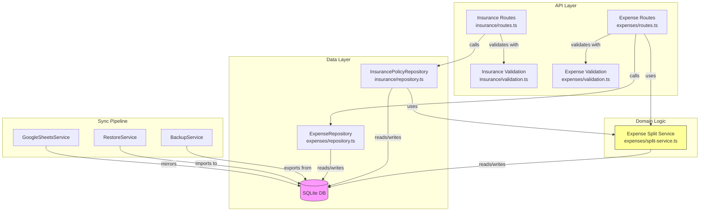
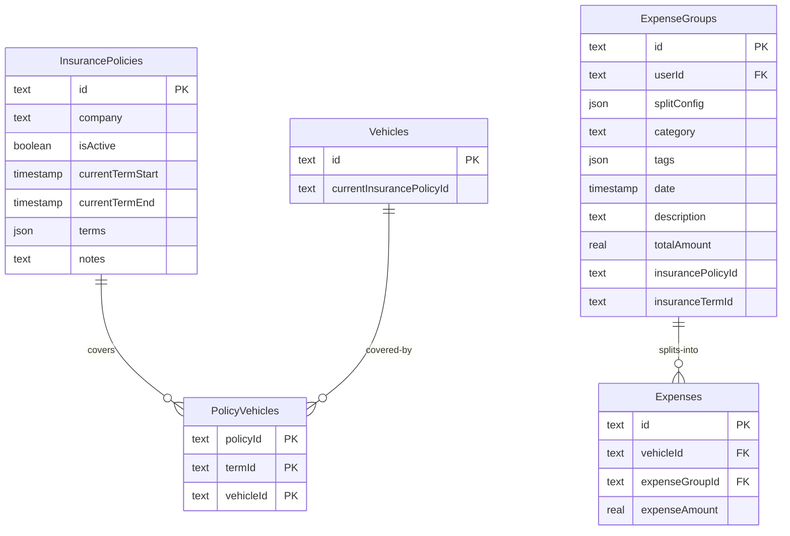
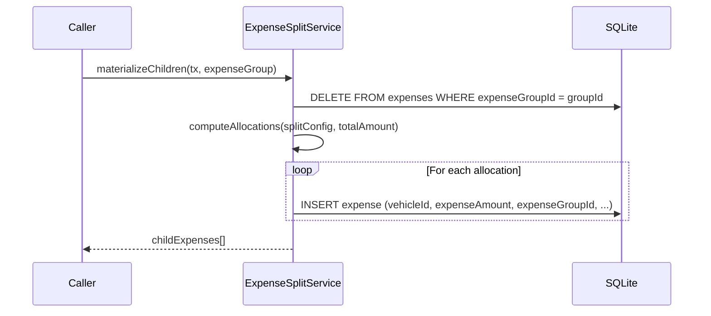
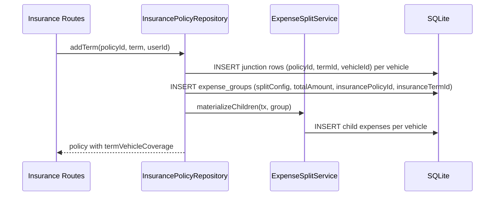

# Design Document: Insurance Term-Vehicle Coverage & General Expense Splitting

## Overview

This feature introduces two interconnected systems: a general-purpose expense splitting mechanism and per-term vehicle coverage for insurance policies.

The expense splitting system uses a separate `expense_groups` table to represent cross-vehicle costs. An expense group holds the total amount, split configuration, and metadata (category, date, description, etc.). The system materializes child expense rows in the existing `expenses` table — real expenses with their own `vehicleId` and computed `expenseAmount` — linked back to the group via an `expenseGroupId` FK. Children are system-managed: when split config changes, all children are deleted and regenerated from the new config. The `expenses.vehicleId` column stays NOT NULL, so all existing queries, analytics, and filters work unchanged.

Insurance becomes a consumer of this system. When a term has `financeDetails.totalCost`, the repository creates an expense group and the system materializes per-vehicle child expenses based on the term's vehicle coverage. The `insurance_policy_vehicles` junction table is repurposed to track per-term coverage with a `(policy_id, term_id, vehicle_id)` composite PK.

No backward compatibility is needed — insurance schema isn't in production. Old backups with missing columns should error, not be handled gracefully.

## Architecture



### Data Model



## Schema Migration

### New `expense_groups` Table

A new table to hold cross-vehicle cost allocation containers:

```typescript
export const expenseGroups = sqliteTable('expense_groups', {
  id: text('id').primaryKey().$defaultFn(() => createId()),
  userId: text('user_id').notNull().references(() => users.id, { onDelete: 'cascade' }),
  splitConfig: text('split_config', { mode: 'json' }).$type<SplitConfig>().notNull(),
  category: text('category').notNull(),
  tags: text('tags', { mode: 'json' }).$type<string[]>(),
  date: integer('date', { mode: 'timestamp' }).notNull(),
  description: text('description'),
  totalAmount: real('total_amount').notNull(),
  insurancePolicyId: text('insurance_policy_id'),
  insuranceTermId: text('insurance_term_id'),
  createdAt: integer('created_at', { mode: 'timestamp' }).$defaultFn(() => new Date()),
  updatedAt: integer('updated_at', { mode: 'timestamp' }).$defaultFn(() => new Date()),
});
```

### Expenses Table Changes

One change to the `expenses` table:

- **Add `expenseGroupId`** — FK to `expense_groups.id`, nullable. Non-null means this expense was materialized from a split group.

```typescript
// Added column on expenses table
expenseGroupId: text('expense_group_id')
  .references(() => expenseGroups.id, { onDelete: 'cascade' }),
```

`vehicleId` stays NOT NULL. All existing queries, analytics, and filters work unchanged. Child expenses are normal expense rows that happen to have an `expenseGroupId`.

### Insurance Policy Vehicles Table Changes

Repurposed to track per-term vehicle coverage:

```typescript
export const insurancePolicyVehicles = sqliteTable(
  'insurance_policy_vehicles',
  {
    policyId: text('policy_id')
      .notNull()
      .references(() => insurancePolicies.id, { onDelete: 'cascade' }),
    termId: text('term_id').notNull(),
    vehicleId: text('vehicle_id')
      .notNull()
      .references(() => vehicles.id, { onDelete: 'cascade' }),
  },
  (table) => ({
    pk: primaryKey({ columns: [table.policyId, table.termId, table.vehicleId] }),
  })
);
```

Changes from current schema:
- Added `termId` — soft FK to the `id` field of a term in the policy's `terms` JSON array
- Updated composite PK — `(policyId, termId, vehicleId)` instead of `(policyId, vehicleId)`

### Migration Strategy

Straight schema change — no data backfill. The new `expense_groups` table is created fresh. The `insurance_policy_vehicles` table is rebuilt for the composite PK change. Existing junction rows are dropped.


## Expense Splitting System

### Split Config Types

```typescript
type SplitConfig =
  | { method: 'even'; vehicleIds: string[] }
  | { method: 'absolute'; allocations: Array<{ vehicleId: string; amount: number }> }
  | { method: 'percentage'; allocations: Array<{ vehicleId: string; percentage: number }> };
```

**Even split**: Total divided equally among listed vehicles. Remainder cents go to the first vehicle.

**Absolute split**: Each vehicle gets a fixed dollar amount. Sum of amounts must equal the group's `totalAmount`.

**Percentage split**: Each vehicle gets a percentage of the total. Percentages must sum to 100. Amounts are computed as `floor(total * pct / 100 * 100) / 100` with remainder cents assigned to the first vehicle.

### Expense Group vs Child Expenses

| Property | Expense Group (`expense_groups`) | Child Expense (`expenses`) |
|---|---|---|
| `vehicleId` | N/A (no column) | Set to the vehicle's ID (NOT NULL) |
| `expenseGroupId` | N/A | FK → expense_groups.id |
| `splitConfig` | JSON describing split intent | N/A |
| `totalAmount` / `expenseAmount` | Total cost | Vehicle's share |
| `category`, `date`, `tags`, `description` | Set by user/system | Copied from group |

### Materialization Logic

When an expense group is created or its `splitConfig` is updated, the split service materializes child expenses:



### Update/Regeneration Flow

When split config changes on an existing expense group:

1. Read new `splitConfig` from request
2. `DELETE FROM expenses WHERE expenseGroupId = :groupId` — wipe all children
3. Update group's `splitConfig` and `totalAmount` (if changed)
4. Regenerate children from new split config
5. Return updated group + children

Children are system-managed — if someone manually edits a child's amount, regenerating will overwrite it. This is acceptable and documented behavior.

### ExpenseSplitService Interface

```typescript
class ExpenseSplitService {
  /**
   * Compute per-vehicle amounts from a split config and total.
   * Pure function — no DB access.
   */
  computeAllocations(
    config: SplitConfig,
    totalAmount: number
  ): Array<{ vehicleId: string; amount: number }>

  /**
   * Delete existing children and create new ones from split config.
   * Runs inside the caller's transaction.
   */
  async materializeChildren(
    tx: Transaction,
    group: ExpenseGroup
  ): Promise<Expense[]>

  /**
   * Update an expense group's split config and regenerate children.
   */
  async updateSplit(
    tx: Transaction,
    groupId: string,
    newConfig: SplitConfig,
    newTotalAmount?: number
  ): Promise<{ group: ExpenseGroup; children: Expense[] }>
}
```

### Expense Splitting API Endpoints

New endpoints on the expenses router for managing split expenses:

| Method | Path | Description |
|---|---|---|
| `POST` | `/api/v1/expenses/split` | Create an expense group + materialized children |
| `PUT` | `/api/v1/expenses/split/:id` | Update split config on an existing group, regenerate children |
| `GET` | `/api/v1/expenses/split/:id` | Get an expense group with its children |
| `DELETE` | `/api/v1/expenses/split/:id` | Delete a group and cascade-delete children |

These are general-purpose — not insurance-specific. Any cross-vehicle cost can use them.

## Insurance Repository Updates

### How Insurance Uses Expense Splitting

When a term is created with `financeDetails.totalCost`:



The insurance repository:
1. Creates junction rows `(policyId, termId, vehicleId)` for each covered vehicle
2. Creates an expense group with `splitConfig` derived from the term's vehicle list and split method, `totalAmount: totalCost`, `insurancePolicyId`, `insuranceTermId`
3. Calls `ExpenseSplitService.materializeChildren()` to create per-vehicle child expenses

### Updated Repository Interfaces

```typescript
// Vehicle coverage input for a term
interface TermVehicleCoverage {
  vehicleIds: string[];
  splitMethod?: 'even' | 'absolute' | 'percentage';  // defaults to 'even'
  allocations?: Array<{ vehicleId: string; amount?: number; percentage?: number }>;
}

// Updated CreatePolicyData — vehicleIds replaced by per-term coverage
interface CreatePolicyData {
  company: string;
  terms: Array<PolicyTerm & { vehicleCoverage: TermVehicleCoverage }>;
  notes?: string;
  isActive?: boolean;
}

// Return type includes per-term vehicle coverage
interface TermCoverageRow {
  termId: string;
  vehicleId: string;
}

type InsurancePolicyWithVehicles = InsurancePolicy & {
  vehicleIds: string[];
  termVehicleCoverage: TermCoverageRow[];
};
```

### Key Repository Method Changes

| Method | Change |
|---|---|
| `create()` | Accept per-term `vehicleCoverage`; insert junction rows with `termId`; create expense group per term via `ExpenseSplitService` |
| `addTerm()` | Accept `vehicleCoverage` on the term; insert junction rows; create expense group |
| `updateTerm()` | If `vehicleCoverage` changes: delete old junction rows for this term, insert new ones; call `ExpenseSplitService.updateSplit()` to regenerate child expenses |
| `update()` | `vehicleIds` at policy level removed from `UpdatePolicyData` — vehicle assignment is per-term only |
| `attachVehicleIds()` | Also attach `termVehicleCoverage` array from junction table |
| `resyncVehicleJunction()` | Updated to work with `(policyId, termId, vehicleId)` rows |
| `getVehicleIdsForPolicy()` | `SELECT DISTINCT vehicle_id WHERE policy_id = ?` (unchanged semantic) |
| `getVehicleIdsForTerm()` | New — `WHERE policy_id = ? AND term_id = ?` |
| `createExpenseForTerm()` | Replaced by creating an expense group + calling `materializeChildren()` |


## Validation Updates

### Split Config Zod Schemas

```typescript
const evenSplitSchema = z.object({
  method: z.literal('even'),
  vehicleIds: z.array(z.string().min(1)).min(1),
});

const absoluteAllocationSchema = z.object({
  vehicleId: z.string().min(1),
  amount: z.number().min(0, 'Amount must be non-negative'),
});

const absoluteSplitSchema = z.object({
  method: z.literal('absolute'),
  allocations: z.array(absoluteAllocationSchema).min(1),
});

const percentageAllocationSchema = z.object({
  vehicleId: z.string().min(1),
  percentage: z.number().min(0).max(100, 'Percentage must be 0-100'),
});

const percentageSplitSchema = z.object({
  method: z.literal('percentage'),
  allocations: z.array(percentageAllocationSchema).min(1),
});

const splitConfigSchema = z.discriminatedUnion('method', [
  evenSplitSchema,
  absoluteSplitSchema,
  percentageSplitSchema,
]);
```

### Updated Insurance Validation Schemas

```typescript
const termVehicleCoverageSchema = z.object({
  vehicleIds: z.array(z.string().min(1)).min(1, 'At least one vehicle required'),
  splitMethod: z.enum(['even', 'absolute', 'percentage']).optional().default('even'),
  allocations: z.array(z.object({
    vehicleId: z.string().min(1),
    amount: z.number().min(0).optional(),
    percentage: z.number().min(0).max(100).optional(),
  })).optional(),
});

const createPolicyTermSchema = z.object({
  id: z.string().min(1),
  startDate: z.coerce.date(),
  endDate: z.coerce.date(),
  policyDetails: policyDetailsSchema,
  financeDetails: financeDetailsSchema,
  vehicleCoverage: termVehicleCoverageSchema,
}).refine((data) => data.endDate > data.startDate, {
  message: 'End date must be after start date',
});

const createPolicySchema = z.object({
  company: z.string().min(1).max(ins.companyMaxLength),
  terms: z.array(createPolicyTermSchema).min(1, 'At least one term is required'),
  notes: z.string().max(ins.notesMaxLength).optional(),
  isActive: z.boolean().optional().default(true),
});

const updatePolicySchema = z.object({
  company: z.string().min(1).max(ins.companyMaxLength).optional(),
  notes: z.string().max(ins.notesMaxLength).optional(),
  isActive: z.boolean().optional(),
});

const addTermSchema = createPolicyTermSchema;

const updateTermSchema = z.object({
  startDate: z.coerce.date().optional(),
  endDate: z.coerce.date().optional(),
  policyDetails: policyDetailsSchema,
  financeDetails: financeDetailsSchema,
  vehicleCoverage: termVehicleCoverageSchema.optional(),
}).refine((data) => {
  if (data.startDate && data.endDate) return data.endDate > data.startDate;
  return true;
}, { message: 'End date must be after start date' });
```

### Create Split Expense Validation

```typescript
const createSplitExpenseSchema = z.object({
  splitConfig: splitConfigSchema,
  category: z.string().min(1),
  tags: z.array(z.string()).optional(),
  date: z.coerce.date(),
  description: z.string().optional(),
  totalAmount: z.number().positive('Amount must be positive'),
  insurancePolicyId: z.string().optional(),
  insuranceTermId: z.string().optional(),
});

const updateSplitSchema = z.object({
  splitConfig: splitConfigSchema,
  totalAmount: z.number().positive().optional(),
});
```

## Route Updates

### Insurance Route Changes

| Endpoint | Change |
|---|---|
| `POST /api/v1/insurance` | Request body: `terms[].vehicleCoverage` replaces top-level `vehicleIds` |
| `GET /api/v1/insurance/:id` | Response includes `termVehicleCoverage[]` alongside `vehicleIds` |
| `GET /api/v1/insurance` | Same response shape change |
| `PUT /api/v1/insurance/:id` | `vehicleIds` removed — vehicle assignment is per-term |
| `POST /api/v1/insurance/:id/terms` | Request body includes `vehicleCoverage` |
| `PUT /api/v1/insurance/:id/terms/:termId` | Optional `vehicleCoverage` to update coverage |
| `GET /api/v1/insurance/vehicles/:vehicleId/policies` | Unchanged query, enriched response |

### New Expense Splitting Routes

```typescript
// POST /api/v1/expenses/split — create an expense group + children
routes.post('/split', zValidator('json', createSplitExpenseSchema), async (c) => {
  const user = c.get('user');
  const data = c.req.valid('json');
  // Validate vehicle ownership for all vehicles in splitConfig
  // Create expense group (splitConfig, totalAmount, category, date, ...)
  // Call ExpenseSplitService.materializeChildren()
  // Return { group, children }
});

// PUT /api/v1/expenses/split/:id — update split config
routes.put('/split/:id', zValidator('json', updateSplitSchema), async (c) => {
  // Validate group exists and belongs to user
  // Call ExpenseSplitService.updateSplit()
  // Return { group, children }
});

// GET /api/v1/expenses/split/:id — get group with children
routes.get('/split/:id', async (c) => {
  // Validate group exists and belongs to user
  // Return { group, children }
});

// DELETE /api/v1/expenses/split/:id — delete group (cascade deletes children)
routes.delete('/split/:id', async (c) => {
  // Validate group exists and belongs to user
  // DELETE FROM expense_groups WHERE id = :id (children cascade)
});
```

## Backup/Restore/Sync Updates

### Files to Update

| File | Change |
|---|---|
| `backend/src/db/schema.ts` | New `expense_groups` table; `expenseGroupId` FK on expenses; `termId` on `insurancePolicyVehicles` |
| `backend/src/config.ts` | Add `expense_groups` to `TABLE_SCHEMA_MAP` and `TABLE_FILENAME_MAP`; add to `OPTIONAL_BACKUP_FILES` for old backup compat |
| `backend/src/types.ts` | Add `ExpenseGroup` to `BackupData` and `ParsedBackupData` interfaces |
| `backend/src/api/sync/backup.ts` | Export `expense_groups` in `createBackup()`; add CSV output in `exportAsZip()`; validate referential integrity for `expenseGroupId` |
| `backend/src/api/sync/restore.ts` | Insert `expense_groups` before expenses in `insertBackupData()`; delete in `deleteUserData()` |
| `backend/src/api/sync/google-sheets.ts` | Add `getExpenseGroupsHeaders()` function; new sheet in `createSpreadsheet()`; export/read in sync functions |

### Restore Order

`expense_groups` must be inserted before `expenses` since child expenses reference groups via `expenseGroupId` FK.

### No Backward Compatibility

Old backups missing the `expense_groups` table or `expenseGroupId` column will fail to restore. This is acceptable — the app is not in production.


## Key Functions with Formal Specifications

### Function 1: computeAllocations()

```typescript
computeAllocations(config: SplitConfig, totalAmount: number): Array<{ vehicleId: string; amount: number }>
```

**Preconditions:**
- `totalAmount > 0`
- `config` is a valid `SplitConfig` (one of `even`, `absolute`, `percentage`)
- For `even`: `config.vehicleIds.length >= 1`
- For `absolute`: `sum(config.allocations[].amount) === totalAmount`
- For `percentage`: `sum(config.allocations[].percentage) === 100`

**Postconditions:**
- Returns one entry per vehicle
- `sum(result[].amount) === totalAmount` (exact — no floating point drift)
- Each `result[].amount >= 0`
- For `even`: all amounts differ by at most 1 cent
- For `absolute`: `result[i].amount === config.allocations[i].amount`
- For `percentage`: remainder cents assigned to first vehicle

### Function 2: materializeChildren()

```typescript
async materializeChildren(tx: Transaction, group: ExpenseGroup): Promise<Expense[]>
```

**Preconditions:**
- `group.splitConfig` is a valid `SplitConfig`
- `group.totalAmount > 0`
- Transaction `tx` is active

**Postconditions:**
- All previous children (`WHERE expenseGroupId = group.id`) are deleted
- New child expenses inserted — one per vehicle in the split config
- Each child has: `vehicleId` set, `expenseGroupId = group.id`
- Each child inherits: `category`, `date`, `tags`, `description`, `insurancePolicyId`, `insuranceTermId` from group
- `sum(children[].expenseAmount) === group.totalAmount`

### Function 3: updateSplit()

```typescript
async updateSplit(
  tx: Transaction,
  groupId: string,
  newConfig: SplitConfig,
  newTotalAmount?: number
): Promise<{ group: ExpenseGroup; children: Expense[] }>
```

**Preconditions:**
- Expense group with `groupId` exists
- `newConfig` is a valid `SplitConfig`
- If `newTotalAmount` provided: `newTotalAmount > 0`

**Postconditions:**
- Group's `splitConfig` updated to `newConfig`
- If `newTotalAmount` provided: group's `totalAmount` updated
- All old children deleted, new children materialized from `newConfig`
- `sum(children[].expenseAmount) === group.totalAmount`

### Function 4: InsurancePolicyRepository.create()

```typescript
async create(data: CreatePolicyData, userId: string): Promise<InsurancePolicyWithVehicles>
```

**Preconditions:**
- `data.terms` has at least one term
- Each `term.vehicleCoverage.vehicleIds` has at least one entry
- All `vehicleId` values across all terms belong to `userId`
- All `term.id` values are unique within the terms array

**Postconditions:**
- One `insurance_policies` row inserted
- For each term T and each vehicle V in T.vehicleCoverage.vehicleIds: one `insurance_policy_vehicles` row `(policyId, T.id, V)`
- For each term T where `T.financeDetails.totalCost != null`: one expense group created; child expenses materialized per vehicle
- If `isActive`: all covered vehicles have `currentInsurancePolicyId = policyId`

### Function 5: InsurancePolicyRepository.addTerm()

```typescript
async addTerm(
  policyId: string,
  term: PolicyTerm & { vehicleCoverage: TermVehicleCoverage },
  userId: string
): Promise<InsurancePolicyWithVehicles>
```

**Preconditions:**
- Policy with `policyId` exists
- `term.id` does not already exist in the policy's terms array
- All `vehicleId` values in `vehicleCoverage.vehicleIds` belong to `userId`

**Postconditions:**
- Policy's `terms` JSON array has the new term appended (without `vehicleCoverage`)
- `currentTermStart` / `currentTermEnd` denormalized fields updated
- Junction rows inserted for `(policyId, term.id, vehicleId)` for each vehicle
- If `financeDetails.totalCost != null`: expense group created, children materialized
- `currentInsurancePolicyId` synced for any newly covered vehicles

### Function 6: InsurancePolicyRepository.updateTerm()

```typescript
async updateTerm(
  policyId: string,
  termId: string,
  termData: Partial<PolicyTerm> & { vehicleCoverage?: TermVehicleCoverage },
  userId: string
): Promise<InsurancePolicyWithVehicles>
```

**Preconditions:**
- Policy with `policyId` exists
- Term with `termId` exists in the policy's terms array
- If `vehicleCoverage` provided: all `vehicleId` values belong to `userId`

**Postconditions:**
- Term fields updated in the `terms` JSON array
- If `vehicleCoverage` provided:
  - Old junction rows for `(policyId, termId, *)` deleted
  - New junction rows inserted for each vehicle
  - Expense group's `splitConfig` updated via `ExpenseSplitService.updateSplit()`
  - Children regenerated
  - Vehicles removed from this term have `currentInsurancePolicyId` cleared (if not covered by other terms)
- Denormalized fields re-synced

## Algorithmic Pseudocode

### Expense Split Materialization

```pascal
ALGORITHM computeAllocations(config, totalAmount)
INPUT: config: SplitConfig, totalAmount: number (> 0)
OUTPUT: allocations: Array of { vehicleId, amount }

BEGIN
  CASE config.method OF
    'even':
      n = config.vehicleIds.length
      baseAmount = FLOOR(totalAmount / n * 100) / 100
      remainder = ROUND((totalAmount - baseAmount * n) * 100) / 100
      allocations = []
      FOR i = 0 TO n - 1 DO
        amount = baseAmount + (IF i = 0 THEN remainder ELSE 0)
        allocations.push({ vehicleId: config.vehicleIds[i], amount })
      END FOR
      RETURN allocations

    'absolute':
      RETURN config.allocations

    'percentage':
      allocations = []
      runningTotal = 0
      FOR i = 0 TO config.allocations.length - 1 DO
        IF i = last THEN
          amount = ROUND((totalAmount - runningTotal) * 100) / 100
        ELSE
          amount = FLOOR(totalAmount * pct / 100 * 100) / 100
        END IF
        runningTotal += amount
        allocations.push({ vehicleId, amount })
      END FOR
      RETURN allocations
  END CASE
END
```

### Insurance Policy Creation

```pascal
ALGORITHM createPolicy(data, userId)
INPUT: data: CreatePolicyData, userId: string
OUTPUT: InsurancePolicyWithVehicles

BEGIN
  allVehicleIds = DISTINCT(all vehicleIds across all terms)
  validateVehicleOwnership(allVehicleIds, userId)

  policyId = generateId()
  strippedTerms = data.terms without vehicleCoverage
  INSERT insurance_policies (policyId, company, strippedTerms, ...)

  FOR each term IN data.terms DO
    FOR each vehicleId IN term.vehicleCoverage.vehicleIds DO
      INSERT insurance_policy_vehicles (policyId, term.id, vehicleId)
    END FOR

    IF term.financeDetails.totalCost > 0 THEN
      splitConfig = buildSplitConfig(term.vehicleCoverage)
      group = INSERT expense_groups (splitConfig, totalAmount, category='financial', ...)
      materializeChildren(tx, group)
    END IF
  END FOR

  IF data.isActive THEN
    syncVehicleReferences(policyId, allVehicleIds, true)
  END IF

  RETURN policy with vehicleIds and termVehicleCoverage
END
```

## Example Usage

### Creating a Policy with Even Split

```typescript
// POST /api/v1/insurance
{
  company: "State Farm",
  terms: [{
    id: "term-2024-h1",
    startDate: "2024-01-01",
    endDate: "2024-06-30",
    financeDetails: { totalCost: 1200 },
    vehicleCoverage: {
      vehicleIds: ["car-a", "car-b"],
      // splitMethod defaults to 'even'
    },
  }],
}
// Result: 1 expense group (totalAmount=1200), 2 child expenses ($600 each)
```

### Creating a Policy with Absolute Split

```typescript
// POST /api/v1/insurance
{
  company: "Geico",
  terms: [{
    id: "term-2024",
    startDate: "2024-01-01",
    endDate: "2024-12-31",
    financeDetails: { totalCost: 1200 },
    vehicleCoverage: {
      vehicleIds: ["car-a", "car-b"],
      splitMethod: "absolute",
      allocations: [
        { vehicleId: "car-a", amount: 800 },
        { vehicleId: "car-b", amount: 400 },
      ],
    },
  }],
}
// Result: 1 expense group, 2 child expenses (car-a=$800, car-b=$400)
```

### Updating Split Config on an Existing Group

```typescript
// PUT /api/v1/expenses/split/:groupId
{
  splitConfig: { method: "even", vehicleIds: ["car-a", "car-b"] },
}
// Result: old children deleted, 2 new children created with even split
```

## Error Handling

| Scenario | Error | Code |
|---|---|---|
| Vehicle not owned by user | `NotFoundError('Vehicle')` | 404 |
| Duplicate term ID | `ConflictError('Term with this ID already exists')` | 409 |
| Term not found for update | `NotFoundError('Term')` | 404 |
| Absolute split sum mismatch | `ValidationError('Absolute allocations must sum to total amount')` | 400 |
| Percentage split sum not 100 | `ValidationError('Percentages must sum to 100')` | 400 |
| Update split on non-existent group | `NotFoundError('Expense group')` | 404 |
| Old backup missing new columns | Restore fails — acceptable (not in production) | N/A |

## Testing Strategy

### Unit Tests
- `computeAllocations()` for each split method
- Even split with odd amounts (remainder cent handling)
- Percentage split with rounding edge cases
- `buildSplitConfig()` conversion from `TermVehicleCoverage` to `SplitConfig`

### Property-Based Tests (fast-check)
- Sum invariant: `sum(computeAllocations(config, total)[].amount) === total`
- Even split fairness: all amounts differ by at most 0.01
- Child expense sum: `sum(children[].expenseAmount) === group.totalAmount`
- Idempotent regeneration: calling `materializeChildren()` twice produces identical results

### Integration Tests
- Create policy with split expenses → verify group + children in DB
- Update term vehicle coverage → verify old children deleted, new children created
- Delete policy → verify cascade deletes groups and child expenses
- Backup round-trip with new tables

### Migration Tests
- New `expense_groups` table created with correct columns
- `expenseGroupId` column added to expenses
- `termId` added to `insurance_policy_vehicles` with updated composite PK
- Existing seed data survives the migration

## Performance Considerations

- Each split creates N+1 rows (1 group + N children). For typical usage (2-3 vehicles), this is minimal.
- `materializeChildren()` does DELETE + batch INSERT in a transaction. Fast for small N.
- No index needed on `expenseGroupId` at current scale — can add later if needed.
- Existing expense queries are unaffected — `vehicleId` stays NOT NULL, no null filtering needed.

## Security Considerations

- Vehicle ownership validated before any group or junction row creation.
- `termId` is a soft FK — repository validates it exists in the policy's `terms` JSON.
- `expenseGroupId` is a real FK with cascade delete — DB enforces referential integrity.
- Split config values validated via Zod schemas.

## Dependencies

- **Drizzle ORM**: Schema definition, migration generation, query builder
- **Zod**: Request validation schemas
- **@paralleldrive/cuid2**: ID generation
- **Hono**: Route definitions and middleware
- **fast-check**: Property-based testing
- **bun:sqlite**: Migration testing with in-memory databases

## Frontend UI Changes

### Expense Creation Flow — Split Toggle

The existing `ExpenseForm.svelte` component gets a new "split" mode:

1. User starts creating an expense (existing flow — picks a vehicle, category, amount, date, etc.)
2. New checkbox below the vehicle selector: "Split this cost among multiple vehicles"
3. When toggled on:
   - The single-vehicle `Select.Root` switches to multi-select mode
   - The currently selected vehicle becomes the first selected vehicle
   - User can select additional vehicles
4. A split config section appears showing:
   - Split method selector: Even (default) / Absolute / Percentage
   - For even: read-only computed per-vehicle amounts
   - For absolute: editable amount inputs per vehicle, validated to sum to total
   - For percentage: editable percentage inputs per vehicle, validated to sum to 100
5. On submit: calls `POST /api/v1/expenses/split` instead of the normal create endpoint

### New Components

| Component | Location | Purpose |
|---|---|---|
| `SplitExpenseToggle` | `$lib/components/expenses/` | Checkbox + label for enabling split mode |
| `SplitConfigEditor` | `$lib/components/expenses/` | Split method selector + per-vehicle allocation inputs |
| `SplitExpenseBadge` | `$lib/components/expenses/` | Small badge/icon shown on child expenses in lists |

### SplitConfigEditor Component

Props:
```typescript
interface SplitConfigEditorProps {
  vehicles: Vehicle[];
  totalAmount: number;
  splitMethod: 'even' | 'absolute' | 'percentage';
  allocations: Array<{ vehicleId: string; amount?: number; percentage?: number }>;
  onMethodChange: (method: string) => void;
  onAllocationsChange: (allocations: Array<...>) => void;
}
```

Behavior:
- Even: shows read-only computed amounts per vehicle
- Absolute: editable amount inputs; running sum + validation
- Percentage: editable percentage inputs; running sum + validation
- Switching method resets allocations to even-split defaults
- Vehicle display uses `nickname || year make model` format

### Editing a Child Expense — Redirect to Parent Group

When a user taps a child expense (one with `expenseGroupId` set) in any expense list:

1. Instead of opening the normal edit form, redirect to the expense group's split editor
2. The split editor shows the group details (category, date, total amount, description) and current split config
3. On save: calls `PUT /api/v1/expenses/split/:groupId` which regenerates all children
4. The user cannot edit a child expense individually — the split is always managed as a unit

Implementation: In `ExpenseForm.svelte` (edit mode), after loading the expense, check if `expenseGroupId` is set. If so, redirect to the group's split editor page.

### Visual Indicators in Expense Lists

- Child expenses show a small split icon (e.g., `GitBranch` from lucide-svelte) next to the amount
- Expense groups appear in an "all expenses" view with a "Split" badge showing the number of children
- Clicking the split icon on a child navigates to the group's split editor

### ExpenseForm Changes Summary

| Area | Change |
|---|---|
| Vehicle selector | Switches between single-select and multi-select based on split toggle |
| New state | `isSplit`, `splitMethod`, `splitAllocations`, `selectedVehicleIds` |
| Submit handler | Branches: normal create vs split create based on `isSplit` |
| Edit mode | Checks `expenseGroupId` → redirects to group editor |
| Validation | When split: validates allocations sum correctly; at least 2 vehicles selected |

### Insurance Term UI — Vehicle Coverage

The insurance policy form (term creation/editing) reuses `SplitConfigEditor` when a term has `financeDetails.totalCost`. The backend creates the expense group and materializes children automatically.

### Future Enhancement (Out of Scope)

Converting an existing single-vehicle expense into a split expense after creation. Deferred to a future iteration.

## Correctness Properties

*A property is a characteristic or behavior that should hold true across all valid executions of a system — essentially, a formal statement about what the system should do. Properties serve as the bridge between human-readable specifications and machine-verifiable correctness guarantees.*

### Property 1: Allocation sum invariant

*For any* valid `SplitConfig` (even, absolute, or percentage) and any positive `totalAmount`, the sum of all amounts returned by `computeAllocations(config, totalAmount)` shall equal exactly `totalAmount` with no floating-point drift.

**Validates: Requirements 4.4, 5.4**

### Property 2: Even split fairness

*For any* even split config with N vehicles and any positive `totalAmount`, the maximum per-vehicle amount minus the minimum per-vehicle amount returned by `computeAllocations` shall be at most 0.01 (one cent).

**Validates: Requirement 4.6**

### Property 3: Allocation count matches vehicle count

*For any* valid `SplitConfig` and any positive `totalAmount`, the number of allocation entries returned by `computeAllocations` shall equal the number of vehicles specified in the config.

**Validates: Requirements 4.5, 5.1**

### Property 4: Absolute split passthrough

*For any* absolute split config where allocations sum to `totalAmount`, the amounts returned by `computeAllocations` shall be identical to the input allocation amounts in the same order.

**Validates: Requirement 4.2**

### Property 5: Materialized children sum equals group total

*For any* expense group with a valid split config, after calling `materializeChildren`, the sum of all child expenses' `expenseAmount` values shall equal the group's `totalAmount`.

**Validates: Requirements 5.4, 4.4**

### Property 6: Idempotent regeneration

*For any* expense group, calling `materializeChildren` twice in succession (without changing the group's config or total) shall produce child expenses with identical `vehicleId` and `expenseAmount` values.

**Validates: Requirement 5.5**

### Property 7: Child expenses inherit group properties

*For any* expense group, every materialized child expense shall have its `expenseGroupId` set to the group's ID, its `vehicleId` set to a vehicle from the split config, and its `category`, `date`, `tags`, and `description` matching the group's values.

**Validates: Requirements 5.2, 5.3**

### Property 8: Cascade delete integrity

*For any* expense group with materialized children, deleting the expense group shall result in zero child expenses remaining with that `expenseGroupId`. *For any* insurance policy with junction rows, deleting the policy shall result in zero junction rows remaining for that `policyId`. *For any* vehicle with junction rows, deleting the vehicle shall result in zero junction rows remaining for that `vehicleId`.

**Validates: Requirements 1.4, 2.3, 2.4**

### Property 9: Split config validation correctness

*For any* split config with a valid method, non-empty vehicle list, non-negative amounts, and percentages in [0, 100], the validation schema shall accept the config. *For any* split config with a negative amount, a percentage outside [0, 100], or an empty vehicle list, the validation schema shall reject the config.

**Validates: Requirements 3.1, 3.3, 3.4**

### Property 10: Term with totalCost creates expense group and children

*For any* insurance term with a non-null `financeDetails.totalCost` and at least one covered vehicle, creating or adding that term to a policy shall result in an expense group with `totalAmount` equal to `totalCost` and one child expense per covered vehicle whose amounts sum to `totalCost`.

**Validates: Requirements 7.3, 8.1**

### Property 11: Junction row correctness on policy create

*For any* policy creation with T terms where term i covers V_i vehicles, the junction table shall contain exactly `sum(V_i)` rows, each with the correct `(policyId, termId, vehicleId)` triple.

**Validates: Requirement 7.2**

### Property 12: Coverage update regenerates children

*For any* existing term with an expense group, updating the term's `vehicleCoverage` to a new set of vehicles shall result in junction rows matching only the new vehicle set and child expenses regenerated for the new coverage — with the child expense sum still equaling the group's `totalAmount`.

**Validates: Requirements 8.3, 6.2**

### Property 13: Vehicle removal clears policy reference

*For any* vehicle removed from a term's coverage during an update, if that vehicle is not covered by any other term of the same policy, the vehicle's `currentInsurancePolicyId` shall be null.

**Validates: Requirement 8.4**

### Property 14: vehicleIds is the distinct union across terms

*For any* policy with multiple terms, the `vehicleIds` array in the API response shall equal the set of distinct vehicle IDs across all terms' junction rows.

**Validates: Requirement 9.2**
