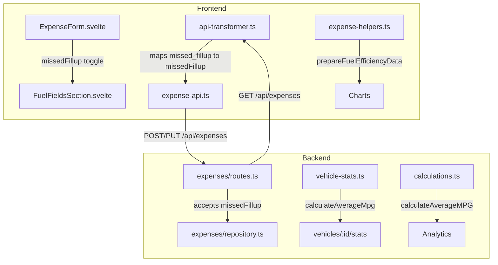
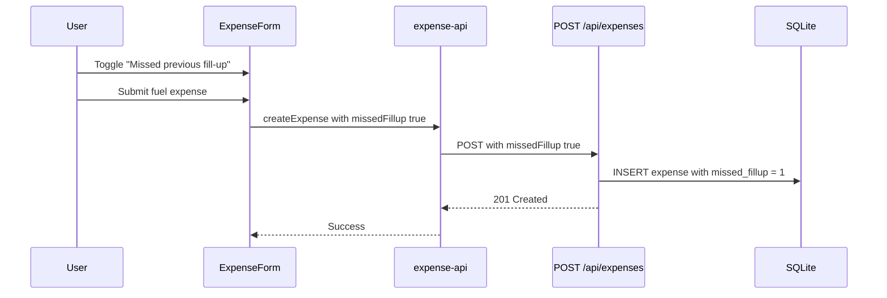
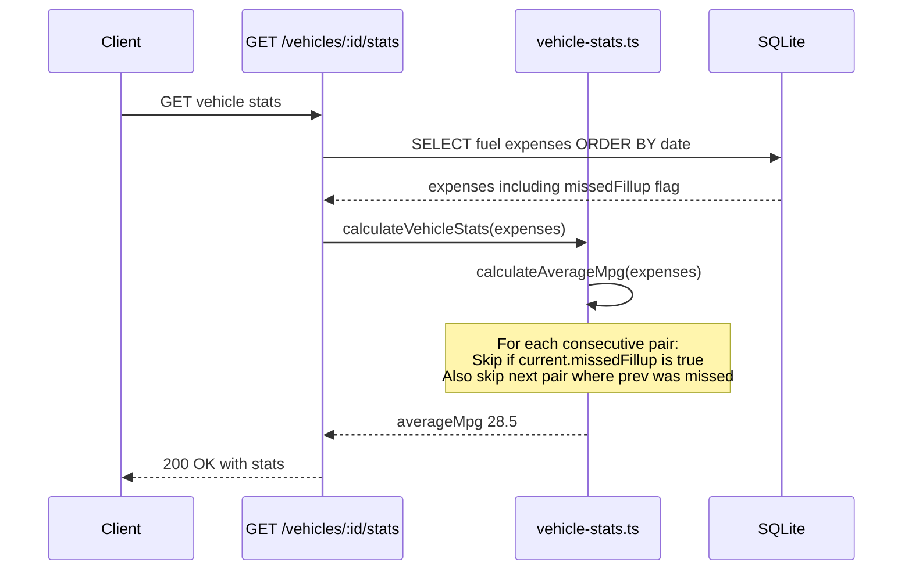

# Design Document: Missed Fill-up MPG Skip

## Overview

When a user misses logging a fuel fill-up between two recorded ones, the odometer difference spans multiple tanks, producing an artificially high MPG that skews averages and charts. This feature lets users flag a fill-up as "missed previous fill-up" so the system excludes that data point from all fuel efficiency calculations.

The `missedFillup` boolean column already exists on the `expenses` table (added by the insurance-management spec). This feature wires it through the API, frontend form, type system, and all three MPG calculation paths.

## Architecture



## Sequence Diagrams

### Creating a Fill-up with Missed Flag



### MPG Calculation with Skip Logic



## Components and Interfaces

### Component 1: Backend — Expense API (routes.ts + repository)

**Purpose**: Accept and persist the `missedFillup` field on expense create/update.

**Changes**: The Zod schema derived from `createInsertSchema(expensesTable)` already picks up the `missedFillup` column automatically via `drizzle-zod`. No manual schema changes needed — the field flows through create and update operations.

**Responsibilities**:
- Accept `missedFillup` boolean in POST/PUT request body
- Persist to database
- Return `missedFillup` in GET responses

### Component 2: Backend — MPG Calculations (vehicle-stats.ts)

**Purpose**: Skip MPG data points where a fill-up was missed.

**Interface**:
```typescript
export interface FuelExpense {
  id: string;
  mileage: number | null;
  fuelAmount: number | null;
  fuelType: string | null;
  date: Date;
  expenseAmount: number;
  missedFillup: boolean; // NEW
}
```

**Responsibilities**:
- When computing consecutive-pair MPG, skip any pair where `current.missedFillup === true`
- Also skip the next pair where the missed entry is the `previous` (since the distance from a missed entry to the next is also unreliable)

### Component 3: Backend — MPG Calculations (calculations.ts)

**Purpose**: Same skip logic for the analytics calculation path.

**Changes**: The `Expense` type from `db/schema.ts` already includes `missedFillup`. The `calculateAverageMPG()` function needs the same skip logic as `vehicle-stats.ts`.

### Component 4: Frontend — API Transformer (api-transformer.ts)

**Purpose**: Map `missedFillup` between frontend and backend field names.

**Interface changes**:
```typescript
// BackendExpenseRequest — add:
missedFillup?: boolean;

// BackendExpenseResponse — add:
missedFillup?: boolean;
```

**Mapping**: The field name is the same in both frontend and backend (`missedFillup` ↔ `missedFillup`), but the backend column is `missed_fillup` (snake_case in SQLite). Drizzle handles the DB ↔ JS mapping. The transformer just needs to pass it through.

### Component 5: Frontend — Types (types.ts)

**Purpose**: Add `missedFillup` to the frontend `Expense` interface.

```typescript
export interface Expense {
  // ... existing fields
  missedFillup?: boolean; // NEW
}
```

Also add to `ExpenseFormData`:
```typescript
export interface ExpenseFormData {
  // ... existing fields
  missedFillup?: boolean; // NEW
}
```

### Component 6: Frontend — Expense Form (ExpenseForm.svelte + FuelFieldsSection.svelte)

**Purpose**: Let users toggle "Missed previous fill-up" when entering a fuel expense.

**UI**: A checkbox inside the fuel details section (similar to the financing payment checkbox pattern). Only visible when category is `fuel`.

**Behavior**:
- When toggled ON, suppress the real-time MPG calculation indicator (since the value would be wrong)
- Pass `missedFillup` through to the API on submit

### Component 7: Frontend — Fuel Efficiency Chart (expense-helpers.ts)

**Purpose**: Skip missed fill-up data points in chart data preparation.

**Changes to `prepareFuelEfficiencyData()`**: Same consecutive-pair skip logic as the backend — skip pairs where `current.missedFillup === true`, and skip the next pair where the missed entry is `previous`.

## Data Models

### Expense Table (existing, column already added)

| Column | Type | Default | Description |
|--------|------|---------|-------------|
| missed_fillup | INTEGER (boolean) | false | Whether user missed logging a previous fill-up |

**Validation Rules**:
- Only meaningful when `category = 'fuel'`
- Defaults to `false` — no migration needed, column exists

## Key Functions with Formal Specifications

### Function 1: calculateAverageMpg() — vehicle-stats.ts

```typescript
function calculateAverageMpg(expensesWithMileage: FuelExpense[]): number | null
```

**Preconditions:**
- `expensesWithMileage` is sorted by date ascending
- Each entry has non-null `mileage`

**Postconditions:**
- Returns `null` if no valid MPG pairs exist
- Returns average of valid MPG values, excluding:
  - Pairs where `current.missedFillup === true` (inflated distance)
  - Pairs where `previous.missedFillup === true` (distance from missed to next is unreliable)
  - Pairs with MPG < 0 or MPG >= 150 (existing filter)
- Does not mutate input array

**Loop Invariants:**
- `mpgValues` contains only valid, non-skipped MPG calculations from indices `[1..i-1]`

### Function 2: calculateAverageMPG() — calculations.ts

```typescript
function calculateAverageMPG(fuelExpenses: Expense[]): number | null
```

**Preconditions:**
- `fuelExpenses` has at least 2 entries
- Entries will be sorted internally by date

**Postconditions:**
- Same skip logic as Function 1
- Returns `null` if fewer than 2 entries or no valid pairs
- Does not mutate input array

### Function 3: prepareFuelEfficiencyData() — expense-helpers.ts

```typescript
function prepareFuelEfficiencyData(expenses: Expense[]): FuelEfficiencyData[]
```

**Preconditions:**
- `expenses` may contain non-fuel entries (filtered internally)

**Postconditions:**
- Returns array of efficiency data points for charting
- Excludes data points where `current.missedFillup === true`
- Excludes data points where `previous.missedFillup === true`
- Existing validation bounds (MIN_VALID_MPG, MAX_VALID_MPG, etc.) still apply
- Does not mutate input array

## Algorithmic Pseudocode

### MPG Calculation with Missed Fill-up Skip

This algorithm is shared across all three calculation locations. The core change is identical in each.

```typescript
// Given: expenses sorted by date ascending, each with mileage
const mpgValues: number[] = [];

for (let i = 1; i < expenses.length; i++) {
  const current = expenses[i];
  const previous = expenses[i - 1];

  // SKIP: current was flagged as missed fill-up
  // The distance (current.mileage - previous.mileage) spans 2+ tanks
  if (current.missedFillup) {
    continue;
  }

  // SKIP: previous was flagged as missed fill-up
  // The distance from a missed entry to the next is also unreliable
  // because we don't know the true starting odometer for this tank
  if (previous.missedFillup) {
    continue;
  }

  // Existing logic: calculate MPG and filter unrealistic values
  const milesDriven = current.mileage - previous.mileage;
  const mpg = milesDriven / current.fuelAmount;

  if (mpg > 0 && mpg < 150) {
    mpgValues.push(mpg);
  }
}
```

**Why skip both directions:**
- If fill-up B is missed between A and C: `C.missedFillup = true`
- Pair (A, C): skipped because C is flagged — distance A→C covers 2 tanks
- Pair (C, D): skipped because previous (C) is flagged — we don't know C's true "start of tank" odometer since the distance to C was inflated

### Form Toggle Behavior

```typescript
// In ExpenseForm.svelte, when missedFillup is toggled:
// 1. Suppress real-time MPG indicator
if (formData.missedFillup) {
  calculatedMpg = null;
  calculatedEfficiency = null;
  showMpgCalculation = false;
}

// 2. Include in submit payload
const expenseData = {
  // ...existing fields
  missedFillup: formData.missedFillup || false,
};
```

## Example Usage

### Backend: Creating a missed fill-up expense

```typescript
// POST /api/v1/expenses
{
  "vehicleId": "abc123",
  "category": "fuel",
  "expenseAmount": 45.00,
  "fuelAmount": 12.5,
  "mileage": 55000,
  "date": "2024-01-15T12:00:00Z",
  "missedFillup": true
}
```

### Frontend: Form toggle in FuelFieldsSection

```svelte
<!-- Inside fuel details section, after fuel type selector -->
<div class="flex items-center gap-3 rounded-lg border bg-muted/50 p-3">
  <Checkbox id="missedFillup" bind:checked={missedFillup} />
  <div>
    <Label for="missedFillup" class="cursor-pointer text-sm font-medium leading-none">
      Missed previous fill-up
    </Label>
    <p class="text-xs text-muted-foreground mt-1">
      Skip this entry in fuel efficiency calculations
    </p>
  </div>
</div>
```

### Frontend: Chart data with skipped entries

```typescript
// Given expenses: [A(10000mi), B(10300mi), C(10900mi, missed), D(11200mi)]
// prepareFuelEfficiencyData returns:
// [{ date: B.date, efficiency: 300/B.volume, mileage: 10300 }]
// Pair (A,B): valid — included
// Pair (B,C): skipped — C.missedFillup is true
// Pair (C,D): skipped — previous (C) has missedFillup
```

## Correctness Properties

*A property is a characteristic or behavior that should hold true across all valid executions of a system — essentially, a formal statement about what the system should do. Properties serve as the bridge between human-readable specifications and machine-verifiable correctness guarantees.*

### Property 1: Missed fill-up pairs are excluded from all calculations

*For any* list of fuel expenses and any Consecutive_Pair where either the current or previous expense has `missedFillup === true`, that pair MUST NOT contribute a data point to any MPG average or chart data array across all three calculation paths (vehicle-stats, analytics, chart data).

**Validates: Requirements 2.1, 2.2, 3.1, 3.2, 4.1, 4.2**

### Property 2: Backward compatibility when no expenses are flagged

*For any* list of fuel expenses where every expense has `missedFillup === false` (or undefined), all three calculation paths SHALL produce identical results to the calculation without the missed fill-up feature.

**Validates: Requirements 2.4, 3.4, 4.4**

### Property 3: Flagging expenses is monotonically non-increasing on data point count

*For any* list of fuel expenses, setting `missedFillup = true` on any expense SHALL result in a data point count less than or equal to the count produced with that expense unflagged. Flagging can only remove data points, never add them.

**Validates: Requirements 2.1, 2.2, 3.1, 3.2, 4.1, 4.2**

### Property 4: API transformer round-trip preserves missed fill-up flag

*For any* frontend Expense with `missedFillup` set to a boolean value, transforming to backend format via `toBackendExpense` and back via `fromBackendExpense` SHALL preserve the `missedFillup` value.

**Validates: Requirements 5.3, 5.4**

### Property 5: API persistence round-trip preserves missed fill-up flag

*For any* expense created or updated with a `missedFillup` value, fetching that expense back from the API SHALL return the same `missedFillup` value that was submitted.

**Validates: Requirements 1.1, 1.2, 1.3**

## Error Handling

### Scenario 1: All fill-ups marked as missed

**Condition**: Every fuel expense for a vehicle has `missedFillup: true`
**Response**: `calculateAverageMpg` returns `null`, stats display shows "N/A" for MPG
**Recovery**: No action needed — existing null-handling in UI already covers this

### Scenario 2: Only one valid pair remains after skipping

**Condition**: After filtering missed entries, only one consecutive pair has valid data
**Response**: Average MPG is calculated from that single pair
**Recovery**: Normal behavior — single data point is still valid

### Scenario 3: Toggling missedFillup on an existing expense

**Condition**: User edits an old expense and toggles missedFillup
**Response**: Next stats/chart fetch recalculates with the updated flag
**Recovery**: No cache invalidation needed — stats are computed on each request

## Testing Strategy

### Unit Testing

- `vehicle-stats.ts`: Test `calculateAverageMpg` with mixed missed/valid entries
- `calculations.ts`: Test `calculateAverageMPG` with same scenarios
- `expense-helpers.ts`: Test `prepareFuelEfficiencyData` with missed entries

**Key test cases**:
1. No missed entries → same result as before (regression)
2. Current entry missed → pair skipped
3. Previous entry missed → pair skipped
4. Consecutive missed entries → multiple pairs skipped
5. All entries missed → returns null / empty array
6. Single valid pair among missed → returns that one value

### Property-Based Testing

**Property Test Library**: fast-check

**Properties to verify**:
- For any list of fuel expenses, the number of MPG values produced is always ≤ the number produced without the missed flag (monotonicity)
- Toggling `missedFillup` on an entry never increases the count of MPG data points
- The average MPG with missed entries excluded is always within the valid bounds (0, 150) or null

### Integration Testing

- API round-trip: create expense with `missedFillup: true`, fetch it back, verify flag persists
- Stats endpoint: create vehicle with mix of missed/valid fill-ups, verify `averageMpg` excludes missed pairs

## Dependencies

- `missedFillup` column on `expenses` table (already added by insurance-management spec)
- No new npm packages required
- No new database migrations required
- shadcn-svelte `Checkbox` component (already used in ExpenseForm for financing payment toggle)
