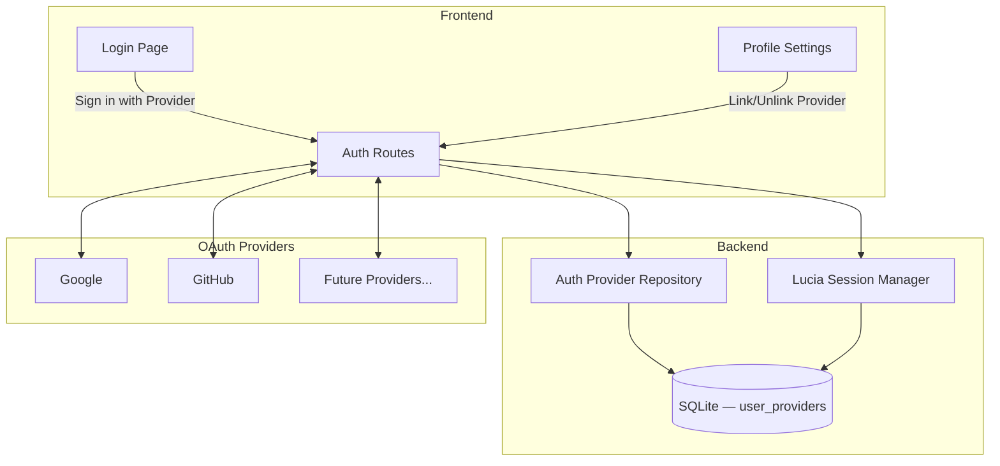
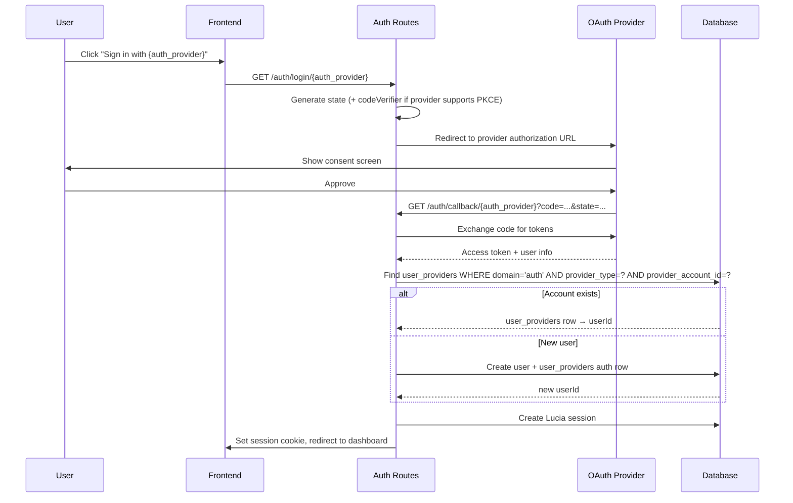
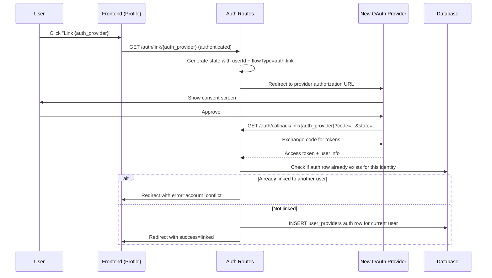
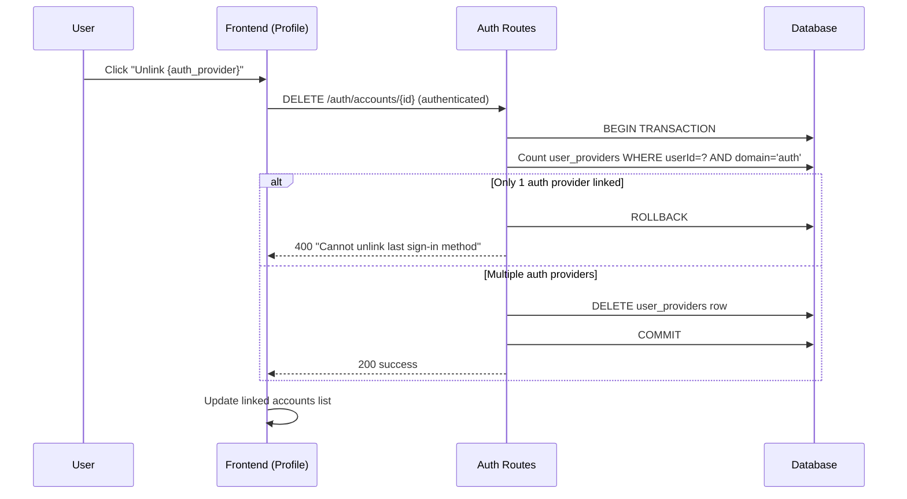

# Design Document: Multi-Provider OAuth

## Overview

The VROOM application currently supports only Google OAuth for authentication, with the user's provider identity tightly coupled to the `users` table via `provider` and `providerId` columns. This design abstracts authentication away from a single provider by reusing the existing `user_providers` table with `domain: 'auth'` rows to store OAuth identity links. Users can sign in with any linked auth provider, and can link/unlink additional providers from their profile settings.

Rather than introducing a separate `oauth_accounts` table, auth identities are stored as rows in `user_providers` — the same table that already manages storage provider connections (Google Drive, S3). The `domain` column distinguishes auth rows (`'auth'`) from storage rows (`'storage'`). This keeps the data model unified: a "provider" is any external service a user has connected, whether for login or for storage.

The design preserves backward compatibility with existing Google-authenticated users by migrating their current `provider`/`providerId` data into `user_providers` auth rows. The Lucia session layer remains unchanged — only the identity resolution and account linking logic changes.

### Alternatives Considered

1. **Separate `oauth_accounts` table** — A dedicated junction table for auth identities. Cleaner domain separation and constraints expressible in Drizzle's schema builder, but adds schema sprawl and conceptually duplicates the "user ↔ external provider" relationship that `user_providers` already models. Would become the better choice if 4+ provider domains emerge with divergent lifecycle rules.

2. **Email-based identity merging** — Use email as the canonical identity and auto-merge accounts with matching emails across providers. Simpler but fragile: emails aren't guaranteed unique across providers, and implicit merging creates security risks (email takeover → account hijack).

3. **Expand users table directly** — Add `google_id`, `github_id`, `apple_id` columns to `users`. Doesn't scale: every new provider requires a schema migration, and the table gets wider with mostly-null columns.

4. **Full Auth.js-style abstraction** — Replace Lucia with a full `accounts` + `sessions` + `verification_tokens` schema. Much larger rewrite for minimal benefit since Lucia is already well-integrated and only handles sessions.

## Architecture



## Sequence Diagrams

### Login Flow (Existing or New User)



### Account Linking Flow



### Account Unlinking Flow




## Components and Interfaces

### Component 1: OAuth Provider Registry

**Purpose**: Centralized registry of supported OAuth auth providers and their configuration. Makes adding new auth providers a config-only change. This is separate from the `StorageProviderRegistry` which handles storage connections.

**File**: `backend/src/api/auth/providers/registry.ts`

```typescript
interface OAuthProviderConfig {
  id: string;                    // 'google' | 'github' | ...
  displayName: string;           // 'Google', 'GitHub'
  supportsPKCE: boolean;         // true for Google, false for GitHub
  scopes: string[];              // ['openid', 'profile', 'email'] — stored for reference
  // Each provider wraps Arctic's provider-specific API into a uniform interface.
  // Scopes are closed over inside each implementation since Arctic providers
  // have different signatures (Google: state+codeVerifier+scopes, GitHub: state+scopes).
  createAuthorizationURL: (state: string, codeVerifier?: string) => URL;
  // Each provider unwraps Arctic's OAuth2Tokens (accessor methods) into plain OAuthTokens.
  validateAuthorizationCode: (code: string, codeVerifier?: string) => Promise<OAuthTokens>;
  fetchUserInfo: (accessToken: string) => Promise<OAuthUserInfo>;
}

// Unwrapped from Arctic's OAuth2Tokens (which uses accessor methods like tokens.accessToken())
interface OAuthTokens {
  accessToken: string;
  refreshToken?: string;
}

interface OAuthUserInfo {
  providerAccountId: string;     // Provider's unique user ID (e.g., Google 'sub')
  email: string;                 // MUST be non-empty — providers that may return null email
                                 // (e.g., GitHub) must fetch from a secondary endpoint
  displayName: string;
  avatarUrl?: string;
}
```

**Arctic API note**: Arctic's provider classes have different signatures:
- `Google.createAuthorizationURL(state, codeVerifier, scopes)` — 3 args
- `GitHub.createAuthorizationURL(state, scopes)` — 2 args, no PKCE
- `Google.validateAuthorizationCode(code, codeVerifier)` — 2 args
- `GitHub.validateAuthorizationCode(code)` — 1 arg

Each provider's wrapper closes over `scopes` and adapts the Arctic API to the uniform `OAuthProviderConfig` interface. The `supportsPKCE` flag tells the callback handler whether to generate/pass a `codeVerifier`.

**Google provider example** (`backend/src/api/auth/providers/google.ts`):
```typescript
import { Google } from 'arctic';
import { CONFIG } from '../../../config';
import type { OAuthProviderConfig } from './registry';

const google = new Google(
  CONFIG.auth.googleClientId || '',
  CONFIG.auth.googleClientSecret || '',
  CONFIG.auth.googleRedirectUri
);

const SCOPES = ['openid', 'profile', 'email'];

export const googleAuthProvider: OAuthProviderConfig = {
  id: 'google',
  displayName: 'Google',
  supportsPKCE: true,
  scopes: SCOPES,
  createAuthorizationURL: (state, codeVerifier) => {
    const url = google.createAuthorizationURL(state, codeVerifier!, SCOPES);
    url.searchParams.set('prompt', 'select_account');
    return url;
  },
  validateAuthorizationCode: async (code, codeVerifier) => {
    const tokens = await google.validateAuthorizationCode(code, codeVerifier!);
    return {
      accessToken: tokens.accessToken(),
      refreshToken: tokens.hasRefreshToken() ? tokens.refreshToken() : undefined,
    };
  },
  fetchUserInfo: async (accessToken) => {
    const res = await fetch('https://openidconnect.googleapis.com/v1/userinfo', {
      headers: { Authorization: `Bearer ${accessToken}` },
    });
    if (!res.ok) throw new Error('Failed to fetch Google user info');
    const data = await res.json() as { sub: string; email: string; name: string; picture?: string };
    return {
      providerAccountId: data.sub,
      email: data.email,
      displayName: data.name,
      avatarUrl: data.picture,
    };
  },
};
```

Note: The `google` instance in `lucia.ts` for the login flow is replaced by this registry entry. The `googleProvider` instance in `lucia.ts` (used for storage provider OAuth with offline access) remains unchanged.

**PKCE handling**: The `supportsPKCE` flag controls whether a `codeVerifier` is generated and passed. Google supports PKCE; GitHub does not. The callback handler checks `providerConfig.supportsPKCE` to decide whether to pass the stored `codeVerifier` or `undefined`.

**Email requirement**: All providers MUST return a non-empty email. For GitHub (where `/user` may return `email: null` for private emails), the `fetchUserInfo` implementation must call `/user/emails` as a fallback and select the primary verified email. If no verified email is available, `fetchUserInfo` should throw, and the callback handler redirects with `?auth_error=no_email`.

**Responsibilities**:
- Register and look up auth provider configurations by ID
- Provide a type-safe way to add new auth providers
- Centralize scope and URL configuration
- Expose a `getEnabledProviders()` method that returns only providers with valid config (non-empty client ID/secret)

### Component 2: Auth Provider Repository

**Purpose**: Data access layer for auth-domain rows in the `user_providers` table. All queries are scoped to `domain = 'auth'`.

**File**: `backend/src/api/auth/auth-provider-repository.ts`

```typescript
interface AuthProviderRepository {
  findByProviderIdentity(authProvider: string, providerAccountId: string): Promise<UserProvider | null>;
  findByUserId(userId: string): Promise<UserProvider[]>;
  create(params: {
    userId: string;
    authProvider: string;
    providerAccountId: string;
    email: string;
    displayName?: string;
    avatarUrl?: string;
  }): Promise<UserProvider>;
  delete(id: string, userId: string): Promise<void>;
  countByUserId(userId: string): Promise<number>;
  updateProfile(id: string, profile: { email: string; displayName?: string; avatarUrl?: string }): Promise<void>;
}
```

**Implementation notes**:
- All queries include `AND domain = 'auth'` filter
- `findByProviderIdentity` queries on `(domain, providerType, providerAccountId)` — uses the partial unique index
- `countByUserId` counts only auth rows, used for the unlink safety guard
- `credentials` is set to `''` (empty string) for auth rows since no persistent tokens are stored
- `config` JSON stores `{ email, avatarUrl }` — the auth-specific metadata
- `displayName` maps to the existing `user_providers.displayName` column
- Export a singleton: `export const authProviderRepository = new AuthProviderRepository(getDb());`

### Component 3: Auth Routes (Updated)

**Purpose**: HTTP route handlers for login, callback, linking, and unlinking flows.

**File**: `backend/src/api/auth/routes.ts` (modify existing)

**New routes** (added alongside existing routes):
- `GET /auth/login/:authProvider` — Provider-agnostic login initiation
- `GET /auth/callback/:authProvider` — Provider-agnostic callback
- `GET /auth/link/:authProvider` — Authenticated linking initiation (requires `requireAuth`)
- `GET /auth/callback/link/:authProvider` — Authenticated linking callback
- `GET /auth/accounts` — List linked auth accounts (requires `requireAuth`)
- `DELETE /auth/accounts/:id` — Unlink auth account (requires `requireAuth`)
- `GET /auth/providers` — List enabled auth providers (public, no auth required)

**Route transition**: The existing `/auth/login/google` and `/auth/callback/google` routes are REMOVED and replaced by the parameterized routes. The `GOOGLE_REDIRECT_URI` env var must be updated to point to `/auth/callback/google` (which now matches `:authProvider = 'google'`). Since the path is the same, no Google OAuth console changes are needed. The old provider-connect routes (`/auth/providers/connect/google`, `/auth/callback/provider/google`) remain unchanged — they serve a different purpose (storage provider OAuth with offline access).

**Response shapes**:
- `GET /auth/accounts`: `{ success: true, data: LinkedAuthProvider[] }`
- `DELETE /auth/accounts/:id`: `204 No Content` on success, `400 { success: false, error: { code: 'LAST_ACCOUNT', message: '...' } }` if last provider
- `GET /auth/providers`: `{ success: true, data: { id: string, displayName: string }[] }`

### Component 4: Frontend Auth UI (Updated)

**Purpose**: Login page with multiple auth provider buttons, profile page with account linking management.

**Responsibilities**:
- Fetch available providers from `GET /auth/providers` (not hardcoded)
- Render login buttons for each enabled auth provider
- Show linked auth accounts in profile/settings via `GET /auth/accounts`
- Handle link/unlink actions with appropriate feedback
- Handle redirect query params: `?auth_error=*`, `?link_error=*`, `?success=linked`

**Provider icons**: Lucide does not ship brand icons. Use inline SVGs for provider logos (Google, GitHub). Store in `frontend/src/lib/components/icons/` as Svelte components (e.g., `GoogleLogo.svelte`, `GitHubLogo.svelte`).

### Component 5: Domain Guard on Existing Provider Routes

**Purpose**: Prevent the existing `DELETE /api/v1/providers/:id` and `PUT /api/v1/providers/:id` routes from modifying auth-domain rows.

**File**: `backend/src/api/providers/routes.ts` (modify existing)

**Implementation**: Add a check at the top of DELETE and PUT handlers:
```typescript
if (existing[0].domain === 'auth') {
  throw new ValidationError('Auth providers cannot be modified through this endpoint');
}
```

This enforces Domain Isolation (Correctness Property 8) through the existing provider CRUD routes, not just through the auth repository.

## Data Models

### Extended Table: `user_providers`

The existing `user_providers` table gains a nullable `provider_account_id` column. Auth rows use `domain: 'auth'` and store the OAuth identity's unique ID in this column. Storage rows leave it NULL.

```typescript
export const userProviders = sqliteTable(
  'user_providers',
  {
    id: text('id').primaryKey().$defaultFn(() => createId()),
    userId: text('user_id')
      .notNull()
      .references(() => users.id, { onDelete: 'cascade' }),
    domain: text('domain').notNull(),                    // 'auth' | 'storage'
    providerType: text('provider_type').notNull(),       // 'google', 'github', 'google-drive', 's3'
    providerAccountId: text('provider_account_id'),      // NEW — OAuth identity ID (auth rows only)
    displayName: text('display_name').notNull(),
    credentials: text('credentials').notNull(),          // Encrypted tokens (storage) or '' (auth)
    config: text('config', { mode: 'json' }),            // Domain-specific JSON
    status: text('status').notNull().default('active'),
    lastSyncAt: integer('last_sync_at', { mode: 'timestamp' }),
    createdAt: integer('created_at', { mode: 'timestamp' }).$defaultFn(() => new Date()),
    updatedAt: integer('updated_at', { mode: 'timestamp' }).$defaultFn(() => new Date()),
  },
  (table) => ({
    userDomainIdx: index('up_user_domain_idx').on(table.userId, table.domain),
  })
);
```

**Auth provider config JSON schema**:
```typescript
interface AuthProviderConfig {
  email: string;
  avatarUrl?: string;
}
```

**Auth row shape**:
```
{
  domain: 'auth',
  providerType: 'google',              // The auth provider
  providerAccountId: '1234567890',     // Google 'sub' / GitHub user ID
  displayName: 'John Doe',
  credentials: '',                     // No persistent tokens for auth
  config: { email: 'john@example.com', avatarUrl: 'https://...' },
  status: 'active',
  lastSyncAt: null                     // Not applicable for auth
}
```

**Storage row shape** (unchanged):
```
{
  domain: 'storage',
  providerType: 'google-drive',
  providerAccountId: null,             // Not applicable for storage
  displayName: 'My Google Drive',
  credentials: '{encrypted refresh token}',
  config: { photoRootPath: '/VROOM' },
  status: 'active',
  lastSyncAt: 1710000000
}
```

**Validation Rules**:
- Auth rows: `providerAccountId` must be non-empty, `credentials` is `''`
- Storage rows: `providerAccountId` is NULL, `credentials` is non-empty encrypted JSON
- Partial unique index on `(provider_type, provider_account_id) WHERE domain = 'auth'` — one OAuth identity maps to exactly one user
- Users CAN link multiple accounts from the same provider (e.g., two Google accounts). The unique index prevents the same identity from being linked to two different users, but does NOT prevent one user from having multiple identities from the same provider.
- SQLite treats NULLs as distinct in unique indexes, so storage rows (where `provider_account_id` is NULL) never conflict with each other or with auth rows.

### Modified Table: `users`

The `users` table has `id`, `email`, `displayName`, `createdAt`, `updatedAt`. There are no `provider`/`providerId` columns — auth identity is stored exclusively in `user_providers` auth rows.

### Email Uniqueness on Signup

The `users` table has a `UNIQUE` constraint on `email`. When a new user signs up via OAuth and their email already exists in `users`:
- The INSERT will fail with a UNIQUE constraint violation
- The callback handler catches this and redirects with `?auth_error=email_exists`
- The frontend shows: "An account with this email already exists. Sign in with your existing account and link this provider from settings."
- This is the safe default — no implicit account merging. Users must explicitly link providers.

### Migration Strategy

**Approach**: Since the app is not yet in production, we regenerate the initial migration to include the new column. This intentionally overrides the DatabaseMigrations.md SOP rule "never delete migration files once committed" — the app has no production deployments, so there are no existing databases to break.

**Steps**:
1. Add `providerAccountId: text('provider_account_id')` to the `userProviders` table in `schema.ts`
2. Delete the existing migration files: `backend/drizzle/0000_regular_shiver_man.sql`, `backend/drizzle/meta/0000_snapshot.json`, and reset `backend/drizzle/meta/_journal.json`
3. Run `bun run db:generate` to regenerate a fresh `0000` migration from the updated schema
4. Manually append the partial unique index to the generated SQL (Drizzle can't express `WHERE` clauses on indexes):

```sql
CREATE UNIQUE INDEX IF NOT EXISTS `up_auth_identity_idx`
  ON `user_providers`(`provider_type`, `provider_account_id`)
  WHERE `domain` = 'auth';
```

5. Delete the local `backend/data/vroom.db*` files and restart the server to apply the fresh migration

**Data seeding** (in `backend/src/db/seed.ts`): Update the seed script to create an auth-domain `user_providers` row for the demo user:
```typescript
await db.insert(userProviders).values({
  userId: sampleUser.id,
  domain: 'auth',
  providerType: 'google',
  providerAccountId: 'demo-google-sub',
  displayName: sampleUser.displayName,
  credentials: '',
  config: { email: sampleUser.email },
  status: 'active',
});
```

No data migration SQL is needed since there are no production users to migrate.


## Key Functions with Formal Specifications

### Function 1: resolveUserFromOAuth()

```typescript
async function resolveUserFromOAuth(
  authProvider: string,
  userInfo: OAuthUserInfo
): Promise<{ userId: string; isNewUser: boolean }>
```

**Preconditions:**
- `authProvider` is a registered auth provider ID
- `userInfo.providerAccountId` is non-empty
- `userInfo.email` is a valid, non-empty email

**Postconditions:**
- If a `user_providers` auth row exists for `(authProvider, providerAccountId)`: returns existing `userId`, `isNewUser = false`. Also updates the auth row's profile info and the `users` table's `email`/`displayName`.
- If no auth row exists: creates a new `user` and `user_providers` auth row in a transaction, returns new `userId`, `isNewUser = true`
- If the INSERT fails due to `users.email` UNIQUE constraint: redirects with `?auth_error=email_exists`
- If the INSERT fails due to `up_auth_identity_idx` constraint (race condition): catches the error and retries as the "existing account" path
- A Lucia session is NOT created by this function (caller's responsibility)

### Function 2: linkAuthProvider()

```typescript
async function linkAuthProvider(
  userId: string,
  authProvider: string,
  userInfo: OAuthUserInfo
): Promise<{ success: true } | { success: false; error: 'account_conflict' | 'already_linked' }>
```

**Preconditions:**
- `userId` corresponds to an authenticated user with a valid session
- `authProvider` is a registered auth provider ID
- `userInfo.providerAccountId` is non-empty

**Postconditions:**
- If `(authProvider, providerAccountId)` is already linked to a DIFFERENT user: returns `{ success: false, error: 'account_conflict' }`
- If `(authProvider, providerAccountId)` is already linked to THIS user: returns `{ success: false, error: 'already_linked' }`
- Otherwise: creates a new `user_providers` auth row, returns `{ success: true }`
- The user's existing session is NOT affected

### Function 3: unlinkAuthProvider()

```typescript
async function unlinkAuthProvider(
  userId: string,
  providerId: string
): Promise<{ success: true } | { success: false; error: 'last_account' | 'not_found' }>
```

**Preconditions:**
- `userId` corresponds to an authenticated user
- `providerId` is a valid `user_providers.id`

**Postconditions:**
- If the row doesn't exist, doesn't belong to `userId`, or isn't `domain = 'auth'`: returns `{ success: false, error: 'not_found' }`
- If the user has only 1 auth-domain row in `user_providers`: returns `{ success: false, error: 'last_account' }`
- Otherwise: deletes the `user_providers` row, returns `{ success: true }`
- The count check and delete MUST be in a single transaction to prevent the race condition where two concurrent unlinks both pass the count check
- Active sessions remain valid (user is still authenticated)

### Function 4: getLinkedAuthProviders()

```typescript
async function getLinkedAuthProviders(userId: string): Promise<LinkedAuthProvider[]>
```

**Preconditions:**
- `userId` corresponds to an authenticated user

**Postconditions:**
- Returns all `user_providers` rows where `domain = 'auth'` for the user
- Sensitive fields excluded (credentials — though empty for auth rows)
- Result is ordered by `createdAt` ascending (oldest first)
- Returns empty array if user has no auth providers (shouldn't happen in practice)

## Algorithmic Pseudocode

### Login/Signup Resolution Algorithm

```typescript
async function handleOAuthCallback(authProvider: string, code: string, state: string) {
  const providerConfig = oauthProviderRegistry.get(authProvider);
  if (!providerConfig) throw new ValidationError(`Unknown auth provider: ${authProvider}`);

  // Step 1: Retrieve stored state and validate
  const storedState = oauthStateStore.get(state);
  if (!storedState) return redirect('?auth_error=invalid_state');
  oauthStateStore.delete(state);

  // Step 2: Exchange code for tokens (PKCE-aware)
  const codeVerifier = providerConfig.supportsPKCE ? storedState.codeVerifier : undefined;
  const tokens = await providerConfig.validateAuthorizationCode(code, codeVerifier);
  const userInfo = await providerConfig.fetchUserInfo(tokens.accessToken);

  // Step 3: Look up existing auth row in user_providers
  const existingRow = await authProviderRepo.findByProviderIdentity(
    authProvider,
    userInfo.providerAccountId
  );

  let userId: string;

  if (existingRow) {
    // Step 4a: Existing user — update profile info
    userId = existingRow.userId;
    await authProviderRepo.updateProfile(existingRow.id, {
      email: userInfo.email,
      displayName: userInfo.displayName,
      avatarUrl: userInfo.avatarUrl,
    });
    // Also update users table so Lucia session data stays fresh
    await db.update(users).set({
      email: userInfo.email,
      displayName: userInfo.displayName,
      updatedAt: new Date(),
    }).where(eq(users.id, userId));
  } else {
    // Step 4b: No auth row found — check if user exists by email (legacy user without auth row)
    const existingByEmail = await db.select({ id: users.id, displayName: users.displayName })
      .from(users)
      .where(eq(users.email, userInfo.email))
      .limit(1);

    if (existingByEmail.length > 0) {
      // Legacy user: exists in users table but has no user_providers auth row.
      // Auto-create the auth row to link this OAuth identity to the existing account.
      userId = existingByEmail[0].id;
      await db.insert(userProviders).values({
        userId,
        domain: 'auth',
        providerType: authProvider,
        providerAccountId: userInfo.providerAccountId,
        displayName: userInfo.displayName,
        credentials: '',
        config: { email: userInfo.email, avatarUrl: userInfo.avatarUrl },
        status: 'active',
      });
    } else {
      // Truly new user — create user + auth provider row in transaction
      // The only constraint that can fire here is the auth identity race condition
      try {
        const result = await db.transaction(async (tx) => {
          const newUserId = `${authProvider}_${userInfo.providerAccountId}`;
          await tx.insert(users).values({
            id: newUserId,
            email: userInfo.email,
            displayName: userInfo.displayName,
          });
          await tx.insert(userProviders).values({
            userId: newUserId,
            domain: 'auth',
            providerType: authProvider,
            providerAccountId: userInfo.providerAccountId,
            displayName: userInfo.displayName,
            credentials: '',
            config: { email: userInfo.email, avatarUrl: userInfo.avatarUrl },
            status: 'active',
          });
          return { userId: newUserId };
        });
        userId = result.userId;
      } catch (error) {
        // Race condition: another request created this identity concurrently
        if (error instanceof Error && error.message.includes('UNIQUE constraint failed')) {
          // Could be auth identity race OR email race — try to find the auth row
          const retryRow = await authProviderRepo.findByProviderIdentity(
            authProvider, userInfo.providerAccountId
          );
          if (retryRow) {
            userId = retryRow.userId;
          } else {
            // Email collision: user exists with same email via different provider
            return redirect('?auth_error=email_exists');
          }
        } else throw error;
      }
    }
  }

  // Step 5: Create Lucia session
  const session = await lucia.createSession(userId, {});
  return { session, userId };
}
```

### Account Linking Algorithm

```typescript
async function handleLinkCallback(
  authenticatedUserId: string,
  authProvider: string,
  code: string,
  state: string
) {
  const providerConfig = oauthProviderRegistry.get(authProvider);
  const storedState = oauthStateStore.get(state);
  if (!storedState || storedState.flowType !== 'auth-link') {
    return redirect('?link_error=invalid_state');
  }

  // CSRF check: state userId must match authenticated session userId
  if (storedState.userId !== authenticatedUserId) {
    logger.warn('Auth link CSRF mismatch', {
      sessionUserId: authenticatedUserId,
      stateUserId: storedState.userId,
    });
    return redirect('?link_error=session_mismatch');
  }
  oauthStateStore.delete(state);

  const codeVerifier = providerConfig.supportsPKCE ? storedState.codeVerifier : undefined;
  const tokens = await providerConfig.validateAuthorizationCode(code, codeVerifier);
  const userInfo = await providerConfig.fetchUserInfo(tokens.accessToken);

  // Check for conflicts
  const existingRow = await authProviderRepo.findByProviderIdentity(
    authProvider, userInfo.providerAccountId
  );

  if (existingRow) {
    if (existingRow.userId === authenticatedUserId) {
      return redirect('?link_error=already_linked');
    }
    return redirect('?link_error=account_conflict');
  }

  await authProviderRepo.create({
    userId: authenticatedUserId,
    authProvider,
    providerAccountId: userInfo.providerAccountId,
    email: userInfo.email,
    displayName: userInfo.displayName,
    avatarUrl: userInfo.avatarUrl,
  });

  return redirect('?success=linked');
}
```

### Unlink Algorithm (Transaction-Safe)

```typescript
async function handleUnlink(userId: string, providerId: string) {
  return await db.transaction(async (tx) => {
    // Verify row exists, belongs to user, and is auth domain
    const row = await tx.select().from(userProviders)
      .where(and(
        eq(userProviders.id, providerId),
        eq(userProviders.userId, userId),
        eq(userProviders.domain, 'auth')
      )).limit(1);

    if (!row[0]) return { success: false, error: 'not_found' };

    // Count auth providers within the transaction
    const countResult = await tx.select({ count: sql`count(*)` })
      .from(userProviders)
      .where(and(
        eq(userProviders.userId, userId),
        eq(userProviders.domain, 'auth')
      ));

    if (countResult[0].count <= 1) return { success: false, error: 'last_account' };

    await tx.delete(userProviders).where(eq(userProviders.id, providerId));
    return { success: true };
  });
}
```

## OAuth State Store Extension

The existing `oauthStateStore` Map needs a new `flowType` value for auth linking. The `codeVerifier` field becomes optional since not all providers support PKCE. Extended shape:

```typescript
const oauthStateStore = new Map<string, {
  codeVerifier?: string;          // Only set if provider supports PKCE
  createdAt: number;
  returnTo?: string;
  // Login flow: no extra fields
  // Provider (storage) flow:
  userId?: string;
  flowType?: 'provider' | 'auth-link';
  providerId?: string;
  nonce?: string;
}>();
```

**Important**: Making `codeVerifier` optional changes the type for ALL state entries. The following existing code must be updated:

1. **`ProviderCallbackState` interface** (`routes.ts`): Change `codeVerifier: string` to `codeVerifier: string` (keep required). The storage provider flow always uses Google which supports PKCE, so `codeVerifier` is always present for `flowType: 'provider'` entries. Instead, add a runtime assertion in `resolveProviderState` before assigning to `ProviderCallbackState`:
```typescript
if (!storedData.codeVerifier) {
  return { error: 'invalid_state', returnTo };
}
```

2. **`exchangeProviderTokens` function** (`routes.ts`): No change needed — it already takes `codeVerifier: string` (required). The assertion in `resolveProviderState` guarantees it's present.

3. **New auth login/link flows**: These read `codeVerifier` from the store conditionally based on `providerConfig.supportsPKCE`. They never pass it to `ProviderCallbackState` — they use their own handler logic.

In summary: the store type becomes `codeVerifier?: string`, but the existing provider flow code path asserts it's present before using it. No signature changes to existing functions.

## Configuration Changes

### New env variables (add to `backend/src/config.ts` `envSchema`):

```typescript
GITHUB_CLIENT_ID: z.string().optional(),
GITHUB_CLIENT_SECRET: z.string().optional(),
GITHUB_REDIRECT_URI: z.string().default('http://localhost:3001/api/v1/auth/callback/github'),
```

Note: The redirect URI must include the `/api/v1` prefix since auth routes are mounted at `/api/v1/auth` in `index.ts`.

### New CONFIG entries:

```typescript
auth: {
  // ... existing google entries ...
  githubClientId: env.GITHUB_CLIENT_ID,
  githubClientSecret: env.GITHUB_CLIENT_SECRET,
  githubRedirectUri: env.GITHUB_REDIRECT_URI,
}
```

### `.env.example` additions:

```
GITHUB_CLIENT_ID=
GITHUB_CLIENT_SECRET=
GITHUB_REDIRECT_URI=http://localhost:3001/api/v1/auth/callback/github
```

### Rate limiting:

Add to `CONFIG.rateLimit`:
```typescript
auth: {
  windowMs: 15 * 60 * 1000,  // 15 minutes
  limit: 30,                   // 30 auth attempts per window
  message: 'Too many auth requests',
}
```

Apply in `backend/src/index.ts` when mounting auth routes.

## Example Usage

### Backend: Adding a New Auth Provider (GitHub)

**File**: `backend/src/api/auth/providers/github.ts`

```typescript
import { GitHub } from 'arctic';
import { CONFIG } from '../../../config';
import type { OAuthProviderConfig } from './registry';

const github = new GitHub(
  CONFIG.auth.githubClientId,
  CONFIG.auth.githubClientSecret,
  CONFIG.auth.githubRedirectUri
);

export const githubProvider: OAuthProviderConfig = {
  id: 'github',
  displayName: 'GitHub',
  supportsPKCE: false,  // GitHub does not support PKCE
  scopes: ['user:email'],
  createAuthorizationURL: (state) =>
    github.createAuthorizationURL(state, ['user:email']),
  validateAuthorizationCode: async (code) => {
    const tokens = await github.validateAuthorizationCode(code);
    return { accessToken: tokens.accessToken() };
  },
  fetchUserInfo: async (accessToken) => {
    // Fetch user profile
    const userRes = await fetch('https://api.github.com/user', {
      headers: { Authorization: `Bearer ${accessToken}` },
    });
    const userData = await userRes.json();

    // GitHub may return null email for private emails — fetch from /user/emails
    let email = userData.email;
    if (!email) {
      const emailRes = await fetch('https://api.github.com/user/emails', {
        headers: { Authorization: `Bearer ${accessToken}` },
      });
      const emails = await emailRes.json();
      const primary = emails.find((e: any) => e.primary && e.verified);
      if (!primary) throw new Error('No verified email found for GitHub account');
      email = primary.email;
    }

    return {
      providerAccountId: String(userData.id),
      email,
      displayName: userData.name || userData.login,
      avatarUrl: userData.avatar_url,
    };
  },
};
```

### Frontend: Login Page with Multiple Auth Providers

Provider icons are custom SVG components in `frontend/src/lib/components/icons/` since Lucide doesn't ship brand logos.

```svelte
<script lang="ts">
  import { Button } from '$lib/components/ui/button';
  import { LoaderCircle } from '@lucide/svelte';
  import GoogleLogo from '$lib/components/icons/GoogleLogo.svelte';
  import GitHubLogo from '$lib/components/icons/GitHubLogo.svelte';
  import { getApiBaseUrl } from '$lib/services/api-client';
  import { browser } from '$app/environment';
  import { onMount } from 'svelte';
  import type { Component } from 'svelte';

  interface AuthProviderInfo {
    id: string;
    displayName: string;
  }

  const iconMap: Record<string, Component> = {
    google: GoogleLogo,
    github: GitHubLogo,
  };

  let providers = $state<AuthProviderInfo[]>([]);
  let loadingProvider = $state<string | null>(null);

  onMount(async () => {
    const res = await fetch(`${getApiBaseUrl()}/api/v1/auth/providers`);
    const data = await res.json();
    if (data.success) providers = data.data;
  });

  function loginWith(authProviderId: string) {
    loadingProvider = authProviderId;
    if (browser) {
      window.location.href = `${getApiBaseUrl()}/api/v1/auth/login/${authProviderId}`;
    }
  }
</script>

{#each providers as provider (provider.id)}
  {@const Icon = iconMap[provider.id]}
  <Button
    variant="outline"
    size="lg"
    class="w-full h-12 text-base"
    disabled={loadingProvider !== null}
    onclick={() => loginWith(provider.id)}
  >
    {#if loadingProvider === provider.id}
      <LoaderCircle class="mr-2 h-5 w-5 animate-spin" />
      Signing in...
    {:else}
      {#if Icon}<Icon class="mr-2 h-5 w-5" />{/if}
      Continue with {provider.displayName}
    {/if}
  </Button>
{/each}
```

### Frontend: Linked Auth Accounts Management

**Type definition** (add to `frontend/src/lib/types/index.ts`):
```typescript
export interface LinkedAuthProvider {
  id: string;
  providerType: string;
  displayName: string;
  email: string;
  avatarUrl?: string;
  createdAt: string;
}
```

```svelte
<script lang="ts">
  import { Button } from '$lib/components/ui/button';
  import { apiClient, getApiBaseUrl } from '$lib/services/api-client';
  import { browser } from '$app/environment';
  import type { LinkedAuthProvider } from '$lib/types';

  let { accounts = $bindable([]) }: { accounts: LinkedAuthProvider[] } = $props();
  let unlinking = $state<string | null>(null);

  async function unlinkAccount(accountId: string) {
    unlinking = accountId;
    try {
      await apiClient.delete(`/api/v1/auth/accounts/${accountId}`);
      accounts = accounts.filter((a) => a.id !== accountId);
    } finally {
      unlinking = null;
    }
  }

  function linkProvider(authProviderId: string) {
    if (browser) {
      window.location.href = `${getApiBaseUrl()}/api/v1/auth/link/${authProviderId}`;
    }
  }
</script>

{#each accounts as account (account.id)}
  <div class="flex items-center justify-between p-4 rounded-lg border bg-card">
    <div>
      <p class="font-medium text-foreground">{account.displayName}</p>
      <p class="text-sm text-muted-foreground">{account.email}</p>
    </div>
    <Button
      variant="outline"
      size="sm"
      disabled={accounts.length <= 1 || unlinking !== null}
      onclick={() => unlinkAccount(account.id)}
    >
      {unlinking === account.id ? 'Unlinking...' : 'Unlink'}
    </Button>
  </div>
{/each}
```

## Correctness Properties

*A property is a characteristic or behavior that should hold true across all valid executions of a system — essentially, a formal statement about what the system should do. Properties serve as the bridge between human-readable specifications and machine-verifiable correctness guarantees.*

### Property 1: Identity Uniqueness

*For any* two auth-domain rows in `user_providers`, if they share the same `(providerType, providerAccountId)` pair, they must belong to the same user. Equivalently, the partial unique index `up_auth_identity_idx` ensures at most one row exists per identity tuple. A single user may have multiple identities from the same provider type, provided each has a distinct `providerAccountId`.

**Validates: Requirements 7.1, 7.3, 5.5**

### Property 2: Unlink Safety

*For any* sequence of link and unlink operations on a user's auth-domain providers, the user's auth-domain provider count never drops below 1. Specifically: if a user has exactly 1 auth row, unlink is rejected with `LAST_ACCOUNT`; if a user has 2+ auth rows, unlinking one succeeds and reduces the count by exactly 1. The count check and delete occur within a single transaction.

**Validates: Requirements 6.2, 6.3, 6.4**

### Property 3: Login Resolution Idempotency

*For any* registered OAuth identity, calling `resolveUserFromOAuth` with the same `(providerType, providerAccountId)` N times always resolves to the same `userId`. The first call may create the user; subsequent calls return the existing user and update profile info without creating duplicates.

**Validates: Requirements 3.3, 3.4**

### Property 4: Domain Isolation

*For any* sequence of auth-domain operations (login resolution, link, unlink, findByUserId, countByUserId), the set of storage-domain rows in `user_providers` remains unchanged. Conversely, the existing provider CRUD routes (DELETE, PUT on `/api/v1/providers/:id`) reject mutations targeting auth-domain rows.

**Validates: Requirements 2.1, 8.1, 8.2, 8.3**

### Property 5: Email Collision Safety

*For any* two distinct OAuth identities `(providerA, idA)` and `(providerB, idB)` that share the same email address, if user creation succeeds for the first identity, the second identity's signup attempt is rejected with `email_exists` — never silently merged into the same user. The only exception is the legacy migration path: if the existing user has no auth row, the identity is auto-linked.

**Validates: Requirements 4.1, 4.2**

### Property 6: Session Independence

*For any* user with active Lucia sessions, linking or unlinking an auth provider does not invalidate, modify, or expire any of those sessions. Sessions reference `userId`, not `user_providers.id`.

**Validates: Requirements 15.1, 15.2**

### Property 7: Row Field Invariants

*For any* `user_providers` row: if `domain = 'auth'`, then `providerAccountId` is non-empty and `credentials` is empty string; if `domain = 'storage'`, then `providerAccountId` is NULL. The `config` JSON for auth rows contains an `email` field.

**Validates: Requirements 2.4, 12.3, 12.4, 16.3**

### Property 8: Legacy User Migration

*For any* user who exists in the `users` table but has no auth-domain row in `user_providers`, logging in via OAuth with a matching email auto-creates an auth row linking the identity to the existing user, and proceeds with session creation as normal.

**Validates: Requirements 11.1, 3.5**

### Property 9: Enabled Providers Filtering

*For any* set of registered providers in the OAuth_Provider_Registry, `getEnabledProviders()` returns exactly those providers whose client ID and client secret are both non-empty strings. Providers with missing or empty credentials are excluded.

**Validates: Requirements 1.3, 9.1**

### Property 10: Link CSRF Validation

*For any* link callback where the `userId` stored in the OAuth state does not match the authenticated session's `userId`, the link operation is rejected with `session_mismatch`. No auth row is created.

**Validates: Requirements 5.2, 16.2**

### Property 11: Linked Provider Display Completeness

*For any* linked auth provider returned by `GET /auth/accounts`, the rendered profile settings entry contains the provider type, display name, and email.

**Validates: Requirement 10.2**

## Error Handling

### Frontend Error Codes

All auth redirect error codes the frontend must handle:

| Query Param | Value | User-Facing Message |
|---|---|---|
| `auth_error` | `provider_unavailable` | "Sign-in provider is temporarily unavailable. Please try again." |
| `auth_error` | `invalid_state` | "Your sign-in session expired. Please try again." |
| `auth_error` | `email_exists` | "An account with this email already exists. Sign in with your existing account and link this provider from settings." |
| `auth_error` | `no_email` | "We couldn't retrieve your email from this provider. Please check your provider's privacy settings." |
| `auth_error` | `unknown_provider` | "This sign-in method is not supported." |
| `link_error` | `account_conflict` | "This account is already linked to a different user." |
| `link_error` | `already_linked` | "This account is already linked to your profile." |
| `link_error` | `invalid_state` | "Your linking session expired. Please try again." |
| `link_error` | `session_mismatch` | "Session mismatch. Please sign in again and retry." |
| `success` | `linked` | "Account linked successfully." |

### Error Scenario 1: OAuth Provider Unavailable

**Condition**: Provider's authorization server is down or returns an error during token exchange
**Response**: Redirect to frontend with `?auth_error=provider_unavailable`
**Recovery**: User retries login; no partial state is created

### Error Scenario 2: Account Conflict During Linking

**Condition**: User tries to link an OAuth identity that's already linked to a different user
**Response**: Redirect to frontend with `?link_error=account_conflict`
**Recovery**: User must unlink the identity from the other account first, or use a different OAuth account

### Error Scenario 3: Unlink Last Auth Provider

**Condition**: User tries to unlink their only remaining auth provider
**Response**: Return 400 with `{ success: false, error: { code: 'LAST_ACCOUNT', message: 'Cannot unlink your last sign-in method' } }`
**Recovery**: User must link another auth provider before unlinking the current one

### Error Scenario 4: Stale OAuth State

**Condition**: OAuth state parameter has expired (>10 min) or is missing from the in-memory store
**Response**: Redirect with `?auth_error=invalid_state` (login) or `?link_error=invalid_state` (linking)
**Recovery**: User restarts the login/link flow

### Error Scenario 5: Race Condition on Account Creation

**Condition**: Two simultaneous signups with the same OAuth identity
**Response**: The partial unique index causes one INSERT to fail with a constraint violation
**Recovery**: The failing request catches the constraint error, re-queries for the existing row, and proceeds as the "existing account" path

### Error Scenario 6: Email Collision on Signup

**Condition**: New user signs up via OAuth with an email that already exists in `users` (from a different provider)
**Response**: Redirect with `?auth_error=email_exists`
**Recovery**: User signs in with their existing account and links the new provider from settings

### Error Scenario 7: No Email from Provider

**Condition**: Provider (e.g., GitHub) returns no verified email
**Response**: Redirect with `?auth_error=no_email`
**Recovery**: User updates their provider account to have a public/verified email, then retries

## Testing Strategy

### Unit Testing Approach

**File**: `backend/src/api/auth/__tests__/auth-provider-repository.property.test.ts`

- Test `resolveUserFromOAuth` with: new user creation, existing user login, profile info update, email collision, race condition retry
- Test `linkAuthProvider` with: successful link, account conflict, already linked
- Test `unlinkAuthProvider` with: successful unlink, last account guard, not found, wrong domain rejection
- Test OAuth provider registry: lookup by ID, unknown provider handling, `getEnabledProviders()` filtering
- Test domain isolation: auth operations don't affect storage rows, storage operations can't touch auth rows

**File**: `backend/src/db/__tests__/migration-XXXX.test.ts`

- Test migration: verify all existing users get a `user_providers` auth row
- Test idempotency: running migration twice doesn't duplicate rows
- Test partial unique index: verify constraint prevents duplicate auth identities

### Property-Based Testing Approach

**Property Test Library**: fast-check

- **Unlink safety property**: For any sequence of link/unlink operations, a user's auth-domain provider count never drops below 1
- **Identity uniqueness property**: For any sequence of user creations and account links, no two users share the same `(providerType, providerAccountId)` in the auth domain
- **Login idempotency property**: Logging in with the same OAuth identity N times always resolves to the same userId
- **Domain isolation property**: For any sequence of auth operations, the set of storage-domain rows remains unchanged
- **Email collision property**: For any two distinct OAuth identities with the same email, only one user is created; the second attempt returns `email_exists`

### Integration Testing Approach

- Full OAuth flow with mocked provider responses (login → callback → session creation)
- Account linking flow with authenticated session
- Migration test: seed users with `provider`/`providerId`, run migration, verify `user_providers` auth rows populated
- Concurrent signup test: two requests with same OAuth identity, verify only one user created
- Verify storage provider operations unaffected after auth rows are added
- Domain guard test: verify `DELETE /api/v1/providers/:id` rejects auth-domain rows

## Security Considerations

- **CSRF on linking**: The link flow stores `userId` in the OAuth state parameter and validates it matches the authenticated session on callback. This prevents an attacker from linking their OAuth account to a victim's user. The existing `validateProviderCsrf` pattern from the storage provider flow is reused.
- **State parameter expiry**: OAuth state entries expire after 10 minutes and are cleaned up periodically.
- **No token storage for auth**: Auth-domain rows store `credentials: ''`. The access token is only used transiently to fetch user info during the OAuth callback. Refresh tokens are NOT stored for auth providers (only for storage provider connections like Google Drive).
- **Unlink guard**: Cannot unlink the last auth provider, preventing account lockout. This guard is scoped to `domain = 'auth'` — unlinking storage providers has no such restriction. The guard is transactional to prevent race conditions.
- **Provider callback isolation**: Login callbacks and link callbacks use separate routes (`/auth/callback/:provider` vs `/auth/callback/link/:provider`) to prevent flow confusion attacks. The state store's `flowType` field provides a second layer of validation.
- **Domain-scoped mutations**: The auth provider repository always filters by `domain = 'auth'`, preventing accidental deletion of storage provider rows through auth endpoints. Additionally, the existing provider CRUD routes reject mutations on auth-domain rows.
- **No implicit account merging**: Email collisions on signup are rejected, not auto-merged. This prevents the attack where an adversary creates an account on a provider with a victim's email to hijack their VROOM account.
- **Rate limiting**: Auth endpoints are rate-limited (30 requests per 15-minute window) to prevent OAuth state exhaustion and brute-force attempts.

## Backup/Restore Impact

The `user_providers` table is intentionally NOT included in the backup/restore pipeline. Storage provider rows contain instance-specific encrypted credentials (encrypted with `PROVIDER_ENCRYPTION_KEY`) that are not portable across instances. Auth provider rows are recreated automatically when users log in.

After a restore, users will need to:
- Re-authenticate (their auth provider links are recreated on next login)
- Re-connect storage providers (Google Drive, S3) since encrypted credentials are not backed up

No changes to the backup/restore pipeline are needed for this feature. A future enhancement could prompt users to re-authenticate their storage providers after a restore is detected.

## Implementation Order

1. **Schema + Migration**: Add `providerAccountId` to `user_providers` in `schema.ts`, delete existing migration files, regenerate with `db:generate`, append partial unique index SQL, delete local DB
2. **Config**: Add GitHub env vars and rate limit config to `config.ts`, update `.env.example`
3. **OAuth Provider Registry**: Create `backend/src/api/auth/providers/registry.ts` with Google + GitHub configs. Create `backend/src/api/auth/providers/google.ts` and `backend/src/api/auth/providers/github.ts`. Remove the `google` login-flow export from `lucia.ts` (the `googleProvider` export for storage provider OAuth stays).
4. **Auth Provider Repository**: Create `backend/src/api/auth/auth-provider-repository.ts`
5. **Domain Guard**: Add `domain !== 'auth'` guard to existing provider DELETE/PUT routes in `backend/src/api/providers/routes.ts`
6. **Auth Routes**: Update `backend/src/api/auth/routes.ts` — remove old `/login/google` and `/callback/google` routes, add parameterized routes, update `oauthStateStore` type, update `resolveProviderState`/`exchangeProviderTokens` for optional `codeVerifier`. Keep provider-connect routes unchanged.
7. **Rate Limiting**: Add auth rate limiter in `backend/src/index.ts` when mounting auth routes
8. **Seed Script**: Update `backend/src/db/seed.ts` to create auth-domain `user_providers` row for demo user
9. **Frontend Types**: Add `LinkedAuthProvider` type to `frontend/src/lib/types/user.ts`, re-export from barrel
10. **Frontend Auth Service**: Create `frontend/src/lib/services/auth-api.ts` with methods for `getProviders()`, `getLinkedAccounts()`, `unlinkAccount(id)`
11. **Frontend Auth Store**: Replace `loginWithGoogle()` with generic `loginWith(provider)` in `auth.svelte.ts`
12. **Frontend Auth UI**: Update login page to fetch providers from API, add linked accounts section to profile page, handle `?auth_error` and `?link_error` query params (login page handles `auth_error`, profile page handles `link_error` and `success`)
13. **Provider Icons**: Create `frontend/src/lib/components/icons/GoogleLogo.svelte` and `GitHubLogo.svelte`
14. **Tests**: Property tests, migration tests, integration tests

## Dependencies

- **arctic**: OAuth 2.0 client library (already used for Google). Supports GitHub, Apple, Microsoft, and many others out of the box. Note: GitHub's Arctic class does NOT support PKCE — the `supportsPKCE` flag in the registry handles this.
- **lucia**: Session management (no changes needed to Lucia itself, but `getUserAttributes` and type declarations need updating).
- **drizzle-orm**: Schema update for the new `provider_account_id` column. The partial unique index requires raw SQL added directly to the `0000` migration file since Drizzle doesn't support WHERE clauses on indexes. No separate migration files needed — the app is pre-production.
- No new external dependencies required — `arctic` already supports multiple providers.
