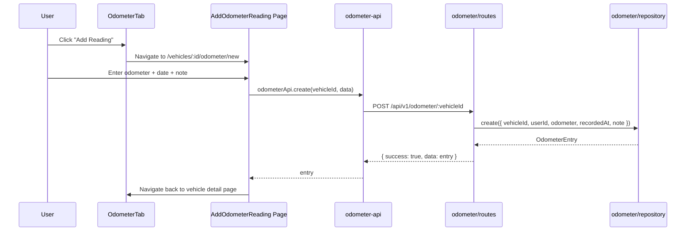
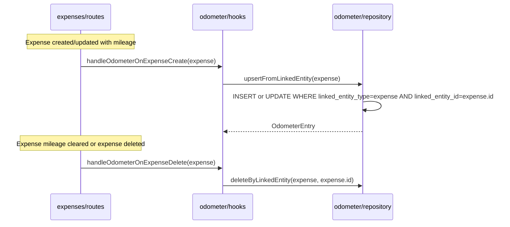

# Design Document: Odometer Log

## Overview

The Odometer Log feature adds a chronological record of odometer readings to each vehicle in VROOM. Entries come from two sources: manual readings logged by the user, and auto-populated entries derived from expenses that include a mileage value. This provides a unified mileage history that replaces the current approach of deriving `currentMileage` solely from the max mileage across fuel expenses.

The feature introduces a new `odometer_entries` table, a new backend domain module (`api/odometer/`), a new frontend tab on the vehicle detail page, and integration hooks into the expense CRUD pipeline. The existing backup/restore/sync pipeline is extended to include the new table.

Odometer entries support polymorphic linking via `linked_entity_type` + `linked_entity_id`, allowing entries to be associated with expenses, trips, or any future entity type. Entries also support photo attachments via the existing polymorphic `photos` table (entity type `'odometer_entry'`).

## Architecture

```mermaid
graph TD
    subgraph Frontend
        VDP[Vehicle Detail Page]
        OT[OdometerTab.svelte]
        AOR[AddOdometerReading Page]
        OAPI[odometer-api.ts]
    end

    subgraph Backend
        OR[odometer/routes.ts]
        OREP[odometer/repository.ts]
        OH[odometer/hooks.ts]
        ER[expenses/routes.ts]
        SYNC[sync/backup · restore · sheets]
    end

    subgraph Database
        OE[odometer_entries]
        EX[expenses]
        VH[vehicles]
        PH[photos]
    end

    VDP --> OT
    OT --> OAPI
    OT -.->|navigate| AOR[/vehicles/id/odometer/new]
    OAPI -->|HTTP| OR
    OR --> OREP
    OREP --> OE
    ER -->|on create/update/delete| OH
    OH --> OREP
    OE -->|FK| VH
    OE -.->|polymorphic link| EX
    PH -.->|entity_type=odometer_entry| OE
    SYNC --> OE
```

## Sequence Diagrams

### Manual Odometer Reading



### Expense-Derived Auto-Population



## Components and Interfaces

### Component 1: OdometerRepository

**Purpose**: Data access layer for `odometer_entries` table. Extends `BaseRepository`.

```typescript
interface OdometerRepository extends BaseRepository<OdometerEntry, NewOdometerEntry> {
  findByVehicleIdPaginated(vehicleId: string, limit: number, offset: number): Promise<{ data: OdometerEntry[], totalCount: number }>
  findByLinkedEntity(entityType: string, entityId: string): Promise<OdometerEntry | null>
  upsertFromLinkedEntity(params: {
    vehicleId: string
    userId: string
    odometer: number
    recordedAt: Date
    linkedEntityType: string
    linkedEntityId: string
  }): Promise<OdometerEntry>
  deleteByLinkedEntity(entityType: string, entityId: string): Promise<void>
}
```

**Responsibilities**:
- CRUD operations on odometer_entries
- Paginated query by vehicle: data query with `ORDER BY recorded_at DESC LIMIT/OFFSET`, plus `COUNT(*)` query for totalCount
- Upsert logic for linked entries (find by `linked_entity_type` + `linked_entity_id`, insert or update)
- Delete linked entries when the source entity's mileage is cleared

### Component 2: Odometer Hooks

**Purpose**: Cross-domain side effects triggered by expense mutations. Same pattern as `financing/hooks.ts`.

```typescript
// Called from expense routes after create/update/delete
function handleOdometerOnExpenseCreate(expense: Expense): Promise<OdometerEntry | null>
function handleOdometerOnExpenseUpdate(existing: Expense, update: Partial<NewExpense>): Promise<OdometerEntry | null>
function handleOdometerOnExpenseDelete(expense: Expense): Promise<void>
```

**Responsibilities**:
- On expense create: if `mileage` is non-null, upsert an odometer entry linked to the expense (`linked_entity_type = 'expense'`)
- On expense update: if mileage changed to non-null, upsert; if cleared to null, delete linked entry
- On expense delete: delete the linked odometer entry if one exists

### Component 3: Odometer Routes

**Purpose**: Hono route handlers for odometer CRUD. Follows the standard domain route pattern.

**Endpoints**:
| Method | Path | Description |
|--------|------|-------------|
| GET | `/api/v1/odometer/:vehicleId` | List entries for a vehicle (paginated, sorted by recorded_at DESC) |
| POST | `/api/v1/odometer/:vehicleId` | Create manual reading |
| PUT | `/api/v1/odometer/:id` | Update a manual reading (reject if entity-linked) |
| DELETE | `/api/v1/odometer/:id` | Delete a manual reading (reject if entity-linked) |

**Paginated list response**:
```typescript
{
  success: true,
  data: OdometerEntry[],
  totalCount: number,
  limit: number,
  offset: number,
  hasMore: boolean
}
```

**Responsibilities**:
- Validate vehicle ownership before list/create
- Validate entry ownership before update/delete
- Reject update/delete on entity-linked entries (those are managed by hooks)
- Apply `requireAuth` and `changeTracker` middleware
- Clamp `limit` to `CONFIG.pagination.maxPageSize`, default to `CONFIG.pagination.defaultPageSize`
- Compute `hasMore` as `offset + data.length < totalCount`

### Component 4: OdometerTab (Frontend)

**Purpose**: 4th tab on the vehicle detail page showing timeline and chart.

**Responsibilities**:
- Display chronological list of odometer entries (newest first)
- Distinguish manual vs entity-linked entries visually
- Entity-linked entries show a link back to the source (e.g., expense link)
- "Add Reading" button navigates to `/vehicles/{vehicleId}/odometer/new`
- Mileage-over-time line chart using layerchart
- Soft warning if a new reading is lower than the most recent (non-monotonic)
- Photo thumbnails on entries that have attached photos
- Photo upload via existing `MediaCaptureDialog` (reuse from vehicle photos)

### Component 5: AddOdometerReading Page (Frontend)

**Purpose**: Full page for creating manual odometer readings, following the convention of `/expenses/new`, `/vehicles/new`, `/insurance/new`.

**Route**: `frontend/src/routes/vehicles/[id]/odometer/new/+page.svelte`

**Fields**:
- Odometer reading (required, integer, min 0)
- Date (required, defaults to today)
- Note (optional, free text)
- Photo upload (optional, via `MediaCaptureDialog`)

**Responsibilities**:
- Form validation with Zod
- Submit via `odometerApi.create()`
- Show soft warning if reading < latest entry's odometer value
- Navigate back to vehicle detail page on success (via `returnTo` query param or default)
- Back button/link to return to vehicle detail page

## Data Models

### OdometerEntry (Database)

```typescript
// backend/src/db/schema.ts
const odometerEntries = sqliteTable('odometer_entries', {
  id: text('id').primaryKey().$defaultFn(() => createId()),
  vehicleId: text('vehicle_id').notNull()
    .references(() => vehicles.id, { onDelete: 'cascade' }),
  userId: text('user_id').notNull()
    .references(() => users.id, { onDelete: 'cascade' }),
  odometer: integer('odometer').notNull(),
  recordedAt: integer('recorded_at', { mode: 'timestamp' }).notNull(),
  note: text('note'),
  linkedEntityType: text('linked_entity_type'),  // 'expense', 'trip', etc.
  linkedEntityId: text('linked_entity_id'),       // ID of the linked entity
  createdAt: integer('created_at', { mode: 'timestamp' }).$defaultFn(() => new Date()),
  updatedAt: integer('updated_at', { mode: 'timestamp' }).$defaultFn(() => new Date()),
}, (table) => ({
  vehicleDateIdx: index('odometer_vehicle_date_idx').on(table.vehicleId, table.recordedAt),
  linkedEntityIdx: index('odometer_linked_entity_idx').on(table.linkedEntityType, table.linkedEntityId),
}))
```

**Notes on polymorphic linking**:
- No FK constraint on `linked_entity_id` — this is a polymorphic reference (same pattern as how `expense_groups.insurancePolicyId` works)
- Both `linked_entity_type` and `linked_entity_id` are nullable; both null = manual entry, both non-null = linked entry
- Application-level cleanup: when an expense is deleted, the odometer hook deletes the linked entry (rather than relying on DB cascade)
- The composite index on `(linked_entity_type, linked_entity_id)` enables fast lookups during hooks

**Photo support**:
- Photos attach via the existing `photos` table with `entity_type = 'odometer_entry'` and `entity_id = odometer_entry.id`
- Reuses the existing photo infrastructure (upload to Google Drive, polymorphic `photos` table)
- `PhotoEntityType` union in schema.ts gets `'odometer_entry'` added

**Validation Rules**:
- `odometer` must be a non-negative integer
- `recordedAt` must be a valid date, not in the future
- If `linkedEntityType` is set, `linkedEntityId` must also be set (and vice versa)
- A vehicle can have multiple entries; no unique constraint on odometer value
- `vehicleId` + `linkedEntityType` + `linkedEntityId` should be effectively unique (enforced at application level via upsert)

### OdometerEntry (Frontend Type)

```typescript
// frontend/src/lib/types.ts
interface OdometerEntry {
  id: string
  vehicleId: string
  odometer: number
  recordedAt: string          // ISO date string
  note?: string
  linkedEntityType?: string   // 'expense', 'trip', etc. — null for manual entries
  linkedEntityId?: string     // ID of the linked entity — null for manual entries
  createdAt: string
  updatedAt: string
}
```

## Key Functions with Formal Specifications

### Function: upsertFromLinkedEntity()

```typescript
async function upsertFromLinkedEntity(params: {
  vehicleId: string
  userId: string
  odometer: number
  recordedAt: Date
  linkedEntityType: string
  linkedEntityId: string
}): Promise<OdometerEntry>
```

**Preconditions:**
- `params.vehicleId` references an existing vehicle
- `params.userId` references an existing user
- `params.odometer >= 0`
- `params.linkedEntityType` is a non-empty string
- `params.linkedEntityId` is a non-empty string
- `params.recordedAt` is a valid Date

**Postconditions:**
- Exactly one odometer entry exists with `linked_entity_type = params.linkedEntityType` AND `linked_entity_id = params.linkedEntityId`
- If entry existed before: odometer, recordedAt updated; id unchanged
- If entry did not exist: new entry created with all fields from params
- `updatedAt` is set to current time

### Function: handleOdometerOnExpenseUpdate()

```typescript
async function handleOdometerOnExpenseUpdate(
  existingExpense: Expense,
  updateData: Partial<NewExpense>
): Promise<OdometerEntry | null>
```

**Preconditions:**
- `existingExpense` is a valid, persisted expense
- `updateData` contains the fields being changed

**Postconditions:**
- If mileage was null and stays null → no-op, returns null
- If mileage was non-null and update sets it to null → linked entry deleted, returns null
- If mileage was null and update sets it to non-null → new linked entry created, returns entry
- If mileage was non-null and update changes it → linked entry updated, returns entry
- If mileage unchanged → no-op, returns null

## Algorithmic Pseudocode

### Expense Hook: Odometer Upsert Logic

```
PROCEDURE handleOdometerOnExpenseCreate(expense)
  INPUT: expense (Expense with id, vehicleId, mileage, date)
  OUTPUT: OdometerEntry or null

  IF expense.mileage IS NULL THEN
    RETURN null
  END IF

  entry = odometerRepository.upsertFromLinkedEntity({
    vehicleId: expense.vehicleId,
    userId: derived from vehicle ownership,
    odometer: expense.mileage,
    recordedAt: expense.date,
    linkedEntityType: 'expense',
    linkedEntityId: expense.id
  })

  RETURN entry
END PROCEDURE

PROCEDURE handleOdometerOnExpenseUpdate(existingExpense, updateData)
  INPUT: existingExpense, updateData (partial)
  OUTPUT: OdometerEntry or null

  oldMileage = existingExpense.mileage
  newMileage = updateData.mileage IF defined ELSE oldMileage

  IF oldMileage IS NULL AND newMileage IS NULL THEN
    RETURN null
  END IF

  IF newMileage IS NULL THEN
    odometerRepository.deleteByLinkedEntity('expense', existingExpense.id)
    RETURN null
  END IF

  entry = odometerRepository.upsertFromLinkedEntity({
    vehicleId: existingExpense.vehicleId,
    userId: derived from vehicle,
    odometer: newMileage,
    recordedAt: updateData.date OR existingExpense.date,
    linkedEntityType: 'expense',
    linkedEntityId: existingExpense.id
  })

  RETURN entry
END PROCEDURE

PROCEDURE handleOdometerOnExpenseDelete(expense)
  INPUT: expense (Expense being deleted)

  IF expense.mileage IS NOT NULL THEN
    odometerRepository.deleteByLinkedEntity('expense', expense.id)
  END IF
END PROCEDURE
```

### Repository: Upsert From Linked Entity

```
PROCEDURE upsertFromLinkedEntity(params)
  INPUT: { vehicleId, userId, odometer, recordedAt, linkedEntityType, linkedEntityId }
  OUTPUT: OdometerEntry

  existing = SELECT * FROM odometer_entries
             WHERE linked_entity_type = params.linkedEntityType
               AND linked_entity_id = params.linkedEntityId
             LIMIT 1

  IF existing IS NOT NULL THEN
    UPDATE odometer_entries
      SET odometer = params.odometer,
          recorded_at = params.recordedAt,
          updated_at = NOW()
      WHERE id = existing.id
    RETURN updated row
  ELSE
    INSERT INTO odometer_entries
      (id, vehicle_id, user_id, odometer, recorded_at, linked_entity_type, linked_entity_id)
      VALUES (newCuid2(), params.vehicleId, params.userId,
              params.odometer, params.recordedAt,
              params.linkedEntityType, params.linkedEntityId)
    RETURN inserted row
  END IF
END PROCEDURE
```

## Example Usage

### Backend: Creating a Manual Reading

```typescript
// POST /api/v1/odometer/:vehicleId
routes.post('/:vehicleId', zValidator('param', vehicleIdParam), zValidator('json', createSchema), async (c) => {
  const user = c.get('user');
  const { vehicleId } = c.req.valid('param');
  const data = c.req.valid('json');

  const vehicle = await vehicleRepository.findByUserIdAndId(user.id, vehicleId);
  if (!vehicle) throw new NotFoundError('Vehicle');

  const entry = await odometerRepository.create({
    vehicleId,
    userId: user.id,
    odometer: data.odometer,
    recordedAt: data.recordedAt,
    note: data.note ?? null,
    linkedEntityType: null,
    linkedEntityId: null,
  });

  return c.json({ success: true, data: entry, message: 'Odometer reading created' }, 201);
});
```

### Frontend: Odometer API Service

```typescript
// frontend/src/lib/services/odometer-api.ts
export const odometerApi = {
  async getEntries(vehicleId: string, params?: { limit?: number; offset?: number }): Promise<PaginatedResponse<OdometerEntry>> {
    const query = new URLSearchParams();
    if (params?.limit) query.set('limit', String(params.limit));
    if (params?.offset) query.set('offset', String(params.offset));
    const qs = query.toString();
    return apiClient.get<PaginatedResponse<OdometerEntry>>(`/api/v1/odometer/${vehicleId}${qs ? `?${qs}` : ''}`);
  },
  async create(vehicleId: string, data: CreateOdometerRequest): Promise<OdometerEntry> {
    return apiClient.post<OdometerEntry>(`/api/v1/odometer/${vehicleId}`, data);
  },
  async update(entryId: string, data: UpdateOdometerRequest): Promise<OdometerEntry> {
    return apiClient.put<OdometerEntry>(`/api/v1/odometer/${entryId}`, data);
  },
  async delete(entryId: string): Promise<void> {
    await apiClient.delete(`/api/v1/odometer/${entryId}`);
  },
};
```

### Frontend: Entity-Linked Entry Display

```svelte
{#if entry.linkedEntityType === 'expense'}
  <a href="/expenses/{entry.linkedEntityId}" class="text-sm text-muted-foreground hover:underline">
    From expense
  </a>
{:else if entry.linkedEntityType}
  <span class="text-sm text-muted-foreground">Linked: {entry.linkedEntityType}</span>
{:else}
  <span class="text-sm text-muted-foreground">Manual reading</span>
{/if}
```

## Correctness Properties

*A property is a characteristic or behavior that should hold true across all valid executions of a system — essentially, a formal statement about what the system should do. Properties serve as the bridge between human-readable specifications and machine-verifiable correctness guarantees.*

### Property 1: Expense hook invariant

*For any* sequence of expense create/update/delete operations with random mileage values, the number of odometer entries linked to expenses (`linked_entity_type = 'expense'`) equals the number of currently-existing expenses with non-null mileage. Each linked entry's `odometer` value matches its source expense's `mileage`, and each linked entry's `recorded_at` matches its source expense's `date`.

**Validates: Requirements 3.1, 3.2, 3.3, 3.4, 3.5, 3.6**

### Property 2: Upsert idempotency

*For any* `linkedEntityType` and `linkedEntityId` pair, calling `upsertFromLinkedEntity` N times (N ≥ 1) with the same type+id results in exactly one odometer entry matching that pair. The entry's `id` remains stable across all N calls, and the `odometer` and `recordedAt` values reflect the most recent call's parameters.

**Validates: Requirements 4.1, 4.2**

### Property 3: Link field consistency invariant

*For any* odometer entry in the database after any sequence of operations, either both `linkedEntityType` and `linkedEntityId` are null (Manual_Entry), or both are non-null (Linked_Entry). There is never a state where exactly one is null.

**Validates: Requirements 5.1, 5.2, 1.5**

### Property 4: Input validation rejects invalid odometer data

*For any* numeric value that is negative or non-integer, the validation schema rejects it. *For any* date in the future, the validation schema rejects it. *For any* non-negative integer odometer value and non-future date, the validation schema accepts it.

**Validates: Requirements 1.2, 1.3**

### Property 5: Linked entry immutability via API

*For any* Linked_Entry (where `linkedEntityType` is non-null), attempting to update or delete the entry via the direct Odometer_API results in a 400 rejection. Only the Odometer_Hooks may modify or remove linked entries.

**Validates: Requirements 2.3**

### Property 6: Listing sort order

*For any* vehicle with odometer entries having random `recordedAt` dates, the list returned by the Odometer_API is sorted by `recordedAt` in strictly descending order.

**Validates: Requirements 6.1**

### Property 7: Vehicle cascade delete

*For any* vehicle with any number of odometer entries, deleting the vehicle results in zero odometer entries remaining with that `vehicleId`.

**Validates: Requirements 7.1**

### Property 8: Backup round-trip

*For any* set of odometer entries, creating a backup and then parsing and validating the backup archive preserves all odometer entries with correct types and values. The count and content of odometer entries after restore matches the original.

**Validates: Requirements 9.1, 9.2, 9.4**

### Property 9: Referential integrity validation rejects orphaned entries

*For any* backup containing an odometer entry whose `vehicleId` does not exist in the backup's vehicle set, the `validateReferentialIntegrity` function reports a validation error for that entry.

**Validates: Requirements 9.4**

### Property 10: Non-monotonic odometer warning

*For any* pair of (latest odometer reading, new odometer reading) where the new value is strictly less than the latest value, the AddOdometerReading_Page displays a soft warning. When the new value is greater than or equal to the latest, no warning is displayed.

**Validates: Requirements 13.3**

## Error Handling

### Error: Update/Delete Entity-Linked Entry

**Condition**: User attempts PUT or DELETE on an odometer entry where `linkedEntityType` is non-null
**Response**: 400 ValidationError — "Linked odometer entries are managed automatically. Edit the source record instead."
**Recovery**: User edits or deletes the linked entity (e.g., expense), which triggers the hook

### Error: Vehicle Not Found

**Condition**: POST to `/api/v1/odometer/:vehicleId` with a vehicleId the user doesn't own
**Response**: 404 NotFoundError — "Vehicle not found"
**Recovery**: User selects a valid vehicle

### Error: Invalid Odometer Value

**Condition**: Odometer value is negative or non-integer
**Response**: 400 Zod validation error via `zValidator`
**Recovery**: User corrects the input

### Error: Inconsistent Link Fields

**Condition**: Only one of `linkedEntityType` / `linkedEntityId` is provided
**Response**: 400 ValidationError — "Both linkedEntityType and linkedEntityId must be provided together"
**Recovery**: Provide both or neither

## Testing Strategy

### Unit Testing

- Repository methods: CRUD operations, upsert idempotency, deleteByLinkedEntity
- Hook functions: all four mileage transition cases (null→null, null→value, value→null, value→value)
- Validation schemas: valid/invalid inputs, link field consistency

### Property-Based Testing

**Library**: fast-check (already used in the project)

- For any sequence of expense create/update/delete operations with random mileage values, the number of odometer entries linked to expenses equals the number of currently-existing expenses with non-null mileage
- Upsert idempotency: calling upsertFromLinkedEntity N times with the same entityType+entityId always results in exactly 1 entry
- Link consistency: for any odometer entry, linkedEntityType and linkedEntityId are either both null or both non-null

### Migration Testing

- New migration applies cleanly on fresh database
- Seed data from prior migrations survives
- `odometer_entries` table has correct columns, types, and indexes
- CASCADE delete from vehicles works

### Integration Testing

- Full flow: create expense with mileage → verify odometer entry created → update expense mileage → verify entry updated → delete expense → verify entry removed
- Manual entry CRUD via API
- Photo attach/delete on odometer entries
- Backup/restore round-trip includes odometer entries

## Performance Considerations

- Index on `(vehicle_id, recorded_at)` for efficient listing sorted by date
- Composite index on `(linked_entity_type, linked_entity_id)` for fast lookups during hooks
- Odometer entries per vehicle are expected to be low volume (hundreds, not thousands), so no pagination needed for v1
- The layerchart line chart renders client-side; no server-side aggregation needed

## Security Considerations

- All odometer routes require authentication (`requireAuth`)
- Vehicle ownership validated before list/create operations
- Entry ownership validated before update/delete operations (entry's userId must match authenticated user)
- Entity-linked entries cannot be directly modified via the odometer API, preventing data inconsistency
- Photo operations reuse existing photo auth (entity ownership check)

## Dependencies

### Backend
- `@paralleldrive/cuid2` — ID generation (already used)
- `drizzle-orm` / `drizzle-zod` — schema, queries, validation (already used)
- `hono` / `@hono/zod-validator` — routing, validation middleware (already used)
- `zod` — schema validation (already used)

### Frontend
- `layerchart` — mileage-over-time line chart (already used for expense trends)
- `shadcn-svelte` — Tabs, Dialog, Button, Card, Input components (already used)
- `lucide-svelte` — icons (already used)

## Migration Strategy

### Consolidated Migration (New 0004)

Migrations 0004 (`track_fuel`/`track_charging` on vehicles), 0005 (`google_drive_custom_folder_name` on user_settings), and the new `odometer_entries` table are consolidated into a single migration file. This replaces the existing 0004 and 0005 files.

**Combined SQL**:
```sql
-- From old 0004: vehicle tracking columns
ALTER TABLE `vehicles` ADD `track_fuel` integer DEFAULT true NOT NULL;
ALTER TABLE `vehicles` ADD `track_charging` integer DEFAULT false NOT NULL;
UPDATE vehicles SET track_charging = 1 WHERE vehicle_type = 'electric';
UPDATE vehicles SET track_fuel = 0 WHERE vehicle_type = 'electric';
UPDATE vehicles SET track_charging = 1 WHERE vehicle_type = 'hybrid';

-- From old 0005: custom folder name
ALTER TABLE `user_settings` ADD `google_drive_custom_folder_name` text;

-- New: odometer entries table
CREATE TABLE `odometer_entries` (
  `id` text PRIMARY KEY NOT NULL,
  `vehicle_id` text NOT NULL REFERENCES `vehicles`(`id`) ON DELETE CASCADE,
  `user_id` text NOT NULL REFERENCES `users`(`id`) ON DELETE CASCADE,
  `odometer` integer NOT NULL,
  `recorded_at` integer NOT NULL,
  `note` text,
  `linked_entity_type` text,
  `linked_entity_id` text,
  `created_at` integer,
  `updated_at` integer
);
CREATE INDEX `odometer_vehicle_date_idx` ON `odometer_entries` (`vehicle_id`, `recorded_at`);
CREATE INDEX `odometer_linked_entity_idx` ON `odometer_entries` (`linked_entity_type`, `linked_entity_id`);
```

**Dev database reconciliation**: Since dev is already on migration 0005, after replacing the migration files the dev database needs manual steps:
1. Run the `CREATE TABLE odometer_entries` and both `CREATE INDEX` statements directly against the dev DB
2. Delete rows from `__drizzle_migrations` for the old 0004 and 0005 hashes
3. Insert the new consolidated migration hash into `__drizzle_migrations`

### Backup/Sync Pipeline Changes

| File | Method/Section | Change |
|------|---------------|--------|
| `config.ts` | `TABLE_SCHEMA_MAP` | Add `odometer: odometerEntries` |
| `config.ts` | `TABLE_FILENAME_MAP` | Add `odometer: 'odometer_entries.csv'` |
| `config.ts` | `OPTIONAL_BACKUP_FILES` | Add `'odometer_entries.csv'` (older backups won't have it) |
| `types.ts` | `BackupData` | Add `odometer: import('./db/schema').OdometerEntry[]` |
| `types.ts` | `ParsedBackupData` | Add `odometer: Record<string, unknown>[]` |
| `backup.ts` | `createBackup()` | Query odometer entries via `innerJoin(vehicles)` on `userId`, add to return object |
| `backup.ts` | `queryUserPhotos()` | Add `{ type: 'odometer_entry', ids: odometerEntryIds }` to `entityQueries` array |
| `backup.ts` | `validateReferentialIntegrity()` | Build `odometerIds` set, add `validateOdometerRefs()` call, pass `odometerIds` to `validatePhotoRefs()` |
| `backup.ts` | new `validateOdometerRefs()` | Check each odometer entry's `vehicleId` exists in `vehicleIds` set |
| `backup.ts` | `validatePhotoRefs()` | Add `odometer_entry: entityIds.odometerIds` to `entityTypeToIds` map |
| `restore.ts` | `ImportSummary` | Add `odometer: number` field |
| `restore.ts` | `insertBackupData()` | Insert odometer entries AFTER expenses (linked_entity_id may reference expense IDs) |
| `restore.ts` | `deleteUserData()` | Delete photos with `entity_type = 'odometer_entry'` for user's odometer entries, then delete odometer entries (before deleting vehicles to avoid FK issues) |
| `google-sheets.ts` | `createSpreadsheet()` | Add `{ properties: { title: 'Odometer' } }` to sheets array |
| `google-sheets.ts` | `ensureRequiredSheets()` | Add `'Odometer'` to `requiredSheets` array |
| `google-sheets.ts` | new `getOdometerHeaders()` | Return column headers: id, vehicle_id, user_id, odometer, recorded_at, note, linked_entity_type, linked_entity_id, created_at, updated_at |
| `google-sheets.ts` | `updateSpreadsheetWithUserData()` | Query odometer entries, call `updateSheet('Odometer', ...)` |
| `google-sheets.ts` | `readSpreadsheetData()` | Read 'Odometer' sheet, coerce rows, add to returned data |
| `backup.test.ts` | `TABLE_SCHEMA_MAP coverage` | Add `'odometer'` to expected keys array |
| `backup.test.ts` | All `ParsedBackupData` fixtures | Add `odometer: []` field to prevent undefined errors |
| `backup.test.ts` | new tests | coerceRow tests for odometer_entries (integer odometer, nullable text fields), referential integrity test for odometer entry referencing non-existent vehicle |

### Photo Entity Type Update

The `PhotoEntityType` union in `schema.ts` must be updated to include `'odometer_entry'`:
```typescript
export type PhotoEntityType = 'vehicle' | 'expense' | 'trip' | 'insurance_policy' | 'expense_group' | 'odometer_entry';
```

### Migration Test File

Per the DatabaseMigrations SOP, create `backend/src/db/__tests__/migration-0004.test.ts` (replacing the old 0004 test if one exists) covering:
- Consolidated migration creates `odometer_entries` table with correct columns
- `track_fuel` and `track_charging` columns added to vehicles
- `google_drive_custom_folder_name` column added to user_settings
- Seed data from migrations 0000–0003 survives
- CASCADE delete from vehicles removes odometer entries
- Indexes `odometer_vehicle_date_idx` and `odometer_linked_entity_idx` exist

Also update `migration-general.test.ts` to include `odometer_entries` in the expected tables list.
