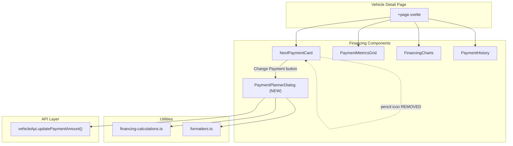
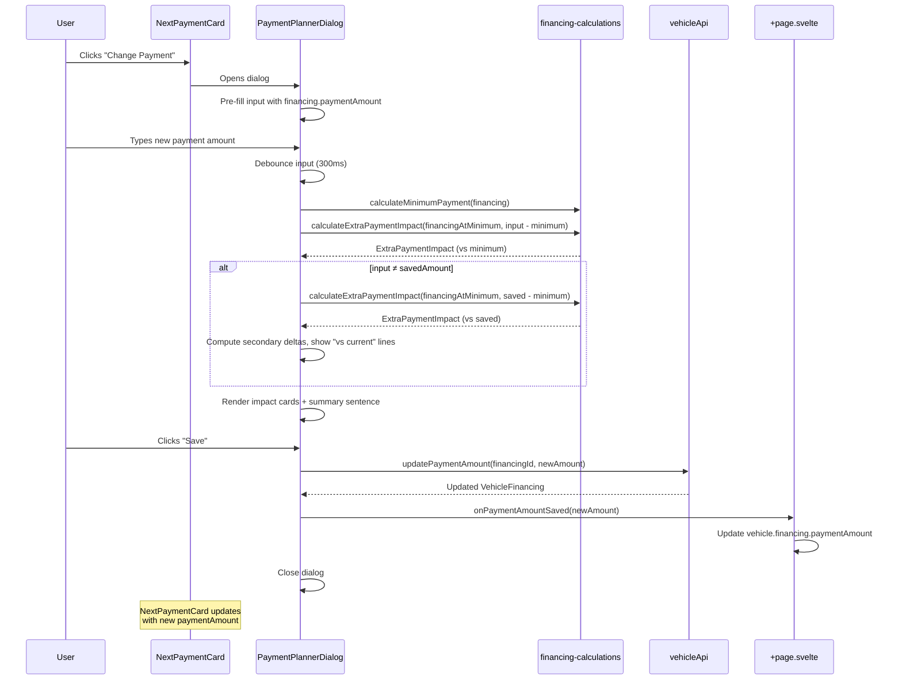

# Design Document: Payment Planner

## Overview

The Payment Planner replaces the existing collapsible PaymentCalculator component with a dialog-based planning tool triggered from the NextPaymentCard. Instead of asking "how much extra do you want to pay?", it pre-fills with the user's current `paymentAmount` and lets them think in terms of "what do I want my monthly payment to be?" The dialog shows impact cards comparing against the calculated minimum payment (absolute baseline), with optional secondary deltas against the previously saved payment amount. A Save button persists changes via the existing PATCH API. The trigger is a "Change Payment" button next to "Record Payment" on the NextPaymentCard, and the pencil icon / inline edit is removed.

## Architecture



## Sequence Diagrams

### User Changes Payment Amount



## Components and Interfaces

### Component: PaymentPlannerDialog

**Purpose**: Dialog-based payment planning tool triggered from NextPaymentCard's "Change Payment" button. Shows the impact of changing the monthly payment amount relative to the minimum payment, with optional comparison to the previously saved amount.

**Interface**:
```typescript
interface PaymentPlannerDialogProps {
  financing: VehicleFinancing;
  open: boolean;                    // bindable, controls dialog visibility
  onPaymentAmountSaved: (_newAmount: number) => Promise<void>;
}
```

**Responsibilities**:
- Render as a shadcn Dialog (or Sheet on mobile via responsive detection)
- Pre-fill input with current `financing.paymentAmount` when dialog opens
- Calculate minimum payment via `calculateMinimumPayment(financing)`
- Calculate impact vs minimum via `calculateExtraPaymentImpact()` using a modified financing object with `paymentAmount` set to `minimumPayment`
- Show three impact cards: Payoff Date, Time Saved, Interest Saved
- Show secondary "vs current" deltas when input ≠ saved amount
- Validate input ≥ minimum payment
- Persist via callback `onPaymentAmountSaved()` on Save, then close dialog
- Show helper text: "Min: $X · Current: $Y"
- Show adaptive summary sentence

### Component: NextPaymentCard (Modified)

**Purpose**: Shows next payment info. Modification removes the pencil icon / inline edit and adds a "Change Payment" button that opens the PaymentPlannerDialog.

**Changes**:
- Remove `onPaymentAmountChange` prop
- Remove `Pencil`, `Check`, `X` icon imports and inline edit state/functions
- Add `onChangePayment` prop (callback to open the dialog)
- Add "Change Payment" outline button next to "Record Payment"
- Keep all other functionality (countdown badge, progress bar, balance stats, min payment display)

## Data Models

### Impact Calculation Model

The component needs two sets of impact calculations:

```typescript
// Primary: impact vs minimum payment (absolute baseline)
// Uses calculateExtraPaymentImpact with a financing object where paymentAmount = minimumPayment
interface PrimaryImpact {
  payoffDate: Date;
  monthsSaved: number;    // months saved vs paying only minimum
  interestSaved: number;  // interest saved vs paying only minimum
}

// Secondary: delta vs saved payment (relative change) — only when input ≠ saved
interface SecondaryDelta {
  monthsDelta: number;    // positive = more months saved, negative = fewer
  interestDelta: number;  // positive = more interest saved, negative = less
  direction: 'better' | 'worse';  // green or red coloring
}
```

**Validation Rules**:
- Input must be ≥ minimum payment (from amortization formula)
- Input must be > 0
- Input must be a valid number

### Impact Card Display States

```typescript
type CardState =
  | 'normal'           // input > minimum, shows primary values
  | 'with-delta'       // input > minimum AND input ≠ saved, shows primary + secondary
  | 'at-minimum'       // input = minimum, shows zeros with "This is the minimum payment"
  | 'below-minimum';   // input < minimum, shows validation error
```

## Algorithmic Pseudocode

### Main Computation Algorithm

```typescript
function computePlannerState(
  financing: VehicleFinancing,
  inputAmount: number,
  minimumPayment: number,
  savedAmount: number // financing.paymentAmount at mount time
): PlannerState {
  // Preconditions:
  //   financing is a valid loan with apr > 0
  //   minimumPayment > 0 (calculated from amortization formula)
  //   savedAmount >= minimumPayment

  if (inputAmount < minimumPayment) {
    return { state: 'below-minimum', error: `Minimum payment is ${formatCurrency(minimumPayment)}` };
  }

  if (inputAmount === minimumPayment) {
    return { state: 'at-minimum', message: 'This is the minimum payment. No extra savings.' };
  }

  // Primary impact: input vs minimum
  // Create a modified financing object with paymentAmount = minimumPayment
  // so calculateExtraPaymentImpact compares against the minimum baseline
  const extraVsMinimum = inputAmount - minimumPayment;
  const financingAtMinimum = { ...financing, paymentAmount: minimumPayment };
  const primaryImpact = calculateExtraPaymentImpact(financingAtMinimum, extraVsMinimum);

  // Postcondition: primaryImpact.monthsSaved >= 0, primaryImpact.interestSaved >= 0

  // Secondary delta: input vs saved (only when different)
  let secondaryDelta: SecondaryDelta | null = null;
  if (Math.abs(inputAmount - savedAmount) > 0.01) {
    // Calculate impact of saved amount vs minimum
    const extraSavedVsMinimum = savedAmount - minimumPayment;
    const savedImpact = calculateExtraPaymentImpact(financingAtMinimum, extraSavedVsMinimum);

    secondaryDelta = {
      monthsDelta: primaryImpact.monthsSaved - savedImpact.monthsSaved,
      interestDelta: primaryImpact.interestSaved - savedImpact.interestSaved,
      direction: inputAmount > savedAmount ? 'better' : 'worse'
    };
  }

  return {
    state: secondaryDelta ? 'with-delta' : 'normal',
    primaryImpact,
    secondaryDelta
  };
}
```

**Preconditions:**
- `financing` is non-null, `financingType === 'loan'`, `apr > 0`
- `minimumPayment` is a positive number from `calculateMinimumPayment()`
- `inputAmount` is a valid positive number

**Postconditions:**
- Returns a valid `PlannerState` with one of the defined states
- `primaryImpact.monthsSaved >= 0` and `primaryImpact.interestSaved >= 0`
- `secondaryDelta` is null when `inputAmount ≈ savedAmount` (within $0.01)
- No side effects on input parameters

**Loop Invariants:** N/A (delegates to `calculateExtraPaymentImpact` which has its own loop invariants)

### Summary Sentence Algorithm

```typescript
function buildSummary(
  inputAmount: number,
  savedAmount: number,
  minimumPayment: number,
  primaryImpact: ExtraPaymentImpact,
  secondaryDelta: SecondaryDelta | null
): string {
  // Preconditions:
  //   inputAmount >= minimumPayment
  //   primaryImpact is valid

  if (inputAmount <= minimumPayment + 0.01) {
    return 'This is the minimum payment. No extra savings.';
  }

  const base = `Paying ${formatCurrency(inputAmount)}/mo saves ${formatMonths(primaryImpact.monthsSaved)} and ${formatCurrency(primaryImpact.interestSaved)} vs minimum.`;

  if (!secondaryDelta) {
    // input = saved
    return `Your current payment of ${formatCurrency(inputAmount)}/mo saves ${formatMonths(primaryImpact.monthsSaved)} and ${formatCurrency(primaryImpact.interestSaved)} vs the minimum.`;
  }

  const moreOrLess = secondaryDelta.direction === 'better' ? 'more' : 'less';
  const deltaMonths = Math.abs(secondaryDelta.monthsDelta);
  const deltaInterest = Math.abs(secondaryDelta.interestDelta);

  return `${base} That's ${formatMonths(deltaMonths)} and ${formatCurrency(deltaInterest)} ${moreOrLess} than your current ${formatCurrency(savedAmount)}/mo.`;
}
```

**Preconditions:**
- All numeric inputs are valid positive numbers
- `primaryImpact` contains valid calculation results

**Postconditions:**
- Returns a non-empty string
- String accurately reflects the relationship between input, saved, and minimum values

## Key Functions with Formal Specifications

### Function: computePlannerState()

```typescript
function computePlannerState(
  financing: VehicleFinancing,
  inputAmount: number,
  minimumPayment: number,
  savedAmount: number
): PlannerState
```

**Preconditions:**
- `financing.financingType === 'loan'`
- `financing.apr > 0`
- `minimumPayment > 0`
- `inputAmount > 0`

**Postconditions:**
- Returns `'below-minimum'` iff `inputAmount < minimumPayment`
- Returns `'at-minimum'` iff `inputAmount ≈ minimumPayment` (within $0.01)
- Returns `'with-delta'` iff `inputAmount > minimumPayment` AND `|inputAmount - savedAmount| > 0.01`
- Returns `'normal'` iff `inputAmount > minimumPayment` AND `|inputAmount - savedAmount| ≤ 0.01`
- No mutations to `financing` object

### Function: handleSave()

```typescript
async function handleSave(): Promise<void>
```

**Preconditions:**
- `inputAmount >= minimumPayment`
- `inputAmount ≠ savedAmount` (Save button disabled otherwise)
- `financing.id` is a valid financing ID

**Postconditions:**
- On success: `savedAmount` updated to `inputAmount`, secondary deltas disappear, `onPaymentAmountSaved` callback invoked
- On failure: Error message displayed, `savedAmount` unchanged
- Loading state properly managed (set before API call, cleared after)

## Example Usage

```typescript
// In +page.svelte — add dialog state and swap PaymentCalculator for PaymentPlannerDialog
import PaymentPlannerDialog from '$lib/components/financing/PaymentPlannerDialog.svelte';

let showPaymentPlanner = $state(false);

// Remove: <PaymentCalculator financing={vehicle.financing} />
// Add dialog component (rendered once, controlled by open prop):
<PaymentPlannerDialog
  financing={vehicle.financing}
  bind:open={showPaymentPlanner}
  onPaymentAmountSaved={handlePaymentAmountChange}
/>

// NextPaymentCard gets a new callback to open the dialog:
<NextPaymentCard
  financing={vehicle.financing}
  onChangePayment={() => (showPaymentPlanner = true)}
  ...
/>

// The existing handlePaymentAmountChange already works:
async function handlePaymentAmountChange(newAmount: number) {
  if (!vehicle?.financing) return;
  await vehicleApi.updatePaymentAmount(vehicle.financing.id, newAmount);
  vehicle.financing.paymentAmount = newAmount;
}
```

```svelte
<!-- PaymentPlannerDialog.svelte — reactive state setup -->
<script lang="ts">
  import * as Dialog from '$lib/components/ui/dialog';

  let { financing, open = $bindable(false), onPaymentAmountSaved }: PaymentPlannerDialogProps = $props();

  let inputValue = $state(financing.paymentAmount.toFixed(2));
  let savedAmount = $state(financing.paymentAmount);
  let isSaving = $state(false);
  let saveError = $state('');

  let inputAmount = $derived(parseFloat(inputValue) || 0);
  let minimumPayment = $derived(calculateMinimumPayment(financing));

  // Reset input when dialog opens
  $effect(() => {
    if (open) {
      inputValue = financing.paymentAmount.toFixed(2);
      savedAmount = financing.paymentAmount;
      saveError = '';
    }
  });

  // Debounced computation
  let debouncedInput = $state(inputAmount);
  const updateDebounced = debounce((val: number) => { debouncedInput = val; }, 300);
  $effect(() => { updateDebounced(inputAmount); });

  let plannerState = $derived.by(() =>
    computePlannerState(financing, debouncedInput, minimumPayment ?? 0, savedAmount)
  );

  let canSave = $derived(
    inputAmount >= (minimumPayment ?? 0) &&
    Math.abs(inputAmount - savedAmount) > 0.01 &&
    !isSaving
  );
</script>
```

## Correctness Properties

*A property is a characteristic or behavior that should hold true across all valid executions of a system — essentially, a formal statement about what the system should do. Properties serve as the bridge between human-readable specifications and machine-verifiable correctness guarantees.*

### Property 1: Planner State Classification

*For any* valid financing object, minimum payment, and input amount: if input < minimum, the planner state is `below-minimum`; if input ≈ minimum (within $0.01), the state is `at-minimum`; if input > minimum and |input - saved| ≤ $0.01, the state is `normal`; if input > minimum and |input - saved| > $0.01, the state is `with-delta`. These four states are exhaustive and mutually exclusive.

**Validates: Requirements 3.1, 3.3, 3.4, 4.1, 4.3**

### Property 2: Impact Monotonicity

*For any* two payment amounts `a` and `b` where `a > b > minimumPayment` against the same financing object, `monthsSaved(a) ≥ monthsSaved(b)` and `interestSaved(a) ≥ interestSaved(b)`. Paying more never results in worse outcomes.

**Validates: Requirement 3.1**

### Property 3: Secondary Delta Correctness and Direction

*For any* input amount that differs from the saved amount by more than $0.01 (both above minimum), the secondary delta's `monthsDelta` equals `primaryImpact(input).monthsSaved - primaryImpact(saved).monthsSaved`, `interestDelta` equals `primaryImpact(input).interestSaved - primaryImpact(saved).interestSaved`, and `direction` is `better` when input > saved, `worse` when input < saved.

**Validates: Requirements 3.3, 3.5, 3.6**

### Property 4: Save Guard Correctness

*For any* input amount and saved amount, the Save button is enabled if and only if: input ≥ minimum payment AND |input - saved| > $0.01 AND no save operation is in progress. All three conditions must hold simultaneously.

**Validates: Requirements 4.1, 4.4, 5.1**

### Property 5: Save Idempotency

*For any* successful save operation, the saved amount is updated to equal the input amount, causing the planner state to transition from `with-delta` to `normal` (secondary deltas disappear) and the Save button to become disabled.

**Validates: Requirements 5.2, 5.3**

### Property 6: Summary Sentence Consistency

*For any* planner state, the summary sentence accurately reflects that state: at-minimum produces "This is the minimum payment. No extra savings."; normal (input = saved) produces a sentence referencing savings vs minimum; with-delta (input ≠ saved) produces a sentence referencing both savings vs minimum and the delta vs the current saved amount.

**Validates: Requirements 7.1, 7.2, 7.3**

### Property 7: Non-Loan Financing Guard

*For any* financing object where `financingType` is not `loan`, the "Change Payment" button is not rendered on the NextPaymentCard and the PaymentPlannerDialog cannot be opened.

**Validates: Requirement 8.1**

## Error Handling

### Error Scenario 1: Save API Failure

**Condition**: `vehicleApi.updatePaymentAmount()` throws an error
**Response**: Display inline error message below Save button, keep input value unchanged
**Recovery**: User can retry by clicking Save again; `savedAmount` remains at previous value

### Error Scenario 2: Invalid Input

**Condition**: User enters non-numeric, zero, or negative value
**Response**: Impact cards show empty/zero state, Save button disabled
**Recovery**: User corrects input; debounced calculation resumes automatically

### Error Scenario 3: Input Below Minimum

**Condition**: `inputAmount < minimumPayment`
**Response**: Show validation message "Amount must be at least {minimumPayment}", Save button disabled, impact cards show `below-minimum` state
**Recovery**: User increases input above minimum

### Error Scenario 4: Calculation Error

**Condition**: `calculateExtraPaymentImpact` returns zero values for a valid extra amount
**Response**: Show impact cards with zero values (graceful degradation)
**Recovery**: N/A — likely a data issue with the financing record

## Testing Strategy

### Unit Testing Approach

- Test `computePlannerState` with various input/saved/minimum combinations
- Test summary sentence generation for all four relationship states
- Test edge cases: input exactly at minimum, input equal to saved, very large inputs
- Test validation: below minimum, zero, negative, NaN

### Property-Based Testing Approach

**Property Test Library**: fast-check

- **Monotonicity**: For any two amounts a > b > minimum, impact(a) ≥ impact(b)
- **Delta consistency**: secondaryDelta always equals primaryImpact(input) - primaryImpact(saved)
- **State transitions**: plannerState is always one of the four defined states for any valid input

### Integration Testing Approach

- Test Save flow: input → click Save → API called → savedAmount updated → deltas disappear
- Test that NextPaymentCard no longer has edit capability
- Test that PaymentPlanner receives correct props from +page.svelte

## Performance Considerations

- Debounce input by 300ms to avoid recalculating on every keystroke
- Use `$derived.by` for impact calculations so they only recompute when debounced input changes
- The `calculateExtraPaymentImpact` function runs two amortization loops (O(n) where n = remaining months) — fast enough for real-time use with debouncing

## Security Considerations

- Input validation on both client (minimum payment floor) and server (PATCH endpoint already validates)
- No sensitive data exposed — all calculations use existing financing data already available to the authenticated user
- API call uses existing `vehicleApi.updatePaymentAmount` which goes through the authenticated `apiClient`

## Dependencies

- `$lib/utils/financing-calculations.ts` — `calculateMinimumPayment`, `calculateExtraPaymentImpact` (existing)
- `$lib/utils/formatters.ts` — `formatCurrency`, `formatDate` (existing)
- `$lib/utils/memoize.ts` — `debounce` (existing)
- `$lib/services/vehicle-api.ts` — `vehicleApi.updatePaymentAmount` (existing)
- `$lib/types.ts` — `VehicleFinancing` (existing)
- shadcn-svelte — `Dialog`, `Card`, `Input`, `Button`, `Label` (existing)
- lucide-svelte — `Calculator`, `Calendar`, `TrendingDown`, `DollarSign`, `ArrowUp`, `ArrowDown`, `Save`, `LoaderCircle` (existing)
