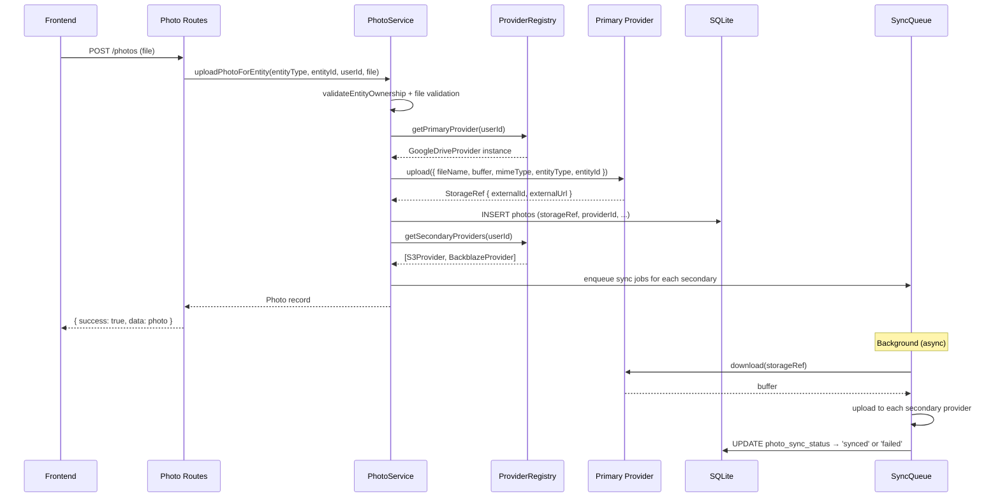
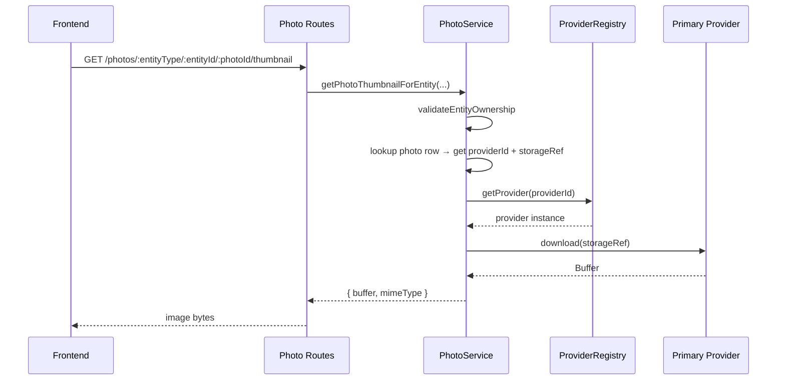

# Design Document: Photo Provider Abstraction

## Overview

The photo system is currently hardcoded to Google Drive at every layer — the database schema stores `driveFileId` and `webViewLink`, the service layer calls `getDriveServiceForUser()` directly, and folder resolution is entirely Google Drive API calls. This design introduces a `StorageProvider` interface that decouples photo storage from any single provider, enabling users to configure multiple storage backends (Google Drive, S3-compatible, OneDrive, etc.) with one marked as primary (for reads) and the rest as async backup targets.

The frontend is already partially decoupled — it proxies all photo access through backend `/thumbnail` endpoints and never talks to Google Drive directly. The abstraction work is primarily backend: introducing the provider interface, generalizing the schema, and building a provider registry.

## Architecture

### Current Architecture

```
Frontend ──→ Backend API (proxy) ──→ GoogleDriveService (concrete class)
                  │                         │
                  ▼                         ▼
            SQLite `photos`           Google Drive API
         (driveFileId, webViewLink)    (OAuth refresh token from users table)
```

- `photo-service.ts` calls `getDriveServiceForUser()` for every operation
- `helpers.ts` resolves Google Drive folder hierarchies per entity type
- `GoogleDriveService` is a concrete class with no interface
- Auth piggybacks on the Google login OAuth token (`users.googleRefreshToken`)
- `photos` table has Google-specific columns: `driveFileId` (NOT NULL), `webViewLink`

### Target Architecture

```
Frontend ──→ Backend API (unchanged proxy pattern)
                  │
                  ▼
            PhotoService (orchestrator)
                  │
                  ▼
         StorageProviderRegistry
          ├── primary provider ──→ read + write
          └── secondary providers ──→ async write (fan-out)
                  │
     ┌────────────┼────────────────┐
     ▼            ▼                ▼
GoogleDrive   S3Compat         OneDrive
 Provider     Provider          Provider
```

- `PhotoService` resolves the user's primary provider via the registry
- Upload writes to primary first, then enqueues async copies to secondaries
- Read always goes through the primary provider
- Each provider implements a common `StorageProvider` interface
- Provider credentials are stored per-user in a new `user_storage_providers` table

## Sequence Diagrams

### Upload Flow (Multi-Provider)



### Read Flow (Unchanged from Frontend Perspective)



## Components and Interfaces

### StorageProvider Interface

```typescript
interface StorageProvider {
  readonly type: string; // 'google-drive' | 's3' | 'backblaze' | 'onedrive'

  upload(params: {
    fileName: string;
    buffer: Buffer;
    mimeType: string;
    entityType: string;
    entityId: string;
    pathHint: string; // provider maps this to its storage model (folders, key prefixes, etc.)
  }): Promise<StorageRef>;

  download(ref: StorageRef): Promise<Buffer>;

  delete(ref: StorageRef): Promise<void>;

  getExternalUrl(ref: StorageRef): Promise<string | null>;

  healthCheck(): Promise<boolean>;
}

interface StorageRef {
  providerType: string;
  externalId: string;     // Drive file ID, S3 key, Backblaze file ID, etc.
  externalUrl?: string;   // Web-viewable link if provider supports it
}
```

### StorageProviderRegistry

```typescript
class StorageProviderRegistry {
  /** Get the user's primary provider instance, ready to use */
  async getPrimaryProvider(userId: string): Promise<StorageProvider>;

  /** Get all secondary (non-primary) provider instances for fan-out */
  async getSecondaryProviders(userId: string): Promise<StorageProvider[]>;

  /** Get a specific provider by its user_storage_providers row ID */
  async getProvider(providerId: string): Promise<StorageProvider>;

  /** Factory: instantiate a StorageProvider from a user_storage_providers row */
  private createProviderInstance(row: UserStorageProvider): StorageProvider;
}
```

### Provider Implementations

**GoogleDriveProvider** — Wraps existing `GoogleDriveService`. Credentials: OAuth refresh token. Preserves current folder structure logic from `helpers.ts` (VROOM/Vehicle Photos/{year make model}/, etc.).

**S3CompatProvider** — Covers AWS S3, Backblaze B2, Cloudflare R2, MinIO. Credentials: endpoint, bucket, region, accessKeyId, secretAccessKey. Path strategy: `{entityType}/{entityId}/{fileName}`.

**OneDriveProvider** (future) — Microsoft Graph API. Credentials: OAuth tokens. Path strategy: `/Apps/VROOM/{entityType}/{entityId}/{fileName}`.

### PhotoService Changes

The existing functions in `photo-service.ts` change from calling `getDriveServiceForUser()` directly to going through the registry:

```typescript
// Before
const driveService = await getDriveServiceForUser(userId);
const folderId = await resolveEntityDriveFolder(driveService, entityType, entityId, folderName);
const driveFile = await driveService.uploadFile(file.name, buffer, file.type, folderId);

// After
const provider = await providerRegistry.getPrimaryProvider(userId);
const storageRef = await provider.upload({
  fileName: file.name, buffer, mimeType: file.type,
  entityType, entityId, pathHint: folderName,
});
```

## Data Models

### New Table: `user_storage_providers`

```sql
CREATE TABLE user_storage_providers (
  id            TEXT PRIMARY KEY,
  user_id       TEXT NOT NULL REFERENCES users(id) ON DELETE CASCADE,
  provider_type TEXT NOT NULL,  -- 'google-drive' | 's3' | 'backblaze' | 'onedrive'
  display_name  TEXT NOT NULL,  -- User-chosen label ("My Google Drive", "Work S3")
  is_primary    INTEGER NOT NULL DEFAULT 0,
  credentials   TEXT NOT NULL,  -- Encrypted JSON, shape varies by provider_type
  config        TEXT,           -- JSON: bucket, region, folder prefs, etc.
  status        TEXT NOT NULL DEFAULT 'active',  -- 'active' | 'error' | 'disconnected'
  last_sync_at  INTEGER,
  created_at    INTEGER,
  updated_at    INTEGER
);
-- Partial unique index: only one primary per user
CREATE UNIQUE INDEX usp_user_primary_idx
  ON user_storage_providers(user_id) WHERE is_primary = 1;
```

### Modified Table: `photos`

| Change | Before | After |
|---|---|---|
| Rename column | `drive_file_id` (NOT NULL) | `storage_ref` (NOT NULL) — provider-specific reference |
| Rename column | `web_view_link` | `external_url` — generic external link |
| Add column | — | `provider_id` TEXT FK → `user_storage_providers.id` |

### New Table: `photo_sync_status` (Phase 3 — multi-provider fan-out)

```sql
CREATE TABLE photo_sync_status (
  id              TEXT PRIMARY KEY,
  photo_id        TEXT NOT NULL REFERENCES photos(id) ON DELETE CASCADE,
  provider_id     TEXT NOT NULL REFERENCES user_storage_providers(id) ON DELETE CASCADE,
  status          TEXT NOT NULL DEFAULT 'pending',  -- 'pending' | 'synced' | 'failed' | 'retrying'
  storage_ref     TEXT,          -- Provider-specific ref once synced
  last_attempt_at INTEGER,
  error_message   TEXT,
  retry_count     INTEGER NOT NULL DEFAULT 0,
  created_at      INTEGER
);
CREATE INDEX pss_pending_idx ON photo_sync_status(status) WHERE status IN ('pending', 'retrying');
```

### Frontend Type Changes

```typescript
// Before
export interface Photo {
  id: string;
  entityType: string;
  entityId: string;
  driveFileId: string;    // Google-specific
  fileName: string;
  mimeType: string;
  fileSize: number;
  webViewLink?: string;   // Google-specific
  isCover: boolean;
  sortOrder: number;
  createdAt: string;
}

// After
export interface Photo {
  id: string;
  entityType: string;
  entityId: string;
  storageRef: string;     // Provider-agnostic
  providerId: string;     // Which provider holds this photo
  fileName: string;
  mimeType: string;
  fileSize: number;
  externalUrl?: string;   // Provider-agnostic
  isCover: boolean;
  sortOrder: number;
  createdAt: string;
}
```

## Migration Strategy

### Phase 1 — Introduce Abstraction (Google Drive Only)

- Create `StorageProvider` interface and `GoogleDriveProvider` implementation
- Add `user_storage_providers` table
- Auto-create a Google Drive provider row for each existing user (using their `googleRefreshToken`)
- Rename `photos.drive_file_id` → `storage_ref`, `web_view_link` → `external_url`
- Add `photos.provider_id` column, backfill with the auto-created provider row ID
- Refactor `photo-service.ts` to call through the provider interface
- Move folder resolution logic from `helpers.ts` into `GoogleDriveProvider.upload()`
- All existing behavior preserved — just routed through the abstraction

### Phase 2 — Add S3-Compatible Provider

- Implement `S3CompatProvider` (covers AWS S3, Backblaze B2, Cloudflare R2, MinIO)
- Add settings UI for configuring S3 credentials (endpoint, bucket, region, keys)
- Support setting as primary or secondary
- User can switch primary between Google Drive and S3

### Phase 3 — Multi-Provider Fan-Out

- Add `photo_sync_status` table
- Implement background sync worker (polling `photo_sync_status` for pending/failed jobs)
- Upload to primary synchronously, enqueue secondary copies
- Retry with exponential backoff (max 3 attempts)
- Add sync status visibility in settings UI

### Phase 4 — Additional OAuth Providers

- OneDrive via Microsoft Graph API
- Dropbox (feasible, another OAuth flow)
- iCloud is likely not feasible without a native Apple app

## Provider Tier Classification

| Tier | Providers | Complexity | Auth Model |
|---|---|---|---|
| Tier 1 | AWS S3, Backblaze B2, Cloudflare R2, MinIO | Low — one `S3CompatProvider` covers all | API keys (endpoint + bucket + credentials) |
| Tier 2 | Google Drive | Medium — refactor existing code | OAuth refresh token |
| Tier 3 | OneDrive, Dropbox | Medium — new OAuth flows | OAuth tokens via provider APIs |
| Tier 4 | iCloud | High — no real write API for web apps | Not feasible without native app |

## Key Design Decisions

### 1. Credential Storage

Provider credentials stored as encrypted JSON in `user_storage_providers.credentials`. AES-256-GCM with a server-side encryption key from environment variables. Each provider type has a different credential shape:

```typescript
// Google Drive
{ refreshToken: string }

// S3-compatible
{ endpoint: string; bucket: string; region: string; accessKeyId: string; secretAccessKey: string }

// OneDrive
{ accessToken: string; refreshToken: string; expiresAt: number }
```

### 2. Background Sync Approach

Lightweight polling on `photo_sync_status` table via `setInterval` — no external job queue. SQLite + Bun is single-process, so a simple in-process worker is appropriate. Poll interval: 30 seconds. Max retries: 3 with exponential backoff (30s, 120s, 480s).

### 3. Primary Switch Behavior

When a user changes their primary provider, existing photos stay where they are. The `photos.provider_id` still points to the original provider. New uploads go to the new primary. A separate "migrate all photos" action can be offered as an explicit user choice, not automatic.

### 4. Folder Structure Per Provider

Each provider decides its own path strategy via the `pathHint` parameter:
- Google Drive: preserves current folder hierarchy (VROOM/Vehicle Photos/{year make model}/)
- S3-compatible: flat key structure (`{entityType}/{entityId}/{fileName}`)
- OneDrive: app folder structure (`/Apps/VROOM/{entityType}/{entityId}/{fileName}`)

### 5. Separate OAuth Connections

Yes — users can connect a Google Drive account different from their login account. The `user_storage_providers` table holds its own credentials independent of `users.googleRefreshToken`. Phase 1 auto-creates a provider row from the login token, but users can add additional Google accounts later.

## Error Handling

### Provider Upload Failure (Primary)

Upload to primary fails → throw error immediately, no photo record created. Frontend shows upload error with retry.

### Provider Upload Failure (Secondary — Phase 3)

Secondary upload fails → `photo_sync_status` row set to `'failed'` with error message. Retried on next poll cycle. After max retries, status stays `'failed'` — surfaced in settings UI. Primary photo is unaffected.

### Provider Health Check Failure

`healthCheck()` returns false → provider `status` set to `'error'` in `user_storage_providers`. If the unhealthy provider is primary, uploads fail with a clear error message suggesting the user check their provider configuration. Secondary failures are logged and retried.

### Provider Credential Expiry (OAuth)

OAuth token refresh fails → provider `status` set to `'disconnected'`. User prompted to re-authenticate. For Google Drive (login account), this may require re-login. For separately connected accounts, a dedicated re-auth flow.

## Security Considerations

- Credentials encrypted at rest (AES-256-GCM) — never stored in plaintext
- Encryption key from environment variable, not hardcoded
- S3 credentials (access keys) are particularly sensitive — consider supporting IAM roles as an alternative for AWS deployments
- Provider configuration endpoints require `requireAuth` middleware
- Users can only access their own providers — ownership validation on all provider CRUD operations
- Credential JSON never returned to the frontend — API returns provider metadata (type, displayName, status) without secrets

## Performance Considerations

- Read path unchanged — single provider lookup + download, same as current Google Drive flow
- Upload path adds one DB query (provider lookup) — negligible overhead
- Multi-provider fan-out (Phase 3) is fully async — no impact on upload response time
- Provider instances can be cached per-request or with short TTL to avoid repeated credential decryption
- Background sync worker is lightweight — single `setInterval` polling a small table

## Dependencies

### Existing (No New Packages for Phase 1)
- Drizzle ORM — schema + migrations for new tables
- Google APIs (`googleapis`) — already used, wrapped in `GoogleDriveProvider`

### New (Phase 2)
- `@aws-sdk/client-s3` — S3-compatible provider implementation

### New (Phase 4)
- `@microsoft/microsoft-graph-client` — OneDrive provider (future)
