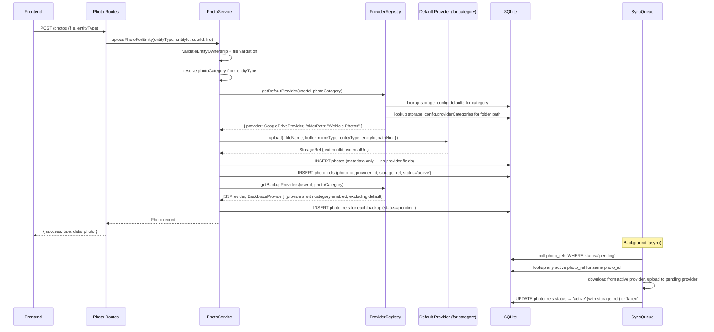
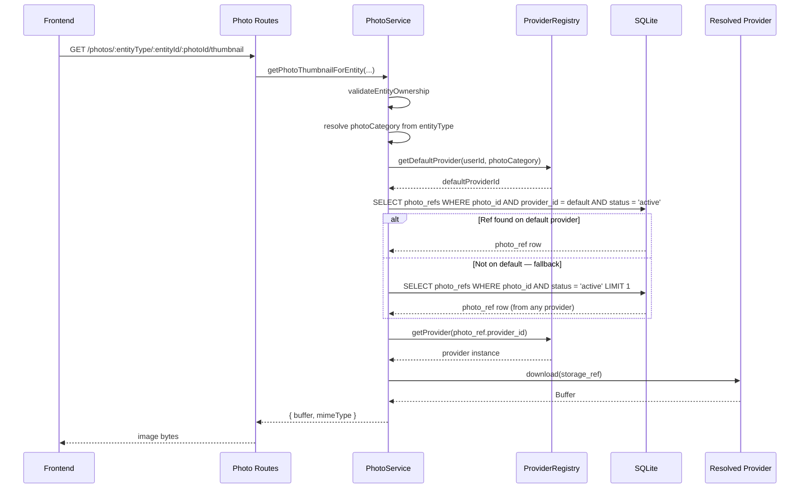

# Design Document: Photo Provider Abstraction

## Overview

The photo system is currently hardcoded to Google Drive at every layer — the database schema stores `driveFileId` and `webViewLink`, the service layer calls `getDriveServiceForUser()` directly, and folder resolution is entirely Google Drive API calls. This design introduces a `StorageProvider` interface that decouples photo storage from any single provider, enabling users to configure multiple storage backends (Google Drive, S3-compatible, OneDrive, etc.) with per-category default providers (for reads/serving) and per-provider category settings (for backup routing and folder paths).

Users choose which provider serves each photo category (vehicle photos, expense receipts, insurance docs) in the app, and configure each provider with category-level enable/disable toggles and folder paths. This gives fine-grained control: e.g., Google Drive serves vehicle photos, Backblaze backs up everything except insurance docs, and each provider organizes files into its own folder structure.

The frontend is already partially decoupled — it proxies all photo access through backend `/thumbnail` endpoints and never talks to Google Drive directly. The abstraction work is primarily backend: introducing the provider interface, generalizing the schema, and building a provider registry. The frontend adds a Photo Storage Settings page under `/settings`.

## Architecture

### Current Architecture

```
Frontend ──→ Backend API (proxy) ──→ GoogleDriveService (concrete class)
                  │                         │
                  ▼                         ▼
            SQLite `photos`           Google Drive API
         (driveFileId, webViewLink)    (OAuth refresh token from users table)
```

- `photo-service.ts` calls `getDriveServiceForUser()` for every operation
- `helpers.ts` resolves Google Drive folder hierarchies per entity type
- `GoogleDriveService` is a concrete class with no interface
- Auth piggybacks on the Google login OAuth token (`users.googleRefreshToken`)
- `photos` table has Google-specific columns: `driveFileId` (NOT NULL), `webViewLink`

### Target Architecture

```
Frontend ──→ Backend API (unchanged proxy pattern)
                  │
                  ▼
            PhotoService (orchestrator)
                  │
                  ▼
         StorageProviderRegistry
          ├── resolve default provider per category ──→ read + write
          └── resolve enabled backup providers per category ──→ async write (fan-out)
                  │
     ┌────────────┼────────────────┐
     ▼            ▼                ▼
GoogleDrive   S3Compat         OneDrive
 Provider     Provider          Provider
```

- `PhotoService` resolves the user's default provider for the photo's category via the registry
- Upload writes to the category's default provider first, then enqueues async copies to other providers that have that category enabled
- Read always goes through the category's default provider
- Each provider implements a common `StorageProvider` interface
- Provider credentials are stored per-user in `user_providers` (domain-agnostic, reusable for LLM/backup/login providers)
- Per-category defaults and per-provider category settings stored in `user_settings.storage_config` JSON

## Sequence Diagrams

### Upload Flow (Category-Based Multi-Provider)



### Read Flow (Fallback Chain)



## Components and Interfaces

### StorageProvider Interface

```typescript
interface StorageProvider {
  readonly type: string; // 'google-drive' | 's3' | 'backblaze' | 'onedrive'

  upload(params: {
    fileName: string;
    buffer: Buffer;
    mimeType: string;
    entityType: string;
    entityId: string;
    pathHint: string; // provider maps this to its storage model (folders, key prefixes, etc.)
  }): Promise<StorageRef>;

  download(ref: StorageRef): Promise<Buffer>;

  delete(ref: StorageRef): Promise<void>;

  getExternalUrl(ref: StorageRef): Promise<string | null>;

  healthCheck(): Promise<boolean>;
}

interface StorageRef {
  providerType: string;
  externalId: string;     // Drive file ID, S3 key, Backblaze file ID, etc.
  externalUrl?: string;   // Web-viewable link if provider supports it
}
```

### StorageProviderRegistry

```typescript
type PhotoCategory = 'vehicle_photos' | 'expense_receipts' | 'insurance_docs';

interface ResolvedProvider {
  provider: StorageProvider;
  providerId: string;
  folderPath: string;  // rootPath (from user_providers.config) + category folderPath (from storage_config)
}

class StorageProviderRegistry {
  /**
   * Get the user's default provider for a photo category.
   * Reads storage_config.defaults from user_settings, then loads the provider from user_providers.
   * Resolves the full folder path from provider.config.rootPath + storage_config.providerCategories[id][category].folderPath.
   */
  async getDefaultProvider(userId: string, category: PhotoCategory): Promise<ResolvedProvider>;

  /**
   * Get all backup providers for a category (providers with category enabled, excluding the default).
   * Reads storage_config.providerCategories, filters to enabled entries, excludes the default.
   */
  async getBackupProviders(userId: string, category: PhotoCategory): Promise<ResolvedProvider[]>;

  /** Get a specific provider by its user_providers row ID (for reads from existing photos) */
  async getProvider(providerId: string): Promise<StorageProvider>;

  /** Get all providers for a user in a given domain (for settings UI) */
  async getProvidersByDomain(userId: string, domain: string): Promise<UserProvider[]>;

  /** Factory: instantiate a StorageProvider from a user_providers row */
  private createProviderInstance(row: UserProvider): StorageProvider;
}
```

### Provider Implementations

**GoogleDriveProvider** — Wraps existing `GoogleDriveService`. Credentials: OAuth refresh token. Preserves current folder structure logic from `helpers.ts` (VROOM/Vehicle Photos/{year make model}/, etc.).

**S3CompatProvider** — Covers AWS S3, Backblaze B2, Cloudflare R2, MinIO. Credentials: endpoint, bucket, region, accessKeyId, secretAccessKey. Path strategy: `{entityType}/{entityId}/{fileName}`.

**OneDriveProvider** (future) — Microsoft Graph API. Credentials: OAuth tokens. Path strategy: `/Apps/VROOM/{entityType}/{entityId}/{fileName}`.

### PhotoService Changes

The existing functions in `photo-service.ts` change from calling `getDriveServiceForUser()` directly to going through the registry with category-based resolution:

```typescript
// Before
const driveService = await getDriveServiceForUser(userId);
const folderId = await resolveEntityDriveFolder(driveService, entityType, entityId, folderName);
const driveFile = await driveService.uploadFile(file.name, buffer, file.type, folderId);

// After
const category = ENTITY_TO_CATEGORY[entityType]; // e.g. 'vehicle_photos'
const { provider, providerId, folderPath } = await providerRegistry.getDefaultProvider(userId, category);
const storageRef = await provider.upload({
  fileName: file.name, buffer, mimeType: file.type,
  entityType, entityId, pathHint: folderPath,
});

// Insert logical photo record (no provider fields)
const photo = await photoRepo.create({ entityType, entityId, fileName, mimeType, fileSize, ... });

// Insert photo_ref for the default provider (active immediately)
await photoRefRepo.create({ photoId: photo.id, providerId, storageRef, status: 'active' });

// Create pending refs for backup providers
const backups = await providerRegistry.getBackupProviders(userId, category);
for (const backup of backups) {
  await photoRefRepo.create({ photoId: photo.id, providerId: backup.providerId, status: 'pending' });
}
```

## Data Models

### Design Principle: One Table for Providers, Settings for Everything Else

Provider connections (credentials, status) need their own table because they're referenced by FKs from `photo_refs`, need row-level encryption, and are queried by domain. But domain-specific preferences (which provider is the default for each photo category, per-provider folder paths) are just user settings — they belong in the existing `user_settings` table as a JSON column.

This means adding a new provider domain later (LLM, backup storage, login) requires zero new tables — just a new JSON column on `user_settings` and a new `domain` value in `user_providers`.

### Photo Categories

```typescript
type PhotoCategory = 'vehicle_photos' | 'expense_receipts' | 'insurance_docs';

const ENTITY_TO_CATEGORY: Record<string, PhotoCategory> = {
  vehicle: 'vehicle_photos',
  expense: 'expense_receipts',
  insurance_policy: 'insurance_docs',
};
```

### New Table: `user_providers`

A single, domain-agnostic table for all provider connections across the app. The `domain` column scopes providers to their use case.

```sql
CREATE TABLE user_providers (
  id            TEXT PRIMARY KEY,
  user_id       TEXT NOT NULL REFERENCES users(id) ON DELETE CASCADE,
  domain        TEXT NOT NULL,  -- 'storage' | 'llm' | 'backup' | ...
  provider_type TEXT NOT NULL,  -- 'google-drive' | 's3' | 'openai' | ...
  display_name  TEXT NOT NULL,  -- User-chosen label ("My Google Drive", "Work S3")
  credentials   TEXT NOT NULL,  -- Encrypted JSON, shape varies by provider_type
  config        TEXT,           -- JSON: non-secret provider config (rootPath, endpoint, bucket, region, etc.)
  status        TEXT NOT NULL DEFAULT 'active',  -- 'active' | 'error' | 'disconnected'
  last_sync_at  INTEGER,
  created_at    INTEGER,
  updated_at    INTEGER
);
CREATE INDEX up_user_domain_idx ON user_providers(user_id, domain);
```

The `config` JSON stores non-secret, provider-type-specific configuration that's safe to return to the frontend:

```typescript
// Google Drive
interface GoogleDriveProviderConfig {
  rootPath: string;       // e.g. "/VROOM"
  accountEmail?: string;  // display only, from OAuth profile
}

// S3-compatible (endpoint, bucket, region are non-secret)
interface S3ProviderConfig {
  rootPath: string;
  endpoint: string;
  bucket: string;
  region: string;
}
```

The `credentials` JSON stores secrets (encrypted at rest, never returned to frontend):

```typescript
// Google Drive
{ refreshToken: string }

// S3-compatible
{ accessKeyId: string; secretAccessKey: string }

// OneDrive
{ accessToken: string; refreshToken: string; expiresAt: number }
```

### Modified Table: `user_settings` — new `storage_config` column

Add a single JSON column to the existing `user_settings` table that holds all photo storage preferences: per-category defaults and per-provider category settings.

```typescript
// New column on user_settings
storageConfig: text('storage_config', { mode: 'json' })
  .$type<StorageConfig>()
  .default(DEFAULT_STORAGE_CONFIG)
```

The JSON shape:

```typescript
interface StorageConfig {
  /** Which provider serves each photo category in the app. null = not configured. */
  defaults: Record<PhotoCategory, string | null>;  // provider ID or null

  /** Per-provider, per-category settings (folder paths, enabled/disabled). Keyed by provider ID. */
  providerCategories: Record<string, Record<PhotoCategory, CategorySetting>>;
}

interface CategorySetting {
  enabled: boolean;
  folderPath: string;  // relative to provider's rootPath
}

const DEFAULT_STORAGE_CONFIG: StorageConfig = {
  defaults: {
    vehicle_photos: null,
    expense_receipts: null,
    insurance_docs: null,
  },
  providerCategories: {},
};
```

Example populated value:

```json
{
  "defaults": {
    "vehicle_photos": "provider-uuid-1",
    "expense_receipts": "provider-uuid-1",
    "insurance_docs": "provider-uuid-2"
  },
  "providerCategories": {
    "provider-uuid-1": {
      "vehicle_photos": { "enabled": true, "folderPath": "/Vehicle Photos" },
      "expense_receipts": { "enabled": true, "folderPath": "/Receipts" },
      "insurance_docs": { "enabled": true, "folderPath": "/Insurance" }
    },
    "provider-uuid-2": {
      "vehicle_photos": { "enabled": true, "folderPath": "/vehicles" },
      "expense_receipts": { "enabled": true, "folderPath": "/receipts" },
      "insurance_docs": { "enabled": false, "folderPath": "/insurance" }
    }
  }
}
```

When a provider is created, its entry in `providerCategories` is auto-populated with all categories enabled and default folder paths. When a provider is deleted, its entry is removed from `providerCategories` and any `defaults` pointing to it are set to `null`.

### Modified Table: `photos` (now purely logical)

The `photos` table becomes provider-agnostic metadata only. All physical location info moves to `photo_refs`.

| Change | Before | After |
|---|---|---|
| Remove column | `drive_file_id` (NOT NULL) | removed — lives in `photo_refs.storage_ref` |
| Remove column | `web_view_link` | removed — lives in `photo_refs.external_url` |
| No provider columns | — | `photos` has no `provider_id` or `storage_ref` |

### New Table: `photo_refs`

Stores where each photo physically lives. One row per photo per provider. Replaces both the old `photos.provider_id`/`storage_ref` columns and the `photo_sync_status` table.

```sql
CREATE TABLE photo_refs (
  id            TEXT PRIMARY KEY,
  photo_id      TEXT NOT NULL REFERENCES photos(id) ON DELETE CASCADE,
  provider_id   TEXT NOT NULL REFERENCES user_providers(id) ON DELETE CASCADE,
  storage_ref   TEXT NOT NULL,    -- Provider-specific: Drive file ID, S3 key, etc.
  external_url  TEXT,             -- Web-viewable link if provider supports it
  status        TEXT NOT NULL DEFAULT 'pending',  -- 'active' | 'pending' | 'failed'
  error_message TEXT,             -- Last error if status = 'failed'
  retry_count   INTEGER NOT NULL DEFAULT 0,
  synced_at     INTEGER,
  created_at    INTEGER
);
CREATE UNIQUE INDEX pr_photo_provider_idx ON photo_refs(photo_id, provider_id);
CREATE INDEX pr_pending_idx ON photo_refs(status) WHERE status IN ('pending', 'failed');
```

Read path (fallback chain):
1. Get the user's default provider for the photo's category from `storage_config.defaults`
2. Look up `photo_refs` WHERE `photo_id = X AND provider_id = default AND status = 'active'`
3. Found → download from that provider using its `storage_ref`
4. Not found → fall back to ANY `photo_refs` WHERE `photo_id = X AND status = 'active'` (first match)
5. Nothing active → photo is orphaned, show placeholder

Write path:
1. Upload to the category's default provider → get back a provider-specific `storage_ref`
2. Insert `photos` row (metadata only — no provider fields)
3. Insert `photo_refs` row for the default provider (status: `active`, `synced_at: now`)
4. For each backup provider with this category enabled, insert `photo_refs` row (status: `pending`)
5. Background worker picks up `pending` rows, downloads from any `active` ref, uploads to the target provider, updates status to `active`

### Default Switch Behavior

When a user changes the default provider for a category:

1. Count photos in that category that don't have an `active` `photo_refs` row on the new provider
2. If gap > 0, show warning: "{N} of {total} photos haven't synced to {provider name} yet. Those photos will still be served from their current provider until sync completes. Switch anyway?"
3. If user confirms (or gap = 0), update `storage_config.defaults` — instant, no photo rows touched
4. The fallback chain ensures all photos remain visible regardless of sync state
5. A "Sync all existing photos" button on the provider card kicks off a backfill: creates `pending` `photo_refs` rows for all photos in enabled categories that don't have a ref on this provider yet

### Sync Progress

Each provider card in the settings UI shows sync progress per category:
- "Vehicle Photos: 423/500 synced" (count of `active` refs vs total photos in category)
- "Expense Receipts: 100/100 synced ✅"
- Failed syncs shown with retry option

### Frontend Type Changes

```typescript
type PhotoCategory = 'vehicle_photos' | 'expense_receipts' | 'insurance_docs';

// Provider as returned by the API (no secrets)
export interface UserProviderInfo {
  id: string;
  domain: string;             // 'storage' | 'llm' | ...
  providerType: string;       // 'google-drive' | 's3' | 'openai' | ...
  displayName: string;
  status: 'active' | 'error' | 'disconnected';
  config: Record<string, unknown>;  // non-secret config (rootPath, endpoint, etc.)
  lastSyncAt?: string;
  createdAt: string;
}

// Storage-specific settings from user_settings.storage_config
export interface StorageConfig {
  defaults: Record<PhotoCategory, string | null>;
  providerCategories: Record<string, Record<PhotoCategory, CategorySetting>>;
}

export interface CategorySetting {
  enabled: boolean;
  folderPath: string;
}

// Photo type (updated — purely logical, no provider fields)
export interface Photo {
  id: string;
  entityType: string;
  entityId: string;
  fileName: string;
  mimeType: string;
  fileSize: number;
  isCover: boolean;
  sortOrder: number;
  createdAt: string;
}

// Photo ref — where a photo physically lives on a provider
export interface PhotoRef {
  id: string;
  photoId: string;
  providerId: string;
  storageRef: string;
  externalUrl?: string;
  status: 'active' | 'pending' | 'failed';
  syncedAt?: string;
}
```

## Settings UI

The Photo Storage Settings page lives under the existing `/settings` route. See `ui-mockup.md` for the full ASCII wireframe.

### Page Structure

The page has two main sections:

1. **Default Photo Sources** — A card at the top with one dropdown per photo category. Each dropdown lists only providers that have that category enabled. If no provider has a category enabled, the dropdown shows "Not configured" and is disabled. This section is the critical one — without defaults set, the app can't serve photos.

2. **Image Providers** — A list of all configured providers for the user, each rendered as an expandable card. Each card shows:
   - Provider icon, display name, edit/delete actions
   - Status badge (connected / error / disconnected) and last sync time
   - Provider-specific settings section (varies by type — OAuth account for Google Drive, endpoint/bucket/region for S3, etc.)
   - Shared folder settings section (if the provider type supports folder paths):
     - Root path text input
     - "Enable All / Disable All" convenience toggle
     - Per-category row: checkbox (enabled/disabled) + folder path text input

An "+ Add Image Provider" button opens a dialog/sheet for creating a new provider.

### Add Provider Dialog

1. Provider type selector (card-style radio group: Google Drive, S3/B2/R2, OneDrive, Dropbox)
2. Display name text input
3. Provider-specific settings (dynamic form based on selected type):
   - S3-compat: endpoint, bucket, region, access key, secret key
   - Google Drive: "Connect Google Account" OAuth button
   - OneDrive: "Connect Microsoft Account" OAuth button
4. Shared folder settings (if provider type supports folder paths):
   - Root path text input
   - Per-category: checkbox + folder path text input
5. "Test Connection" button — calls `healthCheck()` on the backend
6. Cancel / Save buttons

### Frontend Components

| Component | Location | Purpose |
|---|---|---|
| `PhotoStorageSettings.svelte` | `$lib/components/settings/` | Main settings page content |
| `DefaultPhotoSources.svelte` | `$lib/components/settings/` | The per-category default dropdown card |
| `ProviderCard.svelte` | `$lib/components/settings/` | Expandable card for a single configured provider |
| `ProviderFolderSettings.svelte` | `$lib/components/settings/` | Shared folder settings (root path + per-category toggles/paths) |
| `AddProviderDialog.svelte` | `$lib/components/settings/` | Dialog for adding a new provider |
| `S3ProviderForm.svelte` | `$lib/components/settings/` | S3-specific credential fields |
| `GoogleDriveProviderForm.svelte` | `$lib/components/settings/` | Google Drive OAuth connection flow |

## API Endpoints (Provider Management)

All endpoints require `requireAuth` middleware. Credential fields are never returned to the frontend.

### Provider CRUD (domain-agnostic)

| Method | Path | Description |
|---|---|---|
| `GET` | `/api/v1/providers?domain=storage` | List all providers for the authenticated user, filtered by domain (without credentials) |
| `POST` | `/api/v1/providers` | Create a new provider. Body includes `domain`, `providerType`, `displayName`, `credentials`, `config`. Auto-populates `storage_config.providerCategories` entry in user settings if domain is `storage`. |
| `PUT` | `/api/v1/providers/:id` | Update provider display name, config, or credentials |
| `DELETE` | `/api/v1/providers/:id` | Delete a provider. Cleans up `storage_config` references (removes from `providerCategories`, nulls out `defaults` pointing to it). |
| `POST` | `/api/v1/providers/:id/test` | Test connection via `healthCheck()` |

### Storage Config (via existing settings endpoints)

Storage config (defaults + per-provider category settings) is stored in `user_settings.storage_config` and managed through the existing settings API:

| Method | Path | Description |
|---|---|---|
| `GET` | `/api/v1/settings` | Returns all settings including `storageConfig` |
| `PUT` | `/api/v1/settings` | Update settings including `storageConfig` (validated with Zod) |

No separate endpoints needed for defaults or category settings — they're just fields in the settings JSON.

### Response Shapes

```typescript
// GET /api/v1/providers?domain=storage
{
  success: true,
  data: [{
    id: string,
    domain: 'storage',
    providerType: string,
    displayName: string,
    status: 'active' | 'error' | 'disconnected',
    config: { rootPath: string, endpoint?: string, bucket?: string, region?: string },
    lastSyncAt: string | null,
    createdAt: string,
  }]
}

// GET /api/v1/settings (storageConfig portion)
{
  success: true,
  data: {
    // ...existing settings fields...
    storageConfig: {
      defaults: {
        vehicle_photos: "provider-uuid-1" | null,
        expense_receipts: "provider-uuid-1" | null,
        insurance_docs: null,
      },
      providerCategories: {
        "provider-uuid-1": {
          vehicle_photos: { enabled: true, folderPath: "/Vehicle Photos" },
          expense_receipts: { enabled: true, folderPath: "/Receipts" },
          insurance_docs: { enabled: true, folderPath: "/Insurance" },
        }
      }
    }
  }
}
```


## Migration Strategy

### Phase 1 — Introduce Abstraction (Google Drive Only)

- Create `StorageProvider` interface and `GoogleDriveProvider` implementation
- Add `user_providers` table (domain-agnostic)
- Add `photo_refs` table
- Add `storage_config` JSON column to `user_settings`
- Auto-create a Google Drive provider row (domain: `storage`) for each existing user (using their `googleRefreshToken`)
- Auto-populate `storage_config` in user settings: all categories default to the auto-created provider, with default folder paths
- Migrate `photos` table: remove `drive_file_id` and `web_view_link` columns, create `photo_refs` rows from existing data (one ref per photo pointing to the auto-created Google Drive provider, status `active`, `storage_ref` = old `drive_file_id`)
- Refactor `photo-service.ts` to call through the provider interface, resolving provider via `storage_config.defaults` + `photo_refs` fallback chain
- Move folder resolution logic from `helpers.ts` into `GoogleDriveProvider.upload()`
- Build the Photo Storage Settings UI (defaults section + provider list + add/edit provider)
- Build the provider API endpoints (CRUD, domain-filtered)
- Storage config managed through existing settings endpoints
- All existing behavior preserved — just routed through the abstraction

### Phase 2 — Add S3-Compatible Provider

- Implement `S3CompatProvider` (covers AWS S3, Backblaze B2, Cloudflare R2, MinIO)
- Add `S3ProviderForm.svelte` to the Add Provider dialog (endpoint, bucket, region, keys)
- Settings UI already supports multiple providers from Phase 1 — S3 providers appear alongside Google Drive
- User can set S3 as the default for any category, or keep it as backup-only
- User can configure per-category folder paths and enable/disable per category

### Phase 3 — Multi-Provider Fan-Out

- Background sync worker polls `photo_refs` WHERE `status IN ('pending', 'failed')` 
- For each pending ref: download from any `active` ref for the same photo, upload to the target provider, update status to `active` with the new `storage_ref`
- Each backup provider uses its own category-specific folder path from `storage_config.providerCategories`
- Retry with exponential backoff (max 3 attempts), tracked via `photo_refs.retry_count`
- "Sync all existing photos" button on provider cards creates `pending` `photo_refs` rows for photos missing on that provider
- Sync progress shown per category on each provider card in settings UI

### Phase 4 — Additional OAuth Providers

- OneDrive via Microsoft Graph API
- Dropbox (feasible, another OAuth flow)
- iCloud is likely not feasible without a native Apple app

## Provider Tier Classification

| Tier | Providers | Complexity | Auth Model |
|---|---|---|---|
| Tier 1 | AWS S3, Backblaze B2, Cloudflare R2, MinIO | Low — one `S3CompatProvider` covers all | API keys (endpoint + bucket + credentials) |
| Tier 2 | Google Drive | Medium — refactor existing code | OAuth refresh token |
| Tier 3 | OneDrive, Dropbox | Medium — new OAuth flows | OAuth tokens via provider APIs |
| Tier 4 | iCloud | High — no real write API for web apps | Not feasible without native app |

## Key Design Decisions

### 1. Credential Storage

Provider credentials stored as encrypted JSON in `user_providers.credentials`. AES-256-GCM with a server-side encryption key from environment variables. Non-secret config (rootPath, endpoint, bucket, region) lives in the `config` JSON column — this is returned to the frontend for display. Credentials are never returned to the frontend.

Each provider type has a different credential shape:

```typescript
// Google Drive — credentials (encrypted)
{ refreshToken: string }

// S3-compatible — credentials (encrypted)
{ accessKeyId: string; secretAccessKey: string }

// S3-compatible — config (plaintext, returned to frontend)
{ rootPath: string; endpoint: string; bucket: string; region: string }

// OneDrive — credentials (encrypted)
{ accessToken: string; refreshToken: string; expiresAt: number }
```

### 2. Background Sync Approach

Lightweight polling on `photo_refs` table (WHERE `status IN ('pending', 'failed')`) via `setInterval` — no external job queue. SQLite + Bun is single-process, so a simple in-process worker is appropriate. Poll interval: 30 seconds. Max retries: 3 with exponential backoff (30s, 120s, 480s). Retry count tracked on each `photo_refs` row.

### 3. Per-Category Default Provider Model

Each photo category has its own default provider. The default controls both reads and writes:
- New uploads go to the default provider for that category
- Reads prefer the default provider, with fallback to any provider that has the photo
- Switching the default is instant — just a settings change, zero photo rows touched
- When switching to a provider that hasn't synced all photos yet, the user sees a warning with the sync gap count. The fallback chain ensures photos are still visible from the old provider until sync completes.
- A "Sync all existing photos" button on each provider card triggers a backfill job for photos missing on that provider.
- The `user_settings.storage_config.defaults` field enforces one default per category.

### 4. Folder Structure Per Provider (Settings-Driven)

Each provider has a `rootPath` in its config, and each category has a `folderPath` in `storage_config.providerCategories`. The full path is `rootPath + folderPath`. This is configured by the user in the settings UI rather than hardcoded per provider type.

Default folder paths when a provider is created:

| Category | Default folderPath |
|---|---|
| `vehicle_photos` | `/Vehicle Photos` |
| `expense_receipts` | `/Receipts` |
| `insurance_docs` | `/Insurance` |

Default root paths by provider type:

| Provider Type | Default rootPath |
|---|---|
| `google-drive` | `/VROOM` |
| `s3` | `/vroom` |
| `onedrive` | `/Apps/VROOM` |

Providers that don't use folder paths (e.g., a future Google Photos API provider) set `supportsFolderPaths: false` in their implementation, and the UI hides the folder settings section for them.

### 5. Separate OAuth Connections

Yes — users can connect a Google Drive account different from their login account. The `user_providers` table holds its own credentials independent of `users.googleRefreshToken`. Phase 1 auto-creates a provider row from the login token, but users can add additional Google accounts later.

## Error Handling

### Provider Upload Failure (Primary)

Upload to primary fails → throw error immediately, no photo record created. Frontend shows upload error with retry.

### Provider Upload Failure (Secondary — Phase 3)

Secondary upload fails → `photo_refs` row status set to `'failed'` with error message. Retried on next poll cycle. After max retries, status stays `'failed'` — surfaced in settings UI. The photo remains accessible via any other provider that has an `active` ref.

### Provider Health Check Failure

`healthCheck()` returns false → provider `status` set to `'error'` in `user_providers`. If the unhealthy provider is the default for a category, uploads for that category fail with a clear error message suggesting the user check their provider configuration. Secondary failures are logged and retried.

### Provider Credential Expiry (OAuth)

OAuth token refresh fails → provider `status` set to `'disconnected'`. User prompted to re-authenticate. For Google Drive (login account), this may require re-login. For separately connected accounts, a dedicated re-auth flow.

## Security Considerations

- Credentials encrypted at rest (AES-256-GCM) — never stored in plaintext
- Encryption key from environment variable, not hardcoded
- S3 credentials (access keys) are particularly sensitive — consider supporting IAM roles as an alternative for AWS deployments
- Provider configuration endpoints require `requireAuth` middleware
- Users can only access their own providers — ownership validation on all provider CRUD operations
- Credential JSON never returned to the frontend — API returns provider metadata (type, displayName, status) without secrets

## Performance Considerations

- Read path unchanged — single provider lookup + download, same as current Google Drive flow
- Upload path adds one DB query (provider lookup) — negligible overhead
- Multi-provider fan-out (Phase 3) is fully async — no impact on upload response time
- Provider instances can be cached per-request or with short TTL to avoid repeated credential decryption
- Background sync worker is lightweight — single `setInterval` polling a small table

## Dependencies

### Existing (No New Packages for Phase 1)
- Drizzle ORM — schema + migrations for new tables
- Google APIs (`googleapis`) — already used, wrapped in `GoogleDriveProvider`

### New (Phase 2)
- `@aws-sdk/client-s3` — S3-compatible provider implementation

### New (Phase 4)
- `@microsoft/microsoft-graph-client` — OneDrive provider (future)
