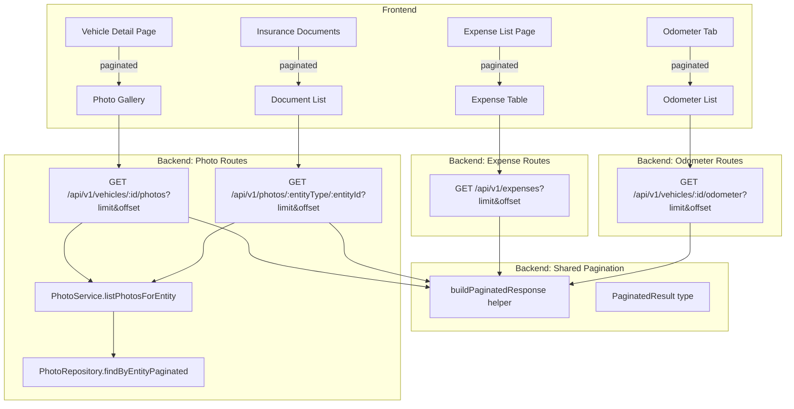
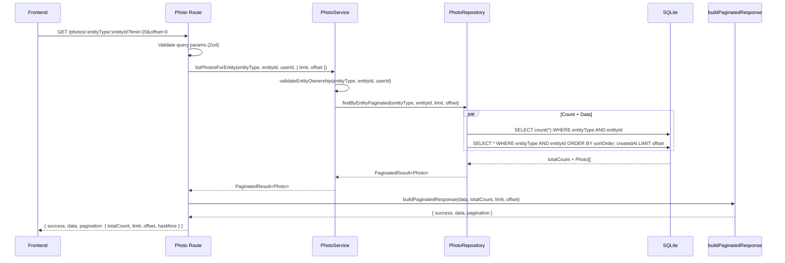
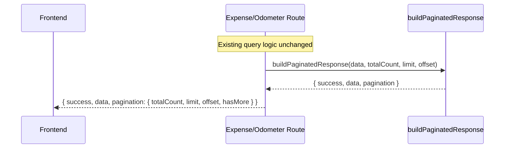

# Design Document: Unified Pagination Response Format

## Overview

This feature unifies the pagination response format across all paginated API endpoints. The photos API currently returns all photos for an entity in a single unbounded query — this adds `limit`/`offset` pagination. Additionally, the expenses and odometer endpoints already support pagination but use a flat response shape with `totalCount`, `limit`, `offset`, and `hasMore` at the top level. All three endpoint groups will migrate to a nested `pagination` object for consistency.

The flat shape `{ success, data, totalCount, limit, offset, hasMore }` becomes `{ success, data, pagination: { totalCount, limit, offset, hasMore } }`. A shared backend helper `buildPaginatedResponse()` constructs this envelope so every paginated endpoint produces an identical structure. The frontend `PaginatedResponse<T>` type and all consuming code (API services, components) update to read from `response.pagination.*` instead of `response.totalCount` etc.

## Architecture



## Sequence Diagrams

### Paginated Photo List Flow



### Refactored Expense/Odometer Flow (response shape change only)



## Components and Interfaces

### Component 1: Shared Pagination Helper (NEW)

**Purpose**: Single function that constructs the unified pagination response envelope. Used by all paginated routes.

**Interface**:
```typescript
// backend/src/utils/pagination.ts

interface PaginationMeta {
  totalCount: number;
  limit: number;
  offset: number;
  hasMore: boolean;
}

interface PaginatedResult<T> {
  data: T[];
  totalCount: number;
}

interface PaginatedApiResponse<T> {
  success: true;
  data: T[];
  pagination: PaginationMeta;
}

function buildPaginatedResponse<T>(
  data: T[],
  totalCount: number,
  limit: number,
  offset: number
): PaginatedApiResponse<T>
```

**Responsibilities**:
- Compute `hasMore` as `offset + data.length < totalCount`
- Return the nested `pagination` object shape
- Ensure consistent structure across all endpoints

### Component 2: PhotoRepository.findByEntityPaginated (NEW)

**Purpose**: Paginated query method that returns a page of photos plus `totalCount` for a given entity.

**Interface**:
```typescript
async findByEntityPaginated(
  entityType: string,
  entityId: string,
  limit: number,
  offset: number
): Promise<PaginatedResult<Photo>>
```

**Responsibilities**:
- Execute a count query and a data query against the photos table
- Filter by entityType + entityId (uses existing composite index)
- Maintain existing sort order: sortOrder ASC, createdAt ASC
- Apply LIMIT and OFFSET to the data query

### Component 3: PhotoService.listPhotosForEntity (updated)

**Purpose**: Updated to accept optional pagination params and delegate to the paginated repository method.

**Interface**:
```typescript
interface PaginationParams {
  limit?: number;
  offset?: number;
}

async function listPhotosForEntity(
  entityType: string,
  entityId: string,
  userId: string,
  pagination?: PaginationParams
): Promise<PaginatedResult<Photo>>
```

**Responsibilities**:
- Validate entity ownership (unchanged)
- Clamp limit to CONFIG.pagination bounds
- Delegate to repository's paginated method

### Component 4: Photo Routes (updated)

**Purpose**: Both the generic photo routes and vehicle photo routes add query param validation and return the nested pagination envelope via `buildPaginatedResponse`.

**Interface**:
```typescript
// Response shape:
{
  success: true,
  data: Photo[],
  pagination: {
    totalCount: number,
    limit: number,
    offset: number,
    hasMore: boolean
  }
}
```

### Component 5: Expense Routes (refactored response shape)

**Purpose**: Existing expense list route changes from flat pagination fields to nested `pagination` object using `buildPaginatedResponse`.

**Before**:
```typescript
return c.json({ success: true, data, totalCount, limit, offset, hasMore });
```

**After**:
```typescript
return c.json(buildPaginatedResponse(data, totalCount, limit, offset));
```

### Component 6: Odometer Routes (refactored response shape)

**Purpose**: Same refactor as expenses — replace flat fields with `buildPaginatedResponse`.

### Component 7: Frontend PaginatedResponse Type (updated)

**Purpose**: Update the generic frontend type to match the nested response shape.

**Before**:
```typescript
export interface PaginatedResponse<T> {
  data: T[];
  totalCount: number;
  limit: number;
  offset: number;
  hasMore: boolean;
}
```

**After**:
```typescript
export interface PaginationMeta {
  totalCount: number;
  limit: number;
  offset: number;
  hasMore: boolean;
}

export interface PaginatedResponse<T> {
  data: T[];
  pagination: PaginationMeta;
}
```

### Component 8: Frontend API Services (updated)

**Purpose**: Update `expense-api.ts`, `odometer-api.ts`, and photo-related API methods to read from `result.pagination.*` instead of flat fields.

**Before** (expense-api example):
```typescript
const result = await apiClient.raw(...);
return { data: ..., totalCount: result.totalCount, limit: result.limit, offset: result.offset, hasMore: result.hasMore };
```

**After**:
```typescript
const result = await apiClient.raw(...);
return { data: ..., pagination: result.pagination };
```

## Data Models

### Existing: Photo (no schema changes)

No changes to the photos table schema. The existing composite index on (entity_type, entity_id) supports the paginated query efficiently.

### New: PaginatedResult<T> (backend)

```typescript
// backend/src/utils/pagination.ts
interface PaginatedResult<T> {
  data: T[];
  totalCount: number;
}
```

### Updated: PaginatedResponse<T> (frontend)

```typescript
// frontend/src/lib/types.ts
interface PaginationMeta {
  totalCount: number;
  limit: number;
  offset: number;
  hasMore: boolean;
}

interface PaginatedResponse<T> {
  data: T[];
  pagination: PaginationMeta;
}
```

## Key Functions with Formal Specifications

### Function 1: buildPaginatedResponse()

```typescript
function buildPaginatedResponse<T>(
  data: T[],
  totalCount: number,
  limit: number,
  offset: number
): PaginatedApiResponse<T>
```

**Preconditions:**
- `data` is an array (may be empty)
- `totalCount` is a non-negative integer
- `limit` is a positive integer
- `offset` is a non-negative integer

**Postconditions:**
- `result.success === true`
- `result.data === data`
- `result.pagination.totalCount === totalCount`
- `result.pagination.limit === limit`
- `result.pagination.offset === offset`
- `result.pagination.hasMore === (offset + data.length < totalCount)`

### Function 2: findByEntityPaginated()

```typescript
async findByEntityPaginated(
  entityType: string,
  entityId: string,
  limit: number,
  offset: number
): Promise<PaginatedResult<Photo>>
```

**Preconditions:**
- `entityType` is a non-empty string
- `entityId` is a non-empty string
- `limit` is a positive integer, already clamped to `[1, CONFIG.pagination.maxPageSize]`
- `offset` is a non-negative integer

**Postconditions:**
- `result.data.length <= limit`
- `result.totalCount` equals the total number of photos matching (entityType, entityId)
- `result.data` is ordered by sortOrder ASC, createdAt ASC
- If `offset >= totalCount`, `result.data` is empty
- No side effects on the database

### Function 3: clampPagination()

```typescript
function clampPagination(pagination?: { limit?: number; offset?: number }): { limit: number; offset: number }
```

**Postconditions:**
- `minPageSize <= result.limit <= maxPageSize`
- `result.offset >= 0`
- `result.limit === min(max(requested ?? defaultPageSize, minPageSize), maxPageSize)`

## Algorithmic Pseudocode

### buildPaginatedResponse Algorithm

```typescript
function buildPaginatedResponse<T>(
  data: T[],
  totalCount: number,
  limit: number,
  offset: number
): PaginatedApiResponse<T> {
  return {
    success: true,
    data,
    pagination: {
      totalCount,
      limit,
      offset,
      hasMore: offset + data.length < totalCount,
    },
  };
}
```

### findByEntityPaginated Algorithm

```typescript
async findByEntityPaginated(
  entityType: string,
  entityId: string,
  limit: number,
  offset: number
): Promise<PaginatedResult<Photo>> {
  const whereClause = and(
    eq(photos.entityType, entityType),
    eq(photos.entityId, entityId)
  );

  const [countResult] = await this.db
    .select({ count: sql<number>`count(*)` })
    .from(photos)
    .where(whereClause);

  const totalCount = countResult?.count ?? 0;

  const data = await this.db
    .select()
    .from(photos)
    .where(whereClause)
    .orderBy(asc(photos.sortOrder), asc(photos.createdAt))
    .limit(limit)
    .offset(offset);

  return { data, totalCount };
}
```

## Example Usage

```typescript
// Backend: Any paginated route using the shared helper
import { buildPaginatedResponse } from '../utils/pagination';

// Photo route
const result = await listPhotosForEntity(entityType, entityId, user.id, { limit, offset });
return c.json(buildPaginatedResponse(result.data, result.totalCount, limit, offset));

// Expense route (refactored)
return c.json(buildPaginatedResponse(expenses, totalCount, limit, offset));

// Odometer route (refactored)
return c.json(buildPaginatedResponse(entries, totalCount, limit, offset));

// Frontend: Reading nested pagination
const response = await vehicleApi.getPhotos(vehicleId, { limit: 20, offset: 0 });
console.log(response.pagination.totalCount);
console.log(response.pagination.hasMore);
```

## Correctness Properties

### Property 1: Pagination Completeness

*For any* set of records belonging to a paginated endpoint and *for any* valid page size, iterating all pages (incrementing offset by the page size) should yield exactly `pagination.totalCount` unique records with no duplicates and no gaps.

**Validates: Requirements 1.1, 5.1, 9.1**

### Property 2: TotalCount Accuracy

*For any* entity with N records and *for any* valid (limit, offset) pair, `pagination.totalCount` in the response should always equal N regardless of the pagination parameters used.

**Validates: Requirements 1.2, 4.1**

### Property 3: HasMore Correctness

*For any* paginated response, `pagination.hasMore` should be `true` if and only if `pagination.offset + data.length < pagination.totalCount`.

**Validates: Requirements 4.2**

### Property 4: Limit Clamping

*For any* requested limit value (including omitted), the effective limit should equal `min(max(requested ?? defaultPageSize, minPageSize), maxPageSize)`.

**Validates: Requirements 3.1, 3.2, 3.3**

### Property 5: Sort Order Preservation

*For any* paginated photo query result, the returned photos should be ordered by sortOrder ascending then createdAt ascending, consistent with the unpaginated sort order.

**Validates: Requirements 1.3**

### Property 6: Page Size Bound

*For any* paginated query with a given limit, the number of returned records should be at most `limit`.

**Validates: Requirements 1.1**

### Property 7: Invalid Parameter Rejection

*For any* limit that is negative, non-integer, or exceeds the maximum, or *for any* offset that is negative or non-integer, the route should reject the request with HTTP 400.

**Validates: Requirements 2.1, 2.2, 2.3**

### Property 8: Unified Response Shape

*For any* paginated endpoint (photos, expenses, odometer), the response body should contain `success`, `data`, and `pagination` at the top level, with `pagination` containing exactly `totalCount`, `limit`, `offset`, and `hasMore`. No flat pagination fields should exist at the top level.

**Validates: Requirements 4.1, 9.1, 10.1**

### Property 9: Helper Idempotence

*For any* inputs (data, totalCount, limit, offset), `buildPaginatedResponse` should produce the same output when called with the same inputs, and the output should always conform to the `PaginatedApiResponse<T>` shape.

**Validates: Requirements 9.2**

## Error Handling

### Error Scenario 1: Invalid Pagination Parameters
**Condition**: `limit` or `offset` is negative, non-integer, or exceeds bounds
**Response**: Zod validation rejects with 400 before reaching the service layer
**Recovery**: Client corrects parameters

### Error Scenario 2: Offset Beyond Total Count
**Condition**: `offset >= totalCount`
**Response**: Returns `{ success: true, data: [], pagination: { totalCount: N, hasMore: false, ... } }` — not an error
**Recovery**: Client adjusts offset or navigates to a valid page

### Error Scenario 3: Entity Not Found / Not Owned
**Condition**: entityType + entityId doesn't exist or isn't owned by the user
**Response**: `NotFoundError` → 404 via global error handler
**Recovery**: Client handles 404

## Testing Strategy

### Unit Testing Approach
- Test `buildPaginatedResponse` produces correct nested shape for various inputs
- Test `findByEntityPaginated` with known data: verify data length, totalCount, sort order
- Test limit clamping: values below min, above max, default when omitted
- Test offset beyond total returns empty data with correct totalCount

### Property-Based Testing Approach
- **Library**: fast-check
- Generate random (limit, offset) pairs against a seeded record set
- Verify: `buildPaginatedResponse` always produces valid nested shape
- Verify: `hasMore` correctness for all (offset, data.length, totalCount) combinations
- Verify: iterating all pages yields exactly totalCount items, no duplicates

### Integration Testing Approach
- Test all three endpoint groups (photos, expenses, odometer) return nested `pagination` object
- Verify no flat pagination fields exist at the top level of any response
- Verify backward compatibility: requests without pagination params return paginated envelope with defaults

## Performance Considerations

- The existing composite index on `(entity_type, entity_id)` covers photo count and data queries efficiently
- Expense and odometer routes already have pagination — only the response shape changes, no query changes
- No schema migration required — this is a pure application-layer change

## Dependencies

- Existing: Hono, Drizzle ORM, Zod, `CONFIG.pagination` settings
- Existing: `commonSchemas.pagination` from `backend/src/utils/validation.ts`
- No new external dependencies required
