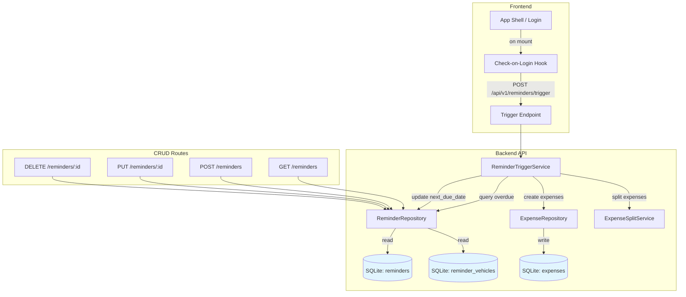
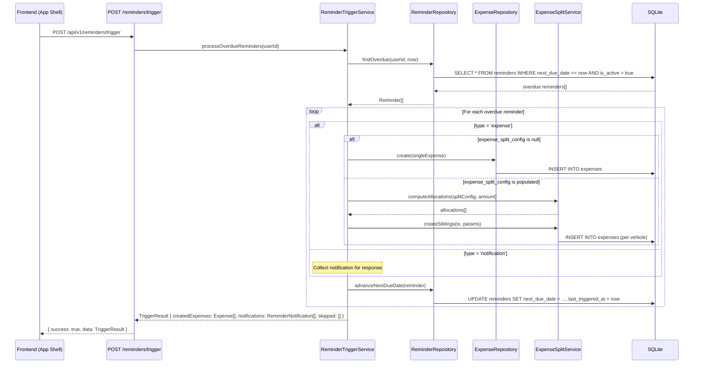
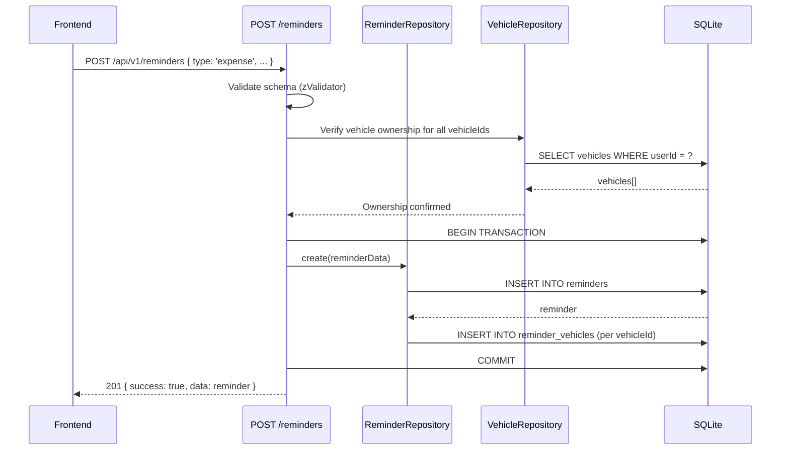

# Design Document: Reminders & Recurring Expenses

## Overview

This feature adds a unified reminders system that serves two purposes: pure notification reminders and recurring expense automation. A reminder is a scheduling container with a configurable frequency. When the reminder's type is `expense`, it automatically creates expense records (including split expenses) when triggered. When the type is `notification`, it simply surfaces an alert to the user.

The execution model is "check-on-login": when the user opens the app, the system checks for overdue reminders and processes them. No background cron or job infrastructure is needed. This keeps the architecture simple and aligns with the personal finance tool's usage pattern — expenses only get created when the user is actively using the app.

Future extensibility is built in via the `action_mode` field (only `automatic` implemented now) and a planned `reminder_calendar_refs` table for calendar provider sync (not built now, but the schema is designed to be purely additive).

## Architecture



## Sequence Diagrams

### Check-on-Login Flow



### Create Reminder (Expense Type)



## Components and Interfaces

### Component 1: ReminderRepository

**Purpose**: Data access layer for reminders, reminder_vehicles junction, and due-date queries.

```typescript
interface ReminderWithVehicles {
  reminder: Reminder;
  vehicleIds: string[];
}

class ReminderRepository extends BaseRepository<Reminder, NewReminder> {
  findByUserId(userId: string): Promise<Reminder[]>;
  findByIdAndUserId(id: string, userId: string): Promise<ReminderWithVehicles | null>;
  findOverdue(userId: string, now: Date): Promise<ReminderWithVehicles[]>;
  findByVehicleId(vehicleId: string, userId: string): Promise<Reminder[]>;
  createWithVehicles(data: NewReminder, vehicleIds: string[]): Promise<ReminderWithVehicles>;
  updateWithVehicles(id: string, userId: string, data: Partial<NewReminder>, vehicleIds?: string[]): Promise<ReminderWithVehicles>;
  advanceNextDueDate(id: string, expectedCurrentDueDate: Date, nextDueDate: Date): Promise<void>;
  // Transactional variant with optimistic locking — used by trigger to prevent double-processing.
  // WHERE next_due_date = expectedCurrentDueDate ensures concurrent trigger calls don't both advance.
  // lastTriggeredAt is set to the `now` captured at the start of processOverdueReminders (Req 3.11).
  advanceNextDueDateTx(tx: DrizzleTransaction, id: string, expectedCurrentDueDate: Date, nextDueDate: Date, lastTriggeredAt: Date): Promise<void>;
  deactivate(id: string): Promise<void>;
}
```

**Responsibilities**:
- CRUD operations on reminders table
- Managing reminder_vehicles junction rows within transactions
- Querying overdue reminders by next_due_date
- Advancing next_due_date after trigger (with optimistic locking for concurrency safety)
- `updateWithVehicles` syncs both the reminder fields AND the junction table in a single transaction, ensuring `expenseSplitConfig` vehicle references and `reminder_vehicles` rows never drift

### Component 2: ReminderTriggerService

**Purpose**: Orchestrates the check-on-login flow — finds overdue reminders, creates expenses, advances due dates.

```typescript
interface TriggerResult {
  createdExpenses: Expense[];
  notifications: ReminderNotification[];
  skipped: Array<{ reminderId: string; reason: string; message?: string }>;
}

class ReminderTriggerService {
  processOverdueReminders(userId: string): Promise<TriggerResult>;
}
```

**Responsibilities**:
- Query overdue reminders for a user
- For expense-type reminders: create single or split expenses using existing ExpenseSplitService, setting `sourceType = 'reminder'` and `sourceId = reminder.id` on created expenses
- For notification-type reminders: create persistent `reminder_notifications` rows (isRead = false)
- Advance next_due_date for each processed reminder
- Handle edge cases: vehicle deleted since reminder created, end_date reached
- Skip reminders where all vehicles have been deleted (cascade removed junction rows)

### Component 3: Reminder Routes

**Purpose**: Hono route handlers for CRUD and trigger endpoint.

```typescript
// Routes mounted at /api/v1/reminders
// All routes use requireAuth + changeTracker middleware

POST   /                  // Create reminder
GET    /                  // List reminders (query params: ?vehicleId=xxx, ?type=expense, ?isActive=true)
GET    /:id               // Get single reminder (includes vehicleIds)
PUT    /:id               // Update reminder
DELETE /:id               // Delete reminder
POST   /trigger           // Check-on-login: process overdue reminders
GET    /notifications     // List unread notifications (?unreadOnly=true)
PUT    /notifications/:id/read  // Mark a notification as read (ownership: WHERE id = ? AND user_id = ?)
```

**Filtering**: Vehicle-scoped listing uses query parameters (`GET /reminders?vehicleId=xxx`), consistent with the existing expense routes pattern (`GET /expenses?vehicleId=xxx`). No nested `/vehicle/:vehicleId` route.

**Rate limiting**: The trigger endpoint should have its own rate limit config (e.g., 10 calls per 15 minutes) since it's write-heavy. Add `CONFIG.rateLimit.trigger` alongside the existing auth/sync/backup limits.

## Data Models

### Table: reminders

```typescript
export const reminders = sqliteTable(
  'reminders',
  {
    id: text('id').primaryKey().$defaultFn(() => createId()),
    userId: text('user_id').notNull().references(() => users.id, { onDelete: 'cascade' }),
    name: text('name').notNull(),
    description: text('description'),
    type: text('type').notNull(), // 'expense' | 'notification'
    actionMode: text('action_mode').notNull().default('automatic'), // 'automatic' | 'requires_confirmation'
    frequency: text('frequency').notNull(), // 'weekly' | 'monthly' | 'yearly' | 'custom'
    intervalValue: integer('interval_value'), // for custom: e.g. 3
    intervalUnit: text('interval_unit'), // 'day' | 'week' | 'month' | 'year'
    startDate: integer('start_date', { mode: 'timestamp' }).notNull(),
    endDate: integer('end_date', { mode: 'timestamp' }), // null = runs forever
    nextDueDate: integer('next_due_date', { mode: 'timestamp' }).notNull(),
    expenseCategory: text('expense_category'),
    expenseTags: text('expense_tags', { mode: 'json' }).$type<string[]>(),
    expenseAmount: real('expense_amount'), // total amount, required when type='expense' + actionMode='automatic'
    expenseDescription: text('expense_description'),
    expenseSplitConfig: text('expense_split_config', { mode: 'json' }),
    // Type: { method: 'even', vehicleIds: string[] }
    //      | { method: 'absolute', allocations: { vehicleId: string, amount: number }[] }
    //      | { method: 'percentage', allocations: { vehicleId: string, percentage: number }[] }
    // NOTE: Do NOT import SplitConfig from api/expenses/validation.ts into schema.ts —
    // that reverses the dependency direction (db → api). Use a raw JSON column here and
    // define a ReminderSplitConfig type in db/types.ts that mirrors the SplitConfig shape.
    // Cast at the repository layer when reading/writing.
    isActive: integer('is_active', { mode: 'boolean' }).notNull().default(true),
    lastTriggeredAt: integer('last_triggered_at', { mode: 'timestamp' }),
    createdAt: integer('created_at', { mode: 'timestamp' }).$defaultFn(() => new Date()),
    updatedAt: integer('updated_at', { mode: 'timestamp' }).$defaultFn(() => new Date()),
  },
  (table) => ({
    // Optimal for the overdue query: WHERE user_id = ? AND is_active = true AND next_due_date <= now
    userActiveDueIdx: index('reminders_user_active_due_idx').on(table.userId, table.isActive, table.nextDueDate),
  })
);
```

**Validation Rules**:
- `name` is required, max 100 chars
- `type` must be `'expense'` or `'notification'`
- `actionMode` must be `'automatic'` (only value accepted for now)
- `frequency` must be `'weekly'` | `'monthly'` | `'yearly'` | `'custom'`
- When `frequency` is `'custom'`: `intervalValue` (positive int) and `intervalUnit` are required
- When `type` is `'expense'` and `actionMode` is `'automatic'`: `expenseAmount` is required and positive
- `expenseCategory` must be a valid ExpenseCategory when provided
- `startDate` is required; `nextDueDate` defaults to `startDate` on creation
- `endDate` must be after `startDate` when provided
- `vehicleIds` (at least one) required for expense-type reminders
- When `expenseSplitConfig` is provided, the vehicle IDs within the split config must exactly match the provided `vehicleIds` array (enforced at validation layer to prevent drift between junction table and split config)
- `actionMode` validation uses `z.literal('automatic')` (not enum) to reject `'requires_confirmation'` until implemented

### Table: reminder_vehicles (junction)

```typescript
export const reminderVehicles = sqliteTable(
  'reminder_vehicles',
  {
    reminderId: text('reminder_id').notNull().references(() => reminders.id, { onDelete: 'cascade' }),
    vehicleId: text('vehicle_id').notNull().references(() => vehicles.id, { onDelete: 'cascade' }),
  },
  (table) => ({
    pk: primaryKey({ columns: [table.reminderId, table.vehicleId] }),
    vehicleIdx: index('rv_vehicle_idx').on(table.vehicleId),
  })
);
```

- Single-vehicle reminders have one row; split reminders have multiple
- Vehicle cascade delete removes junction rows automatically
- Trigger logic checks remaining vehicles before firing — if all vehicles deleted, skip the reminder

### Expense Source Tracking (change to existing `expenses` table)

Two nullable columns added to the existing `expenses` table for generic provenance tracking. Any system that auto-creates expenses sets these; manual expenses leave both null.

```typescript
// Added to the existing expenses table definition in schema.ts:
// After the existing groupId/groupTotal/splitMethod columns:
sourceType: text('source_type'), // nullable — 'reminder' | 'import' | 'api' | ... (extensible)
sourceId: text('source_id'),     // nullable — the ID of the source entity (e.g., reminder ID)
```

**Index**: `(source_type, source_id)` — enables efficient "show all expenses from this reminder" queries. Add to the expenses table index config:

```typescript
// Add to the existing expenses table indexes:
sourceIdx: index('expenses_source_idx').on(table.sourceType, table.sourceId),
```

**Query patterns**:
- All expenses from a specific reminder: `WHERE source_type = 'reminder' AND source_id = ?`
- All auto-created expenses: `WHERE source_type IS NOT NULL`
- All manual expenses: `WHERE source_type IS NULL`

This is the SQL-native equivalent of a composite key like `REMINDER#id` — two columns give clean indexing, type safety, and no string parsing at query time. The `source_type` column is extensible: future systems (CSV import, API integrations) just use their own type value.

**Migration note**: Since the project is not yet in production, these columns are added directly to the schema and the migration is regenerated from scratch (see Migration Sequence below). No incremental `ALTER TABLE` needed.

**Validation note**: `sourceType` and `sourceId` are server-set-only fields. The expense creation/update Zod schemas must explicitly `.omit()` or `.strip()` these fields so users cannot set them via the API. Only the trigger service sets them internally.

### Table: reminder_notifications (persistent notification state)

```typescript
export const reminderNotifications = sqliteTable(
  'reminder_notifications',
  {
    id: text('id').primaryKey().$defaultFn(() => createId()),
    reminderId: text('reminder_id').notNull()
      .references(() => reminders.id, { onDelete: 'cascade' }),
    userId: text('user_id').notNull()
      .references(() => users.id, { onDelete: 'cascade' }),
    dueDate: integer('due_date', { mode: 'timestamp' }).notNull(), // the period this notification is for
    isRead: integer('is_read', { mode: 'boolean' }).notNull().default(false),
    createdAt: integer('created_at', { mode: 'timestamp' }).$defaultFn(() => new Date()),
    updatedAt: integer('updated_at', { mode: 'timestamp' }).$defaultFn(() => new Date()),
  },
  (table) => ({
    userUnreadIdx: index('rn_user_unread_idx').on(table.userId, table.isRead),
    // Safety net: prevents duplicate notifications for the same reminder + period
    // (optimistic locking should already prevent this, but belt-and-suspenders)
    // Also serves as the reminder_id lookup index (leftmost prefix)
    reminderDueIdx: uniqueIndex('rn_reminder_due_idx').on(table.reminderId, table.dueDate),
  })
);
```

- Created by the trigger service when a notification-type reminder fires
- `isRead` defaults to `false` — frontend marks as read via `PUT /reminders/notifications/:id/read`
- `dueDate` records which period triggered the notification (for display: "Tire pressure check was due Jan 15")
- Cascade delete on reminder: deleting a reminder cleans up its notifications
- The `(user_id, is_read)` index supports the "unread notifications" badge query: `WHERE user_id = ? AND is_read = false`

### Type Exports

All new types must be exported from `backend/src/db/schema.ts` and re-exported from `backend/src/types.ts`:

```typescript
export type Reminder = typeof reminders.$inferSelect;
export type NewReminder = typeof reminders.$inferInsert;

export type ReminderVehicle = typeof reminderVehicles.$inferSelect;
export type NewReminderVehicle = typeof reminderVehicles.$inferInsert;

export type ReminderNotification = typeof reminderNotifications.$inferSelect;
export type NewReminderNotification = typeof reminderNotifications.$inferInsert;
```

</text>
</invoke>

### Future Table: reminder_calendar_refs (NOT built now)

```typescript
// ─── FUTURE: Calendar Integration ───────────────────────────────────────
// This table follows the same pattern as photo_refs for multi-provider sync.
// It will be purely additive — no changes to existing tables needed.
//
// Example schema (for reference only, not created in migration):
//
// export const reminderCalendarRefs = sqliteTable(
//   'reminder_calendar_refs',
//   {
//     id: text('id').primaryKey().$defaultFn(() => createId()),
//     reminderId: text('reminder_id').notNull()
//       .references(() => reminders.id, { onDelete: 'cascade' }),
//     providerId: text('provider_id').notNull()
//       .references(() => userProviders.id, { onDelete: 'cascade' }),
//     externalEventId: text('external_event_id'),
//     status: text('status').notNull().default('pending'), // 'pending' | 'synced' | 'failed'
//     errorMessage: text('error_message'),
//     lastSyncedAt: integer('last_synced_at', { mode: 'timestamp' }),
//     createdAt: integer('created_at', { mode: 'timestamp' }).$defaultFn(() => new Date()),
//   },
//   (table) => ({
//     reminderProviderIdx: uniqueIndex('rcr_reminder_provider_idx')
//       .on(table.reminderId, table.providerId),
//   })
// );
//
// Calendar providers would use the existing user_providers table:
//   domain: 'calendar'
//   providerType: 'google-calendar' | 'outlook' | 'apple-calendar'
//
// The sync flow would mirror photo_refs:
//   1. User connects calendar provider → row in user_providers (domain='calendar')
//   2. Reminder created/updated → pending row in reminder_calendar_refs
//   3. Sync worker picks up pending refs → creates/updates external calendar events
//   4. Status transitions: pending → synced | failed
//
// This is purely additive: no schema changes to reminders or user_providers needed.
// ────────────────────────────────────────────────────────────────────────
```

## Key Functions with Formal Specifications

### Function 1: computeNextDueDate()

```typescript
function computeNextDueDate(
  currentDueDate: Date,
  frequency: ReminderFrequency,
  intervalValue?: number,
  intervalUnit?: IntervalUnit,
  anchorDay?: number // day-of-month from startDate, used for month/year to prevent drift
): Date
```

**Preconditions:**
- `currentDueDate` is a valid Date
- `frequency` is one of `'weekly'` | `'monthly'` | `'yearly'` | `'custom'`
- When `frequency` is `'custom'`: `intervalValue` is a positive integer and `intervalUnit` is defined
- When `frequency` involves month/year advancement: `anchorDay` is provided (1-31, derived from reminder's `startDate`)

**Postconditions:**
- Returns a Date strictly after `currentDueDate`
- For `'weekly'`: returns `currentDueDate + 7 days`
- For `'monthly'`: returns `currentDueDate + 1 month`, with day-of-month set to `min(anchorDay, lastDayOfTargetMonth)` — prevents permanent drift after short months (e.g., Jan 31 → Feb 28 → Mar 31, not Mar 28)
- For `'yearly'`: returns `currentDueDate + 1 year`, with day-of-month set to `min(anchorDay, lastDayOfTargetMonth)` for leap year edge cases
- For `'custom'`: returns `currentDueDate + intervalValue * intervalUnit`, with anchor-day clamping for month/year units
- No side effects on input

**Loop Invariants:** N/A

### Function 2: processOverdueReminders()

```typescript
async function processOverdueReminders(userId: string): Promise<TriggerResult>
```

**Preconditions:**
- `userId` is a valid, authenticated user ID
- Database connection is available

**Postconditions:**
- All reminders where `next_due_date <= now` AND `is_active = true` for the user are processed
- For each expense-type reminder with remaining vehicles: exactly one expense (or split group) is created per overdue occurrence, with `sourceType = 'reminder'` and `sourceId = reminder.id`
- For each notification-type reminder: persistent `reminder_notifications` rows created with `isRead = false`, one per overdue period (subject to catch-up limit)
- Each processed reminder has `next_due_date` advanced and `last_triggered_at` set to now
- Reminders past their `end_date` are deactivated (`is_active = false`)
- Reminders with no remaining vehicles (all cascade-deleted) are skipped and included in `skipped` array
- If a reminder is overdue by multiple periods, it catches up by creating one expense/notification per missed period, up to `CONFIG.validation.reminder.maxCatchUpOccurrences`

**Loop Invariants:**
- After processing reminder `i`, reminders `0..i` all have `next_due_date > now` or `is_active = false`
- Total created expenses equals sum of overdue periods across all expense-type reminders with valid vehicles

### Function 3: createExpenseFromReminder()

```typescript
async function createExpenseFromReminder(
  tx: DrizzleTransaction,
  reminder: ReminderWithVehicles,
  dueDate: Date
): Promise<Expense[]>
```

**Preconditions:**
- `tx` is an active database transaction
- `reminder.type === 'expense'`
- `reminder.expenseAmount` is defined and positive
- `reminder.vehicleIds.length > 0`
- At least one vehicle still exists in the database

**Postconditions:**
- When `expenseSplitConfig` is null: creates one expense row for the single vehicle within `tx`
- When `expenseSplitConfig` is populated: calls `expenseSplitService.computeAllocations()` then `createSiblings()` within `tx`
- Created expense(s) have `date` set to `dueDate`, not the current time
- Expense `category`, `tags`, `description` match the reminder's `expense_*` fields
- All DB writes happen within the caller's transaction (atomic with due date advancement)
- No mutation to the reminder record (caller handles next_due_date advancement)

## Algorithmic Pseudocode

### Main Processing Algorithm: processOverdueReminders

```typescript
// Configurable limit to prevent runaway catch-up (e.g., daily reminder, user absent 2 years)
const MAX_CATCHUP_OCCURRENCES = CONFIG.validation.reminder.maxCatchUpOccurrences; // default: 12

async function processOverdueReminders(userId: string): Promise<TriggerResult> {
  const now = new Date();
  const result: TriggerResult = { createdExpenses: [], notifications: [], skipped: [] };

  // Step 1: Query all overdue, active reminders for this user
  const overdueReminders = await reminderRepository.findOverdue(userId, now);

  // Step 2: Process each reminder, catching up on missed periods
  for (const { reminder, vehicleIds } of overdueReminders) {
   try {
    // Guard: if all vehicles were deleted (cascade), skip
    if (vehicleIds.length === 0) {
      result.skipped.push({ reminderId: reminder.id, reason: 'no_vehicles' });
      continue;
    }

    // NOTE: endDate check happens INSIDE the catch-up loop, not before it.
    // A reminder with endDate between nextDueDate and now should still process
    // periods up to endDate before deactivating.

    // Catch-up loop: process each missed period
    // Each reminder is processed in its own transaction — expense creation + next_due_date
    // advancement are atomic. If the transaction fails, next_due_date is NOT advanced,
    // so the reminder will be retried on next login.
    let nextDue = reminder.nextDueDate;
    let catchUpCount = 0;

    while (nextDue <= now && catchUpCount < MAX_CATCHUP_OCCURRENCES) {
      // LOOP INVARIANT: all periods before nextDue have been processed
      // LOOP INVARIANT: catchUpCount < MAX_CATCHUP_OCCURRENCES

      // Guard: if this period's due date is past endDate, deactivate and stop
      if (reminder.endDate && nextDue > reminder.endDate) {
        await reminderRepository.deactivate(reminder.id);
        break;
      }

      if (reminder.type === 'expense') {
        // Transaction wraps expense creation + due date advancement atomically.
        // Prevents duplicate expenses if the app crashes mid-processing.
        const expenses = await transaction(async (tx) => {
          const created = await createExpenseFromReminder(
            tx,
            { reminder, vehicleIds },
            nextDue
          );

          // Compute next due date for the advancement
          const advancedDue = computeNextDueDate(
            nextDue,
            reminder.frequency,
            reminder.intervalValue,
            reminder.intervalUnit,
            reminder.startDate.getDate() // anchorDay — prevents month-end drift
          );

          // Advance next_due_date within the same transaction using optimistic locking:
          // WHERE next_due_date = expectedValue prevents double-processing from concurrent calls
          await reminderRepository.advanceNextDueDateTx(tx, reminder.id, nextDue, advancedDue, now);

          return { created, advancedDue };
        });

        result.createdExpenses.push(...expenses.created);
        nextDue = expenses.advancedDue;
      } else {
        // notification type — create persistent notification row
        const notifResult = await transaction(async (tx) => {
          const [created] = await tx.insert(reminderNotifications).values({
            id: createId(),
            reminderId: reminder.id,
            userId: reminder.userId,
            dueDate: nextDue,
            isRead: false,
          }).returning();

          const advancedDue = computeNextDueDate(
            nextDue,
            reminder.frequency,
            reminder.intervalValue,
            reminder.intervalUnit,
            reminder.startDate.getDate() // anchorDay
          );
          await reminderRepository.advanceNextDueDateTx(tx, reminder.id, nextDue, advancedDue, now);
          return { created, advancedDue };
        });
        result.notifications.push(notifResult.created);
        nextDue = notifResult.advancedDue;
      }

      catchUpCount++;
    }

    // If we hit the catch-up limit, skip remaining periods and advance to now
    if (catchUpCount >= MAX_CATCHUP_OCCURRENCES && nextDue <= now) {
      // Fast-forward next_due_date past now without creating expenses for skipped periods
      const previousDue = nextDue;
      while (nextDue <= now) {
        nextDue = computeNextDueDate(
          nextDue,
          reminder.frequency,
          reminder.intervalValue,
          reminder.intervalUnit,
          reminder.startDate.getDate() // anchorDay
        );
      }
      // Use the non-transactional advanceNextDueDate with optimistic locking for fast-forward
      await reminderRepository.advanceNextDueDate(reminder.id, previousDue, nextDue);
      result.skipped.push({ reminderId: reminder.id, reason: 'catch_up_limit_reached' });
    }

    // For notification type, notifications were already collected in-memory during the loop
   } catch (error) {
    result.skipped.push({
      reminderId: reminder.id,
      reason: 'error',
      message: error instanceof Error ? error.message : 'Unknown error',
    });
    continue;
   }
  }

  return result;
}
```

### Date Advancement Algorithm: computeNextDueDate

```typescript
function computeNextDueDate(
  currentDueDate: Date,
  frequency: ReminderFrequency,
  intervalValue?: number | null,
  intervalUnit?: string | null,
  anchorDay?: number // day-of-month from startDate (1-31), prevents drift after short months
): Date {
  const next = new Date(currentDueDate);

  switch (frequency) {
    case 'weekly':
      next.setDate(next.getDate() + 7);
      break;
    case 'monthly': {
      // Use anchorDay (from startDate) instead of currentDueDate's day to prevent drift.
      // e.g., start=Jan 31: Jan 31 → Feb 28 → Mar 31 → Apr 30 (always tries to hit 31)
      const dayTarget = anchorDay ?? currentDueDate.getDate();
      next.setDate(1); // prevent overflow
      next.setMonth(next.getMonth() + 1);
      const lastDay = new Date(next.getFullYear(), next.getMonth() + 1, 0).getDate();
      next.setDate(Math.min(dayTarget, lastDay));
      break;
    }
    case 'yearly': {
      const dayTarget = anchorDay ?? currentDueDate.getDate();
      next.setDate(1); // prevent overflow (Feb 29 → Mar 1 in non-leap years)
      next.setFullYear(next.getFullYear() + 1);
      const lastDay = new Date(next.getFullYear(), next.getMonth() + 1, 0).getDate();
      next.setDate(Math.min(dayTarget, lastDay));
      break;
    }
    case 'custom': {
      // ASSERT: intervalValue > 0 AND intervalUnit is defined
      const value = intervalValue!;
      switch (intervalUnit) {
        case 'day':
          next.setDate(next.getDate() + value);
          break;
        case 'week':
          next.setDate(next.getDate() + value * 7);
          break;
        case 'month': {
          const dayTarget = anchorDay ?? currentDueDate.getDate();
          next.setDate(1); // prevent overflow
          next.setMonth(next.getMonth() + value);
          const lastDayOfMonth = new Date(next.getFullYear(), next.getMonth() + 1, 0).getDate();
          next.setDate(Math.min(dayTarget, lastDayOfMonth));
          break;
        }
        case 'year':
          const dayTargetY = anchorDay ?? currentDueDate.getDate();
          next.setDate(1); // prevent overflow
          next.setFullYear(next.getFullYear() + value);
          const lastDayY = new Date(next.getFullYear(), next.getMonth() + 1, 0).getDate();
          next.setDate(Math.min(dayTargetY, lastDayY));
          break;
      }
      break;
    }
  }

  return next;
}
```

### Expense Creation Algorithm: createExpenseFromReminder

```typescript
async function createExpenseFromReminder(
  tx: DrizzleTransaction,
  { reminder, vehicleIds }: ReminderWithVehicles,
  dueDate: Date
): Promise<Expense[]> {
  const splitConfig = reminder.expenseSplitConfig;

  if (!splitConfig) {
    // Single-vehicle expense — use first (only) vehicle from junction
    const [expense] = await tx.insert(expenses).values({
      id: createId(),
      vehicleId: vehicleIds[0],
      userId: reminder.userId,
      category: reminder.expenseCategory!,
      tags: reminder.expenseTags ?? null,
      date: dueDate,
      description: reminder.expenseDescription ?? null,
      expenseAmount: reminder.expenseAmount!,
      isFinancingPayment: false,
      missedFillup: false,
      mileage: null,
      volume: null,
      fuelType: null,
      sourceType: 'reminder',
      sourceId: reminder.id,
    }).returning();
    return [expense];
  }

  // Split expense — reuse existing ExpenseSplitService
  const allocations = expenseSplitService.computeAllocations(
    splitConfig,
    reminder.expenseAmount!
  );

  const groupId = createId();
  // Uses the caller's transaction — expense creation is atomic with due date advancement
  const siblings = await expenseSplitService.createSiblings(tx, {
    groupId,
    userId: reminder.userId,
    splitMethod: splitConfig.method,
    groupTotal: reminder.expenseAmount!,
    allocations,
    category: reminder.expenseCategory!,
    date: dueDate,
    tags: reminder.expenseTags ?? undefined,
    description: reminder.expenseDescription ?? undefined,
    sourceType: 'reminder',
    sourceId: reminder.id,
  });

  // NOTE: ExpenseSplitService.createSiblings() must be extended to accept optional
  // sourceType/sourceId params and pass them through to each sibling's NewExpense.
  // The existing method builds NewExpense objects internally — add these as optional
  // fields in the params interface.

  return siblings;
}
```

## Example Usage

### Creating a Monthly Recurring Expense (Single Vehicle)

```typescript
// POST /api/v1/reminders
const response = await fetch('/api/v1/reminders', {
  method: 'POST',
  body: JSON.stringify({
    name: 'Monthly Car Wash',
    type: 'expense',
    frequency: 'monthly',
    startDate: '2025-02-01T00:00:00Z',
    vehicleIds: ['vehicle_abc123'],
    expenseCategory: 'misc',
    expenseTags: ['car-wash', 'recurring'],
    expenseAmount: 29.99,
    expenseDescription: 'Monthly premium car wash subscription',
  }),
});
// → 201 { success: true, data: { id: 'rem_xyz', nextDueDate: '2025-02-01T00:00:00Z', ... } }
```

### Creating a Split Recurring Expense (Multiple Vehicles)

```typescript
// POST /api/v1/reminders
const response = await fetch('/api/v1/reminders', {
  method: 'POST',
  body: JSON.stringify({
    name: 'Annual Insurance Premium',
    type: 'expense',
    frequency: 'yearly',
    startDate: '2025-01-15T00:00:00Z',
    vehicleIds: ['vehicle_abc', 'vehicle_def'],
    expenseCategory: 'financial',
    expenseAmount: 2400.00,
    expenseSplitConfig: {
      method: 'percentage',
      allocations: [
        { vehicleId: 'vehicle_abc', percentage: 60 },
        { vehicleId: 'vehicle_def', percentage: 40 },
      ],
    },
  }),
});
```

### Creating a Notification Reminder

```typescript
// POST /api/v1/reminders
const response = await fetch('/api/v1/reminders', {
  method: 'POST',
  body: JSON.stringify({
    name: 'Check tire pressure',
    type: 'notification',
    frequency: 'custom',
    intervalValue: 2,
    intervalUnit: 'week',
    startDate: '2025-02-01T00:00:00Z',
    vehicleIds: ['vehicle_abc123'],
    description: 'Check and adjust tire pressure on all four tires',
  }),
});
```

### Triggering on Login (Frontend App Shell)

```typescript
// Called once on app mount / login
const triggerResult = await fetch('/api/v1/reminders/trigger', { method: 'POST' });
// → {
//   success: true,
//   data: {
//     createdExpenses: [{ id: 'exp_1', category: 'misc', expenseAmount: 29.99, sourceType: 'reminder', sourceId: 'rem_1', ... }],
//     notifications: [{ id: 'notif_1', reminderId: 'rem_2', dueDate: '2025-02-01T00:00:00Z', isRead: false, ... }],
//     skipped: [{ reminderId: 'rem_3', reason: 'no_vehicles' }]
//   }
// }
```

## Correctness Properties

*A property is a characteristic or behavior that should hold true across all valid executions of a system — essentially, a formal statement about what the system should do. Properties serve as the bridge between human-readable specifications and machine-verifiable correctness guarantees.*

### Property 1: Date advancement is strictly monotonic

*For any* valid date and valid frequency configuration (weekly, monthly, yearly, or custom with positive intervalValue and valid intervalUnit), `computeNextDueDate(date, frequency, ...)` returns a date strictly after the input date.

**Validates: Requirement 4.1**

### Property 2: Monthly advancement clamps to last day of target month

*For any* date, advancing by one month produces a date in the next calendar month whose day-of-month is `min(originalDay, lastDayOfTargetMonth)`. For example, Jan 31 → Feb 28 (non-leap) or Feb 28 (leap), and Mar 31 → Apr 30.

**Validates: Requirements 4.3, 4.4, 4.5**

### Property 3: Weekly advancement adds exactly 7 days

*For any* date, advancing with frequency `'weekly'` produces a date exactly 7 days later.

**Validates: Requirement 4.2**

### Property 4: Reminder creation round-trip preserves fields

*For any* valid reminder input, creating a reminder and then reading it back produces a record where all fields match the input, `nextDueDate` equals `startDate`, and the associated vehicle IDs match the provided `vehicleIds`.

**Validates: Requirements 1.1, 1.2, 2.2**

### Property 5: Validation rejects invalid reminder configurations

*For any* reminder input where: (a) type is `'expense'` but `expenseAmount` or `expenseCategory` is missing, or (b) frequency is `'custom'` but `intervalValue` or `intervalUnit` is missing, or (c) `endDate <= startDate`, or (d) `actionMode` is not `'automatic'`, the system rejects the input with a validation error.

**Validates: Requirements 1.3, 1.4, 1.5, 1.8, 9.1, 9.2, 9.3, 9.6**

### Property 6: Split config vehicle IDs must match provided vehicleIds

*For any* reminder with a `expenseSplitConfig`, the set of vehicle IDs referenced in the split config must exactly equal the set of provided `vehicleIds`. Any mismatch is rejected with a validation error.

**Validates: Requirements 1.6, 9.4**

### Property 7: Percentage split allocations must sum to 100

*For any* split config with method `'percentage'`, the sum of all allocation percentages must equal 100. Any other sum is rejected with a validation error.

**Validates: Requirement 9.5**

### Property 8: Trigger creates correct expense count per overdue periods

*For any* expense-type reminder that is N periods overdue (where N ≤ Catch_Up_Limit), triggering creates exactly N expenses (or N split expense groups). Each expense has `source_type = 'reminder'`, `source_id` = the reminder's ID, and `date` = the period's due date (not the current time).

**Validates: Requirements 3.2, 3.4, 3.7, 5.3, 5.4**

### Property 9: Trigger creates correct notification count per overdue periods

*For any* notification-type reminder that is N periods overdue (where N ≤ Catch_Up_Limit), triggering creates exactly N Reminder_Notification rows, each with `isRead = false` and `dueDate` matching the period's due date.

**Validates: Requirements 3.3, 7.1**

### Property 10: Catch-up limit bounds expense creation

*For any* reminder overdue by N periods where N > Catch_Up_Limit, the trigger creates at most Catch_Up_Limit expenses or notifications, then fast-forwards `nextDueDate` past the current time without creating records for the remaining periods.

**Validates: Requirements 3.7, 3.8**

### Property 11: Post-trigger invariant — no overdue active reminders

*For any* trigger invocation, after processing completes, no active reminder for the user has `nextDueDate ≤ now` (accounting for catch-up limit fast-forwarding).

**Validates: Requirements 3.1, 3.4**

### Property 12: Expense field fidelity from reminder template

*For any* single-vehicle expense-type reminder, the created expense's `category`, `tags`, `expenseAmount`, and `description` match the reminder's `expenseCategory`, `expenseTags`, `expenseAmount`, and `expenseDescription` respectively.

**Validates: Requirement 5.1**

### Property 13: Split expense amount conservation

*For any* expense-type reminder with a split config, the sum of all created sibling expense amounts equals the reminder's `expenseAmount` (penny-exact).

**Validates: Requirement 5.2**

### Property 14: Vehicle update fully replaces junction rows

*For any* reminder update that includes new `vehicleIds`, after the update the Reminder_Vehicles junction rows exactly match the new set — no stale rows from the previous set remain.

**Validates: Requirement 2.3**

### Property 15: Cascade deletion removes all associated rows

*For any* reminder with Reminder_Vehicles and Reminder_Notification rows, deleting the reminder removes all associated junction and notification rows. Similarly, deleting a vehicle removes all Reminder_Vehicles rows referencing it.

**Validates: Requirements 2.5, 10.3, 10.4**

### Property 16: Source tracking fields are server-set only

*For any* expense creation or update request that includes `source_type` or `source_id` values, the system strips those fields — the persisted expense has null source fields for manual expenses, and only the trigger service sets non-null values.

**Validates: Requirements 8.2, 8.3**

### Property 17: Notification read/unread filtering

*For any* set of Reminder_Notifications with mixed `isRead` states, querying with `unreadOnly = true` returns exactly the notifications where `isRead = false`, and marking a notification as read sets `isRead = true`.

**Validates: Requirements 7.2, 7.3**

### Property 18: Reminder list filtering returns correct subset

*For any* set of reminders belonging to a user, filtering by vehicle ID returns only reminders associated with that vehicle, filtering by type returns only reminders of that type, and filtering by active status returns only reminders matching that status.

**Validates: Requirement 2.1**

### Property 19: Backup JSON column round-trip

*For any* reminder with `expenseTags` or `expenseSplitConfig` JSON fields, serializing to CSV backup and deserializing back produces equivalent JSON values (not `[object Object]`).

**Validates: Requirement 12.4**

### Property 20: Anchor day prevents month-end drift

*For any* reminder with startDate on day D, advancing monthly N times always produces dates with day-of-month = `min(D, lastDayOfTargetMonth)`. For example, a reminder starting Jan 31 advances: Jan 31 → Feb 28 → Mar 31 → Apr 30 → May 31 (always tries to hit day 31, clamped when the month is shorter).

**Validates: Requirements 4.3, 4.4, 4.5**

### Property 21: EndDate mid-range deactivation

*For any* reminder with `endDate` between its current `nextDueDate` and `now`, the trigger processes all overdue periods up to and including `endDate`, deactivates the reminder, and does not process periods after `endDate`.

**Validates: Requirement 3.5**

### Property 22: Concurrent trigger safety

*For any* two concurrent trigger invocations processing the same reminder, at most one creates expenses or notifications for each overdue period. The optimistic locking on `next_due_date` ensures no duplicate records are created.

**Validates: Requirements 6.1, 6.2**

### Error Scenario 1: Vehicle Not Found During Creation

**Condition**: User provides a `vehicleId` in `vehicleIds` that doesn't exist or doesn't belong to them
**Response**: `ValidationError` — "One or more vehicles not found or not owned by user" (400)
**Recovery**: User corrects the vehicle IDs and retries

### Error Scenario 2: All Vehicles Deleted Before Trigger

**Condition**: All vehicles in `reminder_vehicles` were deleted (CASCADE removed junction rows), trigger finds 0 vehicles
**Response**: Reminder is skipped (not an error), included in `skipped` array with reason `'no_vehicles'`
**Recovery**: User can update the reminder with new vehicle IDs, or delete it

### Error Scenario 3: Expense Creation Fails During Trigger

**Condition**: Database error while inserting expense during trigger processing
**Response**: `DatabaseError` — the specific reminder's processing fails, but other reminders continue
**Recovery**: The failed reminder's `next_due_date` is NOT advanced, so it will be retried on next login

### Error Scenario 4: Invalid Custom Frequency

**Condition**: `frequency` is `'custom'` but `intervalValue` or `intervalUnit` is missing
**Response**: `ValidationError` — Zod schema rejects at route level (400)
**Recovery**: User provides both `intervalValue` and `intervalUnit`

### Error Scenario 5: Expense Amount Missing for Automatic Expense Reminder

**Condition**: `type` is `'expense'`, `actionMode` is `'automatic'`, but `expenseAmount` is null/undefined
**Response**: `ValidationError` — "Expense amount is required for automatic expense reminders" (400)
**Recovery**: User provides a positive `expenseAmount`

### Error Scenario 6: Reminder Not Found or Not Owned

**Condition**: User tries to GET/PUT/DELETE a reminder that doesn't exist or belongs to another user
**Response**: `NotFoundError` — "Reminder not found" (404)
**Recovery**: User uses correct reminder ID

### Error Scenario 7: Concurrent Trigger Calls

**Condition**: Multiple tabs or double-click fires the trigger endpoint concurrently for the same user
**Response**: Optimistic locking via `WHERE next_due_date = expectedValue` in the advancement query. The second concurrent call's UPDATE matches 0 rows (the first call already advanced the date), so it silently skips that reminder. No duplicate expenses are created.
**Recovery**: Automatic — no user action needed

### Error Scenario 8: Catch-Up Limit Reached

**Condition**: User hasn't logged in for a long time; a reminder has more than `MAX_CATCHUP_OCCURRENCES` (12) overdue periods
**Response**: The first 12 periods are processed normally (expenses created). Remaining periods are fast-forwarded — `next_due_date` is advanced past `now` without creating expenses. The reminder is included in `skipped` with reason `'catch_up_limit_reached'`.
**Recovery**: User is informed via the trigger response. They can manually create expenses for the skipped periods if needed.

### Error Scenario 9: Split Config / Vehicle ID Mismatch

**Condition**: `expenseSplitConfig` references vehicle IDs that don't match the provided `vehicleIds` array
**Response**: `ValidationError` — "Split config vehicle IDs must match the provided vehicleIds" (400)
**Recovery**: User corrects either the split config or the vehicleIds to be consistent

## Testing Strategy

### Unit Testing Approach

- `computeNextDueDate()`: test all frequency types, month-end edge cases (Jan 31 → Feb 28), leap years
- Validation schema tests: verify Zod rejects invalid combinations (custom without interval, expense without amount)
- `createExpenseFromReminder()`: verify correct expense fields are mapped from reminder fields

### Property-Based Testing Approach

**Property Test Library**: fast-check

- **Date advancement is strictly monotonic**: ∀ valid frequency config, `computeNextDueDate(d) > d`
- **Catch-up produces correct count**: if reminder is N periods overdue, trigger creates exactly N expenses
- **Split amount conservation**: ∀ splitConfig and totalAmount, sum of allocations = totalAmount (reuses existing split-service property)
- **Round-trip CRUD**: create → read → update → read → delete produces consistent state
- **Trigger idempotency**: calling trigger twice in quick succession doesn't double-create (next_due_date is advanced after first call)

### Integration Testing Approach

- Full trigger flow: create reminder → advance time past due date → call trigger → verify expense created with correct fields
- Split expense trigger: create split reminder → trigger → verify sibling expenses with correct allocations
- Vehicle deletion cascade: create reminder with vehicle → delete vehicle → trigger → verify reminder skipped
- End date handling: create reminder with end_date → trigger past end_date → verify reminder deactivated

## Performance Considerations

- The `(user_id, is_active, next_due_date)` compound index on reminders makes the overdue query efficient — SQLite can seek to the user, filter active, then range scan on due date
- The `(vehicle_id)` index on `reminder_vehicles` enables fast "reminders for this vehicle" lookups via JOIN
- Trigger processing is bounded by the number of overdue reminders per user (typically small for a personal finance app)
- Catch-up loop is bounded by `MAX_CATCHUP_OCCURRENCES` (12) per reminder per trigger call — prevents runaway expense creation if a user hasn't logged in for a long time. Remaining periods are fast-forwarded without creating expenses.
- Each reminder's expense creation + due date advancement runs in its own transaction — keeps lock duration short and allows partial progress if one reminder fails

## Security Considerations

- All routes require authentication via `requireAuth` middleware
- All mutations verify resource ownership: `findByIdAndUserId()` pattern, not bare `findById()`
- Vehicle ownership is validated before creating reminder_vehicles junction rows
- The trigger endpoint only processes reminders belonging to the authenticated user
- `expenseSplitConfig` is validated against the same Zod schema used by the existing split expense flow
- No sensitive data in reminder records — expense amounts are user-provided, not computed from external sources

## Dependencies

- **Existing**: `ExpenseSplitService` (computeAllocations, createSiblings), `ExpenseRepository` (create), `VehicleRepository` (ownership validation), `BaseRepository`, `transaction()` helper
- **New**: `ReminderRepository`, `ReminderTriggerService`, reminder routes, Drizzle schema additions (reminders, reminder_vehicles tables)
- **Config additions**: `CONFIG.validation.reminder` (nameMaxLength, descriptionMaxLength, maxExpenseAmount, maxCatchUpOccurrences), `TABLE_SCHEMA_MAP` and `TABLE_FILENAME_MAP` entries for backup/restore
- **Migration**: New Drizzle migration for reminders and reminder_vehicles tables
- **Frontend**: New `reminder-api.ts` service, check-on-login hook in app shell

## Backup / Restore Impact

New tables must be integrated into the backup/restore and Google Sheets sync pipeline. The `reminders`, `reminder_vehicles`, and `reminder_notifications` tables are added as optional backup files (older backups won't contain them). The `expenses` table gains two new nullable columns (`source_type`, `source_id`).

### Files to Update

| File | Changes |
|---|---|
| `backend/src/config.ts` | Add `reminders`, `reminderVehicles`, and `reminderNotifications` to `TABLE_SCHEMA_MAP` and `TABLE_FILENAME_MAP`. Add all three filenames to `OPTIONAL_BACKUP_FILES`. |
| `backend/src/types.ts` | Add `reminders: Reminder[]`, `reminderVehicles: ReminderVehicle[]`, and `reminderNotifications: ReminderNotification[]` to `BackupData` and `ParsedBackupData` interfaces. Export new types from schema. |
| `backend/src/api/sync/backup.ts` | Export reminders, reminder_vehicles, and reminder_notifications in `createBackup()`. Add CSV column output in `exportAsZip()`. Add `validateReminderRefs()`, `validateReminderVehicleJunctionRefs()`, and `validateReminderNotificationRefs()` to `validateReferentialIntegrity()`. |
| `backend/src/api/sync/restore.ts` | Insert reminders before reminder_vehicles and reminder_notifications in `insertBackupData()` (FK ordering). Delete all three in `deleteUserData()` — delete reminders BEFORE vehicles (CASCADE handles junction/notifications). Update `ImportSummary` type with `reminders: number`, `reminderVehicles: number`, `reminderNotifications: number`. |
| `backend/src/api/providers/services/google-sheets-service.ts` | Add headers function, new sheets (`'Reminders'`, `'Reminder Vehicles'`, `'Reminder Notifications'`) in `createSpreadsheet()`, export in `updateSpreadsheetWithUserData()`, read in `readSpreadsheetData()`. Update the return type of `readSpreadsheetData()` to include the new keys. |

### Restore Ordering

Reminders must be inserted before reminder_vehicles and reminder_notifications (FK dependency). The restore order becomes:
`vehicles → reminders → reminder_vehicles → reminder_notifications → expenses → ...`

### Column Type Considerations

- `expenseTags` and `expenseSplitConfig` are JSON columns — `coerceRow` already handles JSON string parsing. Verify backup CSV serializes them as JSON strings (not `[object Object]`).
- `isActive` and `isRead` are NOT NULL booleans — `coerceRow`'s generic `SQLiteBoolean` branch coerces empty CSV values to `false`. Confirm with a backup round-trip test.
- `nextDueDate`, `startDate` are NOT NULL timestamps — ensure `coerceRow` produces valid Date values, not null.
- `sourceType` and `sourceId` on expenses are nullable text — no special handling needed, existing `coerceRow` handles nullable text columns.

## Implementation Details

### Config Values (`backend/src/config.ts`)

```typescript
// Add to CONFIG.validation:
reminder: {
  nameMaxLength: 100,
  descriptionMaxLength: 500,
  maxExpenseAmount: 1_000_000,
  maxCatchUpOccurrences: 12,
  maxTags: 10,
  tagMaxLength: 50,
},

// Add to CONFIG.rateLimit:
trigger: { windowMs: 15 * 60 * 1000, limit: 10, message: 'Too many trigger requests' },
```

### Route Mounting (`backend/src/index.ts`)

```typescript
// Add alongside existing route mounts:
import { routes as reminderRoutes } from './api/reminders/routes';
app.route('/api/v1/reminders', reminderRoutes);
```

### Reminder Validation Schema (`backend/src/api/reminders/validation.ts`)

```typescript
import { z } from 'zod';
import { CONFIG } from '../../config';
import { EXPENSE_CATEGORIES } from '../../db/types';
import { splitConfigSchema } from '../expenses/validation';

const reminderTypeSchema = z.enum(['expense', 'notification']);
const frequencySchema = z.enum(['weekly', 'monthly', 'yearly', 'custom']);
const intervalUnitSchema = z.enum(['day', 'week', 'month', 'year']);

export const createReminderSchema = z
  .object({
    name: z.string().min(1).max(CONFIG.validation.reminder.nameMaxLength),
    description: z.string().max(CONFIG.validation.reminder.descriptionMaxLength).optional(),
    type: reminderTypeSchema,
    actionMode: z.literal('automatic').default('automatic'),
    frequency: frequencySchema,
    intervalValue: z.number().int().positive().optional(),
    intervalUnit: intervalUnitSchema.optional(),
    startDate: z.coerce.date(),
    endDate: z.coerce.date().optional(),
    vehicleIds: z.array(z.string().min(1)).min(1),
    // Expense template fields (required when type = 'expense')
    expenseCategory: z.enum(EXPENSE_CATEGORIES).optional(),
    expenseTags: z.array(z.string().min(1).max(CONFIG.validation.reminder.tagMaxLength))
      .max(CONFIG.validation.reminder.maxTags).optional(),
    expenseAmount: z.number().positive().max(CONFIG.validation.reminder.maxExpenseAmount).optional(),
    expenseDescription: z.string().max(CONFIG.validation.reminder.descriptionMaxLength).optional(),
    expenseSplitConfig: splitConfigSchema.optional(),
  })
  .superRefine((data, ctx) => {
    // Custom frequency requires intervalValue + intervalUnit
    if (data.frequency === 'custom') {
      if (!data.intervalValue) {
        ctx.addIssue({ code: z.ZodIssueCode.custom, message: 'intervalValue required for custom frequency', path: ['intervalValue'] });
      }
      if (!data.intervalUnit) {
        ctx.addIssue({ code: z.ZodIssueCode.custom, message: 'intervalUnit required for custom frequency', path: ['intervalUnit'] });
      }
    }
    // Expense type requires category and amount
    if (data.type === 'expense') {
      if (!data.expenseCategory) {
        ctx.addIssue({ code: z.ZodIssueCode.custom, message: 'expenseCategory required for expense reminders', path: ['expenseCategory'] });
      }
      if (!data.expenseAmount) {
        ctx.addIssue({ code: z.ZodIssueCode.custom, message: 'expenseAmount required for automatic expense reminders', path: ['expenseAmount'] });
      }
    }
    // endDate must be after startDate
    if (data.endDate && data.startDate && data.endDate <= data.startDate) {
      ctx.addIssue({ code: z.ZodIssueCode.custom, message: 'endDate must be after startDate', path: ['endDate'] });
    }
    // Split config vehicleIds must match provided vehicleIds
    if (data.expenseSplitConfig) {
      const splitVehicleIds = data.expenseSplitConfig.method === 'even'
        ? data.expenseSplitConfig.vehicleIds
        : data.expenseSplitConfig.allocations.map(a => a.vehicleId);
      const provided = new Set(data.vehicleIds);
      const split = new Set(splitVehicleIds);
      if (provided.size !== split.size || ![...provided].every(id => split.has(id))) {
        ctx.addIssue({ code: z.ZodIssueCode.custom, message: 'Split config vehicle IDs must match vehicleIds', path: ['expenseSplitConfig'] });
      }
      // Absolute split allocations must sum to expenseAmount
      if (data.expenseSplitConfig.method === 'absolute' && data.expenseAmount !== undefined) {
        const sum = data.expenseSplitConfig.allocations.reduce((acc, a) => acc + a.amount, 0);
        if (Math.abs(sum - data.expenseAmount) >= 0.001) {
          ctx.addIssue({ code: z.ZodIssueCode.custom, message: 'Absolute allocations must sum to expenseAmount', path: ['expenseSplitConfig', 'allocations'] });
        }
      }
    }
  });

export const updateReminderSchema = createReminderSchema.partial();
```

**Update schema note**: Since `updateReminderSchema` is `.partial()`, the `superRefine` conditionals only fire when the relevant fields are present in the payload. The update route handler must merge the incoming partial data with the existing reminder record, then re-validate the merged result against `createReminderSchema` to ensure the final state is consistent. This prevents a partial update from leaving the reminder in an invalid state (e.g., changing `frequency` to `'custom'` without providing `intervalValue`).

**`vehicleIds` on update**: When `vehicleIds` is provided in an update, it fully replaces all `reminder_vehicles` junction rows (delete existing + insert new). When omitted, existing junction rows are left unchanged. The `updateWithVehicles` repository method handles this — `vehicleIds` param is optional.

### Expense Schema Changes (`backend/src/api/expenses/routes.ts`)

After adding `sourceType`/`sourceId` to the expenses Drizzle schema, the `createInsertSchema()` will include them. They must be stripped from user-facing schemas:

```typescript
// In the existing baseExpenseSchema.omit() call, add:
const createExpenseSchema = baseExpenseSchema.omit({
  id: true, createdAt: true, updatedAt: true, userId: true,
  sourceType: true, sourceId: true, // ← ADD THESE — server-set-only fields
  // ... existing omits
});
```

### ExpenseSplitService Changes (`backend/src/api/expenses/split-service.ts`)

Extend `createSiblings()` params to accept optional source tracking:

```typescript
// Add to the params interface:
async createSiblings(
  tx: DrizzleTransaction,
  params: {
    // ... existing fields ...
    sourceType?: string;  // ← ADD
    sourceId?: string;    // ← ADD
  }
): Promise<Expense[]> {
  // In the NewExpense construction, add:
  // sourceType: params.sourceType ?? null,
  // sourceId: params.sourceId ?? null,
}
```

### Notification Update — Manual `updatedAt`

The `PUT /notifications/:id/read` handler must manually set `updatedAt` since Drizzle's `$defaultFn` only fires on INSERT:

```typescript
await db.update(reminderNotifications)
  .set({ isRead: true, updatedAt: new Date() })
  .where(and(eq(reminderNotifications.id, id), eq(reminderNotifications.userId, userId)));
```

### Existing Test Impact

Adding `sourceType`/`sourceId` to the expenses schema may affect existing expense test generators in `backend/src/api/expenses/__tests__/`. The new columns are nullable with no default, so existing tests should still pass — but verify after migration generation. If `createInsertSchema()` starts requiring these fields in test generators, add `sourceType: null, sourceId: null` to the generated test data.

### Migration Sequence

Since the project is not yet in production, there's no need for incremental migrations. The approach is:

1. Add all schema changes directly to `backend/src/db/schema.ts` (new tables + expense columns + new index)
2. Delete the existing generated migration files in `backend/drizzle/` (the `0000_*.sql` file and `meta/` contents)
3. Regenerate from scratch: `bun run db:generate` from `backend/` — produces a fresh `0000` migration
4. Delete the existing `backend/data/vroom.db*` files (dev database) so the fresh migration applies cleanly on next startup
5. Update `backend/src/db/__tests__/migration-0000.test.ts` to include the new tables in its assertions
6. Update `backend/src/db/__tests__/migration-general.test.ts` expected tables list to include `reminders`, `reminder_vehicles`, `reminder_notifications`

### File Locations for New Code

| File | Purpose |
|---|---|
| `backend/src/api/reminders/routes.ts` | Hono route handlers (CRUD + trigger + notifications). Apply `requireAuth` + `changeTracker` via `routes.use('*', ...)`. |
| `backend/src/api/reminders/repository.ts` | `ReminderRepository` class + singleton export. |
| `backend/src/api/reminders/trigger-service.ts` | `ReminderTriggerService` class + `computeNextDueDate()` function (co-located, not in utils — it's reminder-specific due to anchorDay). |
| `backend/src/api/reminders/validation.ts` | Zod schemas (`createReminderSchema`, `updateReminderSchema`). |
| `backend/src/api/reminders/__tests__/` | Property tests and test generators. |
| `backend/src/db/types.ts` | Add `ReminderSplitConfig` type (mirrors `SplitConfig` shape without importing from api layer). |
| `frontend/src/lib/services/reminder-api.ts` | Frontend API service. |
| `frontend/src/lib/types/reminder.ts` | Frontend types for `Reminder`, `ReminderNotification`, `TriggerResult`. |

### Response Shapes

```typescript
// GET /reminders — list with optional filters
{ success: true, data: ReminderWithVehicles[] }
// where ReminderWithVehicles = { ...Reminder, vehicleIds: string[] }

// GET /reminders/:id — single reminder with vehicles
{ success: true, data: ReminderWithVehicles }

// POST /reminders — create (HTTP 201)
{ success: true, data: ReminderWithVehicles }

// PUT /reminders/:id — update
{ success: true, data: ReminderWithVehicles }

// DELETE /reminders/:id
{ success: true, message: 'Reminder deleted' }

// POST /reminders/trigger
{ success: true, data: TriggerResult }

// GET /reminders/notifications
{ success: true, data: ReminderNotification[] }

// PUT /reminders/notifications/:id/read
{ success: true, data: ReminderNotification }
```

### PUT Handler Merge-and-Revalidate Pattern

```typescript
// backend/src/api/reminders/routes.ts — PUT /:id handler pseudocode:
routes.put('/:id', zValidator('param', commonSchemas.idParam), zValidator('json', updateReminderSchema), async (c) => {
  const user = c.get('user');
  const { id } = c.req.valid('param');
  const partialUpdate = c.req.valid('json');

  // 1. Fetch existing reminder (ownership check built in)
  const existing = await reminderRepository.findByIdAndUserId(id, user.id);
  if (!existing) throw new NotFoundError('Reminder');

  // 2. Merge partial update with existing data
  const merged = {
    ...existing.reminder,
    ...partialUpdate,
    vehicleIds: partialUpdate.vehicleIds ?? existing.vehicleIds,
  };

  // 3. Re-validate merged result against FULL create schema
  const validated = createReminderSchema.parse(merged);

  // 4. Update with validated data
  const updated = await reminderRepository.updateWithVehicles(
    id, user.id, validated, partialUpdate.vehicleIds
  );

  return c.json({ success: true, data: updated });
});
```

### Frontend Integration Points

- **API service** (`frontend/src/lib/services/reminder-api.ts`): Methods map 1:1 to backend routes — `create()`, `list(filters?)`, `getById(id)`, `update(id, data)`, `delete(id)`, `trigger()`, `getNotifications(unreadOnly?)`, `markNotificationRead(id)`.
- **Check-on-login hook**: Call `reminderApi.trigger()` in the root `+layout.svelte` `onMount`. Store the `TriggerResult` in a Svelte store or handle inline — the frontend implementation details are left to the frontend task since they depend on UI decisions (toast vs notification panel vs badge).
- **Types**: Create `frontend/src/lib/types/reminder.ts` with `Reminder`, `ReminderWithVehicles`, `ReminderNotification`, `TriggerResult` types. Export from `frontend/src/lib/types/index.ts`.
- **Routes**: Add `reminders` to `frontend/src/lib/routes.ts`. Frontend page routes are out of scope for this backend-focused spec.

### Google Sheets `ensureRequiredSheets` Update

The `ensureRequiredSheets()` function in `google-sheets-service.ts` has a hardcoded list of required sheet names. Add `'Reminders'`, `'Reminder Vehicles'`, and `'Reminder Notifications'` to this list alongside the `createSpreadsheet()` changes.
