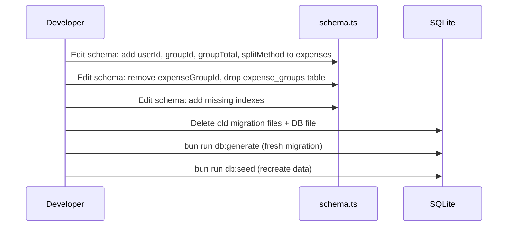

# Design Document: Schema Redesign

## Overview

This redesign unifies the `expenses` and `expense_groups` tables into a single `expenses` table, adds `userId` directly to `expenses` for query performance, and adds missing indexes. Multi-vehicle expenses become sibling rows sharing a `groupId` instead of parent/child relationships through a separate table. The `expense_groups` table is dropped entirely.

The change eliminates the `vehicles` JOIN from every expense query hot path (paginated lists, summaries, all analytics), simplifies the split service from "create group row then materialize children" to "insert N expense rows with the same groupId," and removes the `expense_group` entity type from the photos polymorphic system.

Note: `insurance_policies` already has a `userId` column — no schema change needed there. Only the missing indexes on `vehicle_financing` and `insurance_policy_vehicles` are added.

## Scope Clarification

This is a backend + frontend change. The schema migration changes the expenses table shape, which ripples through:
- Backend: schema, repositories, split service, routes, analytics, insurance repo, backup/restore, Google Sheets sync, photo helpers, config, types
- Frontend: types, API service, expense components, restore dialog, photo sections

## Main Algorithm/Workflow



### Migration Strategy: Direct Schema Edit (Pre-Launch)

Since this is a pre-launch change, there is no production database to migrate. The approach is:

1. Edit `backend/src/db/schema.ts` directly with all changes (add columns, remove columns, drop table, add indexes)
2. Delete existing migration files in `backend/drizzle/`
3. Run `bun run db:generate` to produce a single fresh migration from the new schema
4. Delete the existing `backend/data/vroom.db` and let it be recreated on startup
5. Re-seed with `bun run db:seed` if needed

No data migration script is needed — the database is rebuilt from scratch.

## Core Interfaces/Types

### Backend Schema Changes

```typescript
// expenses table (modified)
export const expenses = sqliteTable(
  'expenses',
  {
    // ... all existing columns remain EXCEPT expenseGroupId ...
    
    // NEW: Direct user ownership — eliminates vehicles JOIN
    userId: text('user_id')
      .notNull()
      .references(() => users.id, { onDelete: 'cascade' }),
    
    // NEW: Replaces expenseGroupId FK to expense_groups
    // NULL for standalone expenses, shared UUID for split siblings
    groupId: text('group_id'),
    
    // NEW: Pre-split total amount, same on all siblings in a group
    groupTotal: real('group_total'),
    
    // NEW: Split method used to derive per-vehicle amounts
    splitMethod: text('split_method'), // 'even' | 'absolute' | 'percentage'
    
    // REMOVED: expenseGroupId (FK to expense_groups) — replaced by groupId
  },
  (table) => ({
    // EXISTING (kept)
    vehicleDateIdx: index('expenses_vehicle_date_idx').on(table.vehicleId, table.date),
    vehicleCategoryDateIdx: index('expenses_vehicle_category_date_idx').on(
      table.vehicleId, table.category, table.date
    ),
    categoryDateIdx: index('expenses_category_date_idx').on(table.category, table.date),
    
    // REMOVED: expenseGroupIdx on expenseGroupId
    
    // NEW: userId-based indexes for analytics hot paths
    userDateIdx: index('expenses_user_date_idx').on(table.userId, table.date),
    userCategoryDateIdx: index('expenses_user_category_date_idx').on(
      table.userId, table.category, table.date
    ),
    // NEW: Group lookup for split operations
    groupIdx: index('expenses_group_idx').on(table.groupId),
  })
);

// SplitMethod type (used on the expenses table column)
export type SplitMethod = 'even' | 'absolute' | 'percentage';

// vehicle_financing table — add missing index
// (no column changes, just add index definition to the table's third arg)
vehicleIdIdx: index('vf_vehicle_id_idx').on(table.vehicleId)

// insurance_policy_vehicles table — add missing index
// (no column changes, just add index definition)
vehiclePolicyIdx: index('ipv_vehicle_policy_idx').on(table.vehicleId, table.policyId)
```

### Removed Backend Types

```typescript
// DROPPED from schema.ts:
// - expenseGroups table definition
// - ExpenseGroup, NewExpenseGroup types
// - SplitConfig type (the discriminated union)
// - expenseGroupsRelations
// - expensesRelations (the expenseGroup reference — keep the vehicle reference)

// IMPORTANT: SplitConfig type is KEPT in validation.ts for the API request schema.
// The frontend still sends { splitConfig: { method, vehicleIds/allocations }, totalAmount }.
// The route handler converts SplitConfig → computeAllocations → createSiblings.
// SplitConfig is an API-layer type, not a DB-layer type.
```

### PhotoEntityType Update

```typescript
export type PhotoEntityType =
  | 'vehicle'
  | 'expense'
  | 'trip'
  | 'insurance_policy'
  // REMOVED: 'expense_group'
  | 'odometer_entry';
```

### Frontend Type Changes

```typescript
// frontend/src/lib/types/expense.ts — CHANGES:

// REMOVED: ExpenseGroup interface
// REMOVED: ExpenseGroupWithChildren interface
// KEPT: SplitConfig type (still used for API requests)

// MODIFIED: Expense interface
export interface Expense {
  id: string;
  vehicleId: string;
  userId: string;           // NEW
  tags: string[];
  category: ExpenseCategory;
  amount: number;
  currency?: string;
  date: string;
  mileage?: number;
  volume?: number;
  charge?: number;
  fuelType?: string;
  description?: string;
  receiptUrl?: string;
  isFinancingPayment: boolean;
  missedFillup?: boolean;
  groupId?: string;          // NEW (replaces expenseGroupId)
  groupTotal?: number;       // NEW
  splitMethod?: string;      // NEW
  createdAt: string;
  updatedAt: string;
}

// NEW: SplitExpenseGroup (replaces ExpenseGroupWithChildren)
export interface SplitExpenseGroup {
  siblings: Expense[];
  groupId: string;
  groupTotal: number;
  splitMethod: string;
}
```

### Frontend API Service Changes

```typescript
// frontend/src/lib/services/expense-api.ts — CHANGES:

// Split expense methods now return Expense[] or SplitExpenseGroup:
async createSplitExpense(data: {
  splitConfig: SplitConfig;  // KEPT — same request shape
  category: ExpenseCategory;
  tags?: string[];
  date: string;
  description?: string;
  totalAmount: number;
  insurancePolicyId?: string;
  insuranceTermId?: string;
}): Promise<SplitExpenseGroup>  // CHANGED from ExpenseGroupWithChildren

async updateSplitExpense(
  groupId: string,
  data: { splitConfig: SplitConfig; totalAmount?: number }
): Promise<SplitExpenseGroup>  // CHANGED

async getSplitExpense(groupId: string): Promise<SplitExpenseGroup>  // CHANGED

async deleteSplitExpense(groupId: string): Promise<void>  // UNCHANGED

// Photo methods — remove 'expense_group' entity type:
async getPhotos(entityType: 'expense', entityId: string, ...): Promise<...>
async uploadPhoto(entityType: 'expense', entityId: string, ...): Promise<...>
// For split expenses, photos attach to individual sibling expense IDs
```

### Frontend Component Changes

| File | Change |
|---|---|
| `frontend/src/lib/types/expense.ts` | Remove `ExpenseGroup`, `ExpenseGroupWithChildren`. Add `SplitExpenseGroup`. Update `Expense` (add `groupId`/`groupTotal`/`splitMethod`, remove `expenseGroupId`). |
| `frontend/src/lib/services/expense-api.ts` | Update return types for split methods. Remove `'expense_group'` from photo entity types. |
| `frontend/src/lib/services/api-transformer.ts` | Map `groupId`/`groupTotal`/`splitMethod` instead of `expenseGroupId`. |
| `frontend/src/lib/components/expenses/ExpenseForm.svelte` | Use `expense.groupId` instead of `expense.expenseGroupId`. Upload photos with `entityType: 'expense'` (not `'expense_group'`). |
| `frontend/src/lib/components/expenses/ExpensesTable.svelte` | Group rows by `expense.groupId` instead of `expense.expenseGroupId`. |
| `frontend/src/lib/components/expenses/ExpensePhotoSection.svelte` | Remove `'expense_group'` from accepted entity types. |
| `frontend/src/lib/components/settings/UnifiedRestoreDialog.svelte` | Remove `expenseGroups` from restore preview display. |

## Key Functions with Formal Specifications

### Function 1: createSplitExpense() — Route Handler

The API contract is preserved. The frontend still sends `{ splitConfig, totalAmount, ... }`. The route handler converts `SplitConfig` → allocations → sibling rows.

```typescript
// Route handler (expenses/routes.ts)
// POST /api/v1/expenses/split
// Request body: { splitConfig: SplitConfig, totalAmount, category, date, ... }
// Response: { success: true, data: SplitExpenseGroup }

// The route handler:
// 1. Validates with existing createSplitExpenseSchema (KEPT as-is from validation.ts)
// 2. Calls expenseSplitService.computeAllocations(data.splitConfig, data.totalAmount)
//    (computeAllocations signature UNCHANGED — still takes SplitConfig)
// 3. Calls expenseRepository.createSplitExpense({ allocations, splitMethod, groupTotal, ... })
// 4. Returns { siblings, groupId, groupTotal, splitMethod }
```

```typescript
// ExpenseRepository method
async createSplitExpense(
  params: {
    splitMethod: SplitMethod;
    allocations: Array<{ vehicleId: string; amount: number }>;
    groupTotal: number;
    category: string;
    tags?: string[];
    date: Date;
    description?: string;
    insurancePolicyId?: string;
    insuranceTermId?: string;
  },
  userId: string
): Promise<Expense[]>
```

**Preconditions:**
- `params.allocations` has at least 2 entries
- All `vehicleId` values belong to `userId`
- `params.groupTotal > 0`
- Sum of amounts ≈ groupTotal (within ±0.01)

**Postconditions:**
- Returns N expense rows sharing the same `groupId`
- Each row has `userId`, `vehicleId`, `expenseAmount`, `groupId`, `groupTotal`, `splitMethod`

### Function 2: updateSplitExpense()

```typescript
async updateSplitExpense(
  groupId: string,
  params: { splitConfig: SplitConfig; totalAmount?: number },
  userId: string
): Promise<Expense[]>
```

**Preconditions:**
- `groupId` identifies existing sibling expenses owned by `userId`

**Postconditions:**
- Old siblings deleted, new siblings inserted with same `groupId`
- Photos attached to old siblings are migrated to new siblings (first new sibling inherits all photos)

**Photo migration on update:** When siblings are deleted and re-created, photos attached to old expense IDs would be orphaned. The update must:
1. Collect all photo IDs attached to old siblings (`SELECT id FROM photos WHERE entity_type = 'expense' AND entity_id IN (old sibling IDs)`)
2. Delete old siblings
3. Insert new siblings
4. Update collected photos to point to the first new sibling's ID

### Function 3: deleteSplitExpense()

```typescript
async deleteSplitExpense(groupId: string, userId: string): Promise<void>
```

**Postconditions:**
- All expense rows with `groupId` deleted
- Photos attached to those expenses deleted
- Odometer entries linked to those expenses deleted

### Function 4: Split Service Changes

```typescript
// ExpenseSplitService — CHANGES:

// computeAllocations() — SIGNATURE UNCHANGED
// Still takes (config: SplitConfig, totalAmount: number)
// This preserves compatibility with insurance repo's buildSplitConfig()
computeAllocations(config: SplitConfig, totalAmount: number): Array<{ vehicleId: string; amount: number }>

// NEW: createSiblings() — replaces materializeChildren()
async createSiblings(
  tx: DrizzleTransaction,
  params: {
    groupId: string;
    userId: string;
    splitMethod: SplitMethod;
    groupTotal: number;
    allocations: Array<{ vehicleId: string; amount: number }>;
    category: string;
    date: Date;
    tags?: string[];
    description?: string;
    insurancePolicyId?: string;
    insuranceTermId?: string;
  }
): Promise<Expense[]>

// REMOVED: materializeChildren() — no longer needed (no parent group row)
// REMOVED: updateSplit() — replaced by repository's updateSplitExpense()
```

### Function 5: Insurance Repository Changes

Three methods currently touch `expense_groups` and need updating:

#### `createExpenseGroupForTerm` → `createExpensesForTerm`

```typescript
// BEFORE: Creates expense_group row + materializes children
// AFTER: Creates sibling expense rows directly

private async createExpensesForTerm(
  tx: DrizzleTransaction,
  policyId: string,
  company: string,
  term: PolicyTerm,
  coverage: TermVehicleCoverage,
  userId: string
): Promise<Expense[] | null> {
  if (term.financeDetails?.totalCost == null || term.financeDetails.totalCost <= 0) return null;
  if (coverage.vehicleIds.length === 0) return null;

  const splitConfig = buildSplitConfig(coverage); // returns SplitConfig — UNCHANGED
  const allocations = expenseSplitService.computeAllocations(
    splitConfig, term.financeDetails.totalCost  // SplitConfig signature — UNCHANGED
  );

  return expenseSplitService.createSiblings(tx, {
    groupId: createId(),
    userId,
    splitMethod: splitConfig.method,
    groupTotal: term.financeDetails.totalCost,
    allocations,
    category: 'financial',
    date: new Date(term.startDate),
    tags: ['insurance'],
    description: `Insurance: ${company} (${term.startDate} to ${term.endDate})`,
    insurancePolicyId: policyId,
    insuranceTermId: term.id,
  });
}
```

#### `deleteTerm` — expense cleanup

```typescript
// BEFORE:
await tx.delete(expenseGroups).where(
  and(eq(expenseGroups.insurancePolicyId, policyId), eq(expenseGroups.insuranceTermId, termId))
);

// AFTER:
await tx.delete(expenses).where(
  and(eq(expenses.insurancePolicyId, policyId), eq(expenses.insuranceTermId, termId))
);
```

#### `syncExpenseGroupForTerm` → `syncExpensesForTerm`

```typescript
// BEFORE: Queries expense_groups by insurancePolicyId + insuranceTermId
// AFTER: Queries expenses by insurancePolicyId + insuranceTermId + groupId IS NOT NULL

// To check if expenses exist for a term:
const existing = await tx.select({ groupId: expenses.groupId })
  .from(expenses)
  .where(and(
    eq(expenses.insurancePolicyId, policyId),
    eq(expenses.insuranceTermId, termId),
    isNotNull(expenses.groupId)
  ))
  .limit(1);

// If exists, delete old siblings and create new ones
// If not exists, create new siblings via createExpensesForTerm
```

#### `handleCoverageUpdate`

Currently calls `syncExpenseGroupForTerm` — same treatment applies. Update to use the new `syncExpensesForTerm`.

### Function 6: Photo Helpers Changes

```typescript
// backend/src/api/photos/helpers.ts — CHANGES:

// REMOVE: validateExpenseGroupOwnership() function entirely
// REMOVE: case 'expense_group': from validateEntityOwnership switch

// UPDATE: validateExpenseOwnership() to use expenses.userId directly:
async function validateExpenseOwnership(entityId: string, userId: string): Promise<void> {
  const db = getDb();
  const rows = await db
    .select({ userId: expenses.userId })
    .from(expenses)
    .where(eq(expenses.id, entityId))
    .limit(1);
  const expense = rows[0];
  if (!expense || expense.userId !== userId) throw new NotFoundError('Expense');
}
```

## Backup/Restore Pipeline Changes (Detailed)

### config.ts

```typescript
// REMOVE from TABLE_SCHEMA_MAP: expenseGroups entry
// REMOVE from TABLE_FILENAME_MAP: expenseGroups entry
// ADD to OPTIONAL_BACKUP_FILES: 'expense_groups.csv' (backward compat)
```

### types.ts

```typescript
// BackupData and ParsedBackupData:
// REMOVE: expenseGroups field
// expenses field now includes userId, groupId, groupTotal, splitMethod columns
```

### backup.ts — createBackup()

```typescript
// REMOVE: expenseGroups query
// expenses query: SELECT directly (no JOIN to vehicles needed — has userId)
// exportAsZip(): remove expense_groups.csv, add new columns to expenses.csv
// validateReferentialIntegrity():
//   REMOVE: expense group ref validation
//   ADD: validate expenses.userId references users.id
//   ADD: validate groupId consistency (siblings share groupTotal/splitMethod)
//   REMOVE: 'expense_group' from valid photo entity types
```

### restore.ts — Backward Compatibility (Critical)

Old backups have:
- `expense_groups.csv` with group data
- `expenses.csv` with `expenseGroupId` column but NO `userId`/`groupId`/`groupTotal`/`splitMethod`

New backups have:
- No `expense_groups.csv`
- `expenses.csv` with `userId`/`groupId`/`groupTotal`/`splitMethod` but NO `expenseGroupId`

The restore pipeline must handle both formats:

```typescript
async insertBackupData(tx: DrizzleTransaction, data: ParsedBackupData): Promise<void> {
  // Detect old format: expenses have expenseGroupId but no userId
  const isOldFormat = data.expenses.length > 0 && !('userId' in data.expenses[0]);
  
  if (isOldFormat) {
    // Transform old format → new format:
    // 1. Build vehicleId → userId map from data.vehicles
    const vehicleUserMap = new Map(data.vehicles.map(v => [v.id, v.userId]));
    
    // 2. Build expenseGroupId → group data map
    const groupMap = new Map((data.expenseGroups ?? []).map(g => [g.id, g]));
    
    // 3. Transform each expense
    for (const expense of data.expenses) {
      expense.userId = vehicleUserMap.get(expense.vehicleId);
      const groupId = expense.expenseGroupId;
      if (groupId) {
        const group = groupMap.get(groupId);
        expense.groupId = groupId;
        expense.groupTotal = group?.totalAmount;
        expense.splitMethod = group?.splitConfig?.method;
      }
      delete expense.expenseGroupId;
    }
    
    // 4. Transform expense_group photos → expense photos
    if (data.photos) {
      for (const photo of data.photos) {
        if (photo.entityType === 'expense_group') {
          const firstChild = data.expenses.find(e => e.groupId === photo.entityId);
          if (firstChild) {
            photo.entityType = 'expense';
            photo.entityId = firstChild.id;
          }
          // If no child found, photo will be orphaned — delete it
        }
      }
      data.photos = data.photos.filter(p => p.entityType !== 'expense_group');
    }
  }
  
  // Insert in order (no expenseGroups step needed)
  if (data.vehicles.length > 0) await tx.insert(vehicles).values(data.vehicles);
  if (data.expenses.length > 0) await tx.insert(expenses).values(data.expenses);
  // ... rest of inserts unchanged
}
```

### restore.ts — deleteUserData() Simplification

```typescript
// BEFORE: Complex multi-step cascade through vehicleIds
// AFTER: Direct userId-based deletes

private async deleteUserData(tx: DrizzleTransaction, userId: string): Promise<void> {
  // Collect IDs for photo cleanup
  const userExpenses = await tx.select({ id: expenses.id }).from(expenses)
    .where(eq(expenses.userId, userId));
  const expenseIds = userExpenses.map(e => e.id);
  
  // ... collect other entity IDs for photo deletion (vehicles, policies, odometer) ...
  
  // Delete photos for expenses (covers both standalone and split)
  if (expenseIds.length > 0) {
    await tx.delete(photos).where(
      and(eq(photos.entityType, 'expense'), inArray(photos.entityId, expenseIds))
    );
  }
  // ... delete photos for other entity types ...
  
  // Delete expenses directly by userId (no vehicleIds needed)
  await tx.delete(expenses).where(eq(expenses.userId, userId));
  
  // NO expenseGroups delete — table doesn't exist
  
  // ... rest of deletes (odometer, financing, insurance, vehicles) ...
}
```

### restore.ts — ImportSummary

```typescript
// REMOVE: expenseGroups field from ImportSummary
export interface ImportSummary {
  vehicles: number;
  expenses: number;
  financing: number;
  insurance: number;
  insurancePolicyVehicles: number;
  // REMOVED: expenseGroups
  odometer: number;
  photos: number;
  photoRefs: number;
}
```

### Google Sheets Service Changes

```typescript
// backend/src/api/providers/google-sheets-service.ts — CHANGES:

// createSpreadsheet(): REMOVE 'Expense Groups' sheet from initial sheets list
// ensureRequiredSheets(): REMOVE 'Expense Groups' from required sheets
// updateSpreadsheetWithUserData():
//   REMOVE: expenseGroups query
//   REMOVE: expenseGroupIds from photo query params
//   UPDATE: expenses query to use expenses.userId directly (no vehicles JOIN)
//   REMOVE: updateSheet call for 'Expense Groups'
// REMOVE: getExpenseGroupsHeaders() method
// UPDATE: getExpenseHeaders() — add userId, groupId, groupTotal, splitMethod; remove expenseGroupId
// UPDATE: getInsuranceHeaders() — already has userId (no change needed)
// queryUserPhotos(): REMOVE 'expense_group' entity type query
// readSpreadsheetData():
//   REMOVE: expenseGroups from return type
//   'Expense Groups' sheet read already uses .catch(() => []) — will gracefully return empty
//   For backward compat: if old spreadsheet has 'Expense Groups' data, transform it
//     same way as restore backward compat (convert to expense groupId/groupTotal/splitMethod)

// NEW getExpenseHeaders():
private getExpenseHeaders() {
  return [
    'id', 'vehicleId', 'userId', 'tags', 'category', 'expenseAmount',
    'fuelAmount', 'fuelType', 'isFinancingPayment', 'missedFillup',
    'date', 'mileage', 'description', 'receiptUrl',
    'groupId', 'groupTotal', 'splitMethod',
    'insurancePolicyId', 'insuranceTermId',
    'createdAt', 'updatedAt',
  ];
}
```

## Migration Test Updates

### seedCoreData (migration-helpers.ts)

```sql
-- BEFORE:
INSERT INTO expenses (id, vehicle_id, category, date, expense_amount)
  VALUES ('e1', 'v1', 'fuel', 1700000000, 45.50);

-- AFTER (must include user_id):
INSERT INTO expenses (id, vehicle_id, user_id, category, date, expense_amount)
  VALUES ('e1', 'v1', 'u1', 'fuel', 1700000000, 45.50);
```

### Backup test updates (backup.test.ts)

All `ParsedBackupData` objects must:
- Remove `expenseGroups: []` field
- Add `userId` to expense test rows
- Update `TABLE_SCHEMA_MAP` coverage test to remove `expenseGroups`

### migration-general.test.ts

Update expected tables list to remove `expense_groups`.

## Correctness Properties

*A property is a characteristic or behavior that should hold true across all valid executions of a system — essentially, a formal statement about what the system should do. Properties serve as the bridge between human-readable specifications and machine-verifiable correctness guarantees.*

### Property 1: Expense userId matches vehicle owner

*For any* expense in the expenses table, the expense's `userId` value must equal the `userId` of the vehicle referenced by the expense's `vehicleId`. This holds for expenses created via split service, insurance repository, data migration, and backup restore.

**Validates: Requirements 4.2, 5.2, 11.2, 14.1**

### Property 2: Split sibling consistency

*For any* set of expenses sharing a non-NULL `groupId`, all sibling rows must have identical values for `groupTotal`, `splitMethod`, `userId`, `category`, and `date`.

**Validates: Requirements 5.2, 14.2**

### Property 3: Split amounts sum to groupTotal

*For any* set of expenses sharing a non-NULL `groupId`, the absolute difference between the sum of all sibling `expenseAmount` values and the `groupTotal` must be less than 0.02.

**Validates: Requirements 5.3, 14.3**

### Property 4: No singleton split groups

*For any* non-NULL `groupId` value in the expenses table, the count of expenses with that `groupId` must be at least 2.

**Validates: Requirements 5.4, 14.4**

### Property 5: Split expense update preserves groupId

*For any* split expense update operation, the new sibling rows must share the same `groupId` as the old sibling rows that were replaced.

**Validates: Requirement 6.1**

### Property 6: Photo migration on split update

*For any* split expense update where the old siblings had attached photos, all photos from old siblings must be reassigned to the first new sibling after the update. No photos should be orphaned.

**Validates: Requirement 6.2**

### Property 7: Cascade deletion completeness

*For any* split expense deletion by `groupId`, after deletion there must be zero expense rows with that `groupId`, zero photo rows referencing any of the deleted expense IDs, and zero odometer entries linked to any of the deleted expense IDs.

**Validates: Requirements 7.1, 7.2, 7.3**

### Property 8: Data migration preserves expense group semantics

*For any* expense group that existed before migration, after the data migration completes there must exist expense rows with `groupId` equal to the old group's ID, `groupTotal` equal to the old group's `totalAmount`, and `splitMethod` equal to the old group's `splitConfig.method`.

**Validates: Requirements 4.3, 14.6**

### Property 9: No expense_group photos after migration

*For any* state of the database after data migration completes, the photos table must contain zero rows with `entity_type = 'expense_group'`. Photos that had matching child expenses must have been reassigned to `entity_type = 'expense'` pointing to the first child.

**Validates: Requirements 4.4, 4.5, 14.7**

### Property 10: Old backup restore preserves group semantics

*For any* old-format backup containing expense_groups data, after restore: (a) every expense must have a valid `userId` derived from its vehicle's owner in the backup, (b) expenses that had `expenseGroupId` must have `groupId`/`groupTotal`/`splitMethod` populated from the backup's expense_groups data, and (c) photos with `entity_type = 'expense_group'` must be transformed to `entity_type = 'expense'` or discarded if orphaned.

**Validates: Requirements 11.1, 11.2, 11.3, 11.4, 11.5**

### Property 11: Backup format correctness

*For any* backup created after the migration, the backup ZIP must contain expenses with `userId`, `groupId`, `groupTotal`, `splitMethod` columns, must not contain an `expense_groups.csv` file, and must not contain any photo records with `entity_type = 'expense_group'`.

**Validates: Requirements 10.1, 10.2, 10.3**

### Property 12: API transformer maps new expense fields

*For any* expense API response, the frontend API transformer must produce an object with `groupId`, `groupTotal`, and `splitMethod` fields and must not produce an `expenseGroupId` field.

**Validates: Requirement 13.4**

### Property 13: Expense table groups by groupId

*For any* set of expenses displayed in the expenses table, rows sharing the same non-NULL `groupId` must be grouped together visually.

**Validates: Requirement 13.5**
