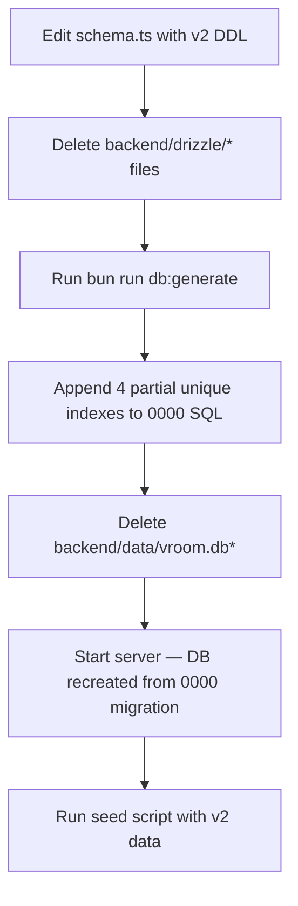
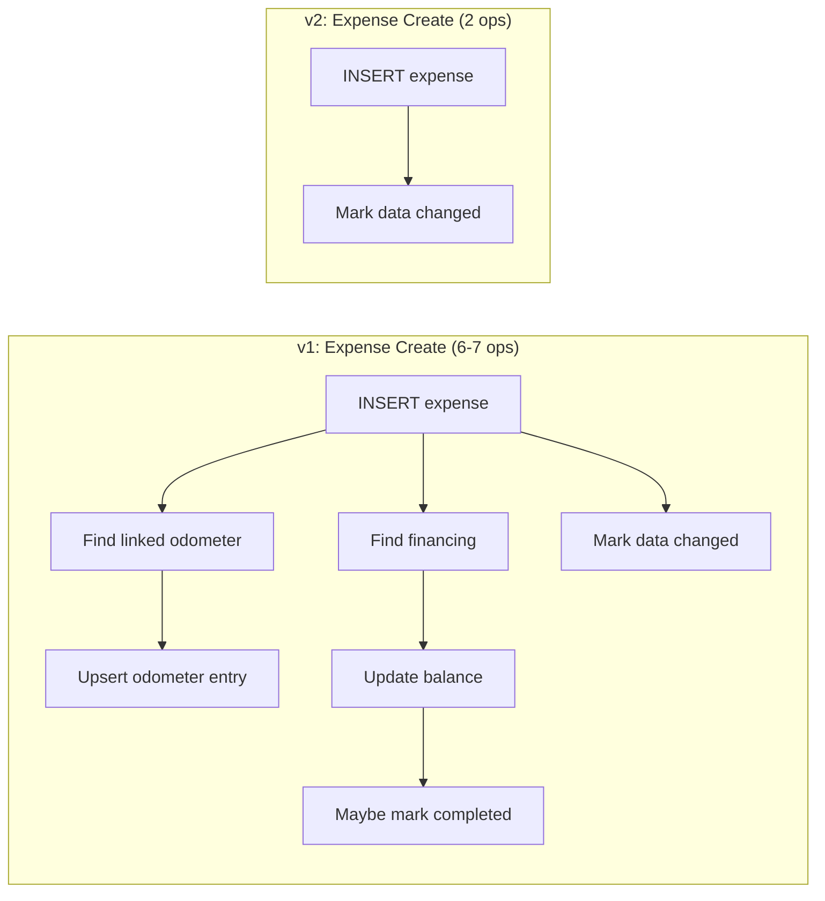
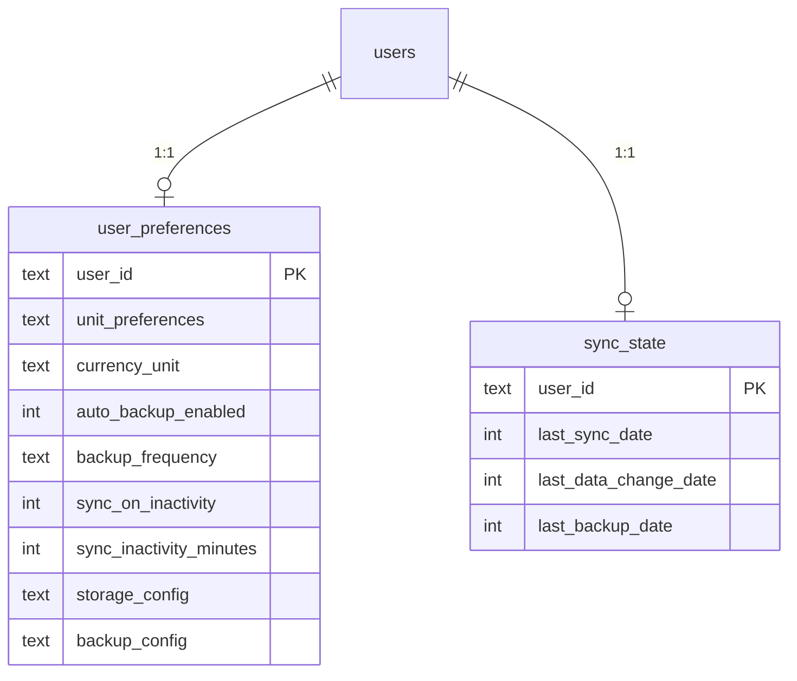
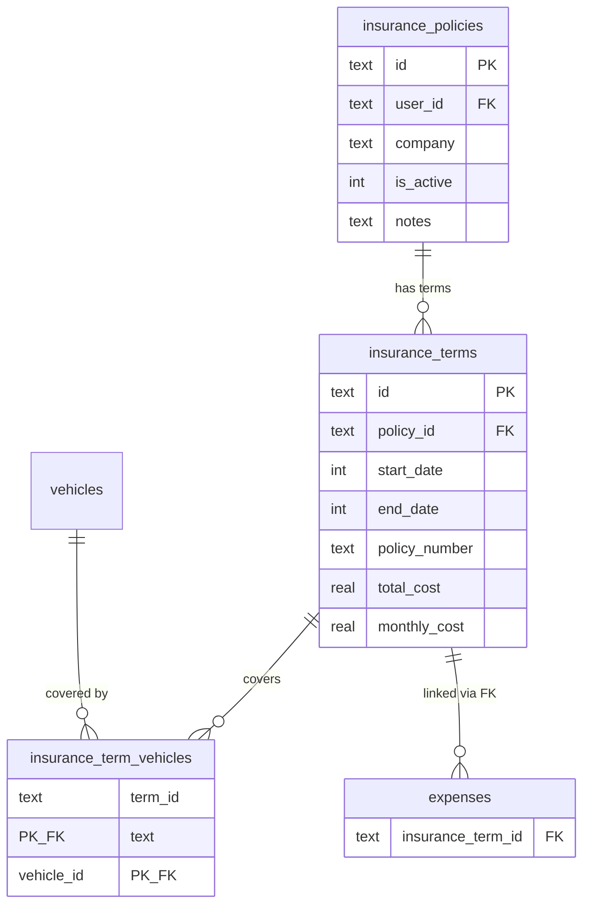

# Design Document: Schema V2

## Overview

This design covers the comprehensive schema v2 redesign for the VROOM application database. The redesign eliminates all 9 cross-domain hooks, extracts insurance terms from JSON to a relational table, splits user_settings into two tables by access pattern, computes derived values on read, and adds DB-enforced invariants via partial unique indexes.

This is a pre-launch change. No production database exists. The approach is:
1. Edit `backend/src/db/schema.ts` directly with all v2 changes
2. Delete existing migration files in `backend/drizzle/`
3. Run `bun run db:generate` to produce a single fresh `0000` migration
4. Delete `backend/data/vroom.db*` and let it recreate on startup
5. Update seed script for new schema
6. Manually append partial unique indexes to the generated migration SQL (Drizzle can't express WHERE clauses on indexes)

There is NO data migration service. There is NO v1 backup restore compatibility. The backup/restore pipeline is updated for the new table structure only.

The `user_providers` table is UNCHANGED in v2.

### Key Design Principles

- **Compute over cache** — derived values (financing balance, current insurance policy, odometer history) are computed on read. SQLite SUM over <100 rows is sub-millisecond.
- **No cross-domain hooks** — every mutation touches exactly the tables it owns.
- **Explicit over implicit** — insurance expenses are created by the user, not auto-generated.
- **Real FKs everywhere** — no text columns referencing IDs inside JSON blobs.
- **DB-enforced invariants** — partial unique indexes enforce business rules at the database level.
- **Split by access pattern** — settings split into user_preferences (write-rare) + sync_state (write-frequent).

## Architecture

### Pre-Launch Migration Strategy

Since no production database exists, the migration is a clean-sheet rebuild:



The 4 partial indexes to manually append are: `vehicles_license_plate_idx`, `vf_active_vehicle_idx`, `up_auth_identity_idx`, `pr_pending_idx`.

### Hook Elimination Architecture

v1 expense CRUD triggers 6-7 DB operations per mutation. v2 reduces this to 2-3:



### Settings Split Architecture



`user_preferences` is read-heavy (analytics, photo uploads, settings page) and write-rare (settings save). `sync_state` is write-heavy (every data mutation via activity tracker middleware).

### Insurance Terms Extraction Architecture



Terms move from a JSON column on `insurance_policies` to a proper relational table. The junction table gets real FKs to `insurance_terms(id)`. Expenses reference terms directly with ON DELETE SET NULL.

## Components and Interfaces

### 1. Schema Changes (`backend/src/db/schema.ts`)

Full rewrite of the Drizzle schema definitions. Key changes:

**Tables modified:**
- `vehicles` — remove `currentInsurancePolicyId`, add partial unique index on `licensePlate`
- `vehicleFinancing` — remove `currentBalance`, add partial unique index on `vehicleId` WHERE `isActive = 1`
- `insurancePolicies` — remove `terms` JSON column, `currentTermStart`, `currentTermEnd`
- `expenses` — rename `fuelAmount` → `volume`, remove `insurancePolicyId`, add real FK on `insuranceTermId` → `insurance_terms(id)` ON DELETE SET NULL, add `expenses_insurance_term_idx`
- `odometerEntries` — remove `linkedEntityType`, `linkedEntityId`, remove `odometer_linked_entity_idx`
- `photos` — add `userId` FK, add `photos_user_entity_type_idx`
- `photoRefs` — change `pr_pending_idx` to partial index

**Tables added:**
- `insuranceTerms` — extracted from JSON, flat columns for policy details and finance details
- `insuranceTermVehicles` — renamed from `insurancePolicyVehicles`, PK is `(termId, vehicleId)`
- `userPreferences` — user-facing settings, `userId` as PK
- `syncState` — system timestamps, `userId` as PK

**Tables removed:**
- `userSettings` — replaced by `userPreferences` + `syncState`
- `insurancePolicyVehicles` — replaced by `insuranceTermVehicles`

**Types added:**
- `InsuranceTerm`, `NewInsuranceTerm`
- `InsuranceTermVehicle`, `NewInsuranceTermVehicle`
- `UserPreferences`, `NewUserPreferences`
- `SyncState`, `NewSyncState`

**Types removed:**
- `PolicyTerm` interface (was used for JSON column)
- `UserSettings`, `NewUserSettings`
- `InsurancePolicyVehicle`, `NewInsurancePolicyVehicle`

**Relations updated:**
- `expensesRelations` updated to include a relation from `expenses.insuranceTermId` → `insuranceTerms.id`

### 2. Files to Delete

| File | Reason |
|---|---|
| `backend/src/api/odometer/hooks.ts` | All 3 odometer hooks eliminated |
| `backend/src/api/financing/hooks.ts` | All 3 financing hooks eliminated |
| `backend/src/api/financing/__tests__/hooks.property.test.ts` | Tests for deleted hooks |
| `backend/src/api/odometer/__tests__/hooks.property.test.ts` | Tests for deleted hooks |

### 3. Expense Routes Simplification (`backend/src/api/expenses/routes.ts`)

Remove all hook imports and calls:
- Remove `import { handleFinancingOnCreate, handleFinancingOnDelete, handleFinancingOnUpdate } from '../financing/hooks'`
- Remove `import { handleOdometerOnExpenseCreate, handleOdometerOnExpenseDelete, handleOdometerOnExpenseUpdate } from '../odometer/hooks'`
- POST handler: remove `handleFinancingOnCreate(createdExpense)` and `handleOdometerOnExpenseCreate(createdExpense, user.id)` calls
- PUT handler: remove `handleFinancingOnUpdate(existingExpense, updateData)` and `handleOdometerOnExpenseUpdate(existingExpense, updateData, user.id)` calls
- DELETE handler: remove `handleFinancingOnDelete(expense)` and `handleOdometerOnExpenseDelete(expense)` calls
- Remove financing validation check on create (no longer adjusting balance). Note: the check that validates a financing record EXISTS for the vehicle when `isFinancingPayment = true` SHOULD be kept — it prevents orphan financing payments. Only the balance adjustment call is removed.
- Update validation schema: `fuelAmount` → `volume` in `baseExpenseSchema` and `createExpenseSchema`
- Remove `insurancePolicyId` from schema/queries
- Update `validateFuelExpenseData` call sites to pass `volume` instead of `fuelAmount`

### 4. Expense Validation Updates (`backend/src/api/expenses/validation.ts`)

- Remove `insurancePolicyId` from `createSplitExpenseSchema` and `updateSplitSchema`
- Note: `fuelAmount` does NOT exist in `validation.ts` — the fuel field is only in `routes.ts`'s `baseExpenseSchema`. The `volume` rename for validation is handled in Section 3 (routes) and Section 22 (validation utility).

### 5. ExpenseSplitService Update (`backend/src/api/expenses/split-service.ts`)

- Remove `insurancePolicyId` from the `createSiblings` params type
- The `NewExpense` object built inside `createSiblings` no longer sets `insurancePolicyId`
- Keep `insuranceTermId` parameter (expenses can still link to terms)

### 5a. Expense Repository Update (`backend/src/api/expenses/repository.ts`)

- Remove `insurancePolicyId` from `createSplitExpense()` method params and the insert values (around line 395, 422)
- Remove `insurancePolicyId` from `updateSplitExpense()` method (around line 550)
- Rename `fuelAmount` → `volume` in any query that references the column

### 6. Insurance Repository Simplification (`backend/src/api/insurance/repository.ts`)

Major rewrite from ~900 lines to ~400 lines:

**Remove:**
- `syncDenormalizedFields()` — no more `currentTermStart`/`currentTermEnd`
- `buildSplitConfig()` — no auto-expense creation
- `stripVehicleCoverage()` — no JSON term manipulation
- `createExpensesForTerm()` — eliminated hook
- `syncExpensesForTerm()` — eliminated hook
- `syncVehicleReferences()` — no more `currentInsurancePolicyId`
- `clearRemovedVehicleRefs()` — no more `currentInsurancePolicyId`
- All JSON parse-mutate-serialize logic
- `PolicyTerm` import

**Replace with:**
- Standard CRUD on `insuranceTerms` table: `INSERT`, `UPDATE`, `DELETE`
- Junction management on `insuranceTermVehicles`: insert/delete rows with real FKs
- `getCurrentTermDates(policyId)` — `SELECT start_date, end_date FROM insurance_terms WHERE policy_id = ? ORDER BY end_date DESC LIMIT 1`
- `findExpiringTerms(startDate, endDate)` — `WHERE end_date BETWEEN ? AND ?` on `insurance_terms`

**Add:**
- `getActiveInsurancePolicyId(vehicleId)` — shared method to derive the active insurance policy for a vehicle:
  ```sql
  SELECT ip.id FROM insurance_policies ip
  JOIN insurance_terms it ON it.policy_id = ip.id
  JOIN insurance_term_vehicles itv ON itv.term_id = it.id
  WHERE itv.vehicle_id = ? AND ip.is_active = 1
  ORDER BY it.end_date DESC LIMIT 1
  ```
  This method is used by analytics fleet health and vehicle detail views. All consumers that previously read `vehicles.currentInsurancePolicyId` use this method instead.

**Updated return type:**
- `InsurancePolicyWithVehicles` no longer includes a `terms` JSON array. The new shape:
  ```typescript
  interface InsurancePolicyWithVehicles {
    id: string;
    userId: string;
    company: string;
    isActive: boolean;
    notes: string | null;
    createdAt: Date;
    updatedAt: Date;
    // Terms are fetched from insurance_terms table, not parsed from JSON
    terms: InsuranceTerm[];
    // Vehicle coverage per term from insurance_term_vehicles junction
    termVehicleCoverage: Array<{ termId: string; vehicleId: string }>;
  }
  ```
  `findById()` and `findByUserId()` JOIN `insurance_terms` and `insurance_term_vehicles` to populate `terms` and `termVehicleCoverage`. This replaces the old pattern of reading `policy.terms` as a JSON array and querying `insurancePolicyVehicles` separately.

**New method signatures:**
```typescript
class InsurancePolicyRepository {
  // Policy CRUD (simplified — no JSON manipulation)
  async create(data: { company: string; isActive?: boolean; notes?: string; terms: CreateTermInput[] }, userId: string): Promise<InsurancePolicyWithVehicles>;
  async findById(id: string): Promise<InsurancePolicyWithVehicles | null>;
  async findByUserId(userId: string): Promise<InsurancePolicyWithVehicles[]>;
  async findByVehicleId(vehicleId: string): Promise<InsurancePolicyWithVehicles[]>;
  async update(id: string, data: { company?: string; isActive?: boolean; notes?: string }, userId: string): Promise<InsurancePolicyWithVehicles>;
  async delete(id: string, userId: string): Promise<void>;

  // Term CRUD (standard SQL operations on insurance_terms table)
  async addTerm(policyId: string, term: CreateTermInput, userId: string): Promise<InsurancePolicyWithVehicles>;
  async updateTerm(policyId: string, termId: string, updates: Partial<CreateTermInput>, userId: string): Promise<InsurancePolicyWithVehicles>;
  async deleteTerm(policyId: string, termId: string, userId: string): Promise<InsurancePolicyWithVehicles>;

  // Derived queries
  async getCurrentTermDates(policyId: string): Promise<{ startDate: Date; endDate: Date } | null>;
  async findExpiringTerms(startDate: Date, endDate: Date): Promise<InsuranceTerm[]>;
  async getActiveInsurancePolicyId(vehicleId: string): Promise<string | null>;

  // Internal helpers
  private async attachTermsAndCoverage(policy: InsurancePolicy): Promise<InsurancePolicyWithVehicles>;
  private async insertJunctionRows(tx: DrizzleTransaction, termId: string, vehicleIds: string[]): Promise<void>;
  private async validateVehicleOwnership(vehicleIds: string[], userId: string): Promise<void>;
}

// CreateTermInput — flat fields matching insurance_terms columns
interface CreateTermInput {
  startDate: Date;
  endDate: Date;
  policyNumber?: string;
  coverageDescription?: string;
  deductibleAmount?: number;
  coverageLimit?: number;
  agentName?: string;
  agentPhone?: string;
  agentEmail?: string;
  totalCost?: number;
  monthlyCost?: number;
  premiumFrequency?: string;
  paymentAmount?: number;
  vehicleCoverage: { vehicleIds: string[] };
}
```

### 7. Insurance Routes Rewrite (`backend/src/api/insurance/routes.ts`)

**Remove:**
- `PolicyTerm` import from schema
- `toStorableTerm()` helper function — terms are no longer converted to/from JSON strings
- All JSON manipulation logic

**Replace with:**
- Routes accept flat term fields in request bodies instead of nested `policyDetails` and `financeDetails` objects
- Term CRUD routes call standard INSERT/UPDATE/DELETE on `insurance_terms` table via the repository
- POST `/api/v1/insurance/:id/terms` — inserts a row into `insurance_terms` + junction rows
- PUT `/api/v1/insurance/:id/terms/:termId` — updates the `insurance_terms` row + junction rows
- DELETE `/api/v1/insurance/:id/terms/:termId` — deletes the `insurance_terms` row (junction cascades, expenses get SET NULL)

### 8. Insurance Validation Rewrite (`backend/src/api/insurance/validation.ts`)

**Remove:**
- `policyDetailsSchema` (nested object)
- `financeDetailsSchema` (nested object)
- `policyTermSchema` with nested details

**Replace with:**
- Flat term schema with direct fields: `policyNumber`, `coverageDescription`, `deductibleAmount`, `coverageLimit`, `agentName`, `agentPhone`, `agentEmail`, `totalCost`, `monthlyCost`, `premiumFrequency`, `paymentAmount`
- `createTermSchema` — validates flat fields + `startDate`, `endDate`, `vehicleCoverage`
- `updateTermSchema` — partial version of flat fields
- `createPolicySchema` — validates `company`, `terms[]` (array of flat term schemas), `notes`, `isActive`

### 9. Financing Repository Changes (`backend/src/api/financing/repository.ts`)

**Remove:**
- `updateBalance(id, newBalance)` method
- `markAsCompleted(id, endDate)` method

**Add:**
- `computeBalance(financingId)` — takes a financing record ID (not vehicleId), looks up the financing record's `originalAmount` and `vehicleId`, then computes `originalAmount - COALESCE(SUM(expenses.expenseAmount), 0)` by querying expenses WHERE `vehicle_id = ? AND is_financing_payment = 1` for that vehicle. Clamped to minimum 0. Note: the partial unique index `vf_active_vehicle_idx` ensures only one active financing per vehicle, but a vehicle may have historical inactive financing records. The query sums ALL financing payments for the vehicle regardless of which financing record they were made against — this is correct because financing payments are vehicle-scoped, not financing-record-scoped.

The financing routes return the computed balance in the API response. When balance ≤ 0.01, the response includes an `eligibleForPayoff: true` flag. The frontend shows a "Mark as paid off" button that sends an explicit `PUT` to set `isActive = false`.

### 10. Odometer Repository Changes (`backend/src/api/odometer/repository.ts`)

**Remove:**
- `upsertFromLinkedEntity()` method
- `deleteByLinkedEntity()` method
- `findByLinkedEntity()` method

**Add:**
- `getHistory(vehicleId, options?)` — executes the UNION query with LIMIT/OFFSET pagination and total count:
```sql
-- Data query
SELECT mileage AS odometer, date AS recorded_at, 'expense' AS source, id AS source_id, NULL AS note
FROM expenses WHERE vehicle_id = ? AND mileage IS NOT NULL
UNION ALL
SELECT odometer, recorded_at, 'manual' AS source, id AS source_id, note
FROM odometer_entries WHERE vehicle_id = ?
ORDER BY recorded_at DESC
LIMIT ? OFFSET ?

-- Count query (for pagination)
SELECT (
  (SELECT COUNT(*) FROM expenses WHERE vehicle_id = ? AND mileage IS NOT NULL) +
  (SELECT COUNT(*) FROM odometer_entries WHERE vehicle_id = ?)
) AS total
```

### 11. Settings Repository Split (`backend/src/api/settings/repository.ts`)

Split into two repositories:

**`PreferencesRepository`** — reads/writes `user_preferences` table:
- `getByUserId(userId)` / `getOrCreate(userId)` / `update(userId, updates)`
- Handles unit preferences, currency, backup config, storage config, sync settings

**`SyncStateRepository`** — reads/writes `sync_state` table:
- `getOrCreate(userId)` — returns existing row or creates one with all NULL timestamps (needed because `markDataChanged` may be called before any sync_state row exists for a new user)
- `markDataChanged(userId)` — upserts `lastDataChangeDate` (uses `getOrCreate` internally to handle missing rows)
- `hasChangesSinceLastSync(userId)` — compares `lastDataChangeDate` vs `lastSyncDate`
- `updateSyncDate(userId)` — updates `lastSyncDate`
- `updateBackupDate(userId)` — updates `lastBackupDate`

Note: `sync_state` has no `created_at`/`updated_at` columns — do NOT set `updatedAt` in any update operations.

The old `SettingsRepository` class and `settingsRepository` singleton are removed. All import sites are updated. Both repositories live in `backend/src/api/settings/repository.ts` (same file, two classes, two exported singletons).

### 12. Settings Routes Update (`backend/src/api/settings/routes.ts`)

- Import `userPreferences` from schema instead of `userSettings`
- Derive Zod validation schema from `userPreferences` Drizzle table via `createInsertSchema(userPreferences, ...)`
- GET endpoint reads from `user_preferences` via `PreferencesRepository`
- PUT endpoint writes to the User_Preferences_Table for user-facing fields
- PUT endpoint does NOT write `lastBackupDate`, `lastSyncDate`, or `lastDataChangeDate` (those live in `sync_state`)
- The current `POST /api/settings/backup` route calls `settingsRepository.update(user.id, { lastBackupDate })` — this must change to `syncStateRepository.updateBackupDate(user.id)` since `lastBackupDate` lives in `sync_state`
- Remove all `userSettings` imports
- The API response shape MAY be preserved by combining preferences and sync state internally if needed

### 13. Activity Tracker Retargeting (`backend/src/api/sync/activity-tracker.ts`, `backend/src/middleware/activity.ts`)

**`activity-tracker.ts`:**
- `markDataChanged()` calls `syncStateRepository.markDataChanged(userId)` instead of doing raw `db.update(userSettings)`. Use the repository singleton, not raw queries — this ensures the upsert logic handles missing rows.
- `hasChangesSinceLastSync()` calls `syncStateRepository.hasChangesSinceLastSync(userId)` instead of raw `userSettings` queries.
- Remove `userSettings` import from schema. Import `syncStateRepository` from `../settings/repository`.

**`activity.ts` (middleware):**
- Activity middleware reads `syncOnInactivity`, `syncInactivityMinutes`, and `backupConfig` from `userPreferences` via `preferencesRepository.getOrCreate(user.id)` instead of `settingsRepository.getOrCreate(user.id)`
- Import `preferencesRepository` instead of `settingsRepository`

### 14. Backup Orchestrator Update (`backend/src/api/sync/backup-orchestrator.ts`)

- Import `preferencesRepository` instead of `settingsRepository` for loading backup config
- Load `backupConfig` from `preferencesRepository.getOrCreate(userId)` instead of `settingsRepository.getOrCreate(userId)`
- After successful backup: call `preferencesRepository.update(userId, { backupConfig: updatedConfig })` to persist per-provider `lastBackupAt` timestamps (replaces `settingsRepository.updateBackupConfig()`)
- After successful backup: call `SyncStateRepository.updateSyncDate(userId)` to update `lastSyncDate` (replaces `settingsRepository.updateSyncDate()`)
- After successful backup: call `SyncStateRepository.updateBackupDate(userId)` to update `lastBackupDate`

### 15. Photo Repository Changes (`backend/src/api/photos/photo-repository.ts`)

- `create()` method accepts and stores `userId` parameter on new photo rows
- User-scoped queries use `WHERE user_id = ?` directly instead of 4-branch entity JOINs

### 16. Photo Service Update (`backend/src/api/photos/photo-service.ts`)

- Pass the authenticated user's `userId` to `PhotoRepository.create()`

### 17. Provider Routes Simplification (`backend/src/api/providers/routes.ts`)

- `countUserPhotos()` and `findUserPhotoIds()` simplified from 4-branch entity-type JOINs to single queries: `SELECT COUNT(*) FROM photos WHERE user_id = ? AND entity_type = ?`
- Remove the multi-branch switch logic for vehicle, expense, insurance_policy, odometer_entry entity types
- Import `preferencesRepository` instead of `settingsRepository`
- Remove `insurancePolicyVehicles` import from schema (table no longer exists)
- Remove `userSettings` import from schema (table no longer exists)
- `cleanupStorageConfig()` currently does a raw `db.update(userSettings).set({ storageConfig, ... })` — change to `db.update(userPreferences)` or refactor to use `preferencesRepository.update()`
- `cleanupBackupConfig()` uses `settingsRepository.getOrCreate()` and `settingsRepository.updateBackupConfig()` — change to `preferencesRepository.getOrCreate()` and `preferencesRepository.update()`
- The backfill route (around line 590) does a raw `db.select({ storageConfig: userSettings.storageConfig }).from(userSettings)` — change to `db.select({ storageConfig: userPreferences.storageConfig }).from(userPreferences)` or use `preferencesRepository`

### 18. Photo Helpers Update (`backend/src/api/photos/helpers.ts`)

- `validateEntityOwnership()` updated with dual behavior:
  - For operations on **existing photos** (delete, set cover): check `photos.user_id` directly — `SELECT user_id FROM photos WHERE id = ?` and compare with authenticated user
  - For **new photo uploads** (where no photo row exists yet): continue to validate entity ownership through the entity tables (vehicle, expense, insurance_policy, odometer_entry)

### 19. Storage Provider Registry Update (`backend/src/api/providers/domains/storage/registry.ts`)

- `loadStorageConfig()` reads `storageConfig` from `user_preferences` table via `PreferencesRepository` instead of `user_settings`
- Import `userPreferences` from schema instead of `userSettings`
- Remove `userSettings` import

### 20. Vehicles Repository Update (`backend/src/api/vehicles/repository.ts`)

- Remove all reads/writes of `currentInsurancePolicyId` column
- No `currentInsurancePolicyId` in select, insert, or update operations
- The `VehicleWithFinancing` type no longer includes `currentInsurancePolicyId`

### 21. Utility Function Column Rename (`backend/src/utils/calculations.ts`)

- `EfficiencyExpense` interface: `fuelAmount` → `volume`
- `calculateAverageMPG()`: references to `current.fuelAmount` → `current.volume`
- `calculateAverageMilesPerKwh()`: references to `current.fuelAmount` → `current.volume`
- All property test files that create test expense objects with `fuelAmount` updated to use `volume`:
  - `backend/src/utils/__tests__/calculations.property.test.ts`
  - `backend/src/utils/__tests__/vehicle-stats.property.test.ts`
  - `backend/src/utils/__tests__/validation.property.test.ts`

### 22. Validation Utility Update (`backend/src/utils/validation.ts`)

- `validateFuelExpenseData()` function signature: `fuelAmount` parameter → `volume`
- All call sites updated (expense routes, split validation)

### 23. Backup/Restore Pipeline (`backend/src/api/sync/backup.ts`, `restore.ts`)

**Backup changes (`backup.ts`):**
- Add queries for `insuranceTerms`, `insuranceTermVehicles`, `userPreferences`, and `syncState` to `createBackup()` (these are NEW queries — the current backup does NOT query `userSettings`, so this is additive, not a replacement)
- Export `insuranceTerms` and `insuranceTermVehicles` instead of embedding terms in policies
- Export `userPreferences` and `syncState` instead of `userSettings`
- Expenses CSV uses `volume` column, no `insurancePolicyId`
- Photos CSV includes `userId`
- Odometer CSV excludes `linkedEntityType`, `linkedEntityId`
- Vehicles CSV excludes `currentInsurancePolicyId`
- Vehicle financing CSV excludes `currentBalance`
- `loadBackupConfig()` dynamically imports `preferencesRepository` instead of `settingsRepository`
- `queryUserPhotos()` simplified to `SELECT * FROM photos WHERE user_id = ?` instead of 4-branch entity JOINs

**Restore changes (`restore.ts`):**
- Import `insuranceTerms`, `insuranceTermVehicles`, `userPreferences`, `syncState` from schema instead of `insurancePolicyVehicles`, `userSettings`
- Import `preferencesRepository` instead of `settingsRepository`
- `restoreFromSheets()` reads settings via `preferencesRepository.getOrCreate(userId)` instead of `settingsRepository.getUserSettings(userId)`
- `ImportSummary` type: replace `insurancePolicyVehicles: number` with `insuranceTermVehicles: number`, add `insuranceTerms: number`, `userPreferences: number`, `syncState: number`
- `insertBackupData()` insert order: vehicles → financing → insurance_policies → insurance_terms → insurance_term_vehicles → expenses → odometer → user_preferences → sync_state → photos → photo_refs
- `insertBackupData()` inserts into `insuranceTerms` and `insuranceTermVehicles` instead of `insurancePolicyVehicles`
- `insertBackupData()` inserts into `userPreferences` and `syncState` instead of `userSettings`
- `deleteUserData()` updated for new tables. Note: `insurance_terms` and `insurance_term_vehicles` cascade from policy deletion via FK ON DELETE CASCADE, so explicit deletion is not needed if policies are deleted. Photo deletion simplifies to `DELETE FROM photos WHERE user_id = ?` since photos now have a direct `user_id` column (no more 4-branch entity-type collection).
- `validateReferentialIntegrity()` junction validation: `validateJunctionRefs()` must check `junction.termId` against insurance term IDs (not `junction.policyId` against policy IDs). Also add `insuranceTerms` referential integrity check: each term's `policyId` must reference an existing policy.
- No v1 backup compatibility (pre-launch, no existing backups to preserve)

### 23a. Sync Routes Update (`backend/src/api/sync/routes.ts`)

- Import `preferencesRepository` instead of `settingsRepository`
- All calls to `settingsRepository.getOrCreate(user.id)` replaced with `preferencesRepository.getOrCreate(user.id)` for reading `backupConfig`, `syncOnInactivity`, etc.
- For sync status reads that need `lastSyncDate`/`lastDataChangeDate`, use `SyncStateRepository` methods
- Remove `settingsRepository` import entirely

### 23b. Vehicles Routes Update (`backend/src/api/vehicles/routes.ts`)

- Import `preferencesRepository` instead of `settingsRepository`
- The vehicle create handler reads `unitPreferences` from `preferencesRepository.getOrCreate(user.id)` when the request doesn't include explicit unit preferences
- Remove `settingsRepository` import entirely

### 24. Backend Infrastructure Updates (`backend/src/config.ts`, `backend/src/types.ts`)

**`config.ts` changes:**
- `TABLE_SCHEMA_MAP`: add `insuranceTerms`, `insuranceTermVehicles`, `userPreferences`, `syncState`; remove `insurancePolicyVehicles`, `userSettings` (the `insurance` key maps to `insurancePolicies` still)
- `TABLE_FILENAME_MAP`: add `insurance_terms.csv`, `insurance_term_vehicles.csv`, `user_preferences.csv`, `sync_state.csv`; remove `insurance_policy_vehicles.csv`, `user_settings.csv`
- `OPTIONAL_BACKUP_FILES`: update for new filenames
- `getRequiredBackupFiles()`: update for new filenames

**`types.ts` changes:**
- `BackupData` interface: add `insuranceTerms: InsuranceTerm[]`, `insuranceTermVehicles: InsuranceTermVehicle[]`, `userPreferences: UserPreferences[]`, `syncState: SyncState[]`; remove `insurancePolicyVehicles`, `userSettings` fields
- `ParsedBackupData` interface: same structural changes with `Record<string, unknown>[]`
- Remove `PolicyTerm` interface re-export (it no longer exists in schema)
- Add new type re-exports: `InsuranceTerm`, `NewInsuranceTerm`, `InsuranceTermVehicle`, `NewInsuranceTermVehicle`, `UserPreferences`, `NewUserPreferences`, `SyncState`, `NewSyncState`
- Remove old type re-exports: `UserSettings`, `NewUserSettings`, `InsurancePolicyVehicle`, `NewInsurancePolicyVehicle`

### 25. Google Sheets Sync (`backend/src/api/providers/services/google-sheets-service.ts`)

- **Add** new sheet: `Insurance Terms` with flat columns (this is a new sheet, not a replacement — no existing terms sheet exists)
- **Add** new sheet: `Insurance Term Vehicles` (replaces `Insurance Policy Vehicles` sheet)
- **Add** new sheets: `User Preferences`, `Sync State` (these are new sheets — no existing `User Settings` sheet exists in the current Google Sheets service)
- Updated `Expenses` sheet: `volume` header instead of `fuel_amount`, no `insurance_policy_id`
- Updated `Photos` sheet: includes `user_id`
- Updated `Odometer Entries` sheet: no `linked_entity_type`, `linked_entity_id`
- Updated `Insurance Policies` sheet: no `terms`, `current_term_start`, `current_term_end`
- Updated `Vehicles` sheet: headers already exclude `current_insurance_policy_id` — no change needed for this column
- Updated `Vehicle Financing` sheet: no `current_balance`

### 26. Analytics Repository Changes (`backend/src/api/analytics/repository.ts`)

This is a 1943-line file with deep v1 dependencies. The following methods need specific changes:

**Import changes:**
- Remove imports: `insurancePolicyVehicles`, `PolicyTerm`, `userSettings` from schema
- Add imports: `insuranceTerms`, `insuranceTermVehicles`, `userPreferences`, `syncState` from schema
- Import `preferencesRepository` instead of `settingsRepository`

**Column rename `fuelAmount` → `volume` in these methods:**
- `queryFuelExpenses()` — `SELECT expenses.fuelAmount` → `expenses.volume`
- `queryAllExpenses()` — `SELECT expenses.fuelAmount` → `expenses.volume`
- `queryFuelAggregates()` — `SUM(expenses.fuelAmount)` → `SUM(expenses.volume)`
- All fuel stats computation methods that reference `row.fuelAmount` → `row.volume`

**Unit preferences — read from `user_preferences` instead of `user_settings`:**
- `getUserUnits()` — query `userPreferences` table WHERE `userId = ?` instead of `userSettings`
- Any method that calls `settingsRepository` → use `preferencesRepository`

**Insurance analytics — query `insurance_terms` table instead of parsing JSON:**
- `getInsurance()` — query `insurance_terms` JOIN `insurance_term_vehicles` instead of reading `policy.terms` as `PolicyTerm[]` and parsing JSON
- `buildInsuranceDetails()` — iterate `insurance_terms` rows instead of `PolicyTerm[]` objects
- `accumulateCarrierData()` — use flat term fields (`totalCost`, `monthlyCost`) instead of `term.financeDetails.totalCost`
- `buildInsuranceVehicleEntries()` — query `insurance_term_vehicles` instead of `insurancePolicyVehicles`
- `accumulateMonthlyPremiums()` — use flat term fields
- Junction table queries: replace `insurancePolicyVehicles` with `insuranceTermVehicles` (lines 1572-1578)

**Fleet health — derive active policy via JOIN instead of `currentInsurancePolicyId`:**
- `computeFleetHealthScore()` — remove `vehicles.currentInsurancePolicyId` from the vehicle query (lines 1022-1025). Instead, call `insurancePolicyRepository.getActiveInsurancePolicyId(vehicleId)` for each vehicle, or batch the derivation query
- `queryActivePolicyIds()` — rewrite to use the JOIN through `insurance_terms` + `insurance_term_vehicles` instead of filtering on `currentInsurancePolicyId`

**Analytics charts utility (`backend/src/utils/analytics-charts.ts`):**
- `FuelExpenseRow` interface: `fuelAmount` → `volume`
- `GeneralExpenseRow` interface: `fuelAmount` → `volume`
- `FuelRow` interface: `fuelAmount` → `volume`
- `computeEfficiency()`: `current.fuelAmount` → `current.volume`
- `buildMonthlyFuelData()`: `row.fuelAmount` → `row.volume`
- `buildPricePerVolumeData()`: `r.fuelAmount` → `r.volume`
- `buildDayOfWeekData()`: `row.fuelAmount` → `row.volume`
- All other functions referencing `fuelAmount` → `volume`

### 27. Seed Script (`backend/src/db/seed.ts`)

Update for v2 schema:
- Insurance: create `insuranceTerms` rows with flat columns (e.g., `policyNumber: 'SF123456789'`, `totalCost: 1200`, `monthlyCost: 200`) instead of JSON `terms` array on policies
- Insurance: create `insuranceTermVehicles` junction rows instead of `insurancePolicyVehicles`
- Insurance policies: no `currentTermStart`, `currentTermEnd`, or `terms` fields
- Financing: no `currentBalance` field
- Expenses: use `volume` instead of `fuelAmount`
- Settings: create `userPreferences` + `syncState` rows instead of `userSettings`
- Photos: include `userId` in photo creation (if seed creates photos)

### 28. Frontend Changes

**Insurance flow (biggest UX change):**
- Term creation no longer auto-creates expenses
- After saving a term with cost data, UI prompts: "Add expense for this term?"
- Term detail page shows "Create expense" action for terms without linked expenses
- `InsuranceTerm` type uses flat fields instead of nested `policyDetails`/`financeDetails`

**Financing flow:**
- Detail page shows computed balance from API
- "Mark as paid off" button appears when balance ≤ 0.01
- Explicit API call to set `isActive = false`

**Odometer history:**
- Displays UNION query results with `source` indicator (`'expense'` or `'manual'`)

**Type/transformer updates:**
- `Expense.volume` instead of mapping from `fuelAmount`
- Remove `insurancePolicyId` from Expense type
- Remove `terms`, `currentTermStart`, `currentTermEnd` from InsurancePolicy type
- New `InsuranceTerm` type with flat fields
- Remove `currentInsurancePolicyId` from Vehicle type
- Remove `currentBalance` from VehicleFinancing type (balance is computed in API response)
- Remove `linkedEntityType`, `linkedEntityId` from OdometerEntry type
- Remove `fuelAmount` ↔ `volume` bridging in api-transformer

### 29. Partial Unique Indexes (Manual SQL Append)

Drizzle cannot express WHERE clauses on indexes. After running `bun run db:generate`, manually append these 4 indexes to the generated `0000` migration SQL:

**Important:** Remove the `pr_pending_idx` definition from the Drizzle schema in `schema.ts` before generating. The current schema defines `pendingIdx: index('pr_pending_idx').on(table.status)` — this must be removed to avoid a duplicate index name conflict with the manually appended partial index. The other 3 partial indexes (`vehicles_license_plate_idx`, `vf_active_vehicle_idx`, `up_auth_identity_idx`) don't exist in the current Drizzle schema, so they're purely additive.

```sql
-- One active financing per vehicle
CREATE UNIQUE INDEX vf_active_vehicle_idx ON vehicle_financing(vehicle_id) WHERE is_active = 1;

-- Unique license plates (non-null only)
CREATE UNIQUE INDEX vehicles_license_plate_idx ON vehicles(license_plate) WHERE license_plate IS NOT NULL;

-- Auth identity uniqueness (from OAuth spec, included in fresh migration)
CREATE UNIQUE INDEX up_auth_identity_idx ON user_providers(provider_type, provider_account_id) WHERE domain = 'auth';

-- Sync worker poll optimization
CREATE INDEX pr_pending_idx ON photo_refs(status, created_at) WHERE status IN ('pending', 'failed') AND retry_count < 3;
```

### 30. Test File Updates

**Files to delete:**
- `backend/src/api/financing/__tests__/hooks.property.test.ts`
- `backend/src/api/odometer/__tests__/hooks.property.test.ts`

**Migration test helpers** (`backend/src/db/__tests__/migration-helpers.ts`):
- Update `seedCoreData()` to seed data matching v2 schema: `user_id` on expenses, no `current_balance` on financing, no `linked_entity_type` on odometer entries, `volume` instead of `fuelAmount`, `insurance_terms` rows instead of JSON terms

**Migration general test** (`backend/src/db/__tests__/migration-general.test.ts`):
- Update expected tables list: add `insurance_terms`, `insurance_term_vehicles`, `user_preferences`, `sync_state`; remove `insurance_policy_vehicles`, `user_settings`

**Backup tests** (`backend/src/api/sync/__tests__/backup.test.ts`):
- Update all `ParsedBackupData` test objects for v2 table structure

**Domain test files to update:**
- Insurance tests: update for flat term fields, `insurance_terms` table CRUD, no JSON manipulation
- Expense tests: `volume` instead of `fuelAmount`, no `insurancePolicyId`
- Analytics tests: read from `insurance_terms` table, `user_preferences` table
- Photo tests: include `userId` in test photo objects
- Utility tests (`calculations.property.test.ts`, `vehicle-stats.property.test.ts`, `validation.property.test.ts`): `volume` instead of `fuelAmount`

## Data Models

### Complete V2 Table Definitions

#### `users` — unchanged
```sql
CREATE TABLE users (
  id TEXT PRIMARY KEY, email TEXT NOT NULL UNIQUE,
  display_name TEXT NOT NULL, created_at INTEGER NOT NULL, updated_at INTEGER NOT NULL
);
```

#### `sessions` — unchanged
```sql
CREATE TABLE sessions (
  id TEXT PRIMARY KEY NOT NULL,
  user_id TEXT NOT NULL REFERENCES users(id) ON DELETE CASCADE,
  expires_at INTEGER NOT NULL
);
```

#### `vehicles` — drop insurance ref, add license plate index
```sql
CREATE TABLE vehicles (
  id TEXT PRIMARY KEY, user_id TEXT NOT NULL REFERENCES users(id) ON DELETE CASCADE,
  make TEXT NOT NULL, model TEXT NOT NULL, year INTEGER NOT NULL,
  vehicle_type TEXT NOT NULL DEFAULT 'gas', track_fuel INTEGER NOT NULL DEFAULT 1,
  track_charging INTEGER NOT NULL DEFAULT 0, license_plate TEXT, nickname TEXT, vin TEXT,
  initial_mileage INTEGER, purchase_price REAL, purchase_date INTEGER,
  unit_preferences TEXT NOT NULL DEFAULT '{}',
  created_at INTEGER NOT NULL, updated_at INTEGER NOT NULL
);
CREATE INDEX vehicles_user_id_idx ON vehicles(user_id);
-- Partial unique (manual append): vehicles_license_plate_idx
```

#### `vehicle_financing` — drop `current_balance`, add active uniqueness
```sql
CREATE TABLE vehicle_financing (
  id TEXT PRIMARY KEY, vehicle_id TEXT NOT NULL REFERENCES vehicles(id) ON DELETE CASCADE,
  financing_type TEXT NOT NULL DEFAULT 'loan', provider TEXT NOT NULL,
  original_amount REAL NOT NULL, apr REAL, term_months INTEGER NOT NULL,
  start_date INTEGER NOT NULL, payment_amount REAL NOT NULL,
  payment_frequency TEXT NOT NULL DEFAULT 'monthly',
  payment_day_of_month INTEGER, payment_day_of_week INTEGER,
  residual_value REAL, mileage_limit INTEGER, excess_mileage_fee REAL,
  is_active INTEGER NOT NULL DEFAULT 1, end_date INTEGER,
  created_at INTEGER NOT NULL, updated_at INTEGER NOT NULL
);
CREATE INDEX vf_vehicle_id_idx ON vehicle_financing(vehicle_id);
-- Partial unique (manual append): vf_active_vehicle_idx
```

#### `insurance_policies` — simplified, terms extracted
```sql
CREATE TABLE insurance_policies (
  id TEXT PRIMARY KEY, user_id TEXT NOT NULL REFERENCES users(id) ON DELETE CASCADE,
  company TEXT NOT NULL, is_active INTEGER NOT NULL DEFAULT 1, notes TEXT,
  created_at INTEGER NOT NULL, updated_at INTEGER NOT NULL
);
CREATE INDEX insurance_policies_user_id_idx ON insurance_policies(user_id);
```

#### `insurance_terms` — NEW TABLE
```sql
CREATE TABLE insurance_terms (
  id TEXT PRIMARY KEY, policy_id TEXT NOT NULL REFERENCES insurance_policies(id) ON DELETE CASCADE,
  start_date INTEGER NOT NULL, end_date INTEGER NOT NULL,
  policy_number TEXT, coverage_description TEXT, deductible_amount REAL, coverage_limit REAL,
  agent_name TEXT, agent_phone TEXT, agent_email TEXT,
  total_cost REAL, monthly_cost REAL, premium_frequency TEXT, payment_amount REAL,
  created_at INTEGER NOT NULL, updated_at INTEGER NOT NULL
);
CREATE INDEX it_policy_id_idx ON insurance_terms(policy_id);
CREATE INDEX it_policy_end_date_idx ON insurance_terms(policy_id, end_date);
```

#### `insurance_term_vehicles` — renamed junction, real FKs
```sql
CREATE TABLE insurance_term_vehicles (
  term_id TEXT NOT NULL REFERENCES insurance_terms(id) ON DELETE CASCADE,
  vehicle_id TEXT NOT NULL REFERENCES vehicles(id) ON DELETE CASCADE,
  PRIMARY KEY (term_id, vehicle_id)
);
CREATE INDEX itv_vehicle_idx ON insurance_term_vehicles(vehicle_id);
```

#### `expenses` — FK fix, column rename, drop redundant column
```sql
CREATE TABLE expenses (
  id TEXT PRIMARY KEY, user_id TEXT NOT NULL REFERENCES users(id) ON DELETE CASCADE,
  vehicle_id TEXT NOT NULL REFERENCES vehicles(id) ON DELETE CASCADE,
  category TEXT NOT NULL, tags TEXT, date INTEGER NOT NULL, mileage INTEGER,
  description TEXT, receipt_url TEXT, expense_amount REAL NOT NULL,
  volume REAL, fuel_type TEXT,
  is_financing_payment INTEGER NOT NULL DEFAULT 0, missed_fillup INTEGER NOT NULL DEFAULT 0,
  insurance_term_id TEXT REFERENCES insurance_terms(id) ON DELETE SET NULL,
  group_id TEXT, group_total REAL, split_method TEXT,
  created_at INTEGER NOT NULL, updated_at INTEGER NOT NULL
);
CREATE INDEX expenses_vehicle_date_idx ON expenses(vehicle_id, date);
CREATE INDEX expenses_vehicle_category_date_idx ON expenses(vehicle_id, category, date);
CREATE INDEX expenses_category_date_idx ON expenses(category, date);
CREATE INDEX expenses_user_date_idx ON expenses(user_id, date);
CREATE INDEX expenses_user_category_date_idx ON expenses(user_id, category, date);
CREATE INDEX expenses_group_idx ON expenses(group_id);
CREATE INDEX expenses_insurance_term_idx ON expenses(insurance_term_id);
```

#### `odometer_entries` — manual-only, slimmed
```sql
CREATE TABLE odometer_entries (
  id TEXT PRIMARY KEY, vehicle_id TEXT NOT NULL REFERENCES vehicles(id) ON DELETE CASCADE,
  user_id TEXT NOT NULL REFERENCES users(id) ON DELETE CASCADE,
  odometer INTEGER NOT NULL, recorded_at INTEGER NOT NULL, note TEXT,
  created_at INTEGER NOT NULL, updated_at INTEGER NOT NULL
);
CREATE INDEX odometer_vehicle_date_idx ON odometer_entries(vehicle_id, recorded_at);
```

#### `user_preferences` — split from user_settings
```sql
CREATE TABLE user_preferences (
  user_id TEXT PRIMARY KEY REFERENCES users(id) ON DELETE CASCADE,
  unit_preferences TEXT NOT NULL DEFAULT '{}', currency_unit TEXT NOT NULL DEFAULT 'USD',
  auto_backup_enabled INTEGER NOT NULL DEFAULT 0, backup_frequency TEXT NOT NULL DEFAULT 'weekly',
  sync_on_inactivity INTEGER NOT NULL DEFAULT 1, sync_inactivity_minutes INTEGER NOT NULL DEFAULT 5,
  storage_config TEXT DEFAULT '{}', backup_config TEXT DEFAULT '{}',
  created_at INTEGER NOT NULL, updated_at INTEGER NOT NULL
);
```

Note: The `unit_preferences` DDL default `'{}'` is a placeholder. In the Drizzle schema, use `.$type<UnitPreferences>().notNull().default(DEFAULT_UNIT_PREFERENCES)` which produces the full default JSON `{"distanceUnit":"miles","volumeUnit":"gallons_us","chargeUnit":"kwh"}`. Same pattern as the current `userSettings` table.

#### `sync_state` — NEW TABLE
```sql
CREATE TABLE sync_state (
  user_id TEXT PRIMARY KEY REFERENCES users(id) ON DELETE CASCADE,
  last_sync_date INTEGER, last_data_change_date INTEGER, last_backup_date INTEGER
);
```

Note: `sync_state` intentionally omits `created_at`/`updated_at` to minimize write overhead. This is a system-managed table updated on every data mutation — timestamps would add unnecessary I/O.

#### `user_providers` — UNCHANGED
```sql
CREATE TABLE user_providers (
  id TEXT PRIMARY KEY, user_id TEXT NOT NULL REFERENCES users(id) ON DELETE CASCADE,
  domain TEXT NOT NULL, provider_type TEXT NOT NULL, provider_account_id TEXT,
  display_name TEXT NOT NULL, credentials TEXT NOT NULL, config TEXT,
  status TEXT NOT NULL DEFAULT 'active', last_sync_at INTEGER,
  created_at INTEGER NOT NULL, updated_at INTEGER NOT NULL
);
CREATE INDEX up_user_domain_idx ON user_providers(user_id, domain);
-- Partial unique (manual append): up_auth_identity_idx
```

#### `photos` — add user_id
```sql
CREATE TABLE photos (
  id TEXT PRIMARY KEY, user_id TEXT NOT NULL REFERENCES users(id) ON DELETE CASCADE,
  entity_type TEXT NOT NULL, entity_id TEXT NOT NULL,
  file_name TEXT NOT NULL, mime_type TEXT NOT NULL, file_size INTEGER NOT NULL,
  is_cover INTEGER NOT NULL DEFAULT 0, sort_order INTEGER NOT NULL DEFAULT 0,
  created_at INTEGER NOT NULL
);
CREATE INDEX photos_entity_idx ON photos(entity_type, entity_id);
CREATE INDEX photos_user_entity_type_idx ON photos(user_id, entity_type);
```

#### `photo_refs` — partial index for sync worker
```sql
CREATE TABLE photo_refs (
  id TEXT PRIMARY KEY, photo_id TEXT NOT NULL REFERENCES photos(id) ON DELETE CASCADE,
  provider_id TEXT NOT NULL REFERENCES user_providers(id) ON DELETE CASCADE,
  storage_ref TEXT NOT NULL, external_url TEXT,
  status TEXT NOT NULL DEFAULT 'pending', error_message TEXT,
  retry_count INTEGER NOT NULL DEFAULT 0, synced_at INTEGER, created_at INTEGER NOT NULL
);
CREATE UNIQUE INDEX pr_photo_provider_idx ON photo_refs(photo_id, provider_id);
-- Partial index (manual append): pr_pending_idx
```

### Index Summary

| Index | Type | Table | Columns | Condition |
|---|---|---|---|---|
| `vehicles_user_id_idx` | Standard | vehicles | user_id | — |
| `vehicles_license_plate_idx` | Partial unique | vehicles | license_plate | WHERE license_plate IS NOT NULL |
| `vf_vehicle_id_idx` | Standard | vehicle_financing | vehicle_id | — |
| `vf_active_vehicle_idx` | Partial unique | vehicle_financing | vehicle_id | WHERE is_active = 1 |
| `insurance_policies_user_id_idx` | Standard | insurance_policies | user_id | — |
| `it_policy_id_idx` | Standard | insurance_terms | policy_id | — |
| `it_policy_end_date_idx` | Standard | insurance_terms | policy_id, end_date | — |
| `itv_vehicle_idx` | Standard | insurance_term_vehicles | vehicle_id | — |
| `expenses_vehicle_date_idx` | Standard | expenses | vehicle_id, date | — |
| `expenses_vehicle_category_date_idx` | Standard | expenses | vehicle_id, category, date | — |
| `expenses_category_date_idx` | Standard | expenses | category, date | — |
| `expenses_user_date_idx` | Standard | expenses | user_id, date | — |
| `expenses_user_category_date_idx` | Standard | expenses | user_id, category, date | — |
| `expenses_group_idx` | Standard | expenses | group_id | — |
| `expenses_insurance_term_idx` | Standard | expenses | insurance_term_id | — |
| `odometer_vehicle_date_idx` | Standard | odometer_entries | vehicle_id, recorded_at | — |
| `photos_entity_idx` | Standard | photos | entity_type, entity_id | — |
| `photos_user_entity_type_idx` | Standard | photos | user_id, entity_type | — |
| `pr_photo_provider_idx` | Unique | photo_refs | photo_id, provider_id | — |
| `pr_pending_idx` | Partial | photo_refs | status, created_at | WHERE status IN ('pending','failed') AND retry_count < 3 |
| `up_user_domain_idx` | Standard | user_providers | user_id, domain | — |
| `up_auth_identity_idx` | Partial unique | user_providers | provider_type, provider_account_id | WHERE domain = 'auth' |

## Correctness Properties

*A property is a characteristic or behavior that should hold true across all valid executions of a system — essentially, a formal statement about what the system should do. Properties serve as the bridge between human-readable specifications and machine-verifiable correctness guarantees.*

### Property 1: Current term derivation returns latest term

*For any* insurance policy with one or more terms, deriving the current term dates should return the `start_date` and `end_date` of the term with the greatest `end_date` value.

**Validates: Requirements 1.6**

### Property 2: Active policy derivation for vehicle

*For any* vehicle covered by one or more insurance terms belonging to active policies, deriving the active insurance policy via `getActiveInsurancePolicyId(vehicleId)` should return the policy whose latest term covers that vehicle, matching the result of the JOIN through `insurance_terms` and `insurance_term_vehicles` WHERE `is_active = 1` ORDER BY `end_date DESC LIMIT 1`.

**Validates: Requirements 3.2, 32.1**

### Property 3: License plate partial unique index enforcement

*For any* two vehicles with the same non-null `license_plate` value, inserting the second vehicle should fail with a uniqueness constraint violation. Two vehicles with NULL license plates should both insert successfully.

**Validates: Requirements 3.3**

### Property 4: Active financing partial unique index enforcement

*For any* vehicle with an existing active financing record (`is_active = 1`), inserting a second active financing record for the same vehicle should fail with a uniqueness constraint violation. Inserting an inactive financing record should succeed.

**Validates: Requirements 4.3**

### Property 5: Financing balance computation

*For any* vehicle financing record and any set of expenses where `is_financing_payment = 1` for that vehicle, the computed balance should equal `original_amount - SUM(expense_amount)` of those financing payment expenses, clamped to a minimum of 0.

**Validates: Requirements 4.2, 17.1**

### Property 6: Financing payoff eligibility flag

*For any* vehicle financing record where the computed balance (Property 5) is less than or equal to 0.01, the API response should include an `eligibleForPayoff` indicator set to true. For balances greater than 0.01, the indicator should be false.

**Validates: Requirements 4.4, 17.3**

### Property 7: Insurance term FK ON DELETE SET NULL

*For any* expense linked to an insurance term via `insurance_term_id`, deleting that insurance term should set the expense's `insurance_term_id` to NULL and preserve the expense row (not delete it).

**Validates: Requirements 5.3, 5.5, 12.3**

### Property 8: Odometer UNION query completeness and source labeling

*For any* vehicle with both expense mileage entries (expenses where `mileage IS NOT NULL`) and manual odometer entries, the UNION query should return all entries from both sources, each with a correct `source` field (`'expense'` or `'manual'`) and a `source_id` field containing the original row ID, ordered by date descending. The total count should equal the count of non-null-mileage expenses plus the count of manual odometer entries for that vehicle. LIMIT/OFFSET pagination should return the correct subset.

**Validates: Requirements 6.3, 6.4**

### Property 9: Expense CRUD is self-contained

*For any* single (non-split) expense create, update, or delete operation (including financing payment expenses and expenses with non-null mileage), the `odometer_entries` table and `vehicle_financing` table should remain unchanged. The expense route handler SHALL NOT call any hook functions. The only tables modified should be `expenses` and `sync_state`.

**Validates: Requirements 10.1, 10.2, 10.3, 11.1, 11.2, 11.3, 18.1, 18.2, 18.3**

### Property 10: Insurance term creation does not auto-create expenses

*For any* insurance term created with a non-null `total_cost` value and associated vehicle coverage, the `expenses` table should not gain any new rows as a side effect of the term creation. Similarly, updating a term's coverage should not create, modify, or delete expense rows.

**Validates: Requirements 12.1, 12.2**

### Property 11: Insurance term CRUD round-trip

*For any* valid insurance term data with flat fields, creating a term via INSERT into `insurance_terms`, reading it back, updating fields, reading again, and deleting should produce consistent results at each step. The read-after-create should match the input data. The read-after-update should reflect the updated fields. The read-after-delete should return no rows.

**Validates: Requirements 16.1, 36.1**

### Property 12: Expiring terms date range query

*For any* set of insurance terms with various `end_date` values and any date range `[start, end]`, querying `WHERE end_date BETWEEN start AND end` should return exactly those terms whose `end_date` falls within the range (inclusive), and no others.

**Validates: Requirements 16.3**

### Property 13: Insurance term-vehicle junction FK cascade

*For any* insurance term with associated junction rows in `insurance_term_vehicles`, deleting the term should cascade-delete all junction rows referencing that term. The vehicles themselves should remain unaffected.

**Validates: Requirements 16.4**

### Property 14: Activity tracker writes to sync_state

*For any* data mutation (expense, vehicle, financing, insurance, odometer, photo create/update/delete), the `sync_state.last_data_change_date` for the authenticated user should be updated. The `user_preferences` table should not be modified by the activity tracker.

**Validates: Requirements 9.4**

### Property 15: Backup round-trip preserves data

*For any* user with vehicles, expenses, financing, insurance policies, insurance terms, term-vehicle junctions, odometer entries, photos, photo refs, preferences, and sync state, creating a backup and restoring it should produce identical data in all backed-up tables (excluding `user_providers` which contains encrypted credentials and is not backed up). The backup should contain `insuranceTerms`, `insuranceTermVehicles`, `userPreferences`, `syncState` keys. Expenses should use `volume` (not `fuelAmount`). Photos should include `userId`. Vehicles should not include `currentInsurancePolicyId`. Financing should not include `currentBalance`.

**Validates: Requirements 14.1, 14.2, 14.3, 14.4, 14.5, 14.6, 14.7, 14.8**

### Property 16: Backup validation catches broken references

*For any* backup data where an insurance term references a non-existent policy ID, or a junction row references a non-existent term ID, or an expense references a non-existent vehicle ID, `validateBackupData()` should return `valid: false` with appropriate error messages.

**Validates: Requirements 14.9**

### Property 17: Google Sheets export headers match v2 schema

*For any* Google Sheets export, the expense sheet headers should include `volume` and not include `fuel_amount` or `insurance_policy_id`. The photo sheet headers should include `user_id`. The odometer sheet headers should not include `linked_entity_type` or `linked_entity_id`. The vehicle headers should not include `current_insurance_policy_id`. The financing headers should not include `current_balance`.

**Validates: Requirements 15.3, 15.4, 15.5, 15.6, 15.7**

### Property 18: Analytics queries use terms table for insurance data

*For any* user with insurance policies and terms, insurance analytics computations should produce correct results by querying the `insurance_terms` table directly. Fleet health scores should correctly identify vehicles with active insurance coverage via the JOIN through `insurance_terms` and `insurance_term_vehicles`. Unit preferences should be read from `user_preferences`.

**Validates: Requirements 23.1, 23.2, 23.3**

### Property 19: Insurance validation accepts flat term fields

*For any* valid insurance term data with flat fields (`policyNumber`, `coverageDescription`, `deductibleAmount`, `coverageLimit`, `agentName`, `agentPhone`, `agentEmail`, `totalCost`, `monthlyCost`, `premiumFrequency`, `paymentAmount`, `startDate`, `endDate`), the validation schema should accept the data. Data with nested `policyDetails` or `financeDetails` objects should be rejected.

**Validates: Requirements 26.2, 36.4**

### Property 20: Photo create stores userId and user-scoped queries work

*For any* photo created with a `userId`, the stored row should contain the correct `userId`. Querying `photos WHERE user_id = ?` should return exactly the photos belonging to that user, matching the count from the old 4-branch entity JOIN approach.

**Validates: Requirements 28.1, 28.3**

### Property 21: validateEntityOwnership dual behavior

*For any* existing photo, `validateEntityOwnership` should verify ownership by checking `photos.user_id` directly. *For any* new photo upload (no photo row exists), ownership should be verified through the entity tables (vehicle owner, expense owner, etc.).

**Validates: Requirements 28.4**

### Property 22: Efficiency calculations use volume field

*For any* set of fuel expenses with `volume` values, the `calculateAverageMPG` and `calculateAverageMilesPerKwh` functions should correctly compute efficiency using the `volume` field. Expense objects with `fuelAmount` instead of `volume` should not be accepted by the `EfficiencyExpense` interface.

**Validates: Requirements 35.2**

### Property 23: Settings repository split — preferences and sync state separate

*For any* user, `PreferencesRepository.getOrCreate()` should return user preferences from `user_preferences` and `SyncStateRepository.markDataChanged()` should update `sync_state.last_data_change_date`. Writing to one table should not affect the other.

**Validates: Requirements 27.1, 27.2**

### Property 24: Storage provider registry reads from user_preferences

*For any* user with a configured storage provider, the `StorageProviderRegistry.loadStorageConfig()` should read `storageConfig` from the `user_preferences` table and correctly resolve the default provider for each photo category.

**Validates: Requirements 34.1**

## Error Handling

### Schema-Level Error Handling

- **Partial unique index violations** — inserting a duplicate active financing or duplicate non-null license plate will throw a SQLite UNIQUE constraint error. The repository layer catches these and throws `ConflictError` with a descriptive message (e.g., "Vehicle already has an active financing record").
- **FK constraint violations** — inserting a term with a non-existent `policy_id`, or a junction row with a non-existent `term_id`, throws a SQLite FK constraint error. The repository catches and throws `ValidationError`.
- **ON DELETE SET NULL** — deleting an insurance term silently nullifies `expenses.insurance_term_id`. No error is thrown; this is expected behavior. The expense route should handle `insuranceTermId: null` gracefully in responses.
- **ON DELETE CASCADE** — deleting a policy cascades to terms, which cascades to junction rows. Deleting a user cascades to preferences, sync_state, vehicles (which cascades further). No manual cleanup needed.

### Repository Error Handling

- `FinancingRepository.computeBalance()` — returns 0 if no financing record exists for the vehicle. Does not throw.
- `OdometerRepository.getHistory()` — returns empty array if no entries exist. Does not throw.
- `PreferencesRepository.getOrCreate()` — creates default preferences if none exist. Wraps in try/catch with `DatabaseError`.
- `SyncStateRepository.markDataChanged()` — fire-and-forget pattern (existing behavior). Logs errors but does not throw to avoid blocking the response.
- `InsuranceRepository` term CRUD — throws `NotFoundError` if policy or term not found. Throws `ConflictError` for duplicate term IDs. Throws `DatabaseError` for unexpected DB failures.
- `InsuranceRepository.getActiveInsurancePolicyId()` — returns `null` if no active policy covers the vehicle. Does not throw.

### Migration Error Handling

Since this is a pre-launch clean rebuild:
- If `bun run db:generate` fails, fix the schema and retry.
- If the generated migration SQL has issues, fix schema.ts and regenerate.
- If the server fails to start after DB recreation, check the migration SQL for syntax errors (especially the manually appended partial indexes).
- The seed script should be run separately and errors logged clearly.

## Testing Strategy

### Dual Testing Approach

Both unit tests and property-based tests are required for comprehensive coverage.

**Unit tests** focus on:
- Schema structural verification (table existence, column names, index presence)
- Specific examples (seed data round-trip, known edge cases)
- Integration points (backup ZIP parsing, CSV serialization)
- Error conditions (FK violations, unique constraint violations)
- File deletion verification (hooks.ts files removed)
- Code structure checks (no `PolicyTerm` import, no `toStorableTerm`, no `userSettings` imports)

**Property-based tests** focus on:
- Universal properties across all valid inputs (Properties 1-24 above)
- Comprehensive input coverage through randomization
- Invariant verification across CRUD operations

### Property-Based Testing Configuration

- **Library:** `fast-check` (already used in the project's existing property tests)
- **Minimum iterations:** 100 per property test
- **Tag format:** `Feature: schema-v2, Property {number}: {property_text}`
- Each correctness property (1-24) is implemented by a single property-based test

### Test File Organization

| Test File | Properties Covered |
|---|---|
| `backend/src/db/__tests__/migration-0000.test.ts` | Structural checks (all example-testable criteria from Req 1-9, 13, 24) |
| `backend/src/db/__tests__/schema-constraints.property.test.ts` | Properties 3, 4 (partial unique index enforcement) |
| `backend/src/api/insurance/__tests__/insurance-terms.property.test.ts` | Properties 1, 2, 7, 10, 11, 12, 13 |
| `backend/src/api/insurance/__tests__/insurance-validation.property.test.ts` | Property 19 |
| `backend/src/api/financing/__tests__/financing-balance.property.test.ts` | Properties 5, 6 |
| `backend/src/api/odometer/__tests__/odometer-history.property.test.ts` | Property 8 |
| `backend/src/api/expenses/__tests__/expense-self-contained.property.test.ts` | Property 9 |
| `backend/src/api/settings/__tests__/settings-split.property.test.ts` | Properties 14, 23 |
| `backend/src/api/photos/__tests__/photo-ownership.property.test.ts` | Properties 20, 21 |
| `backend/src/api/sync/__tests__/backup-v2.property.test.ts` | Properties 15, 16 |
| `backend/src/api/sync/__tests__/sheets-v2.property.test.ts` | Property 17 |
| `backend/src/api/analytics/__tests__/analytics-v2.property.test.ts` | Property 18 |
| `backend/src/utils/__tests__/calculations.property.test.ts` | Property 22 (updated) |
| `backend/src/api/providers/__tests__/storage-provider.property.test.ts` | Property 24 (updated) |

### Unit Test Coverage

| Area | What to Test |
|---|---|
| Migration 0000 | All v2 tables exist, correct columns, correct indexes, FK cascades work, partial unique indexes enforce constraints |
| Seed script | Runs without errors against v2 schema, all seeded data is queryable |
| Backup round-trip | Create backup → export ZIP → parse ZIP → validate → restore → verify data matches |
| Insurance term CRUD | Create, read, update, delete terms as standard SQL operations on `insurance_terms` table |
| Insurance validation | Flat term fields accepted, nested `policyDetails`/`financeDetails` rejected |
| Financing compute | Balance computation with 0, 1, many payments; edge case at exactly 0.01 |
| Odometer UNION | Empty results, expense-only, manual-only, mixed sources, pagination |
| Hook file deletion | `odometer/hooks.ts` and `financing/hooks.ts` do not exist |
| Hook test deletion | `financing/__tests__/hooks.property.test.ts` and `odometer/__tests__/hooks.property.test.ts` do not exist |
| Settings split | `PreferencesRepository` reads/writes `user_preferences`, `SyncStateRepository` reads/writes `sync_state` |
| Settings routes | GET/PUT read/write `user_preferences`, not `user_settings` |
| Storage registry | `loadStorageConfig` reads from `user_preferences` |
| Activity tracker | `markDataChanged` writes to `sync_state`, middleware reads preferences from `user_preferences` |
| Backup orchestrator | Calls `SyncStateRepository.updateBackupDate()` after success |
| Photo ownership | `create()` stores `userId`, user-scoped queries use `WHERE user_id = ?` |
| Entity ownership | `validateEntityOwnership` checks `photos.user_id` for existing photos, entity tables for new uploads |
| Vehicles repo | No `currentInsurancePolicyId` in any query |
| Active policy derivation | `getActiveInsurancePolicyId()` returns correct policy via JOIN |
| Column rename | `volume` used everywhere instead of `fuelAmount` — expense routes, validation, calculations, split service |
| Config maps | `TABLE_SCHEMA_MAP` and `TABLE_FILENAME_MAP` include new tables, exclude old ones |
| Type exports | `types.ts` exports new types, does not export removed types |
| Google Sheets | Correct headers for all sheets matching v2 schema. New sheets `Insurance Terms`, `Insurance Term Vehicles`, `User Preferences`, `Sync State` are created in `createSpreadsheet()` |
| user_providers unchanged | Migration 0000: `user_providers` table has expected columns (`provider_account_id` included) and indexes (`up_user_domain_idx`, `up_auth_identity_idx`) matching the current schema — unchanged from v1 |
