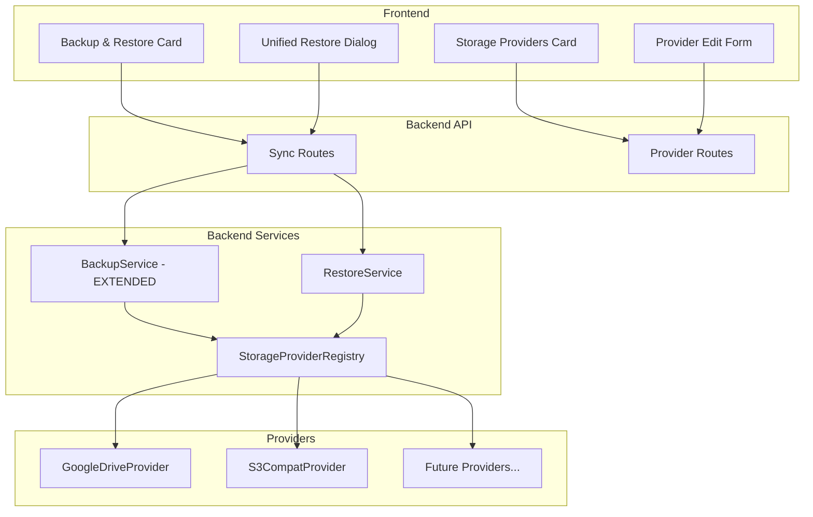
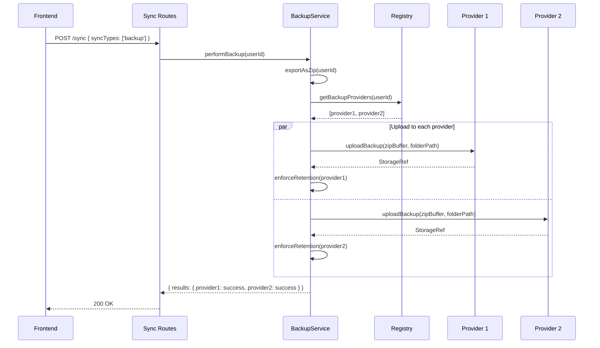
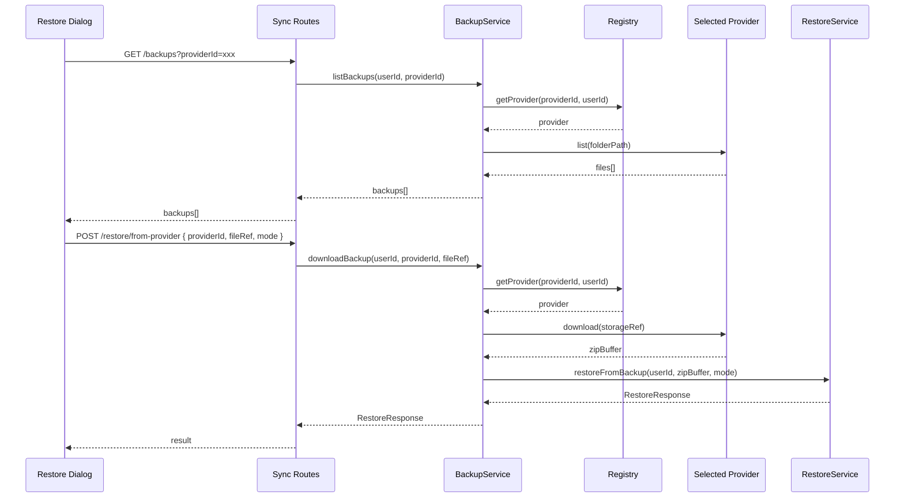

# Design Document: Unified Backup Providers

## Overview

The backup system is currently hardcoded to Google Drive — backup creation, listing, restore, and retention all go through `GoogleDriveService` directly. Meanwhile, the storage provider infrastructure (`StorageProvider` interface, `StorageProviderRegistry`, Google Drive and S3-compatible implementations) already supports multiple providers for photo storage.

This feature unifies the two systems so that any configured storage provider can serve as a backup target. A new `BackupConfig` structure (stored in `user_settings.backup_config` as JSON) tracks which providers are backup-enabled, their backup folder paths, and retention counts. The backup creation pipeline uses the generic `StorageProvider` interface to upload ZIP files, and listing/restore/retention work through any backup-enabled provider. Google Sheets sync remains a separate mechanism — it is not a storage provider.

On the frontend, the Settings page is restructured: the Storage Providers card gains per-provider backup toggles, the Backup & Restore card becomes provider-agnostic with a unified restore flow, and the Provider edit page gets a "Backup Settings" section.

## Architecture



## Sequence Diagrams

### Backup Creation Flow



### Unified Restore Flow



## Components and Interfaces

### Component 1: BackupService (EXTENDED)

**Purpose**: The existing `BackupService` in `sync/backup.ts` handles ZIP creation and parsing. It gains new methods for multi-provider upload, listing, download, deletion, and retention enforcement — replacing the Google Drive-specific logic currently in `sync/routes.ts`.

**New Methods Added to Existing Service**:
```typescript
// Added to the existing BackupService (sync/backup.ts)

/** Upload backup ZIP to all backup-enabled providers */
async performProviderBackup(userId: string, displayName: string): Promise<BackupSyncResult>;

/** List backup files from a specific provider */
async listBackups(userId: string, providerId: string): Promise<BackupFileInfo[]>;

/** List backup files from ALL backup-enabled providers */
async listAllBackups(userId: string): Promise<ProviderBackupList[]>;

/** Download a backup file from a specific provider */
async downloadBackup(userId: string, providerId: string, fileRef: string): Promise<Buffer>;

/** Delete a backup file from a specific provider */
async deleteBackup(userId: string, providerId: string, fileRef: string): Promise<void>;

/** Enforce retention policy for a specific provider */
async enforceRetention(userId: string, providerId: string): Promise<number>;
```

**Responsibilities** (in addition to existing ZIP creation/parsing):
- Load `BackupConfig` from user settings to determine which providers are backup-enabled
- Use `StorageProviderRegistry` to instantiate providers
- Upload backup ZIPs using the generic `StorageProvider` interface
- List/download/delete backup files through providers
- Enforce per-provider retention (max backup count, auto-delete oldest)

### Component 2: Extended StorageProvider Interface

**Purpose**: The existing `StorageProvider` interface needs a `list` method for backup file enumeration. Currently only Google Drive has `listFilesInFolder` on its service class, but this isn't exposed through the `StorageProvider` interface.

**Interface Extension**:
```typescript
interface StorageFileInfo {
  key: string;           // Provider-specific file identifier (Drive fileId or S3 key)
  name: string;          // Human-readable filename
  size: number;          // File size in bytes (GoogleDrive: Number(file.size) || 0; S3: native number)
  createdTime: string;   // ISO 8601 — Drive: file.createdTime; S3: same as lastModified
  lastModified: string;  // ISO 8601 — must never be undefined. Drive: file.modifiedTime ?? file.createdTime ?? epoch. S3: LastModified.
}

interface StorageProvider {
  // ... existing methods ...
  readonly type: string;
  upload(params: UploadParams): Promise<StorageRef>;
  download(ref: StorageRef): Promise<Buffer>;
  delete(ref: StorageRef): Promise<void>;
  getExternalUrl(ref: StorageRef): Promise<string | null>;
  healthCheck(): Promise<boolean>;

  // NEW: List files in a folder/prefix path
  list(folderPath: string): Promise<StorageFileInfo[]>;
}
```

**Responsibilities**:
- Google Drive: wraps `listFilesInFolder` on the underlying `GoogleDriveService`
- S3: uses `ListObjectsV2Command` with prefix filtering

### Component 3: BackupConfig (NEW Data Model)

**Purpose**: Tracks per-provider backup settings, replacing the flat `googleDriveBackup*` columns in `user_settings`.

**Interface**:
```typescript
interface ProviderBackupSettings {
  enabled: boolean;
  folderPath: string;       // e.g., "/Backups" — appended to provider's rootPath
  retentionCount: number;   // Max backups to keep (default 10)
  lastBackupAt?: string;    // ISO 8601 — updated per-provider on successful backup
  sheetsSyncEnabled?: boolean;   // Google Sheets sync toggle (only for google-drive providers)
  sheetsSpreadsheetId?: string;  // The synced spreadsheet ID (only for google-drive providers)
}

interface BackupConfig {
  providers: Record<string, ProviderBackupSettings>;  // keyed by providerId
}

const DEFAULT_BACKUP_CONFIG: BackupConfig = {
  providers: {},
};
```

### Component 4: Unified Restore Dialog (NEW Frontend Component)

**Purpose**: Replaces the three separate restore flows (file upload, Google Drive, Google Sheets) with a single stepped dialog.

**Interface**:
```typescript
interface UnifiedRestoreDialogProps {
  open: boolean;
  backupProviders: BackupProviderInfo[];  // Providers with backup enabled
  googleSheetsSyncEnabled: boolean;
  onRestore: (result: RestoreResult) => void;
  onClose: () => void;
}

interface BackupProviderInfo {
  id: string;
  displayName: string;
  providerType: string;
  backupEnabled: boolean;
}
```

**Steps**:
1. Source selection: "Upload file" | pick from backup-enabled providers | Google Sheets
2. If provider: list available backups (date, size, "latest" badge)
3. Preview (table counts, conflicts)
4. Mode selection (replace/merge) and execute

## Data Models

### BackupConfig (new JSON column on user_settings)

```typescript
// New column: user_settings.backup_config (JSON)
interface BackupConfig {
  providers: Record<string, ProviderBackupSettings>;
}

interface ProviderBackupSettings {
  enabled: boolean;
  folderPath: string;
  retentionCount: number;
}
```

**Validation Rules**:
- `folderPath` must not contain `..` (path traversal)
- `folderPath` must not exceed 255 characters
- `retentionCount` must be between 1 and 100
- Provider ID must reference an existing `user_providers` row owned by the user

**Migration Strategy**:
- Add `backup_config` JSON column to `user_settings` with default `'{}'`
- Data migration: for users with `googleDriveBackupEnabled = true`, populate `backup_config.providers[googleDriveProviderId]` with their existing settings
- Keep legacy `googleDriveBackup*` columns temporarily for backward compatibility during rollout
- Legacy columns can be dropped in a future migration once the new system is stable

### BackupFileInfo (API response type)

```typescript
interface BackupFileInfo {
  providerId: string;
  providerName: string;
  providerType: string;
  fileRef: string;        // Provider-specific reference (Drive fileId or S3 key)
  fileName: string;
  size: number;
  createdTime: string;
  isLatest: boolean;
}

interface ProviderBackupList {
  providerId: string;
  providerName: string;
  providerType: string;
  backups: BackupFileInfo[];
  error?: string;         // If listing failed for this provider
}

interface BackupSyncResult {
  results: Record<string, {
    success: boolean;
    message?: string;
    fileRef?: string;
    fileName?: string;
    deletedOldBackups?: number;
  }>;
  timestamp: string;
}
```

## Algorithmic Pseudocode

### Backup Creation Algorithm

```typescript
async function performBackup(userId: string, displayName: string): Promise<BackupSyncResult> {
  // Precondition: userId is authenticated and valid
  // Postcondition: ZIP uploaded to all backup-enabled providers, retention enforced

  const backupConfig = await loadBackupConfig(userId);
  const enabledProviders = Object.entries(backupConfig.providers)
    .filter(([_, settings]) => settings.enabled);

  if (enabledProviders.length === 0) {
    return { results: {}, timestamp: new Date().toISOString() };
  }

  // Generate ZIP once, upload to all providers
  const zipBuffer = await backupService.exportAsZip(userId);
  const timestamp = new Date().toISOString().replace(/[:.]/g, '-');
  const fileName = `vroom-backup-${timestamp}.zip`;

  const results: Record<string, unknown> = {};

  for (const [providerId, settings] of enabledProviders) {
    try {
      const provider = await registry.getProvider(providerId, userId);
      const folderPath = resolveBackupFolderPath(provider, settings);

      // Upload using generic StorageProvider interface
      const ref = await provider.upload({
        fileName,
        buffer: zipBuffer,
        mimeType: 'application/zip',
        entityType: 'backup',
        entityId: userId,
        pathHint: folderPath,
      });

      // Enforce retention
      const deletedCount = await enforceRetention(provider, settings);

      results[providerId] = {
        success: true,
        fileRef: ref.externalId,
        fileName,
        deletedOldBackups: deletedCount,
      };
    } catch (error) {
      // One provider failing doesn't block others
      results[providerId] = {
        success: false,
        message: error instanceof Error ? error.message : 'Backup failed',
      };
    }
  }

  await settingsRepository.updateBackupDate(userId);
  return { results, timestamp: new Date().toISOString() };
}
```

### Retention Enforcement Algorithm

```typescript
async function enforceRetention(
  provider: StorageProvider,
  settings: ProviderBackupSettings
): Promise<number> {
  // Precondition: provider is active and accessible
  // Postcondition: at most settings.retentionCount backups remain
  // Loop invariant: backups list is sorted newest-first

  const files = await provider.list(settings.folderPath);
  const backupFiles = files
    .filter(f => f.name.startsWith('vroom-backup-') && f.name.endsWith('.zip'))
    .sort((a, b) => b.lastModified.localeCompare(a.lastModified));

  if (backupFiles.length <= settings.retentionCount) return 0;

  const toDelete = backupFiles.slice(settings.retentionCount);
  let deletedCount = 0;

  for (const file of toDelete) {
    try {
      await provider.delete({
        providerType: provider.type,
        externalId: file.key,
      });
      deletedCount++;
    } catch (error) {
      logger.warn('Failed to delete old backup', { key: file.key, error });
    }
  }

  return deletedCount;
}
```

### Backup Config Migration Algorithm

```typescript
async function migrateBackupConfig(userId: string): Promise<void> {
  // Precondition: user has legacy googleDriveBackup* settings
  // Postcondition: backup_config populated, legacy fields preserved

  const settings = await settingsRepository.getOrCreate(userId);
  
  if (!settings.googleDriveBackupEnabled) return;
  if (settings.backupConfig?.providers && 
      Object.keys(settings.backupConfig.providers).length > 0) return; // Already migrated

  // Find the user's Google Drive provider
  const providers = await registry.getProvidersByDomain(userId, 'storage');
  const driveProvider = providers.find(p => p.providerType === 'google-drive');
  
  if (!driveProvider) return;

  const backupConfig: BackupConfig = {
    providers: {
      [driveProvider.id]: {
        enabled: true,
        folderPath: '/Backups',
        retentionCount: settings.googleDriveBackupRetentionCount ?? 10,
      },
    },
  };

  await settingsRepository.updateBackupConfig(userId, backupConfig);
}
```

## Key Functions with Formal Specifications

### Function: `BackupService.performProviderBackup()`

```typescript
async performProviderBackup(userId: string, displayName: string): Promise<BackupSyncResult>
```

**Preconditions:**
- `userId` is a valid, authenticated user ID
- At least one provider in `backupConfig.providers` has `enabled: true`
- Each enabled provider's `user_providers` row exists and has `status: 'active'`

**Postconditions:**
- Returns `BackupSyncResult` with one entry per enabled provider
- For each successful provider: ZIP file uploaded, retention enforced, `fileRef` populated
- For each failed provider: `success: false` with error message
- `lastBackupDate` updated in user_settings if at least one provider succeeded
- No side effects on the backup data itself (ZIP is read-only)

### Function: `StorageProvider.list()`

```typescript
async list(folderPath: string): Promise<StorageFileInfo[]>
```

**Preconditions:**
- Provider credentials are valid and not expired
- `folderPath` is a valid path within the provider's storage

**Postconditions:**
- Returns array of files in the specified folder/prefix
- Each `StorageFileInfo` has a valid `key` that can be used with `download()` and `delete()`
- Empty array if folder doesn't exist or is empty (no error thrown)
- Results are not guaranteed to be sorted (caller must sort)

### Function: `BackupService.listBackups()`

```typescript
async listBackups(userId: string, providerId: string): Promise<BackupFileInfo[]>
```

**Preconditions:**
- `userId` owns the provider identified by `providerId`
- Provider is backup-enabled in `backupConfig`

**Postconditions:**
- Returns backup files sorted newest-first
- Each file has `isLatest: true` only for the most recent backup
- Only files matching `vroom-backup-*.zip` pattern are included
- Empty array if no backups exist

### Function: `migrateBackupConfig()`

```typescript
async migrateBackupConfig(userId: string): Promise<void>
```

**Preconditions:**
- `userId` is valid
- Database is accessible

**Postconditions:**
- If user had `googleDriveBackupEnabled: true` and no existing `backupConfig`, config is populated
- If user already has `backupConfig` with entries, no changes made (idempotent)
- Legacy `googleDriveBackup*` columns are not modified
- If no Google Drive provider exists for the user, no changes made

## Example Usage

### Backend: Creating a backup to all providers

```typescript
// In sync/routes.ts — replaces the current performBackupSync()
routes.post('/', syncRateLimiter, idempotency({ required: false }), async (c) => {
  const user = c.get('user');
  const body = await c.req.json();
  const syncTypes = validateSyncTypes(body.syncTypes);
  const results: Record<string, unknown> = {};

  if (syncTypes.includes('backup')) {
    results.backup = await backupService.performProviderBackup(user.id, user.displayName);
  }
  if (syncTypes.includes('sheets')) {
    results.sheets = await performSheetsSync(user.id, user.displayName, settings);
  }

  return c.json(createSuccessResponse({ syncTypes, results }));
});
```

### Backend: Listing backups from a specific provider

```typescript
// GET /sync/backups?providerId=xxx (generalized from current Google-only endpoint)
routes.get('/backups', async (c) => {
  const user = c.get('user');
  const providerId = c.req.query('providerId');

  if (providerId) {
    const backups = await backupService.listBackups(user.id, providerId);
    return c.json(createSuccessResponse(backups));
  }

  // No providerId — list from all backup-enabled providers
  const allBackups = await backupService.listAllBackups(user.id);
  return c.json(createSuccessResponse(allBackups));
});
```

### Backend: Restoring from any provider

```typescript
// POST /sync/restore/from-provider (replaces /restore/from-drive-backup/:fileId)
routes.post('/restore/from-provider', restoreRateLimiter, idempotency({ required: true }), async (c) => {
  const user = c.get('user');
  const { providerId, fileRef, mode } = await c.req.json();

  const zipBuffer = await backupService.downloadBackup(user.id, providerId, fileRef);
  const result = await restoreService.restoreFromBackup(user.id, zipBuffer, mode);
  return c.json(createSuccessResponse(result));
});
```

### Frontend: Provider backup toggle in settings

```svelte
<!-- In ProviderCard.svelte — new backup toggle section -->
<div class="flex items-center justify-between">
  <div class="space-y-0.5">
    <Label for="backup-{provider.id}" class="text-sm">Backup target</Label>
    <p class="text-xs text-muted-foreground">Store ZIP backups on this provider</p>
  </div>
  <Switch
    id="backup-{provider.id}"
    checked={backupSettings.enabled}
    onCheckedChange={(checked) => onBackupToggle(provider.id, checked)}
  />
</div>
```

## Correctness Properties

*A property is a characteristic or behavior that should hold true across all valid executions of a system — essentially, a formal statement about what the system should do. Properties serve as the bridge between human-readable specifications and machine-verifiable correctness guarantees.*

### Property 1: Provider isolation during backup

*For any* set of backup-enabled providers where some providers fail and others succeed, the BackupSyncResult SHALL contain exactly one entry per enabled provider, successful providers SHALL have `success: true` with valid `fileRef` and `fileName`, failed providers SHALL have `success: false` with an error message, and no successful provider's result SHALL be affected by another provider's failure.

**Validates: Requirements 1.1, 1.3, 1.4**

### Property 2: Retention enforcement correctness

*For any* list of N files matching `vroom-backup-*.zip` in a provider's backup folder and a retention count R (1 ≤ R ≤ 100), after enforcement exactly `max(0, N - R)` files SHALL be deleted, the R newest files (by `lastModified`) SHALL be preserved, and the returned deleted count SHALL equal the number of actually successful deletions (not attempted).

**Validates: Requirements 2.2, 2.3, 2.4**

### Property 3: StorageFileInfo field coalescing

*For any* Google Drive file metadata with arbitrary combinations of null/undefined `createdTime`, `modifiedTime`, and `size` fields, the resulting `StorageFileInfo` SHALL have non-undefined `createdTime`, `lastModified`, and `size` fields — with `size` coerced via `Number(file.size) || 0` and timestamps coalesced to epoch as a fallback.

**Validates: Requirement 3.2**

### Property 4: Backup listing filter, sort, and badge

*For any* list of files returned by `provider.list()` containing a mix of backup files (`vroom-backup-*.zip`) and non-backup files, `listBackups()` SHALL return only the matching files, sorted newest-first by `lastModified`, with exactly one file marked `isLatest: true` (the most recent), and all others marked `isLatest: false`.

**Validates: Requirements 4.1, 4.2**

### Property 5: Restore source equivalence

*For any* valid backup ZIP file, restoring it via provider download (`POST /sync/restore/from-provider`) SHALL produce the same `RestoreResponse` as restoring the identical ZIP via file upload (`POST /sync/restore/from-backup`) — the restore result is determined solely by ZIP content, not by storage source.

**Validates: Requirement 5.1**

### Property 6: Restore endpoint input validation

*For any* request body to `POST /sync/restore/from-provider`, the endpoint SHALL accept bodies where `providerId` is a string of 1-64 chars, `fileRef` is a string of 1-1024 chars, and `mode` is one of `preview`, `replace`, `merge` — and SHALL reject all other inputs with a validation error.

**Validates: Requirement 5.2**

### Property 7: BackupConfig validation

*For any* `BackupConfig` submitted via `PUT /settings`, the validation SHALL accept configs where all `folderPath` values are 1-255 chars without `..` segments, all `retentionCount` values are integers between 1 and 100, and the total provider count is ≤ 20 — and SHALL reject configs violating any of these constraints.

**Validates: Requirements 6.2, 14.3**

### Property 8: Ownership enforcement

*For any* backup operation (list, download, delete, restore, config update), the system SHALL verify that the specified provider ID belongs to the authenticated user via `storageProviderRegistry.getProvider(providerId, userId)` or Zod ownership validation — and SHALL reject operations on providers not owned by the user.

**Validates: Requirements 5.4, 6.3, 14.1, 14.2**

### Property 9: Migration transformation correctness

*For any* user with `googleDriveBackupEnabled = true` or `googleSheetsSyncEnabled = true` and a matching active Google Drive provider, the migration SHALL produce a `BackupConfig` with that provider's ID as key, `enabled` matching the legacy backup flag, `retentionCount` matching the legacy value (defaulting to 10), and `sheetsSyncEnabled`/`sheetsSpreadsheetId` matching the legacy Sheets fields.

**Validates: Requirement 7.1**

### Property 10: Migration idempotency

*For any* user settings state, running `migrateBackupConfig` twice SHALL produce the same `backup_config` value as running it once — the second run detects the non-empty config and skips without modification.

**Validates: Requirement 7.3**

### Property 11: rawPath key routing

*For any* `UploadParams` with `rawPath` set, the S3CompatProvider SHALL use `rawPath/fileName` as the object key (bypassing `buildKey`), and the GoogleDriveProvider SHALL use `rawPath` as the folder path. *For any* `UploadParams` without `rawPath`, both providers SHALL use their existing key-building logic unchanged.

**Validates: Requirements 9.2, 9.3, 9.4**

### Property 12: Provider deletion cleans up BackupConfig

*For any* provider deletion where the provider has an entry in `backupConfig.providers`, the deletion handler SHALL remove that entry. *For any* provider deletion where no entry exists, the handler SHALL complete without error.

**Validates: Requirements 11.1, 11.2**

### Property 13: Stale provider resilience

*For any* `backupConfig` containing a provider ID that no longer exists in `user_providers`, the BackupService SHALL skip that provider during backup operations and continue with remaining providers without crashing.

**Validates: Requirement 11.3**

### Property 14: Restore dialog source options

*For any* set of backup-enabled providers and Sheets sync state, the UnifiedRestoreDialog SHALL display "Upload file" always, one option per backup-enabled provider (by display name), and "Google Sheets" if and only if at least one provider has `sheetsSyncEnabled: true`.

**Validates: Requirement 12.1**

### Property 15: Frontend derivation correctness

*For any* `BackupConfig`, the derived `googleSheetsSyncEnabled` SHALL be `true` if and only if at least one provider entry has `sheetsSyncEnabled: true`. The derived `lastBackupDate` SHALL equal the maximum `lastBackupAt` value across all provider entries, or `null` if no provider has a `lastBackupAt`.

**Validates: Requirements 13.4, 13.5**

### Property 16: Backup skip logic

*For any* call to `performProviderBackup`, if `force` is `false` and `activityTracker.hasChangesSinceLastSync(userId)` returns `false`, the result SHALL have `skipped: true` and no ZIP SHALL be generated. If `force` is `true`, the backup SHALL proceed regardless of change status.

**Validates: Requirements 15.1, 15.2**

### Property 17: lastBackupAt per-provider update

*For any* backup run with mixed success/failure across providers, only providers with `success: true` SHALL have their `lastBackupAt` field updated in `backupConfig`. Failed providers' `lastBackupAt` SHALL remain unchanged.

**Validates: Requirement 1.5**

## Error Handling

### Error Scenario 1: Provider credentials expired during backup

**Condition**: OAuth token expired or S3 keys rotated since last use
**Response**: Mark that provider's result as `{ success: false, message: 'Authentication failed — re-authenticate provider' }`. Continue with other providers.
**Recovery**: User re-authenticates the provider via the existing re-auth flow. Next backup attempt succeeds.

### Error Scenario 2: Provider deleted but backups exist

**Condition**: User deletes a storage provider that has backup files on it
**Response**: On provider deletion, remove the provider's entry from `backupConfig.providers`. Existing backup files on the remote storage are orphaned (not deleted — user may still access them directly).
**Recovery**: No automatic recovery needed. If user re-adds the same provider, they can manually browse for old backups.

### Error Scenario 3: Backup folder doesn't exist on provider

**Condition**: User or external process deleted the backup folder
**Response**: `list()` returns empty array (no error). `upload()` creates the folder path on-the-fly (Google Drive: find-or-create segments; S3: prefix-based, no folder creation needed).
**Recovery**: Automatic — next backup creates the folder structure.

### Error Scenario 4: Backup file corrupted or not a valid ZIP

**Condition**: Downloaded file from provider fails ZIP parsing
**Response**: `restoreService.restoreFromBackup` throws `SyncError(VALIDATION_ERROR)` with descriptive message.
**Recovery**: User selects a different backup file or uploads a known-good backup manually.

### Error Scenario 5: Provider storage quota exceeded

**Condition**: Google Drive or S3 bucket is full
**Response**: Upload fails, provider result marked as `{ success: false, message: 'Storage quota exceeded' }`. Other providers continue.
**Recovery**: User frees space on the provider or reduces retention count.

## Testing Strategy

### Unit Testing Approach

- `BackupService.performProviderBackup()`: Mock `StorageProviderRegistry`. Verify ZIP is generated once and uploaded to each enabled provider. Verify retention is enforced per-provider.
- `BackupService.listBackups()`: Mock provider's `list()` method. Verify filtering (`vroom-backup-*.zip`), sorting (newest first), and `isLatest` badge.
- `enforceRetention()`: Mock provider's `list()` and `delete()`. Verify correct files are deleted when count exceeds retention.
- `migrateBackupConfig()`: Test with various initial states (no Drive provider, already migrated, legacy settings present).
- `StorageProvider.list()` implementations: Test Google Drive and S3 list methods with mocked API responses.

### Property-Based Testing Approach

**Property Test Library**: fast-check

- **Retention property**: For any list of N backup files and retention count R (1 ≤ R ≤ N), after enforcement exactly max(0, N - R) files are deleted, and the R newest files are preserved.
- **Backup config validation**: For any generated `BackupConfig`, validation accepts configs with valid folder paths and retention counts, rejects configs with path traversal or out-of-range retention.
- **Migration idempotency**: For any initial settings state, applying `migrateBackupConfig` twice produces the same result as applying it once.

### Integration Testing Approach

- End-to-end backup + restore cycle: Create backup → list backups → download latest → restore with mode=replace → verify data integrity.
- Multi-provider backup: Configure two providers → backup → verify both have the ZIP → delete one provider → verify other still works.
- Migration test: Seed legacy Google Drive backup settings → run migration → verify `backupConfig` populated correctly → verify backup still works through new system.

## Performance Considerations

- **Single ZIP generation**: The backup ZIP is generated once and uploaded to all providers in parallel (or sequentially if needed for rate limiting). No redundant data serialization.
- **Parallel uploads**: When multiple providers are backup-enabled, uploads can run concurrently using `Promise.allSettled()` to avoid one slow provider blocking others.
- **Lazy provider instantiation**: Provider instances are created on-demand via the registry, not pre-loaded. Credential decryption only happens when the provider is actually used.
- **List pagination**: S3 `ListObjectsV2` is paginated by default (1000 objects). For users with many backups, the `list()` implementation should handle pagination. Google Drive's `listFilesInFolder` already handles this.
- **Backup file size**: ZIP backups are typically small (KB to low MB for data-only). Photo inclusion is a future feature and not in scope here.

## Security Considerations

- **Ownership validation**: All backup operations go through `registry.getProvider(providerId, userId)` which enforces user ownership. No cross-user access.
- **Path traversal prevention**: `folderPath` in `ProviderBackupSettings` is validated to reject `..` segments and absolute paths.
- **Credential isolation**: Provider credentials remain encrypted in the database. The `BackupService` never handles raw credentials — it delegates to the registry which decrypts on-demand.
- **Rate limiting**: Backup and restore endpoints retain their existing rate limiters (`backupRateLimiter`, `restoreRateLimiter`).
- **No credential leakage in responses**: API responses include `providerId` and `providerType` but never credentials or internal folder IDs beyond what's needed for restore operations.

## Implementation Notes (Review Findings)

### Note 1: BackupService Registry Access

The existing `BackupService` is a class with a singleton export (`export const backupService = new BackupService()`). The new provider-aware methods do NOT inject `StorageProviderRegistry` via the constructor. Instead, they import the `storageProviderRegistry` singleton lazily inside each method body — the same pattern used by `sync/routes.ts`. This avoids initialization order issues since the import is resolved at call time, not module load time. The `BackupService` constructor remains parameterless.

```typescript
// Inside BackupService methods — lazy import, not constructor injection
async performProviderBackup(userId: string, displayName: string): Promise<BackupSyncResult> {
  const { storageProviderRegistry } = await import('../providers/registry');
  // ... use registry ...
}
```

The `BackupService` also loads `BackupConfig` directly from `user_settings` via `settingsRepository` rather than going through the registry. Backup config is a backup concern, not a photo-routing concern — the registry stays focused on photo storage.

### Note 2: StorageProvider.list() — Path vs Folder ID

The `list(folderPath: string)` method takes a path string, not a provider-specific ID. Each provider handles path resolution internally:

- **Google Drive**: The implementation resolves the path to a folder ID using the existing `GoogleDriveService.resolveFolderPath()` method, then calls `listFilesInFolder(folderId)`. The caller never sees folder IDs.
- **S3-compatible**: Uses `ListObjectsV2Command` with the path as a key prefix. S3 `ListObjectsV2` requires `s3:ListBucket` permission, which is included in most IAM policies that already grant `s3:PutObject`/`s3:GetObject`/`s3:DeleteObject` (the permissions needed for photo upload/download). If a user created a write-only policy (rare), the `list()` call fails gracefully and the backup listing UI shows an error for that provider. The S3 implementation must handle pagination (`IsTruncated` + `ContinuationToken`) since `ListObjectsV2` returns max 1000 objects per request.

Both implementations return `StorageFileInfo[]` with a `key` field that can be passed directly to `download()` and `delete()` — for Drive this is the `fileId`, for S3 this is the full object key.

### Note 3: Google Drive Folder Structure Abstraction

The current `ensureBackupFolder()` in `sync/routes.ts` does two things: (a) ensures the VROOM folder structure exists on Google Drive (4 subfolders: Receipts, Maintenance Records, Vehicle Photos, Backups), and (b) returns the backup subfolder ID. This is Google Drive-specific.

For the new system, each provider's `upload()` already handles path creation:
- Google Drive's `upload()` resolves/creates folder segments on-the-fly via `resolveFolderPath()`
- S3 doesn't need folder creation — prefixes are implicit in the object key

So the `BackupService.performProviderBackup()` just calls `provider.upload()` with the backup folder path from `BackupConfig.providers[id].folderPath` — no separate `ensureBackupFolder()` needed. The existing `ensureBackupFolder()` and `createVroomFolderStructure()` remain for the legacy backup flow during the transition period but are not called by the new code path.

### Note 4: New Restore Endpoints (Replace Legacy)

Legacy Google Drive-specific endpoints are removed. New provider-agnostic endpoints replace them:

- `GET /api/v1/sync/backups/providers?providerId=xxx` — list backups from a specific provider. Without `providerId`, lists from all backup-enabled providers.
- `POST /api/v1/sync/restore/from-provider` — restore from any provider. Takes `{ providerId, fileRef, mode }`. Downloads the ZIP via `provider.download()`, then passes the buffer to the existing `restoreFromBackup()` function.

Removed endpoints:
- `GET /api/v1/sync/backups` (was Google Drive-only listing) — replaced by `/backups/providers`
- `GET /api/v1/sync/backups/:fileId/download` (was Drive-specific) — replaced by `downloadBackup()` through the provider
- `DELETE /api/v1/sync/backups/:fileId` (was Drive-specific) — replaced by `deleteBackup()` through the provider
- `POST /api/v1/sync/backups/initialize-drive` (was Drive-specific folder setup) — no longer needed, providers create folders on upload

Kept endpoints (still valid):
- `GET /api/v1/sync/backups/download` — download a fresh ZIP backup (local file download, not provider-specific)
- `POST /api/v1/sync/restore/from-backup` — restore from uploaded file (unchanged)
- `POST /api/v1/sync/restore/from-sheets` — restore from Google Sheets (unchanged, Sheets is not a provider)

### Note 5: Settings Migration — Hard Migration (Breaking Change)

This is a clean break — no legacy column coexistence. All backup configuration moves to `backup_config` and the old Google Drive-specific columns are dropped.

**Step 1 — Drizzle migration**:
1. Add `backup_config` JSON column to `user_settings` with default `'{}'`
2. Drop legacy columns: `google_drive_backup_enabled`, `google_drive_backup_folder_id`, `google_drive_backup_retention_count`, `google_drive_custom_folder_name`, `google_sheets_sync_enabled`, `google_sheets_spreadsheet_id`

**Step 2 — Data migration** (in `data-migration.ts`, runs on startup before the column drop, idempotent):
For each user where `googleDriveBackupEnabled = true` AND `backup_config` is empty/`'{}'`:
1. Find their Google Drive storage provider ID from `user_providers`
2. Populate `backup_config = { providers: { [providerId]: { enabled: true, folderPath: '/Backups', retentionCount: googleDriveBackupRetentionCount ?? 10, sheetsSyncEnabled: googleSheetsSyncEnabled ?? false, sheetsSpreadsheetId: googleSheetsSpreadsheetId ?? null } } }`
3. Skip if no Google Drive provider exists for the user
4. If `googleDriveBackupFolderId` is null (user enabled but never initialized), still migrate with `enabled: true` — the new system will create the folder on first backup via `provider.upload()`
5. Also migrate users where `googleSheetsSyncEnabled = true` even if `googleDriveBackupEnabled = false` — they need a `backupConfig` entry with `enabled: false` but `sheetsSyncEnabled: true`

**Step 3 — Code cleanup**:
- Remove all references to `googleDriveBackupEnabled`, `googleDriveBackupFolderId`, `googleDriveBackupRetentionCount`, `googleDriveCustomFolderName`, `googleSheetsSyncEnabled`, `googleSheetsSpreadsheetId` from:
  - `backend/src/db/schema.ts` (column definitions)
  - `backend/src/api/settings/routes.ts` (validation schemas, merge logic)
  - `backend/src/api/settings/repository.ts` (updateSyncConfig, updateBackupFolderId, updateSyncDate methods)
  - `backend/src/api/sync/routes.ts` (performBackupSync, ensureBackupFolder, all Drive-specific backup logic, POST /sync/configure endpoint)
  - `frontend/src/lib/types/settings.ts` (UserSettings interface)
  - `frontend/src/lib/stores/settings.svelte.ts` (configureSyncSettings, Drive-specific methods)
  - `frontend/src/lib/services/settings-api.ts` (configureSyncSettings, Drive-specific API calls)
  - `frontend/src/lib/components/settings/BackupSyncCard.svelte` (Google Drive toggle, Sheets toggle, retention selector)
  - `frontend/src/routes/settings/+page.svelte` (all googleDriveBackup* and googleSheets* state variables)
- Remove `ensureBackupFolder()`, `performBackupSync()`, `enforceBackupRetention()` from `sync/routes.ts` — replaced by `BackupService` methods
- Remove `settingsStore.configureSyncSettings()` — backup config is now managed through `backupConfig` on the settings object
- The `googleDriveCustomFolderName` functionality (naming the VROOM folder on Drive) moves to the provider's `config.customFolderName` field if needed, or is dropped entirely since the new system uses `rootPath + folderPath`

**No legacy. No backward compat. Clean cut.**

### Note 6: BackupService Loads Backup Config Directly (No New Registry Methods)

The `BackupService` loads `BackupConfig` from `user_settings.backup_config` directly via `settingsRepository`, then calls `storageProviderRegistry.getProvider(providerId, userId)` for each enabled provider. This avoids adding backup-specific methods to the `StorageProviderRegistry`, which stays focused on photo storage routing.

The existing `StorageProviderRegistry.getBackupProviders(userId, category)` is for photo backup providers (providers with a photo category enabled, excluding the default). This is conceptually different from "providers that store backup ZIP files." The naming distinction is important:
- `registry.getBackupProviders(userId, category)` → photo redundancy providers
- `backupService.getBackupEnabledProviders(userId)` → backup ZIP storage providers (reads from `backup_config`)

### Note 7: Frontend Settings Store Updates (Hard Migration)

The `settingsStore` in `frontend/src/lib/stores/settings.svelte.ts` is cleaned up. All Google Drive-specific backup methods are removed and replaced with provider-agnostic ones:

**Removed methods**: `listBackups()`, `downloadBackupFromDrive(fileId)`, `restoreFromDriveBackup(fileId, mode)`, `deleteBackup(fileId)`, `initializeDrive()`, `configureSyncSettings()`

**New methods**:
```typescript
async listBackupsFromProvider(providerId: string): Promise<BackupFileInfo[]>
async listAllBackups(): Promise<ProviderBackupList[]>
async restoreFromProvider(providerId: string, fileRef: string, mode: string): Promise<RestoreResult>
async deleteBackupFromProvider(providerId: string, fileRef: string): Promise<void>
```

**Kept methods** (still valid): `downloadBackup()` (local ZIP download), `uploadBackup()` (file restore), `restoreFromSheets()` (Sheets is not a provider), `executeSync()` (triggers backup to all enabled providers).

The `BackupSyncCard` component is replaced with a new provider-agnostic backup card. The `BackupNowDialog` is updated to show per-provider results. The three separate `RestoreDialog` instances are replaced by the unified restore dialog.

## Review Fixes (Detailed Review Round 2)

### Fix 1: StorageFileInfo field coercion (Issues #1, #2, #3)

`StorageFileInfo` now has both `createdTime` and `lastModified` fields. Provider implementations must coalesce:
- **Google Drive**: `lastModified: file.modifiedTime ?? file.createdTime ?? new Date(0).toISOString()`, `createdTime: file.createdTime ?? file.modifiedTime ?? new Date(0).toISOString()`, `size: Number(file.size) || 0`
- **S3**: `lastModified: obj.LastModified.toISOString()`, `createdTime: obj.LastModified.toISOString()` (S3 doesn't distinguish), `size: obj.Size ?? 0`

`BackupFileInfo.createdTime` maps from `StorageFileInfo.createdTime` for display. Sorting uses `lastModified`.

### Fix 4: enforceRetention returns actual deleted count

The existing `enforceBackupRetention` returns `toDelete.length` (attempted). The new version returns `deletedCount` (actual successes). This is intentional — the old behavior was a bug. Tests asserting on `deletedOldBackups` must be updated.

### Fix 5: Interface + implementations must land atomically

The `StorageProvider.list()` interface extension, `GoogleDriveProvider.list()`, and `S3CompatProvider.list()` must all be implemented in the same commit. You cannot merge the interface change without both implementations.

### Fix 6: settingsRepository.updateBackupConfig() must be created

Add to `SettingsRepository`:
```typescript
async updateBackupConfig(userId: string, config: BackupConfig): Promise<void> {
  await this.db.update(userSettings)
    .set({ backupConfig: config, updatedAt: new Date() })
    .where(eq(userSettings.userId, userId));
}
```
Also add `backupConfig` column to the Drizzle schema: `text('backup_config', { mode: 'json' }).$type<BackupConfig>().default('{}')`.

### Fix 7 + Fix 13: resolveBackupFolderPath defined explicitly

```typescript
function resolveBackupFolderPath(providerRow: UserProvider, settings: ProviderBackupSettings): string {
  const rootPath = (providerRow.config as Record<string, unknown> | null)?.rootPath as string ?? '';
  return rootPath + settings.folderPath;
}
```
Both `performProviderBackup` upload AND `enforceRetention` listing must use this same resolved path.

### Fix 8: listBackups queries user_providers for metadata

`listBackups(userId, providerId)` queries `user_providers` directly for `displayName` and `providerType` before calling `provider.list()`. No new registry method needed.

### Fix 9: Restore endpoint validation

New `POST /sync/restore/from-provider` uses Zod: `z.object({ providerId: z.string().min(1).max(64), fileRef: z.string().min(1).max(1024), mode: z.enum(['preview', 'replace', 'merge']) })` with `zValidator('json', schema)`.

### Fix 10: fileRef naming convention (no legacy)

All APIs use `fileRef` consistently. Legacy `fileId`-based endpoints are removed entirely. Frontend `settingsApi` methods use `fileRef`:
```typescript
async listBackupsFromProvider(providerId: string): Promise<BackupFileInfo[]>
async restoreFromProvider(providerId: string, fileRef: string, mode: string): Promise<RestoreResult>
```
Remove legacy methods: `downloadBackupFromDrive(fileId)`, `deleteBackup(fileId)`, `listBackups()` (Drive-only).

### Fix 11: Migration picks first active Google Drive provider

Documented limitation: if multiple Drive providers exist, migration picks the first active one.

### Fix 12: list() handles pagination internally

`StorageProvider.list()` postcondition updated: "Returns ALL files, handling provider-specific pagination internally."

### Fix 14: Frontend types updated

Add `BackupConfig`, `ProviderBackupSettings` to `frontend/src/lib/types/settings.ts`. Add `backupConfig?: BackupConfig` to `UserSettings`.

### Fix 15: RestoreResult type alignment

Frontend `RestoreResult` must match backend `RestoreResponse`. Remove recursive `data?` field.

### Fix 16: Per-provider lastBackupAt

`ProviderBackupSettings.lastBackupAt` updated per-provider on success. The global `lastBackupDate` column is dropped (part of the hard migration). UI reads per-provider dates from `backupConfig`.

### Fix 17: Provider backup listing endpoint

Legacy `GET /sync/backups` (Drive-only) is removed. New `GET /sync/backups/providers` returns `ProviderBackupList[]` for the unified restore dialog. Supports `?providerId=xxx` to filter to a single provider.

### Fix 18: S3 key structure for backups

Backup key: `{rootPath}{folderPath}/{fileName}`. Leading slashes stripped by `buildKey()`. Retention filter (`vroom-backup-*.zip`) prevents listing unrelated files.

### Fix 19: Migration handles null googleDriveBackupFolderId

If `googleDriveBackupEnabled = true` but `googleDriveBackupFolderId` is null, the migration still creates the `backupConfig` entry with `enabled: true`. The new system will create the folder on first backup via `provider.upload()`. No need to skip — the old folder ID is irrelevant since the new system uses `rootPath + folderPath`.

### Fix 20: Provider deletion cleans up backupConfig

Provider delete route calls `cleanupBackupConfig(userId, providerId)` after `cleanupStorageConfig()`:
```typescript
async function cleanupBackupConfig(userId: string, providerId: string): Promise<void> {
  const settings = await settingsRepository.getOrCreate(userId);
  if (!settings.backupConfig?.providers?.[providerId]) return;
  const updated = { ...settings.backupConfig };
  updated.providers = { ...updated.providers };
  delete updated.providers[providerId];
  await settingsRepository.updateBackupConfig(userId, updated);
}
```

## Dependencies

- **Existing**: `BackupService` in `sync/backup.ts` (ZIP creation/parsing — extended with provider methods), `RestoreService` (data import), `StorageProviderRegistry` (provider instantiation), `GoogleDriveProvider`, `S3CompatProvider`
- **AWS SDK**: `@aws-sdk/client-s3` — needs `ListObjectsV2Command` added to S3 provider imports
- **Database**: New `backup_config` JSON column on `user_settings` table, plus a Drizzle migration
- **Frontend**: shadcn-svelte `Dialog` (no Stepper — use a custom step state machine with `{#if step === N}` blocks)

## Agent Implementation Guide

This section resolves all ambiguities identified in review. Each decision is final — do not deviate.

### Decision 1: autoRestoreFromLatestBackup() — Remove entirely

The existing `RestoreService.autoRestoreFromLatestBackup()` and its endpoint `POST /sync/restore/auto` are deleted. The frontend never calls this endpoint — there are zero references in the frontend codebase. Users restore manually through the unified restore dialog.

**Remove:**
- `autoRestoreFromLatestBackup()` method from `RestoreService`
- `POST /sync/restore/auto` route from `sync/routes.ts`

### Decision 2: POST /sync/configure — Remove entirely. Sheets sync moves to provider config.

Google Sheets sync is a Google Drive capability — it uses the same OAuth token and the same Google account. It should be configured per-provider, not as a standalone setting.

**Remove:**
- `POST /sync/configure` endpoint from `sync/routes.ts`
- `configureSyncSettings()` from frontend `settingsStore`
- `configureSyncSettings()` from frontend `settingsApi`
- `updateSyncConfig()` from `SettingsRepository`
- `googleSheetsSyncEnabled` column from `user_settings` (part of the hard migration)
- `googleSheetsSpreadsheetId` column from `user_settings` (moves to provider config)

**Move to `ProviderBackupSettings`:**
```typescript
interface ProviderBackupSettings {
  enabled: boolean;
  folderPath: string;
  retentionCount: number;
  lastBackupAt?: string;
  sheetsSyncEnabled?: boolean;      // NEW: Google Sheets sync toggle (only meaningful for google-drive providers)
  sheetsSpreadsheetId?: string;     // NEW: The synced spreadsheet ID
}
```

Only Google Drive providers can have `sheetsSyncEnabled: true`. The UI shows the Sheets toggle only when editing a Google Drive provider. S3 providers don't show it.

**Sync inactivity settings** (`syncOnInactivity`, `syncInactivityMinutes`) stay on `user_settings` as global settings — they control when the background sync fires, not which providers are involved. These are updated via `PUT /settings` directly.

**The `POST /sync` route** checks `backupConfig` for enabled providers (for backup) and checks `sheetsSyncEnabled` on the Google Drive provider entry (for Sheets sync). The `executeSyncType` function is updated accordingly.

### Decision 3: S3 upload key structure — New `rawPath` field on UploadParams

Add an optional `rawPath` field to `UploadParams`:

```typescript
interface UploadParams {
  fileName: string;
  buffer: Buffer;
  mimeType: string;
  entityType: string;
  entityId: string;
  pathHint: string;
  rawPath?: string;  // NEW: If set, key = rawPath/fileName (bypasses buildKey)
}
```

In `S3CompatProvider.upload()`:
```typescript
const key = params.rawPath
  ? this.buildRawKey(params.rawPath, params.fileName)  // rawPath/fileName, strip leading slashes
  : this.buildKey(params);  // existing entityType/entityId/fileName structure
```

In `GoogleDriveProvider.upload()`:
```typescript
const folderPath = params.rawPath ?? params.pathHint;
// resolveFolderPath already handles path-to-ID resolution
```

The backup upload call:
```typescript
const folderPath = resolveBackupFolderPath(providerRow, settings);
const ref = await provider.upload({
  fileName,
  buffer: zipBuffer,
  mimeType: 'application/zip',
  entityType: 'backup',
  entityId: userId,
  pathHint: '',
  rawPath: folderPath,  // Full resolved path: rootPath + /Backups
});
```

### Decision 4: pathHint vs rootPath — rawPath resolves this

With `rawPath`, the caller passes the full resolved path (`rootPath + folderPath`). The provider does NOT prepend rootPath again. For photo uploads (existing behavior), `pathHint` is used and the provider prepends rootPath as before. For backup uploads, `rawPath` bypasses this.

`resolveBackupFolderPath` returns the full path:
```typescript
function resolveBackupFolderPath(providerRow: UserProvider, settings: ProviderBackupSettings): string {
  const rootPath = (providerRow.config as Record<string, unknown> | null)?.rootPath as string ?? '';
  return rootPath + settings.folderPath;
}
```

Both `upload(rawPath)` and `list(folderPath)` and `enforceRetention` use this same resolved path.

### Decision 5: lastBackupDate replacement

The `lastBackupDate` column is dropped. Replace with a derived value:

**Backend** — `GET /sync/status` returns:
```typescript
lastBackupDate: deriveLastBackupDate(settings.backupConfig),
```
Where:
```typescript
function deriveLastBackupDate(backupConfig: BackupConfig | null): string | null {
  if (!backupConfig?.providers) return null;
  let latest: string | null = null;
  for (const settings of Object.values(backupConfig.providers)) {
    if (settings.lastBackupAt && (!latest || settings.lastBackupAt > latest)) {
      latest = settings.lastBackupAt;
    }
  }
  return latest;
}
```

**Frontend** — `settings.lastBackupDate` is removed from `UserSettings`. The UI reads backup dates from `settings.backupConfig.providers[id].lastBackupAt` per-provider, or derives a global "last backup" from the most recent across all providers.

The `settingsRepository.updateBackupDate()` method is removed. Instead, `performProviderBackup` updates `backupConfig.providers[id].lastBackupAt` directly via `settingsRepository.updateBackupConfig()`.

### Decision 6: backupConfig Zod validation on PUT /settings

Add to `settings/routes.ts`:

```typescript
const providerBackupSettingsSchema = z.object({
  enabled: z.boolean(),
  folderPath: z.string().min(1).max(255).refine(s => !s.includes('..'), { message: 'Path traversal not allowed' }),
  retentionCount: z.number().int().min(1).max(100),
  lastBackupAt: z.string().datetime().optional(),
});

const backupConfigSchema = z.object({
  providers: z.record(z.string().max(64), providerBackupSettingsSchema)
    .refine(obj => Object.keys(obj).length <= 20, { message: 'Too many provider entries (max 20)' }),
});
```

`backupConfig` is updatable via `PUT /settings` (same as `storageConfig`). The `updateSettingsSchema` extends with `backupConfig: backupConfigSchema.optional()`. Validation includes ownership check — all provider IDs in `backupConfig.providers` must exist in `user_providers` and belong to the user.

### Decision 7: RestoreResponse exact type

Backend returns:
```typescript
interface RestoreResponse {
  success: boolean;
  preview?: ImportSummary;
  imported?: ImportSummary;
  conflicts?: Array<{ table: string; id: string; localData: unknown; remoteData: unknown }>;
}
```

Frontend type (replace current `RestoreResult`):
```typescript
interface RestoreResponse {
  success: boolean;
  preview?: Record<string, number>;
  imported?: Record<string, number>;
  conflicts?: Array<{ table: string; id: string }>;
}
```

No recursive `data?` field. The `apiClient` unwraps the envelope, so the frontend gets `RestoreResponse` directly.

### Decision 8: hasChanges skip logic — Preserved

`performProviderBackup` accepts a `force` parameter:
```typescript
async performProviderBackup(userId: string, displayName: string, force: boolean = false): Promise<BackupSyncResult>
```

If `!force`, check `activityTracker.hasChangesSinceLastSync(userId)`. If no changes, return `{ results: {}, timestamp, skipped: true }`. The `POST /sync` route passes `force` through.

### Decision 9: BackupNowDialog updated props

```typescript
interface BackupNowDialogProps {
  open: boolean;
  isSyncing: boolean;
  syncSheets: boolean;
  syncBackup: boolean;
  googleSheetsSyncEnabled: boolean;
  backupProvidersEnabled: boolean;  // true if any provider has backup enabled
  syncResults: BackupSyncResult | null;  // per-provider results
  onSync: () => void;
}
```

The dialog shows a checkbox for "Backup to providers" (replaces "Google Drive") and "Sync to Google Sheets". Results show per-provider success/failure.

### Decision 10: Repository cleanup — explicit list

Remove from `SettingsRepository`:
- `updateBackupDate(userId, backupFolderId?)` — replaced by updating `backupConfig.providers[id].lastBackupAt`
- `updateBackupFolderId(userId, folderId)` — no longer needed, folder paths are in `backupConfig`
- `updateSyncConfig()` — simplified to only handle Sheets/inactivity fields, rename to `updateSyncPreferences()`

Add to `SettingsRepository`:
- `updateBackupConfig(userId, config)` — writes `backupConfig` JSON column

### Decision 11: GoogleDriveProvider.list() implementation

```typescript
async list(folderPath: string): Promise<StorageFileInfo[]> {
  const folderId = await this.driveService.resolveFolderPath(folderPath);
  if (!folderId) return [];
  const files = await this.driveService.listFilesInFolder(folderId);
  return files.map(f => ({
    key: f.id,
    name: f.name,
    size: Number(f.size) || 0,
    createdTime: f.createdTime ?? f.modifiedTime ?? new Date(0).toISOString(),
    lastModified: f.modifiedTime ?? f.createdTime ?? new Date(0).toISOString(),
  }));
}
```

### Decision 12: Frontend provider list for restore dialog

The unified restore dialog receives `backupProviders` derived in the settings page:

```typescript
// In settings page or backup card component
let backupProviders = $derived.by(() => {
  if (!settings?.backupConfig?.providers) return [];
  return providers
    .filter(p => settings.backupConfig?.providers[p.id]?.enabled)
    .map(p => ({
      id: p.id,
      displayName: p.displayName,
      providerType: p.providerType,
    }));
});
```

The `providers` list comes from `providerApi.getProviders('storage')` (already loaded by `PhotoStorageSettings`). The `backupConfig` comes from `settingsStore.settings.backupConfig`. Both are available on the settings page.

### Decision 13: Parallel uploads in pseudocode

Replace the sequential `for...of` loop with `Promise.allSettled()`:

```typescript
const uploadResults = await Promise.allSettled(
  enabledProviders.map(async ([providerId, settings]) => {
    const provider = await registry.getProvider(providerId, userId);
    const providerRow = await db.select()...;
    const folderPath = resolveBackupFolderPath(providerRow, settings);
    const ref = await provider.upload({ ..., rawPath: folderPath });
    const deletedCount = await enforceRetention(provider, folderPath, settings);
    return { providerId, success: true, fileRef: ref.externalId, fileName, deletedOldBackups: deletedCount };
  })
);
```

### Decision 14: Data migration uses raw SQL

The migration pseudocode in Note 5 is conceptual. The actual implementation in `data-migration.ts` uses raw SQLite queries (same pattern as the existing `runDataMigration` function). The registry and ORM are NOT used — they may not be initialized when the migration runs. Example:

```typescript
// Raw SQL in data-migration.ts
const users = sqlite.query(
  "SELECT us.user_id, us.google_drive_backup_enabled, us.google_drive_backup_retention_count, us.google_sheets_sync_enabled, us.google_sheets_spreadsheet_id, up.id as provider_id " +
  "FROM user_settings us " +
  "LEFT JOIN user_providers up ON up.user_id = us.user_id AND up.domain = 'storage' AND up.provider_type = 'google-drive' AND up.status = 'active' " +
  "WHERE (us.google_drive_backup_enabled = 1 OR us.google_sheets_sync_enabled = 1) AND (us.backup_config IS NULL OR us.backup_config = '{}')"
).all();
```

### Decision 15: Sheets sync data flow (end-to-end)

Google Sheets sync is now a per-provider capability stored in `backupConfig.providers[providerId].sheetsSyncEnabled`. Here's the full data flow:

**Backend — `POST /sync` route (Sheets branch):**
1. Load `backupConfig` from `user_settings`
2. Find the Google Drive provider entry where `sheetsSyncEnabled: true`
3. If found, load the provider via `storageProviderRegistry.getProvider(providerId, userId)` to get the refresh token
4. Call `performSheetsSync()` using that provider's credentials — the existing `createSheetsServiceForUser()` takes a `userId` and looks up the refresh token from `users.googleRefreshToken`. This doesn't change — Sheets sync uses the user's Google OAuth token, not the provider's stored credentials. The provider entry just controls whether Sheets sync is enabled.
5. The `sheetsSpreadsheetId` is stored in `backupConfig.providers[providerId].sheetsSpreadsheetId` instead of `user_settings.googleSheetsSpreadsheetId`. After sync, update this field via `settingsRepository.updateBackupConfig()`.

**Backend — `POST /sync/restore/from-sheets`:**
1. Load `backupConfig`, find the Google Drive provider with `sheetsSyncEnabled: true`
2. Read `sheetsSpreadsheetId` from that provider's backup settings
3. Pass to `restoreService.restoreFromSheets()` — this method currently reads `settings.googleSheetsSpreadsheetId`, so it needs updating to accept the spreadsheet ID as a parameter instead of reading it from settings.

**Frontend — Settings page:**
1. The Sheets sync toggle moves from `BackupSyncCard` into the provider edit page (`ProviderForm.svelte`), shown only for `google-drive` providers
2. The "Restore from Sheets" option in the unified restore dialog checks `backupConfig.providers` for any provider with `sheetsSyncEnabled: true`
3. The "Backup Now" dialog shows Sheets sync as an option only if a provider has `sheetsSyncEnabled: true`

**Frontend — Data derivation:**
```typescript
// Derive Sheets sync state from backupConfig
let sheetsSyncProvider = $derived.by(() => {
  if (!settings?.backupConfig?.providers) return null;
  for (const [id, config] of Object.entries(settings.backupConfig.providers)) {
    if (config.sheetsSyncEnabled) return { id, config };
  }
  return null;
});
let googleSheetsSyncEnabled = $derived(!!sheetsSyncProvider);
```

**Key files touched for Sheets migration:**
- `backend/src/api/sync/routes.ts` — `executeSyncType()` reads `sheetsSyncEnabled` from `backupConfig` instead of `settings.googleSheetsSyncEnabled`
- `backend/src/api/sync/restore.ts` — `restoreFromSheets()` accepts `spreadsheetId` parameter instead of reading from settings
- `backend/src/api/sync/google-sheets.ts` — no changes (uses user's OAuth token, not provider credentials)
- `frontend/src/lib/components/settings/ProviderForm.svelte` — adds Sheets sync toggle for Google Drive providers
- `frontend/src/routes/settings/+page.svelte` — removes `googleSheetsSyncEnabled` state, derives from `backupConfig`
