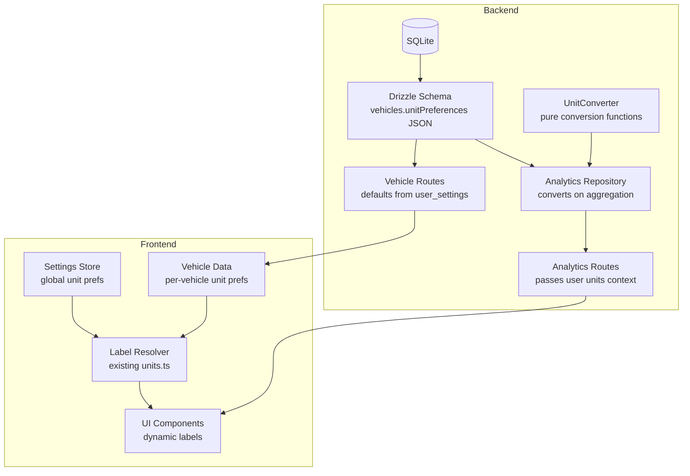

# Design Document: Unit-Aware Display

## Overview

This feature transforms VROOM from a hardcoded-imperial display system into a fully unit-aware application. Each vehicle stores its own unit preferences (distance, volume, charge) as a JSON column. Expenses inherit units from their parent vehicle. Cross-vehicle analytics convert all values to the user's global unit preference before aggregation. The frontend replaces every hardcoded imperial label with dynamic labels resolved from the appropriate unit context (vehicle-level for single-vehicle views, global for cross-vehicle views).

The backend gains a pure `UnitConverter` module for distance, volume, and efficiency conversions. API responses adopt unit-neutral field names (`totalDistance` instead of `totalMiles`) and include a `units` object so the frontend knows which labels to render. This is a breaking API change — both backend and frontend are migrated simultaneously.

## Architecture



### Data Flow

1. **Vehicle creation**: Frontend sends `unitPreferences` (or omits to use global defaults). Backend populates from `user_settings` if absent.
2. **Single-vehicle analytics**: Backend returns raw values in the vehicle's native units. Frontend reads `vehicle.unitPreferences` to resolve labels.
3. **Cross-vehicle analytics**: Backend reads each vehicle's `unitPreferences`, converts values to the requesting user's `user_settings` units via `UnitConverter`, then aggregates. Response includes a `units` object.
4. **Label resolution**: Frontend components call existing `getDistanceUnitLabel()`, `getFuelEfficiencyLabel()`, etc., passing the appropriate unit enum from either the vehicle or global settings.

### Key Design Decisions

| Decision | Rationale |
|---|---|
| JSON column for `unitPreferences` | Extensible for future unit types (pressure, temperature) without schema migrations |
| Unified `UnitPreferences` type | Same JSON schema across `user_settings` and `vehicles` for consistency |
| No per-expense unit storage | Expenses inherit from vehicle; avoids high-volume table bloat. Can add later if needed |
| Convert on read, not on write | Raw values stay as-entered; no data loss from repeated conversions |
| Backend does cross-vehicle conversion | Frontend doesn't need to know other vehicles' units when viewing aggregates |
| Unit-neutral API field names | Decouples API contract from any specific unit system |
| Breaking API change (no transition) | Backend and frontend deploy together; no need for dual field names |
| Reuse existing label functions | `units.ts` already has all label functions; just need to wire them to the right unit source |

## Components and Interfaces

### Backend Components

#### 1. UnitConverter (`backend/src/utils/unit-conversions.ts`)

Extends the existing file with pure conversion functions. No state, no side effects.

```typescript
// Conversion factors (exact values)
const MILES_TO_KM = 1.609344;
const GALLONS_US_TO_LITERS = 3.785411784;
const GALLONS_UK_TO_LITERS = 4.54609;

// Core conversion functions
function convertDistance(value: number, from: DistanceUnit, to: DistanceUnit): number;
function convertVolume(value: number, from: VolumeUnit, to: VolumeUnit): number;
function convertEfficiency(value: number, fromDist: DistanceUnit, fromVol: VolumeUnit, toDist: DistanceUnit, toVol: VolumeUnit): number;
```

#### 2. UnitPreferences Type (`backend/src/types.ts`)

```typescript
interface UnitPreferences {
  distanceUnit: DistanceUnit;
  volumeUnit: VolumeUnit;
  chargeUnit: ChargeUnit;
  [key: string]: string; // extensible for future unit types
}
```

Used consistently across `user_settings.unitPreferences`, `vehicles.unitPreferences`, and frontend types.

#### 3. Settings Schema Updates (`backend/src/db/schema.ts`, `backend/src/api/settings/`)

- Replace separate `distanceUnit`, `volumeUnit`, `chargeUnit` columns in `user_settings` with a single `unitPreferences` TEXT (JSON) column using the same `UnitPreferences` type.
- Settings API accepts/returns `unitPreferences` as a JSON object.
- Settings store on frontend exposes `unitPreferences` object instead of separate fields.
- Migration consolidates existing column values into the JSON column.

#### 4. Analytics Repository Updates (`backend/src/api/analytics/repository.ts`)

- Add a private helper `getUserUnits(userId)` that reads `user_settings.unitPreferences` JSON to get the target unit system.
- Add a private helper `getVehicleUnits(vehicleId)` that reads the vehicle's `unitPreferences` JSON.
- Cross-vehicle methods (`getCrossVehicle`, `getQuickStats`, `getYearEnd`) convert per-vehicle values to user's global units before aggregation.
- Single-vehicle methods (`getFuelStats` with vehicleId, `getVehicleTCO`) return values in the vehicle's native units.
- All response objects include a `units` field.

#### 5. Vehicle Routes Updates (`backend/src/api/vehicles/routes.ts`)

- Create schema adds optional `unitPreferences` field.
- On create, if `unitPreferences` is absent, populate from the user's `user_settings.unitPreferences`.
- Update schema allows partial `unitPreferences` updates.
- Validation ensures enum values are valid.

#### 6. Analytics Routes Updates (`backend/src/api/analytics/routes.ts`)

- Pass user context (including unit preferences) to repository methods.
- Response shape changes to unit-neutral field names with `units` metadata.

### Frontend Components

#### 7. Vehicle Type Extension (`frontend/src/lib/types.ts`)

```typescript
interface UnitPreferences {
  distanceUnit: DistanceUnit;
  volumeUnit: VolumeUnit;
  chargeUnit: ChargeUnit;
  [key: string]: string;
}

// Vehicle interface gains:
interface Vehicle {
  // ... existing fields
  unitPreferences?: UnitPreferences;
}

// UserSettings interface changes:
interface UserSettings {
  // ... existing fields (minus separate distanceUnit/volumeUnit/chargeUnit)
  unitPreferences: UnitPreferences;
}
```

#### 8. Analytics Response Types (`frontend/src/lib/types.ts`)

Unit-neutral response types replace the old imperial-named types. This is a breaking change — old field names are removed entirely.

```typescript
interface UnitsMetadata {
  distanceUnit: DistanceUnit;
  volumeUnit: VolumeUnit;
  chargeUnit: ChargeUnit;
}

// Updated response types use neutral names:
// totalMiles → totalDistance, avgMpg → avgEfficiency, etc.
// Each response includes `units: UnitsMetadata`
```

#### 8. Label Resolution in Components

Components that currently hardcode labels will instead:
1. Determine the unit context (vehicle-level or global).
2. Call existing label functions from `$lib/utils/units.ts`.
3. Use `$derived` to reactively compute labels when the unit source changes.

```svelte
<!-- Example: FuelStatsTab -->
<script>
  import { getDistanceUnitLabel, getFuelEfficiencyLabel } from '$lib/utils/units';
  let { vehicle, data } = $props();
  let distLabel = $derived(getDistanceUnitLabel(vehicle.unitPreferences.distanceUnit, true));
  let effLabel = $derived(getFuelEfficiencyLabel(
    vehicle.unitPreferences.distanceUnit,
    vehicle.unitPreferences.volumeUnit
  ));
</script>
<span>{data.distance.total} {distLabel}</span>
<span>Average {effLabel}: {data.fuelConsumption.avgEfficiency}</span>
```

#### 9. Vehicle Form Updates

- Vehicle create/edit forms gain a collapsible "Unit Preferences" section.
- Defaults pre-filled from `settingsStore.settings`.
- Uses shadcn-svelte `Select` components for each unit type.

#### 10. Settings Page Updates

- Add explanatory text clarifying that global units serve as defaults for new vehicles and as the display preference for cross-vehicle analytics.
- No functional changes to the settings save flow.

### Interface Contracts

#### Vehicle API (create)
```
POST /api/v1/vehicles
Body: { make, model, year, ..., unitPreferences?: { distanceUnit, volumeUnit, chargeUnit } }
Response: { success: true, data: Vehicle }
```

#### Vehicle API (update)
```
PUT /api/v1/vehicles/:id
Body: { ..., unitPreferences?: { distanceUnit?, volumeUnit?, chargeUnit? } }
Response: { success: true, data: Vehicle }
```

#### Analytics API (fuel-stats, cross-vehicle, year-end, etc.)
```
GET /api/v1/analytics/fuel-stats?startDate=...&endDate=...&vehicleId=...
Response: {
  success: true,
  data: {
    ...unitNeutralFields,
    units: { distanceUnit, volumeUnit, chargeUnit }
  }
}
```

## Data Models

### Database Schema Change

Add `unitPreferences` TEXT column to `vehicles` table:

```sql
ALTER TABLE vehicles ADD COLUMN unit_preferences TEXT NOT NULL
  DEFAULT '{"distanceUnit":"miles","volumeUnit":"gallons_us","chargeUnit":"kwh"}';
```

### Drizzle Schema Update

```typescript
// In vehicles table definition
unitPreferences: text('unit_preferences', { mode: 'json' })
  .$type<UnitPreferences>()
  .notNull()
  .default({ distanceUnit: 'miles', volumeUnit: 'gallons_us', chargeUnit: 'kwh' }),

// In user_settings table definition (replaces separate distanceUnit/volumeUnit/chargeUnit columns)
unitPreferences: text('unit_preferences', { mode: 'json' })
  .$type<UnitPreferences>()
  .notNull()
  .default({ distanceUnit: 'miles', volumeUnit: 'gallons_us', chargeUnit: 'kwh' }),
```

### UnitPreferences JSON Shape

```json
{
  "distanceUnit": "miles" | "kilometers",
  "volumeUnit": "gallons_us" | "gallons_uk" | "liters",
  "chargeUnit": "kwh"
}
```

Extensible — future keys like `pressureUnit`, `temperatureUnit` can be added without migration.

### Migration Strategy (migration 0006)

The migration must:
1. Add the `unit_preferences` column to `vehicles` with a default value.
2. Backfill each existing vehicle's `unitPreferences` from the owning user's `user_settings`.
3. Add the `unit_preferences` column to `user_settings`, consolidating the separate `distanceUnit`, `volumeUnit`, `chargeUnit` columns.
4. Backfill `user_settings.unit_preferences` from the existing separate columns.
5. Drop the old separate columns from `user_settings`.

```sql
-- Step 1: Add unit_preferences to vehicles
ALTER TABLE vehicles ADD COLUMN unit_preferences TEXT NOT NULL
  DEFAULT '{"distanceUnit":"miles","volumeUnit":"gallons_us","chargeUnit":"kwh"}';

-- Step 2: Backfill vehicles from user_settings
UPDATE vehicles SET unit_preferences = (
  SELECT json_object(
    'distanceUnit', COALESCE(us.distance_unit, 'miles'),
    'volumeUnit', COALESCE(us.volume_unit, 'gallons_us'),
    'chargeUnit', COALESCE(us.charge_unit, 'kwh')
  )
  FROM user_settings us WHERE us.user_id = vehicles.user_id
)
WHERE EXISTS (SELECT 1 FROM user_settings us WHERE us.user_id = vehicles.user_id);

-- Step 3: Add unit_preferences to user_settings
ALTER TABLE user_settings ADD COLUMN unit_preferences TEXT NOT NULL
  DEFAULT '{"distanceUnit":"miles","volumeUnit":"gallons_us","chargeUnit":"kwh"}';

-- Step 4: Backfill user_settings from existing columns
UPDATE user_settings SET unit_preferences = json_object(
  'distanceUnit', COALESCE(distance_unit, 'miles'),
  'volumeUnit', COALESCE(volume_unit, 'gallons_us'),
  'chargeUnit', COALESCE(charge_unit, 'kwh')
);

-- Step 5: Drop old columns (SQLite requires table rebuild for column drops)
-- Handled by Drizzle migration tooling
```

No changes to `expenses` or `odometer_entries` tables — existing numeric values are preserved as-is. Expenses resolve units from their parent vehicle at display time.

### API Response Field Name Mapping

| Old (imperial) | New (unit-neutral) |
|---|---|
| `totalMiles` | `totalDistance` |
| `avgMpg` | `avgEfficiency` |
| `bestMpg` | `bestEfficiency` |
| `worstMpg` | `worstEfficiency` |
| `gallons` | `volume` |
| `costPerMile` | `costPerDistance` |
| `pricePerGallon` | `pricePerVolume` |
| `mpg` | `efficiency` |
| `mileage` (in odometer) | `odometer` (already neutral) |
| `avgGallons` | `avgVolume` |
| `mpgTrend` | `efficiencyTrend` |

Both old and new field names are changed in a single breaking release. The frontend is updated simultaneously to use the new names.

### Backup/Sync Impact

Both `vehicles` and `user_settings` tables gain a new JSON column `unit_preferences`. The `user_settings` table loses the separate `distance_unit`, `volume_unit`, `charge_unit` columns. Updates needed:
- `backup.ts`: The columns are already part of the table exports (Drizzle serializes all columns). Verify JSON round-trip in `coerceRow`.
- `restore.ts`: Ensure `unit_preferences` is handled as a JSON string during restore. Older backups without this column should use the schema default. Older backups with the separate columns should be migrated to the JSON format during restore.
- `google-sheets.ts`: Add `unit_preferences` to the vehicles and user_settings sheet headers. Remove old separate unit columns from user_settings headers.
- `config.ts`: No changes needed (both tables already in `TABLE_SCHEMA_MAP`).


## Correctness Properties

*A property is a characteristic or behavior that should hold true across all valid executions of a system — essentially, a formal statement about what the system should do. Properties serve as the bridge between human-readable specifications and machine-verifiable correctness guarantees.*

### Property 1: Unit preferences contain required keys

*For any* Vehicle_Record created or updated through the API, the stored `unitPreferences` JSON SHALL contain `distanceUnit`, `volumeUnit`, and `chargeUnit` keys, and each value SHALL be a member of its respective enum (`miles`|`kilometers`, `gallons_us`|`gallons_uk`|`liters`, `kwh`).

**Validates: Requirements 1.1, 1.2**

### Property 2: Default unit inheritance on vehicle creation

*For any* user with a Global_Unit_Preference and any vehicle creation request that omits `unitPreferences`, the resulting Vehicle_Record's `unitPreferences` SHALL equal the user's Global_Unit_Preference (`distanceUnit`, `volumeUnit`, `chargeUnit`).

**Validates: Requirements 1.4**

### Property 3: Explicit unit preferences override defaults

*For any* valid `unitPreferences` object provided in a vehicle creation request, the resulting Vehicle_Record's `unitPreferences` SHALL exactly match the provided values, regardless of the user's Global_Unit_Preference.

**Validates: Requirements 1.5**

### Property 4: Unit preferences are updatable

*For any* existing Vehicle_Record and any valid `unitPreferences` update, after the update the Vehicle_Record's `unitPreferences` SHALL reflect the new values.

**Validates: Requirements 1.6**

### Property 5: Unit conversion correctness

*For any* numeric value `v` and any pair of supported units (distance, volume, or efficiency), `convertDistance(v, from, to)` SHALL equal `v * (conversionFactor(from, to))`, where the conversion factors are: 1 mile = 1.609344 km, 1 gallon (US) = 3.785411784 L, 1 gallon (UK) = 4.54609 L. Efficiency conversion SHALL apply the appropriate distance and volume factors.

**Validates: Requirements 3.1, 3.2, 3.3**

### Property 6: Unit conversion identity

*For any* numeric value and any single unit, converting from that unit to itself SHALL return the original value exactly (no floating-point drift).

**Validates: Requirements 3.4**

### Property 7: Unit conversion round-trip

*For any* numeric value and any pair of supported units A and B, converting from A to B and then from B back to A SHALL produce a result within 0.0001 of the original value.

**Validates: Requirements 3.5**

### Property 8: Label resolution uses vehicle units for single-vehicle context

*For any* Vehicle_Record with any valid `unitPreferences`, when resolving labels for that vehicle's data (expenses, fuel stats, odometer), the Label_Resolver SHALL produce labels matching that vehicle's `distanceUnit`, `volumeUnit`, and `chargeUnit` — not the Global_Unit_Preference.

**Validates: Requirements 2.1, 2.3, 2.4, 4.1**

### Property 9: Label resolution uses global units for cross-vehicle context

*For any* user Global_Unit_Preference, when resolving labels for cross-vehicle analytics, the Label_Resolver SHALL produce labels matching the global `distanceUnit`, `volumeUnit`, and `chargeUnit`.

**Validates: Requirements 4.2**

### Property 10: Label function output correctness

*For any* valid unit enum value, the label functions SHALL produce the correct output: `getDistanceUnitLabel('miles', true)` → `'mi'`, `getDistanceUnitLabel('kilometers', true)` → `'km'`, `getVolumeUnitLabel('gallons_us', true)` → `'gal'`, `getVolumeUnitLabel('liters', true)` → `'L'`, and `getFuelEfficiencyLabel(d, v)` SHALL equal `getDistanceUnitLabel(d, true) + '/' + getVolumeUnitLabel(v, true)` for all valid distance/volume pairs.

**Validates: Requirements 4.3, 4.4, 4.5, 4.6**

### Property 11: Cross-vehicle analytics conversion

*For any* set of vehicles with potentially different unit preferences and any user Global_Unit_Preference, the Analytics_API cross-vehicle aggregation SHALL convert each vehicle's distance, volume, and efficiency values to the global unit system before summing or averaging.

**Validates: Requirements 6.1**

### Property 12: Single-vehicle analytics returns native units

*For any* single-vehicle analytics query, the returned values SHALL be in that vehicle's Vehicle_Unit_Preference, and the response `units` object SHALL match the vehicle's `unitPreferences`.

**Validates: Requirements 6.2**

### Property 13: Analytics response includes units metadata

*For any* analytics API response, the response object SHALL include a `units` field containing `distanceUnit`, `volumeUnit`, and `chargeUnit` that accurately describe the unit system of the returned numeric values.

**Validates: Requirements 7.2**

### Property 14: User settings migration consolidates columns

*For any* existing `user_settings` row with separate `distanceUnit`, `volumeUnit`, and `chargeUnit` column values, after migration 0006 the row's `unitPreferences` JSON SHALL contain those same values, and the separate columns SHALL be removed.

**Validates: Requirements 10.2, 10.3, 10.4**

### Property 15: Migration backfills from user settings

*For any* existing Vehicle_Record whose owning user has a `user_settings` row, after migration 0006 the vehicle's `unitPreferences` SHALL contain `distanceUnit`, `volumeUnit`, and `chargeUnit` values matching that user's settings.

**Validates: Requirements 9.1**

### Property 16: Migration preserves existing data

*For any* existing Expense_Record or OdometerEntry, after migration 0006 all numeric fields (`expenseAmount`, `fuelAmount`, `mileage`, `odometer`) SHALL be unchanged.

**Validates: Requirements 9.3**

### Property 17: Global settings change does not affect vehicles

*For any* update to a user's Global_Unit_Preference, all existing Vehicle_Records owned by that user SHALL retain their previous `unitPreferences` values unchanged.

**Validates: Requirements 10.3**

## Error Handling

### Backend Errors

| Scenario | Error Type | HTTP Status | Message |
|---|---|---|---|
| Invalid `unitPreferences` enum value in vehicle create/update | `ValidationError` | 400 | "Invalid distanceUnit: must be 'miles' or 'kilometers'" |
| Vehicle not found (for unit lookup during analytics) | `NotFoundError` | 404 | "Vehicle not found" |
| Invalid unit value in stored `unitPreferences` JSON (data corruption) | `ValidationError` | 400 | "Vehicle has invalid unit preferences" |
| Conversion between unsupported unit types | `ValidationError` | 400 | "Unsupported unit conversion" |

### Frontend Error Handling

- If a vehicle's `unitPreferences` is missing or malformed (e.g., from an older API response before migration), fall back to the user's Global_Unit_Preference.
- If the Global_Unit_Preference is also unavailable (settings not loaded), fall back to imperial defaults (`miles`, `gallons_us`, `kwh`).
- Label functions already handle all valid enum values; no additional error handling needed in label resolution.

### Conversion Edge Cases

- `convertDistance(0, 'miles', 'kilometers')` → `0` (zero is preserved).
- `convertDistance(NaN, ...)` → `NaN` (pass-through; callers should validate inputs).
- `convertDistance(Infinity, ...)` → `Infinity` (pass-through).
- Negative values are converted normally (the converter is a pure math function, not a validator).

## Testing Strategy

### Property-Based Testing

Use `fast-check` for property-based testing on both frontend (Vitest) and backend (bun:test).

Each property test must:
- Run a minimum of 100 iterations.
- Reference its design property with a tag comment: `// Feature: unit-aware-display, Property N: <title>`
- Use a single property-based test per correctness property.

#### Backend Property Tests (`backend/src/utils/__tests__/unit-conversions.property.test.ts`)

- **Property 5**: Generate random numeric values and unit pairs, verify conversion applies correct factor.
- **Property 6**: Generate random values and units, verify identity conversion returns exact input.
- **Property 7**: Generate random values and unit pairs, verify round-trip within 0.0001 tolerance.

#### Backend Property Tests (`backend/src/api/analytics/__tests__/analytics-units.property.test.ts`)

- **Property 11**: Generate vehicles with mixed units and expense data, verify cross-vehicle aggregation converts to target units.

#### Backend Property Tests (`backend/src/api/vehicles/__tests__/vehicle-units.property.test.ts`)

- **Property 1**: Generate random unit preference objects, verify validation accepts valid and rejects invalid.
- **Property 2**: Generate random user settings, create vehicles without units, verify defaults match.
- **Property 3**: Generate random valid unit prefs, create vehicles with explicit units, verify stored values match.
- **Property 17**: Generate user settings updates, verify existing vehicles unchanged.

#### Frontend Property Tests (`frontend/src/lib/utils/__tests__/units.property.test.ts`)

- **Property 10**: Generate all valid unit enum combinations, verify label functions produce correct output.

#### Migration Tests (`backend/src/db/__tests__/migration-0006.test.ts`)

- **Property 14**: Seed users with separate unit columns, run migration, verify `unitPreferences` JSON matches original values.
- **Property 15**: Seed users with settings and vehicles, run migration, verify vehicle backfill correctness.
- **Property 16**: Seed expenses and odometer entries, run migration, verify numeric values unchanged.

### Unit Tests

Unit tests complement property tests for specific examples and edge cases:

- **Conversion edge cases**: zero, negative, very large values, same-unit identity.
- **Label edge cases**: all enum values produce non-empty strings, efficiency labels for all valid pairs.
- **Migration**: column exists after migration, default value is correct JSON, vehicles without user_settings get defaults (Requirement 9.2). User settings consolidated correctly (Requirement 10.2–10.4).
- **API response shape**: specific response objects use unit-neutral field names and include `units` metadata (Requirement 7.1, 7.2).
- **Vehicle form defaults**: specific example of form pre-fill from settings (Requirement 8.1).
- **Hardcoded label replacement**: spot-check specific components render dynamic labels (Requirements 5.1–5.15).

### Integration Tests (Playwright)

- Create a vehicle with metric units, add an expense, verify labels show "km" and "L".
- Create two vehicles with different units, view cross-vehicle analytics, verify labels match global settings.
- Change global settings, verify existing vehicle labels don't change but cross-vehicle analytics labels update.
