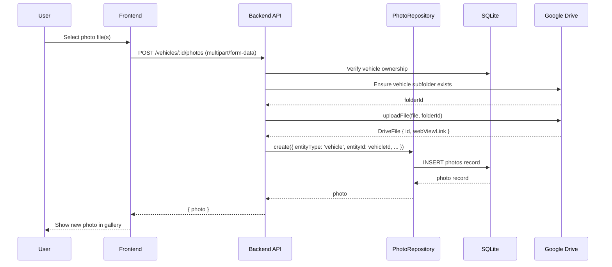
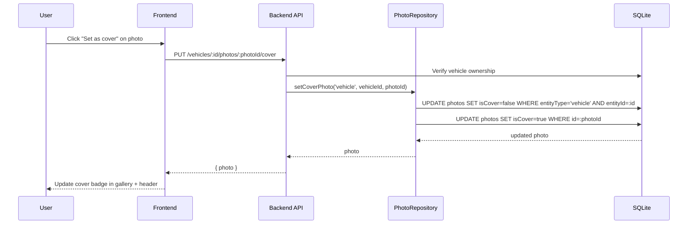
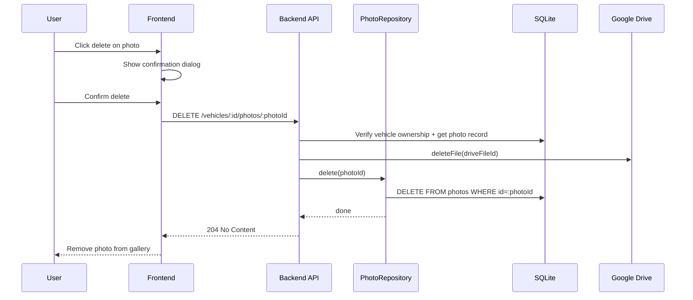

# Design Document: Vehicle Photos

## Overview

Vehicle Photos allows users to attach any number of photos to a vehicle, with images stored in Google Drive under the existing "Vehicle Photos" subfolder. Each photo record is tracked in the local SQLite database using a polymorphic association pattern — a generic `photos` table with `entityType` and `entityId` columns instead of a direct foreign key. This makes the photo system reusable for other entities (expenses, trips, etc.) in the future. Users can designate one photo as the cover photo per entity. The cover photo appears on the vehicle header and dashboard vehicle cards.

The system leverages the existing `GoogleDriveService` which already creates a "Vehicle Photos" folder inside the VROOM folder structure. Photos are uploaded to Google Drive via the backend API, which creates per-vehicle subfolders under "Vehicle Photos" to keep files organized. The frontend provides a photo gallery on the vehicle detail page with upload, delete, and cover-selection capabilities. While the underlying `PhotoRepository` is entity-agnostic, the vehicle photo routes pass `entityType: 'vehicle'` to scope all operations.

## Architecture

```mermaid
graph TD
    subgraph Frontend
        A[VehiclePhotoGallery] --> B[PhotoUploadDialog]
        A --> C[PhotoCard]
        A --> D[CoverPhotoBadge]
        E[VehicleHeader] --> F[Cover Photo Display]
        G[Dashboard Vehicle Cards] --> F
    end

    subgraph Backend API
        H[Vehicle Photo Routes] -->|entityType: vehicle| PS[PhotoService]
        PS --> I[GoogleDriveService]
        PS --> K[PhotoRepository]
        K --> DB2[photos table]
    end

    subgraph Google Drive
        I --> O[Vehicle Photos / {vehicleName} /]
    end

    subgraph Database
        K --> P[SQLite - photos]
        P --> Q[Composite Index: entityType + entityId]
    end

    A --> H
    A --> J
    A --> L
    A --> M
    F --> N
```

## Sequence Diagrams

### Photo Upload Flow



### Set Cover Photo Flow



### Photo Deletion Flow



## Components and Interfaces

### Component 1: Photo Service (`backend/src/api/photos/photo-service.ts`)

**Purpose**: Shared business logic layer for all photo operations. Entity-agnostic — handles file validation, Google Drive coordination, DB record management, cover photo logic, and cascade deletion. Route handlers are thin wrappers that extract entity context from the URL and delegate here.

**Interface**:
```typescript
// Shared constants
const ALLOWED_MIME_TYPES = ['image/jpeg', 'image/png', 'image/webp'];
const MAX_FILE_SIZE = 10_485_760; // 10MB

// Core operations — called by entity-specific route handlers
async function uploadPhotoForEntity(entityType: string, entityId: string, userId: string, userName: string, file: File): Promise<Photo>
async function listPhotosForEntity(entityType: string, entityId: string, userId: string): Promise<Photo[]>
async function setCoverPhotoForEntity(entityType: string, entityId: string, photoId: string, userId: string): Promise<Photo>
async function deletePhotoForEntity(entityType: string, entityId: string, photoId: string, userId: string): Promise<void>
async function getPhotoThumbnailForEntity(entityType: string, entityId: string, photoId: string, userId: string): Promise<{ buffer: Buffer; mimeType: string }>
async function deleteAllPhotosForEntity(entityType: string, entityId: string, userId: string): Promise<void>
```

**Responsibilities**:
- Validate entity ownership via `validateEntityOwnership`
- Enforce file size limits (10MB) and allowed MIME types (jpeg, png, webp)
- Coordinate between Google Drive and database for uploads/deletes
- Handle auto-cover on first upload and cover promotion on delete
- Provide cascade delete for entity deletion
- All operations scoped by `entityType` + `entityId`

### Component 2: Vehicle Photo Routes (`backend/src/api/vehicles/photo-routes.ts`)

**Purpose**: Thin Hono sub-router mounted at `/api/v1/vehicles/:vehicleId/photos`. Extracts `vehicleId` from the URL, passes `entityType: 'vehicle'` to the shared `PhotoService`. No business logic lives here.

**Interface**:
```typescript
// Hono sub-router mounted at /api/v1/vehicles/:vehicleId/photos
const photoRoutes = new Hono();

// POST /              - Upload photo(s) via multipart/form-data
// GET /               - List all photos for a vehicle
// PUT /:photoId/cover - Set a photo as the cover photo
// DELETE /:photoId    - Delete a photo (DB + Google Drive)
// GET /:photoId/thumbnail - Proxy thumbnail from Google Drive
```

**Responsibilities**:
- Extract `vehicleId` from URL params
- Delegate to `PhotoService` with `entityType: 'vehicle'`
- Return HTTP responses

### Component 3: Photo Repository (`backend/src/api/photos/photo-repository.ts`)

**Purpose**: Generic data access layer for the `photos` table. Entity-agnostic — works with any `entityType`/`entityId` combination.

**Interface**:
```typescript
class PhotoRepository {
  findByEntity(entityType: string, entityId: string): Promise<Photo[]>
  findById(photoId: string): Promise<Photo | null>
  findCoverPhoto(entityType: string, entityId: string): Promise<Photo | null>
  create(data: NewPhoto): Promise<Photo>
  setCoverPhoto(entityType: string, entityId: string, photoId: string): Promise<Photo>
  delete(photoId: string): Promise<void>
  deleteByEntity(entityType: string, entityId: string): Promise<void>
}
```

**Responsibilities**:
- CRUD operations on `photos` table scoped by `entityType` + `entityId`
- Enforce single-cover-photo invariant per entity via transaction
- Provide `deleteByEntity` for application-level cascade (no FK constraint in polymorphic pattern)

### Component 3: VehiclePhotoGallery (`frontend/src/lib/components/vehicles/VehiclePhotoGallery.svelte`)

**Purpose**: Photo gallery component shown on the vehicle detail page as a new "Photos" tab.

**Responsibilities**:
- Display grid of photo thumbnails
- Show cover photo badge on the designated cover
- Trigger upload dialog
- Handle set-as-cover and delete actions
- Show empty state when no photos exist

### Component 4: PhotoUploadDialog (`frontend/src/lib/components/vehicles/PhotoUploadDialog.svelte`)

**Purpose**: Dialog for selecting and uploading one or more photos.

**Responsibilities**:
- File input with drag-and-drop support
- Client-side validation (file type, file size)
- Upload progress indication
- Error handling for failed uploads

## Data Models

### Database: `photos` table (polymorphic)

```typescript
export const photos = sqliteTable('photos', {
  id: text('id').primaryKey().$defaultFn(() => createId()),
  entityType: text('entity_type').notNull(), // 'vehicle', 'expense', 'trip', etc.
  entityId: text('entity_id').notNull(),     // ID of the associated entity
  driveFileId: text('drive_file_id').notNull(),
  fileName: text('file_name').notNull(),
  mimeType: text('mime_type').notNull(),
  fileSize: integer('file_size').notNull(), // bytes
  webViewLink: text('web_view_link'),
  isCover: integer('is_cover', { mode: 'boolean' }).notNull().default(false),
  sortOrder: integer('sort_order').notNull().default(0),
  createdAt: integer('created_at', { mode: 'timestamp' }).$defaultFn(() => new Date()),
}, (table) => ({
  entityIdx: index('photos_entity_idx').on(table.entityType, table.entityId),
}));

export type Photo = typeof photos.$inferSelect;
export type NewPhoto = typeof photos.$inferInsert;

// Known entity types (extensible)
export type PhotoEntityType = 'vehicle' | 'expense' | 'trip';
```

**Validation Rules**:
- `entityType` must be a known entity type string (e.g., `'vehicle'`, `'expense'`, `'trip'`)
- `entityId` must be a non-empty string referencing a valid entity of the given type
- `driveFileId` must be a valid Google Drive file ID (non-empty string)
- `mimeType` must be one of: `image/jpeg`, `image/png`, `image/webp`
- `fileSize` must be > 0 and <= 10,485,760 (10MB)
- Only one photo per entity (`entityType` + `entityId` combo) can have `isCover = true`
- No FK constraint — referential integrity is enforced at the application level

### Frontend Type

```typescript
export interface Photo {
  id: string;
  entityType: string;
  entityId: string;
  driveFileId: string;
  fileName: string;
  mimeType: string;
  fileSize: number;
  webViewLink?: string;
  isCover: boolean;
  sortOrder: number;
  createdAt: string;
}
```


## Algorithmic Pseudocode

### Photo Upload Algorithm

```typescript
async function uploadPhoto(
  entityType: string,
  entityId: string,
  userId: string,
  file: File
): Promise<Photo> {
  // Step 1: Validate entity ownership (entity-specific logic)
  // For vehicles: verify vehicle belongs to userId
  await validateEntityOwnership(entityType, entityId, userId);

  // Step 2: Validate file
  const ALLOWED_TYPES = ['image/jpeg', 'image/png', 'image/webp'];
  const MAX_SIZE = 10 * 1024 * 1024; // 10MB
  if (!ALLOWED_TYPES.includes(file.type)) throw new ValidationError('Invalid file type');
  if (file.size > MAX_SIZE) throw new ValidationError('File too large');

  // Step 3: Get or create entity subfolder in Google Drive
  // For vehicles: create subfolder under "Vehicle Photos / {year} {make} {model}/"
  const driveService = await getDriveServiceForUser(userId);
  const folderId = await resolveEntityDriveFolder(driveService, entityType, entityId);

  // Step 4: Upload to Google Drive
  const buffer = Buffer.from(await file.arrayBuffer());
  const driveFile = await driveService.uploadFile(
    file.name, buffer, file.type, folderId
  );

  // Step 5: Create database record
  const photo = await photoRepository.create({
    entityType,
    entityId,
    driveFileId: driveFile.id,
    fileName: file.name,
    mimeType: file.type,
    fileSize: file.size,
    webViewLink: driveFile.webViewLink,
    isCover: false,
    sortOrder: 0,
  });

  // Step 6: If this is the first photo for this entity, auto-set as cover
  const existingPhotos = await photoRepository.findByEntity(entityType, entityId);
  if (existingPhotos.length === 1) {
    return await photoRepository.setCoverPhoto(entityType, entityId, photo.id);
  }

  return photo;
}
```

**Preconditions:**
- `userId` is authenticated and valid
- `entityType` is a known entity type (e.g., `'vehicle'`)
- `entityId` references an entity of the given type owned by `userId`
- `file` is a valid image file (jpeg, png, or webp) under 10MB
- User has Google Drive access (valid refresh token)

**Postconditions:**
- File is uploaded to Google Drive under the appropriate entity subfolder
- A `photos` record exists in the database with the correct `entityType` and `entityId`
- If this is the first photo for the entity, it is automatically set as cover
- Returns the created `Photo` record

### Set Cover Photo Algorithm

```typescript
async function setCoverPhoto(
  entityType: string,
  entityId: string,
  photoId: string,
  userId: string
): Promise<Photo> {
  // Step 1: Validate entity ownership
  await validateEntityOwnership(entityType, entityId, userId);

  // Step 2: Validate photo belongs to this entity
  const photo = await photoRepository.findById(photoId);
  if (!photo || photo.entityType !== entityType || photo.entityId !== entityId) {
    throw new NotFoundError('Photo');
  }

  // Step 3: Transactional update — unset all for this entity, then set target
  return await transaction(async (tx) => {
    await tx.update(photos)
      .set({ isCover: false })
      .where(
        and(
          eq(photos.entityType, entityType),
          eq(photos.entityId, entityId)
        )
      );

    const [updated] = await tx.update(photos)
      .set({ isCover: true })
      .where(eq(photos.id, photoId))
      .returning();

    return updated;
  });
}
```

**Preconditions:**
- `entityType` + `entityId` references an entity owned by `userId`
- `photoId` references a photo belonging to the given entity

**Postconditions:**
- Exactly one photo for the entity (`entityType` + `entityId`) has `isCover = true`
- All other photos for the entity have `isCover = false`
- The operation is atomic (transactional)

**Loop Invariants:** N/A (no loops)

### Delete Photo Algorithm

```typescript
async function deletePhoto(
  entityType: string,
  entityId: string,
  photoId: string,
  userId: string
): Promise<void> {
  // Step 1: Validate entity ownership
  await validateEntityOwnership(entityType, entityId, userId);

  // Step 2: Get photo record
  const photo = await photoRepository.findById(photoId);
  if (!photo || photo.entityType !== entityType || photo.entityId !== entityId) {
    throw new NotFoundError('Photo');
  }

  const wasCover = photo.isCover;

  // Step 3: Delete from Google Drive (best-effort, don't fail if Drive delete fails)
  try {
    const driveService = await getDriveServiceForUser(userId);
    await driveService.deleteFile(photo.driveFileId);
  } catch (error) {
    logger.warn('Failed to delete photo from Google Drive', {
      photoId, driveFileId: photo.driveFileId, error
    });
  }

  // Step 4: Delete database record
  await photoRepository.delete(photoId);

  // Step 5: If deleted photo was cover, promote the next photo
  if (wasCover) {
    const remaining = await photoRepository.findByEntity(entityType, entityId);
    if (remaining.length > 0) {
      await photoRepository.setCoverPhoto(entityType, entityId, remaining[0].id);
    }
  }
}
```

**Preconditions:**
- `entityType` + `entityId` references an entity owned by `userId`
- `photoId` references a photo belonging to the given entity

**Postconditions:**
- Photo is deleted from Google Drive (best-effort)
- Photo record is removed from the database
- If the deleted photo was the cover, the oldest remaining photo becomes the new cover
- If no photos remain, no cover photo exists

### Thumbnail Proxy Algorithm

```typescript
async function getPhotoThumbnail(
  entityType: string,
  entityId: string,
  photoId: string,
  userId: string
): Promise<{ buffer: Buffer; mimeType: string }> {
  // Step 1: Validate entity ownership
  await validateEntityOwnership(entityType, entityId, userId);

  // Step 2: Get photo record
  const photo = await photoRepository.findById(photoId);
  if (!photo || photo.entityType !== entityType || photo.entityId !== entityId) {
    throw new NotFoundError('Photo');
  }

  // Step 3: Download from Google Drive via API
  const driveService = await getDriveServiceForUser(userId);
  const buffer = await driveService.downloadFile(photo.driveFileId);

  return { buffer, mimeType: photo.mimeType };
}
```

**Preconditions:**
- `entityType` + `entityId` references an entity owned by `userId`
- `photoId` references a photo belonging to the given entity
- User has valid Google Drive access

**Postconditions:**
- Returns the raw image buffer and MIME type
- The response can be served with appropriate `Content-Type` and cache headers

### Entity Ownership Validation (Helper)

```typescript
async function validateEntityOwnership(
  entityType: string,
  entityId: string,
  userId: string
): Promise<void> {
  switch (entityType) {
    case 'vehicle':
      const vehicle = await vehicleRepository.findByUserIdAndId(userId, entityId);
      if (!vehicle) throw new NotFoundError('Vehicle');
      break;
    // Future entity types:
    // case 'expense':
    //   const expense = await expenseRepository.findByUserIdAndId(userId, entityId);
    //   if (!expense) throw new NotFoundError('Expense');
    //   break;
    default:
      throw new ValidationError(`Unknown entity type: ${entityType}`);
  }
}
```

### Entity Drive Folder Resolution (Helper)

```typescript
async function resolveEntityDriveFolder(
  driveService: GoogleDriveService,
  entityType: string,
  entityId: string
): Promise<string> {
  switch (entityType) {
    case 'vehicle':
      const vehicle = await vehicleRepository.findById(entityId);
      const folderStructure = await driveService.createVroomFolderStructure(vehicle.make);
      const photosFolderId = folderStructure.subFolders.photos.id;
      const vehicleFolderName = `${vehicle.year} ${vehicle.make} ${vehicle.model}`;
      const vehicleFolder = await driveService.findFolder(vehicleFolderName, photosFolderId)
        ?? await driveService.createFolder(vehicleFolderName, photosFolderId);
      return vehicleFolder.id;
    // Future entity types would resolve their own folder paths
    default:
      throw new ValidationError(`Unknown entity type: ${entityType}`);
  }
}
```

### Application-Level Cascade Delete (Vehicle Deletion)

```typescript
async function deleteVehicleWithPhotos(
  vehicleId: string,
  userId: string
): Promise<void> {
  // Step 1: Delete all photos for this vehicle (Drive + DB)
  const vehiclePhotos = await photoRepository.findByEntity('vehicle', vehicleId);
  for (const photo of vehiclePhotos) {
    try {
      const driveService = await getDriveServiceForUser(userId);
      await driveService.deleteFile(photo.driveFileId);
    } catch (error) {
      logger.warn('Failed to delete photo from Drive during vehicle deletion', {
        photoId: photo.id, driveFileId: photo.driveFileId, error
      });
    }
  }
  await photoRepository.deleteByEntity('vehicle', vehicleId);

  // Step 2: Delete the vehicle itself
  await vehicleRepository.delete(vehicleId);
}
```

**Preconditions:**
- `vehicleId` references a vehicle owned by `userId`

**Postconditions:**
- All photos for the vehicle are deleted from Google Drive (best-effort)
- All photo records for the vehicle are removed from the `photos` table
- The vehicle record is deleted
- No orphaned photo records remain for this vehicle


## Key Functions with Formal Specifications

### Backend: Photo Routes (Vehicle-Scoped)

```typescript
// POST /api/v1/vehicles/:vehicleId/photos
// Content-Type: multipart/form-data
// Body: { photo: File }
// Response: { success: true, data: Photo }
// Internally: entityType = 'vehicle', entityId = vehicleId
function uploadVehiclePhoto(vehicleId: string, file: File): Promise<Photo>

// GET /api/v1/vehicles/:vehicleId/photos
// Response: { success: true, data: Photo[] }
// Internally: photoRepository.findByEntity('vehicle', vehicleId)
function listVehiclePhotos(vehicleId: string): Promise<Photo[]>

// PUT /api/v1/vehicles/:vehicleId/photos/:photoId/cover
// Response: { success: true, data: Photo }
// Internally: photoRepository.setCoverPhoto('vehicle', vehicleId, photoId)
function setVehicleCoverPhoto(vehicleId: string, photoId: string): Promise<Photo>

// DELETE /api/v1/vehicles/:vehicleId/photos/:photoId
// Response: 204 No Content
function deleteVehiclePhoto(vehicleId: string, photoId: string): Promise<void>

// GET /api/v1/vehicles/:vehicleId/photos/:photoId/thumbnail
// Response: image binary with Content-Type header
function getVehiclePhotoThumbnail(vehicleId: string, photoId: string): Promise<Response>
```

### Backend: Generic PhotoRepository

```typescript
class PhotoRepository {
  // Query photos scoped to a specific entity
  findByEntity(entityType: string, entityId: string): Promise<Photo[]>
  // SELECT * FROM photos WHERE entity_type = ? AND entity_id = ? ORDER BY sort_order, created_at

  findById(photoId: string): Promise<Photo | null>
  // SELECT * FROM photos WHERE id = ?

  findCoverPhoto(entityType: string, entityId: string): Promise<Photo | null>
  // SELECT * FROM photos WHERE entity_type = ? AND entity_id = ? AND is_cover = true LIMIT 1

  create(data: NewPhoto): Promise<Photo>
  // INSERT INTO photos (id, entity_type, entity_id, ...) VALUES (...)

  setCoverPhoto(entityType: string, entityId: string, photoId: string): Promise<Photo>
  // BEGIN TRANSACTION
  //   UPDATE photos SET is_cover = false WHERE entity_type = ? AND entity_id = ?
  //   UPDATE photos SET is_cover = true WHERE id = ?
  // COMMIT

  delete(photoId: string): Promise<void>
  // DELETE FROM photos WHERE id = ?

  deleteByEntity(entityType: string, entityId: string): Promise<void>
  // DELETE FROM photos WHERE entity_type = ? AND entity_id = ?
}
```

### Frontend: Vehicle Photo API Service

```typescript
// Added to vehicle-api.ts — routes still use vehicle-scoped URLs
export const vehicleApi = {
  // ... existing methods ...

  async getPhotos(vehicleId: string): Promise<Photo[]>,

  async uploadPhoto(vehicleId: string, file: File): Promise<Photo>,

  async setCoverPhoto(vehicleId: string, photoId: string): Promise<Photo>,

  async deletePhoto(vehicleId: string, photoId: string): Promise<void>,

  getPhotoThumbnailUrl(vehicleId: string, photoId: string): string,
}
```

## Example Usage

### Backend: Mounting photo routes

```typescript
// In backend/src/api/vehicles/routes.ts
import { photoRoutes } from './photo-routes';

// Mount as sub-router under vehicles
routes.route('/:vehicleId/photos', photoRoutes);
```

### Backend: Route handler delegating to PhotoService

```typescript
// In photo-routes.ts — thin wrapper, no business logic
import { Hono } from 'hono';
import {
  uploadPhotoForEntity,
  listPhotosForEntity,
  setCoverPhotoForEntity,
  deletePhotoForEntity,
  getPhotoThumbnailForEntity,
} from '../photos/photo-service';

const photoRoutes = new Hono();

photoRoutes.post('/', async (c) => {
  const vehicleId = c.req.param('vehicleId');
  const user = c.get('user');
  const body = await c.req.parseBody();
  const file = body['photo'] as File;

  const photo = await uploadPhotoForEntity('vehicle', vehicleId, user.id, user.name, file);
  return c.json({ success: true, data: photo }, 201);
});

photoRoutes.get('/', async (c) => {
  const vehicleId = c.req.param('vehicleId');
  const user = c.get('user');

  const photos = await listPhotosForEntity('vehicle', vehicleId, user.id);
  return c.json({ success: true, data: photos });
});
```

### Frontend: Using the photo gallery

```svelte
<!-- In vehicle detail page, new "Photos" tab -->
<TabsTrigger value="photos">Photos</TabsTrigger>

<TabsContent value="photos" class="space-y-6">
  <VehiclePhotoGallery
    vehicleId={vehicle.id}
    photos={vehiclePhotos}
    onUpload={handlePhotoUpload}
    onDelete={handlePhotoDelete}
    onSetCover={handleSetCover}
  />
</TabsContent>
```

### Frontend: Uploading a photo

```typescript
async function handlePhotoUpload(file: File) {
  const photo = await vehicleApi.uploadPhoto(vehicleId, file);
  vehiclePhotos = [...vehiclePhotos, photo];
}
```

### Frontend: Cover photo in VehicleHeader

```svelte
<!-- VehicleHeader.svelte - show cover photo if available -->
{#if coverPhoto}
  
{/if}
```

## Correctness Properties

*A property is a characteristic or behavior that should hold true across all valid executions of a system — essentially, a formal statement about what the system should do. Properties serve as the bridge between human-readable specifications and machine-verifiable correctness guarantees.*

### Property 1: Single Cover Invariant

*For any* entity (`entityType`, `entityId`) that has at least one photo, after any sequence of upload, setCover, and delete operations, exactly one photo for that entity has `isCover = true`. For entities with zero photos, no photo has `isCover = true`.

**Validates: Requirements 3.1, 3.4, 14.2**

### Property 2: Auto-Cover on First Upload

*For any* entity with zero existing photos, uploading a valid photo results in that photo having `isCover = true`. *For any* entity with one or more existing photos, uploading a valid photo results in the new photo having `isCover = false` and the existing cover photo remaining unchanged.

**Validates: Requirements 1.2, 1.3**

### Property 3: Cover Promotion on Delete

*For any* entity where the cover photo is deleted and at least one other photo remains, the oldest remaining photo (by `createdAt`) becomes the new cover photo with `isCover = true`.

**Validates: Requirements 4.2, 3.4**

### Property 4: Entity Isolation

*For any* two distinct (`entityType`, `entityId`) pairs — including pairs where the `entityId` matches but the `entityType` differs — the set of photos returned by `findByEntity` for one pair has zero overlap with the set returned for the other pair. Operations on one entity never affect photos of another entity.

**Validates: Requirements 6.1, 6.2**

### Property 5: Ownership Enforcement

*For any* user and any entity not owned by that user, all photo operations (upload, list, setCover, delete, thumbnail) return a 404 status and perform no mutations.

**Validates: Requirements 1.6, 2.2, 7.2, 7.3**

### Property 6: MIME Type Validation

*For any* file with a MIME type not in the set `{image/jpeg, image/png, image/webp}`, the upload endpoint rejects the request with a 400 status and no photo record is created.

**Validates: Requirements 1.4, 9.1**

### Property 7: File Size Validation

*For any* file with size exceeding 10,485,760 bytes, the upload endpoint rejects the request with a 413 status and no photo record is created.

**Validates: Requirements 1.5, 9.2**

### Property 8: Cascade Delete Completeness

*For any* vehicle with N photos (N ≥ 0), after cascade deletion via `deleteByEntity('vehicle', vehicleId)`, the photos table contains zero records where `entityType = 'vehicle'` and `entityId` matches the deleted vehicle ID.

**Validates: Requirements 8.1, 8.3**

### Property 9: Photo Count Consistency

*For any* entity, after N successful uploads and M successful deletes (where M ≤ N), the photo list for that entity contains exactly N − M records.

**Validates: Requirements 1.1, 4.1, 2.1**

### Property 10: Entity Binding Immutability

*For any* photo, after any sequence of setCover, delete (of other photos), or upload operations on the same entity, the photo's `entityType` and `entityId` remain equal to the values set at creation time.

**Validates: Requirement 14.1**

### Property 11: Data Integrity Invariant

*For any* photo record in the database, `fileSize` is a positive integer and `mimeType` is one of `image/jpeg`, `image/png`, or `image/webp`.

**Validates: Requirement 14.3**

## Error Handling

### Error Scenario 1: Google Drive Upload Failure

**Condition**: Google Drive API returns an error during file upload (quota exceeded, auth expired, network error)
**Response**: Return 502 Bad Gateway with message "Failed to upload photo to Google Drive"
**Recovery**: No database record is created. User can retry. If auth expired, user is prompted to re-authenticate.

### Error Scenario 2: Google Drive Delete Failure

**Condition**: Google Drive API returns an error during file deletion
**Response**: The database record is still deleted. A warning is logged.
**Recovery**: Orphaned files in Google Drive are acceptable. A future cleanup job could reconcile.

### Error Scenario 3: File Too Large

**Condition**: Uploaded file exceeds 10MB
**Response**: Return 413 Payload Too Large with message "Photo must be under 10MB"
**Recovery**: User selects a smaller file or compresses the image before uploading.

### Error Scenario 4: Invalid File Type

**Condition**: Uploaded file is not jpeg, png, or webp
**Response**: Return 400 Bad Request with message "Only JPEG, PNG, and WebP images are allowed"
**Recovery**: User selects a valid image file.

### Error Scenario 5: Entity Not Found / Unauthorized

**Condition**: Entity ID doesn't exist or doesn't belong to the authenticated user (validated via `validateEntityOwnership`)
**Response**: Return 404 Not Found
**Recovery**: User navigates to a valid entity.

### Error Scenario 6: Photo Not Found

**Condition**: Photo ID doesn't exist or doesn't belong to the specified entity (`entityType` + `entityId` mismatch)
**Response**: Return 404 Not Found
**Recovery**: Frontend refreshes the photo list.

### Error Scenario 7: Unknown Entity Type

**Condition**: `entityType` is not a recognized value (e.g., not `'vehicle'`, `'expense'`, or `'trip'`)
**Response**: Return 400 Bad Request with message "Unknown entity type"
**Recovery**: This is a programming error — should not occur via the vehicle photo routes which hardcode `entityType: 'vehicle'`.

### Error Scenario 8: Orphaned Photos After Entity Deletion

**Condition**: A parent entity is deleted without calling `photoRepository.deleteByEntity()` first (since there's no FK cascade)
**Response**: Orphaned photo records remain in the database
**Recovery**: Application code must always call `deleteByEntity` before deleting a parent entity. A periodic cleanup job could detect orphans by checking if the referenced entity still exists.

## Testing Strategy

### Unit Testing Approach

- **Photo Repository**: Test CRUD operations scoped by `entityType` + `entityId`, single-cover invariant enforcement per entity, `deleteByEntity` cleanup
- **Entity Scoping**: Verify that photos for `('vehicle', 'id1')` are isolated from `('expense', 'id1')` — same `entityId`, different `entityType`
- **Upload Validation**: Test file type and size validation logic in isolation
- **Cover Photo Logic**: Test auto-cover on first upload, cover promotion on delete, scoped per entity
- **Ownership Validation**: Test `validateEntityOwnership` for each supported entity type

### Property-Based Testing Approach

**Property Test Library**: fast-check

- **Single Cover Property**: After any sequence of upload/setCover/delete operations on a given entity, at most one photo per entity has `isCover = true`
- **Entity Isolation Property**: For any two distinct `(entityType, entityId)` pairs, operations on one never affect the other
- **Photo Count Consistency**: After N uploads and M deletes (M <= N) for an entity, exactly N - M photos exist for that entity
- **File Type Validation**: For any random string MIME type not in the allowed list, upload is rejected

### Integration Testing Approach

- **Upload + List**: Upload a photo for a vehicle, verify it appears in the list response with `entityType: 'vehicle'`
- **Upload + Cover + Delete**: Upload two photos, set second as cover, delete first, verify second is still cover
- **Upload + Delete Cover**: Upload two photos (first auto-cover), delete first, verify second becomes cover
- **Thumbnail Proxy**: Upload a photo, request thumbnail, verify correct Content-Type and non-empty body
- **Entity Cascade**: Delete a vehicle, verify all associated photos are cleaned up via application code
- **Cross-Entity Isolation**: Upload photos for two different vehicles, verify each vehicle only sees its own photos

## Performance Considerations

- **Composite Index**: The `(entity_type, entity_id)` composite index on the `photos` table ensures efficient lookups when querying photos for a specific entity. This is critical since there's no FK constraint to leverage.
- **Thumbnail Proxy Caching**: The `/thumbnail` endpoint should set `Cache-Control: private, max-age=3600` headers so browsers cache thumbnails and avoid repeated Drive API calls.
- **Lazy Loading**: The photo gallery should use `loading="lazy"` on `` tags to avoid loading all thumbnails at once.
- **Upload Size Limit**: The 10MB limit is enforced both client-side (for fast feedback) and server-side (for security). The backend body-limit middleware should allow multipart uploads up to 10MB for photo routes.
- **Concurrent Uploads**: The frontend should upload files sequentially to avoid overwhelming the Google Drive API rate limits. A queue-based approach with visual progress per file is preferred.
- **Photo List Pagination**: For the initial implementation, all photos are returned in a single list. If entities accumulate many photos (50+), pagination should be added.

## Security Considerations

- **Authentication**: All photo endpoints require authentication via the existing `requireAuth` middleware.
- **Authorization**: Every operation validates entity ownership via `validateEntityOwnership`. No user can access another user's photos.
- **Entity Type Validation**: Only known entity types are accepted. Unknown types are rejected to prevent abuse of the polymorphic pattern.
- **File Validation**: MIME type is validated server-side (not just by file extension) to prevent uploading malicious files disguised as images.
- **Thumbnail Proxy**: Photos are served through the backend proxy rather than exposing Google Drive URLs directly. This ensures access control is enforced on every request.
- **No Direct Drive Links**: `webViewLink` is stored for potential future use but not exposed to the frontend. All photo access goes through the authenticated API.

## Dependencies

- **Existing**: `googleapis` (Google Drive API), `drizzle-orm` (database), `@paralleldrive/cuid2` (ID generation), `hono` (routing), `zod` (validation)
- **No new dependencies required** — the existing Google Drive service and file upload capabilities in Hono/Bun are sufficient.
