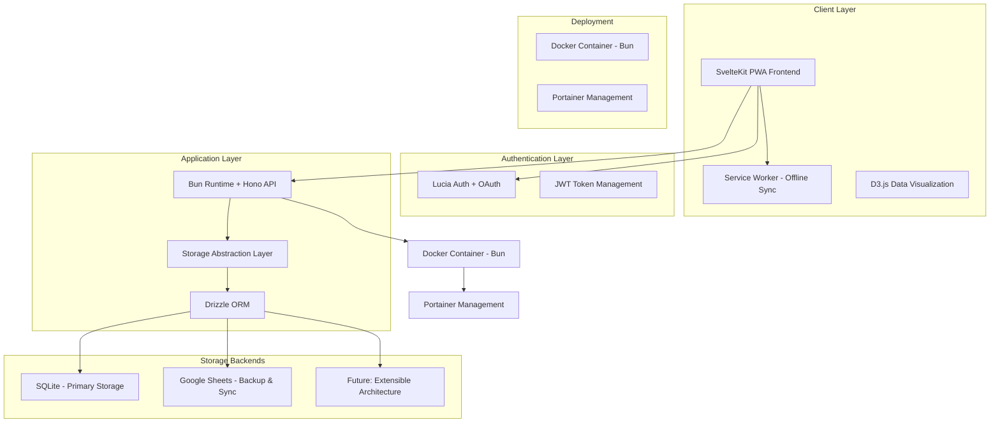

# Design Document

## Overview

VROOM is a modern, self-hostable car cost tracking and visualization web application designed with a mobile-first approach and cost-effective architecture. The system employs a pluggable storage backend architecture that supports multiple data sources, from Google Sheets API to lightweight databases, enabling users to choose their preferred storage solution based on cost and complexity requirements.

The application follows a Progressive Web App (PWA) architecture with a SvelteKit-based frontend and an abstracted storage layer that can interface with various backends. This design prioritizes exceptional mobile user experience, minimal bundle sizes, data portability, and ultra-low hosting costs while maintaining the flexibility for future scaling.

## Architecture

### High-Level Architecture



### Technology Stack

**Frontend:**
- **SvelteKit** with TypeScript for exceptional performance and developer experience
- **Vite** (built into SvelteKit) for lightning-fast development and optimized builds
- **SvelteKit routing** for file-based routing with SSR/SPA hybrid capabilities
- **D3.js** for powerful, custom data visualizations
- **Tailwind CSS** for responsive, mobile-first styling
- **Superforms** for type-safe, efficient form handling
- **PWA capabilities** with service worker for offline functionality

**Backend:**
- **Bun runtime** for 3x faster performance than Node.js with native TypeScript
- **Hono** ultra-fast web framework (faster than Express)
- **Lucia Auth** for modern, secure Google OAuth authentication
- **Drizzle ORM** for type-safe database operations

**Storage Abstraction:**
- **Repository Pattern** with extensible backend architecture
- **SQLite** with Drizzle ORM as primary storage (always free, works offline)
- **Google Sheets API v4** for backup, sync, and human-readable data access
- **Extensible design** for future cloud provider integrations (Oracle, Azure, etc.)

**Deployment:**
- **Docker** with Bun's optimized container builds (smaller than Node.js)
- **Docker Compose** for local development environment
- **GitHub Actions** for automated builds, testing, and deployment
- **GitHub Container Registry** for Docker image storage
- **Bun's built-in static file serving** (no need for separate Nginx)

## Components and Interfaces

### Frontend Components

#### Core Components (Svelte)
- **AuthStore**: Svelte store managing OAuth authentication state and token refresh
- **Dashboard**: Main landing page with vehicle overview and quick stats
- **VehicleManager**: Add, edit, and manage multiple vehicles with purchase/loan details
- **InsuranceManager**: Track insurance policies with automatic monthly cost calculation
- **LoanTracker**: Comprehensive loan management with amortization schedules and payment tracking
- **PaymentReminders**: Notifications for upcoming loan and insurance payments
- **ExpenseEntry**: Mobile-optimized form with smart categorization and offline capability
- **ExpenseCategories**: Visual breakdown of spending by category with insights
- **Analytics**: Interactive D3.js charts and visualizations for cost analysis
- **DataExport**: Export functionality with multiple format support (JSON/CSV/Excel)
- **SheetsSync**: Google Sheets backup, sync, and restore functionality (core feature)
- **StorageSettings**: Configuration for Google Sheets integration and future extensibility
- **OfflineSync**: Service worker integration for offline expense entry
- **InactivitySync**: Auto-sync to Google Drive after user inactivity periods

#### Shared Components
- **Layout**: Responsive navigation and page structure with SvelteKit slots
- **LoadingSpinner**: Consistent loading states with Svelte transitions
- **ErrorBoundary**: Graceful error handling with Svelte error boundaries
- **Modal**: Reusable modal dialogs with Svelte portals
- **FormField**: Standardized form input components with Superforms integration

### Backend API Interfaces

#### Authentication Endpoints (Hono + Lucia)
```typescript
POST /auth/login/google        // Initiate Google OAuth flow
GET  /auth/callback/google     // Google OAuth callback handler
POST /auth/refresh             // Refresh session token
POST /auth/logout              // Invalidate Lucia session
GET  /auth/me                  // Get current user info
```

#### Vehicle Management
```typescript
GET    /api/vehicles           // List user's vehicles
POST   /api/vehicles           // Create new vehicle
PUT    /api/vehicles/:id       // Update vehicle details
DELETE /api/vehicles/:id       // Remove vehicle
```

#### Insurance Management
```typescript
GET    /api/vehicles/:id/insurance     // Get vehicle insurance policies
POST   /api/vehicles/:id/insurance     // Add new insurance policy
PUT    /api/insurance/:id              // Update insurance policy
DELETE /api/insurance/:id              // Delete insurance policy
GET    /api/insurance/:id/monthly      // Get monthly cost breakdown
```

#### Loan Management
```typescript
GET    /api/vehicles/:id/loan              // Get loan details and payment history
POST   /api/vehicles/:id/loan              // Create/update loan information
PUT    /api/loans/:loanId                  // Update loan terms
DELETE /api/loans/:loanId                  // Remove loan (paid off)

POST   /api/loans/:loanId/payment          // Record a loan payment
GET    /api/loans/:loanId/schedule         // Get amortization schedule
GET    /api/loans/:loanId/balance          // Get current balance

// Future: Advanced payment scenarios
POST   /api/loans/:loanId/analyze          // Analyze payment scenarios
POST   /api/loans/:loanId/scenarios        // Compare payment strategies
PUT    /api/loans/:loanId/payment-config   // Update payment configuration
```

#### Expense Tracking
```typescript
GET    /api/vehicles/:id/expenses     // Get vehicle expenses
POST   /api/vehicles/:id/expenses     // Add new expense
PUT    /api/expenses/:id              // Update expense
DELETE /api/expenses/:id              // Delete expense
```

#### Analytics & Export
```typescript
GET /api/vehicles/:id/analytics       // Get analytics data
GET /api/vehicles/:id/export/:format  // Export data (JSON/CSV/Excel)
POST /api/import                      // Import data from file
```

#### Google Drive & Sheets Integration
```typescript
POST /api/drive/setup                 // Create VROOM folder in Google Drive
GET /api/drive/folder                 // Get VROOM folder info and contents
POST /api/sheets/backup               // Manual backup to Google Sheets
GET /api/sheets/restore               // Restore from Google Sheets
POST /api/sheets/sync                 // Bi-directional sync with Google Sheets
GET /api/sheets/status                // Check sync status and last backup
POST /api/sheets/configure            // Configure Google Sheets integration
POST /api/sheets/sync/auto            // Trigger inactivity-based auto-sync
```

### Storage Abstraction Layer

#### Repository Interface (Drizzle ORM)
```typescript
interface IVehicleRepository {
  findByUserId(userId: string): Promise<Vehicle[]>
  create(vehicle: Vehicle): Promise<Vehicle>
  update(id: string, vehicle: Partial<Vehicle>): Promise<Vehicle>
  delete(id: string): Promise<void>
}

interface IExpenseRepository {
  findByVehicleId(vehicleId: string): Promise<Expense[]>
  create(expense: Expense): Promise<Expense>
  update(id: string, expense: Partial<Expense>): Promise<Expense>
  delete(id: string): Promise<void>
  batchCreate(expenses: Expense[]): Promise<Expense[]> // For offline sync
}
```

#### Storage Backend Implementations
- **SQLiteRepository**: Drizzle ORM with SQLite (primary storage, always free)
- **GoogleSheetsService**: Bi-directional sync and backup service (core feature)
- **AbstractCloudRepository**: Base class for future cloud provider extensions
- **RepositoryFactory**: Extensible factory pattern for adding new storage backends

## Data Models

### Core Entities

#### User
```typescript
interface User {
  id: string
  email: string
  displayName: string
  provider: 'google'
  providerId: string
  googleRefreshToken?: string // For Google Sheets access
  createdAt: Date
  updatedAt: Date
}
```

#### Vehicle
```typescript
interface Vehicle {
  id: string
  userId: string
  make: string
  model: string
  year: number
  licensePlate?: string
  nickname?: string
  initialMileage?: number
  // Purchase Information
  purchasePrice?: number
  purchaseDate?: Date
  // Loan Information (containerized)
  loan?: VehicleLoan
  createdAt: Date
  updatedAt: Date
}
```

#### Vehicle Loan (Containerized)
```typescript
interface VehicleLoan {
  id: string
  vehicleId: string
  // Basic Loan Terms
  lender: string
  originalAmount: number
  currentBalance: number
  apr: number
  termMonths: number
  startDate: Date
  // Payment Configuration
  standardPayment: LoanPaymentConfig
  customPaymentSchedule?: LoanPaymentConfig[] // For future split payments
  // Loan Status
  isActive: boolean
  payoffDate?: Date // Actual payoff date if paid early
  createdAt: Date
  updatedAt: Date
}
```

#### Loan Payment Configuration
```typescript
interface LoanPaymentConfig {
  amount: number
  frequency: 'monthly' | 'bi-weekly' | 'weekly' | 'custom'
  dayOfMonth?: number // For monthly (1-31)
  dayOfWeek?: number  // For weekly (0-6, Sunday=0)
  customSchedule?: {
    amount: number
    dayOfMonth: number
  }[] // For future: multiple payments per month
}
```

#### Expense
```typescript
interface Expense {
  id: string
  vehicleId: string
  type: ExpenseType
  category: ExpenseCategory
  amount: number
  currency: string
  date: Date
  mileage?: number
  gallons?: number // For fuel expenses
  description?: string
  receiptUrl?: string
  createdAt: Date
  updatedAt: Date
}

type ExpenseType = 
  // Operating Costs
  | 'fuel' | 'tolls' | 'parking'
  // Maintenance & Repairs
  | 'maintenance' | 'repairs' | 'tires' | 'oil-change'
  // Financial
  | 'insurance' | 'loan-payment'
  // Regulatory/Legal
  | 'registration' | 'inspection' | 'emissions' | 'tickets'
  // Enhancements/Modifications
  | 'modifications' | 'accessories' | 'detailing'
  // Other
  | 'other'

type ExpenseCategory = 
  | 'operating'     // Day-to-day driving costs (fuel, tolls, parking)
  | 'maintenance'   // Keeping the car running (oil, repairs, tires)
  | 'financial'    // Loans, insurance
  | 'regulatory'   // Government-required (registration, inspection, tickets)
  | 'enhancement'  // Optional improvements (tint, accessories, detailing)
  | 'convenience'  // Nice-to-have (vanity plates, car washes)
```

#### Insurance Policy
```typescript
interface InsurancePolicy {
  id: string
  vehicleId: string
  company: string
  policyNumber?: string
  totalCost: number
  termLengthMonths: number // e.g., 6 for 6-month terms
  startDate: Date
  endDate: Date
  monthlyCost: number // Calculated: totalCost / termLengthMonths
  isActive: boolean
  createdAt: Date
  updatedAt: Date
}
```

#### Loan Payment Record
```typescript
interface LoanPayment {
  id: string
  loanId: string // References VehicleLoan.id
  paymentDate: Date
  paymentAmount: number
  principalAmount: number
  interestAmount: number
  remainingBalance: number
  paymentNumber: number
  paymentType: 'standard' | 'extra' | 'custom-split'
  isScheduled: boolean
  createdAt: Date
  updatedAt: Date
}
```

#### Loan Analysis & Scenarios
```typescript
interface LoanAnalysis {
  loanId: string
  currentScenario: LoanScenario
  alternativeScenarios: LoanScenario[]
}

interface LoanScenario {
  name: string // "Current", "Pay Extra $100/month", "Bi-weekly payments"
  paymentConfig: LoanPaymentConfig
  projectedPayoffDate: Date
  totalInterestPaid: number
  interestSavings: number // Compared to standard
  monthsSaved: number
  schedule: LoanPayment[]
}
```

#### Fuel Efficiency Calculation
```typescript
interface FuelEfficiency {
  vehicleId: string
  date: Date
  mpg: number
  milesPerMonth: number
  costPerMile: number
  totalGallons: number
}
```

### Core Storage Strategy

#### Implementation Scope (This Design)
1. **SQLite**: Primary storage with Drizzle ORM (always free, works offline)
2. **Google Sheets**: Backup, sync, and human-readable data access (always free)
3. **Extensible Architecture**: Foundation for future cloud provider integrations

#### Future Extensibility (Out of Scope)
- **Oracle Cloud**: 20GB free forever (future implementation)
- **Azure Cosmos DB**: 25GB + 1000 RU/s free forever (future implementation)
- **Other providers**: Pluggable architecture supports easy additions

#### Storage Configuration
```typescript
interface StorageConfig {
  sqlite: {
    path: string
    backupEnabled: boolean
  }
  googleDrive: {
    enabled: boolean
    folderId?: string // VROOM folder ID in Google Drive
    spreadsheetId?: string // Main data spreadsheet ID
    autoSync: boolean
    syncInterval: 'manual' | 'daily' | 'weekly' | 'on-inactivity'
    inactivityDelay: number // Minutes of inactivity before auto-sync (default: 5)
    organizeByDate: boolean // Auto-organize receipts by date
  }
  // Future: extensible for additional providers
}
```

#### Google Drive Folder Structure
VROOM creates an organized folder structure in the user's Google Drive:

```
📁 VROOM Car Tracker/
├── 📊 VROOM Data - [User Name].xlsx (Main spreadsheet)
├── 📁 Receipts/
│   ├── 📁 2024/
│   │   ├── 📁 01-January/
│   │   └── 📁 02-February/
│   └── 📁 2025/
├── 📁 Maintenance Records/
└── 📁 Vehicle Photos/
```

#### Google Sheets Backup Structure (Human-Readable)
**"VROOM Data - [User Name]" Spreadsheet:**
- **Dashboard Sheet**: Summary statistics and overview
- **Vehicles Sheet**: 
  - Columns: Make, Model, Year, License Plate, Nickname, Purchase Date, Purchase Price, Initial Mileage
  - Loan Details: Loan Company, Loan Amount, APR, Term (Months), Monthly Payment
  - Human-friendly formatting with proper headers
- **Expenses Sheet** (All expenses with smart categorization):
  - Columns: Date, Vehicle, Type, Category, Description, Amount, Mileage
  - Fuel-specific: Gas Station, Gallons, MPG, Cost/Mile
  - Calculated fields for efficiency metrics
- **Expense Categories Sheet** (Summary by category):
  - Operating Costs: Fuel, Tolls, Parking
  - Maintenance: Oil Changes, Repairs, Tires, Inspections
  - Financial: Insurance, Loan Payments
  - Regulatory: Registration, Emissions, Tickets
  - Enhancements: Tint, Accessories, Detailing
  - Convenience: Vanity Plates, Car Washes
- **Maintenance Sheet**:
  - Columns: Date, Vehicle, Service Type, Description, Cost, Mileage, Next Due
- **Insurance Sheet**:
  - Columns: Vehicle, Company, Policy #, Total Cost, Term (Months), Start Date, End Date, Monthly Cost
  - Automatic calculation of monthly costs from term-based payments
- **Loan Details Sheet**:
  - Columns: Vehicle, Loan Company, Original Amount, APR, Term, Monthly Payment, Payment Day
  - Current Balance, Total Interest Paid, Payoff Date
- **Loan Payment History Sheet**:
  - Columns: Payment Date, Payment #, Amount, Principal, Interest, Remaining Balance
  - Running totals and payment progress tracking
- **Amortization Schedule Sheet**:
  - Full payment schedule showing principal/interest breakdown for each payment
  - Charts showing loan balance over time and interest vs principal ratios
- **Monthly Summary Sheet**:
  - Pivot tables showing monthly costs by vehicle and category (including prorated insurance)
  - Charts for visual analysis including total cost of ownership

## Error Handling

### Frontend Error Handling
- **React Error Boundaries** for component-level error catching
- **Global error handler** for API request failures
- **User-friendly error messages** with actionable guidance
- **Offline detection** with appropriate user feedback

### Backend Error Handling
- **Centralized error middleware** for consistent error responses
- **Input validation** using Joi or similar validation library
- **Rate limiting** to prevent abuse
- **Graceful degradation** when storage backends are unavailable

### Storage Backend Error Handling
- **Retry logic** for transient failures (network issues, API rate limits)
- **Fallback mechanisms** when primary storage is unavailable
- **Data consistency checks** to prevent corruption
- **Backup and recovery** procedures for each storage type

## Testing Strategy

### Frontend Testing
- **Unit Tests**: Vitest and Svelte Testing Library for component testing
- **Integration Tests**: Testing user workflows and API integration with SvelteKit
- **E2E Tests**: Playwright for critical user journeys and PWA functionality
- **Visual Regression Tests**: Ensure UI consistency across updates

### Backend Testing
- **Unit Tests**: Bun's built-in test runner for business logic and utility functions
- **Integration Tests**: Hono testing utilities for API endpoint testing
- **Storage Tests**: Drizzle ORM testing with mock and real storage backends
- **Authentication Tests**: Lucia Auth flow and session validation

### Storage Backend Testing
- **Repository Pattern Tests**: Ensure consistent behavior across implementations
- **Google Sheets API Tests**: Mock API responses and error scenarios
- **Database Migration Tests**: Ensure schema changes work correctly
- **Data Import/Export Tests**: Validate data integrity during transfers

### Performance Testing
- **Load Testing**: API performance under concurrent users
- **Storage Performance**: Compare backend performance characteristics
- **Mobile Performance**: Ensure responsive performance on mobile devices
- **Bundle Size Analysis**: Monitor and optimize JavaScript bundle sizes

## Security Considerations

### Authentication & Authorization
- **Google OAuth 2.0** with PKCE for enhanced security
- **Google Sheets API scopes** for direct spreadsheet access
- **Lucia session management** with secure httpOnly cookies
- **CSRF protection** for state-changing operations
- **Refresh token storage** for persistent Google Sheets access

### Data Protection
- **Input sanitization** to prevent XSS and injection attacks
- **Rate limiting** on authentication and API endpoints
- **HTTPS enforcement** for all communications
- **Secure headers** (HSTS, CSP, etc.) via Nginx configuration

### Storage Security
- **API key management** using environment variables and secrets
- **Data encryption** at rest when using database backends
- **Access control** for shared vehicle data
- **Audit logging** for sensitive operations

## Deployment Architecture

### Docker Configuration
```dockerfile
# Bun-based multi-stage build for ultra-optimized production image
FROM oven/bun:1 AS builder
# Build SvelteKit frontend and Bun backend

FROM oven/bun:1-alpine AS production
# Production runtime with Bun (smaller and faster than Node.js)
# Built-in static file serving, no need for separate Nginx
```

### GitHub Actions CI/CD Pipeline
```yaml
# Automated build, test, and deployment pipeline
name: VROOM CI/CD
on: [push, pull_request]
jobs:
  test:
    - Run unit and integration tests with Bun
    - Lint and type-check TypeScript code
    - Test database migrations and data integrity
  build:
    - Build SvelteKit frontend for production
    - Create optimized Docker container
    - Push to GitHub Container Registry
  deploy:
    - Trigger self-hosted deployment via webhook
    - Update Portainer stack configuration
```

### Environment Configuration
- **Development**: Docker Compose with hot reload and debugging
- **Production**: Optimized container with health checks and monitoring
- **Portainer Integration**: Container management and monitoring dashboard

### Storage Backend Configuration
- **SQLite as primary storage** - reliable, fast, always free
- **Google Sheets integration** - user-configurable backup and sync
- **Extensible architecture** - clean interfaces for future cloud provider additions
- **Configuration validation** and connection testing for Google Sheets
- **Health monitoring** for sync status and backup integrity
- **Automatic backup scheduling** - configurable intervals (daily/weekly/manual)
- **Bi-directional sync** - changes in Google Sheets can sync back to SQLite
- **Human-readable format** - Google Sheets designed for easy manual editing

This design provides a solid foundation for building VROOM with the flexibility to adapt to different storage requirements while maintaining a consistent user experience across all deployment scenarios.

## Future Enhancements (Out of Current Scope)

### **Advanced Storage Providers**
- **Oracle Cloud Integration**: 20GB free forever Autonomous Database support
- **Azure Cosmos DB Integration**: 25GB + 1000 RU/s free forever with SQL API
- **Multi-provider redundancy**: Primary + backup storage configurations
- **Storage migration tools**: Seamless switching between providers

### **Custom Expense Categories**
- **User-defined categories**: Allow users to create custom expense types and categories
- **Smart suggestions**: AI-powered category recommendations based on description
- **Category sharing**: Import/export custom categories between users
- **Seasonal categories**: Winter prep, summer road trips, track days
- **Budget tracking**: Set spending limits per custom category with alerts

### **Advanced Loan Features**
- **Payment strategy analysis**: Compare different payment schedules (bi-weekly, extra payments)
- **Split payment support**: Multiple payments per month (e.g., 4 weekly payments)
- **Refinancing calculator**: Compare current vs new loan terms with savings analysis
- **Early payoff scenarios**: Calculate interest savings from extra principal payments
- **Multiple loans per vehicle**: Support refinancing history and loan transfers

### **Photo and Document Management**
- **Receipt scanning**: OCR integration for automatic expense entry from photos
- **Document storage**: Maintenance records, warranties, insurance documents
- **Image organization**: Automatic date-based folder organization in Google Drive
- **Receipt validation**: AI-powered receipt verification and data extraction

### **Maintenance and Reminders**
- **Maintenance scheduling**: Track oil changes, tire rotations, inspections
- **Service reminders**: Push notifications for upcoming maintenance
- **Service history**: Complete maintenance timeline with cost tracking
- **Warranty tracking**: Monitor warranty expiration dates and coverage

### **Advanced Analytics and Insights**
- **Predictive analytics**: Forecast future maintenance costs and fuel efficiency trends
- **Vehicle comparison**: Side-by-side cost analysis between multiple vehicles
- **Market value tracking**: Integration with KBB/Edmunds for depreciation analysis
- **Tax optimization**: Business vs personal mile categorization for tax purposes
- **Environmental impact**: Carbon footprint tracking and eco-friendly suggestions

### **Social and Sharing Features**
- **Family accounts**: Shared vehicle management for households
- **Mechanic sharing**: Grant temporary access to service providers
- **Community features**: Anonymous cost comparisons with similar vehicles
- **Export for insurance**: Generate reports for insurance claims and audits

### **Integration Enhancements**
- **Bank integration**: Automatic expense import from credit card transactions
- **Fuel station APIs**: Real-time fuel price tracking and station recommendations
- **Calendar integration**: Sync maintenance reminders with Google Calendar
- **Smart home integration**: Voice commands for quick expense entry

### **Mobile App Development**
- **Native mobile apps**: iOS and Android apps with full offline capability
- **Apple CarPlay/Android Auto**: In-vehicle expense tracking integration
- **Siri/Google Assistant**: Voice-activated expense entry while driving
- **Apple Watch/Wear OS**: Quick expense logging from wearables

### **Enterprise Features**
- **Fleet management**: Multi-vehicle tracking for businesses
- **Employee reimbursement**: Business expense categorization and reporting
- **API access**: Third-party integrations for fleet management systems
- **Advanced permissions**: Role-based access control for organizations

### **Technical Enhancements**
- **Real-time sync**: WebSocket-based live updates across devices
- **Offline-first architecture**: Enhanced offline capabilities with conflict resolution
- **Performance optimization**: Advanced caching and data compression
- **Security enhancements**: End-to-end encryption for sensitive financial data
- **Backup redundancy**: Multiple backup providers with automatic failover

These future enhancements maintain the core architectural principles established in the current design while providing clear extension points for advanced functionality.