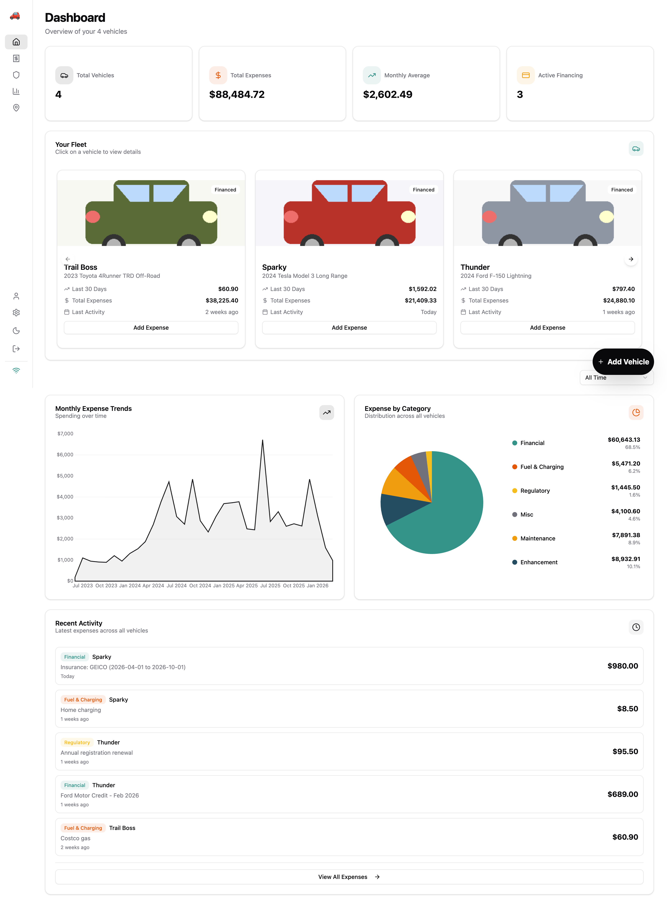
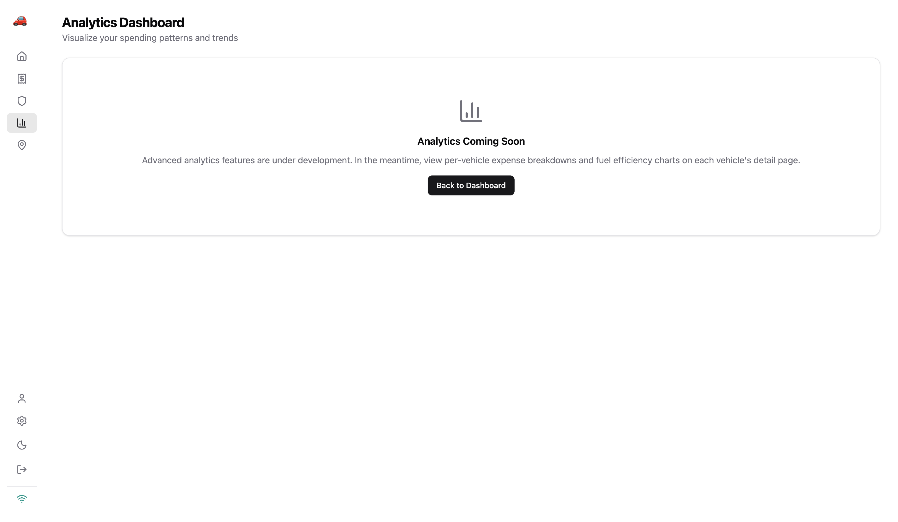
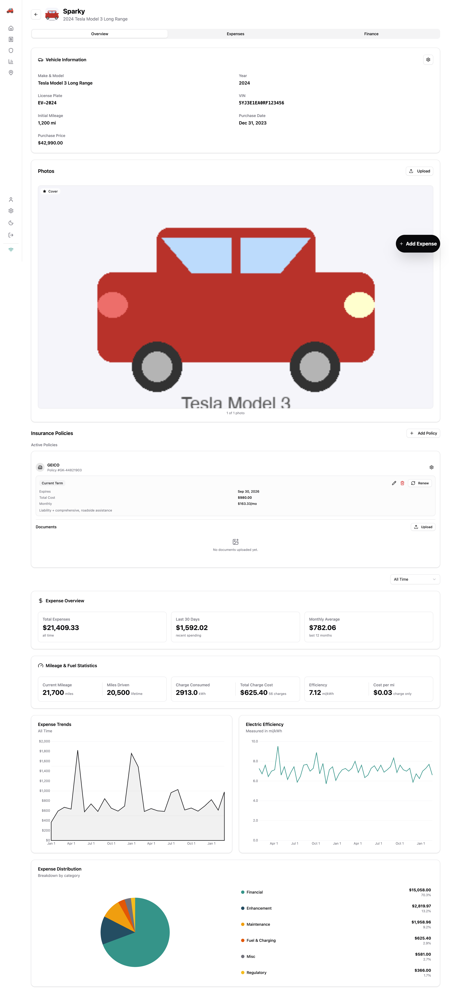
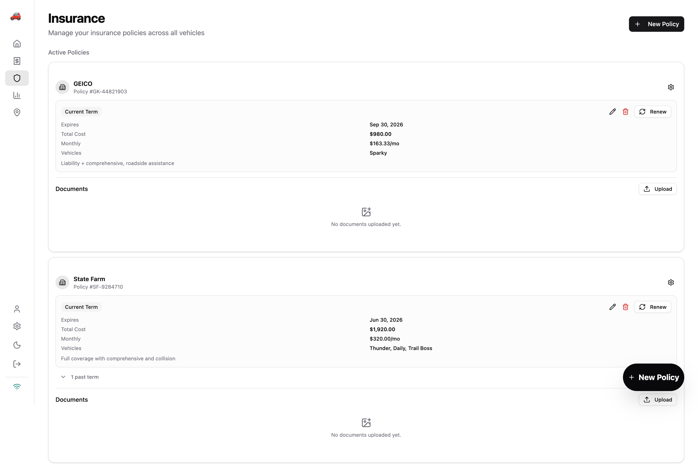
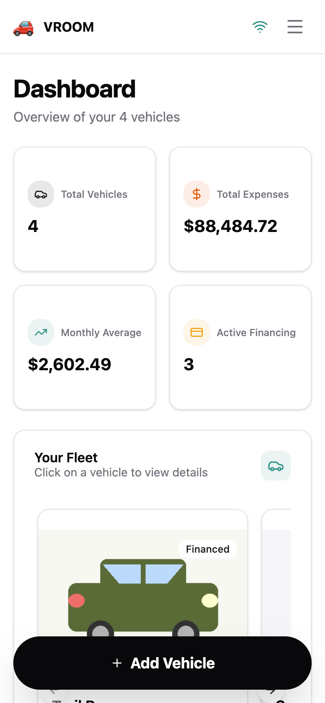

# VROOM Car Tracker


VROOM (Vehicle Record & Organization Of Maintenance) — a modern, self-hostable car cost tracking and visualization web app with mobile-first design and comprehensive expense analytics.

> ⚠️ **This project is under rapid development.** Features, APIs, and database schemas may change between releases. Back up your data regularly via Google Drive sync. If you're self-hosting, pin to a specific image tag rather than `latest` for stability.

## Why VROOM?

- **Open Source** — fork, customize, and host it yourself with full control over your data
- **Open Format** — data stored in standard CSV format via Google Drive backup, zero lock-in
- **Google Drive Integration** — your data syncs directly to your Google Drive
- **Privacy First** — no third-party data storage; everything lives on your server and your Drive

## Screenshots

| Dashboard | Analytics |
|---|---|
|  |  |

| Vehicle Detail | Expenses |
|---|---|
|  |  |

| Insurance | Mobile View |
|---|---|
|  |  |

## Tech Stack

| Layer | Technologies |
|---|---|
| Frontend | SvelteKit, Svelte 5 (runes), Tailwind CSS v4, shadcn-svelte (bits-ui), layerchart, Zod, Vitest + Playwright |
| Backend | Hono on Bun, Drizzle ORM + SQLite, Lucia Auth (Google OAuth), Biome |
| Infra | Docker, GitHub Actions CI/CD, GitHub Container Registry |

## Quick Start

### Prerequisites

- [Bun](https://bun.sh/) (backend runtime)
- Node.js 22+ (frontend — see `.nvmrc`)
- Docker 20.10+ (optional, for containerized deployment)

### Local Development

```bash
# Use correct Node version
nvm use

# Backend
cd backend
bun install
cp .env.example .env   # configure Google OAuth credentials
bun run db:push         # apply migrations
bun run dev             # http://localhost:3001

# Frontend (separate terminal)
cd frontend
npm install
cp .env.example .env    # set PUBLIC_API_URL=http://localhost:3001
npm run dev             # http://localhost:5173
```

### Docker (Production)

```bash
cp docs/examples/.env.example .env    # configure all required env vars
cp docs/examples/docker-compose.yml .
docker-compose -f docker-compose.yml up -d
# Frontend: http://localhost:3000
# Backend:  http://localhost:3001
```

See the [Deployment Guide](docs/deployment.md) for full instructions.

## Project Structure

```
vroom/
├── backend/              # Bun + Hono API server
│   ├── src/
│   │   ├── api/          # Domain modules (auth, vehicles, expenses, financing, insurance, settings, sync)
│   │   ├── db/           # Schema, connection, migrations, seeding
│   │   ├── middleware/    # Auth, rate-limit, error-handler, idempotency, body-limit, activity
│   │   ├── utils/        # Calculations, logger, validation, unit-conversions, vehicle-stats
│   │   ├── config.ts     # Environment config with Zod validation
│   │   ├── errors.ts     # Error classes and handlers
│   │   ├── types.ts      # Shared TypeScript types
│   │   └── index.ts      # App entry point
│   └── drizzle/          # SQL migrations
├── frontend/             # SvelteKit PWA
│   ├── src/
│   │   ├── lib/
│   │   │   ├── components/   # Domain components + shadcn-svelte ui/
│   │   │   ├── services/     # API client + domain services
│   │   │   ├── stores/       # Svelte stores (app, auth, offline, settings)
│   │   │   ├── types/        # TypeScript types
│   │   │   ├── utils/        # Shared utilities
│   │   │   ├── constants/    # App constants
│   │   │   └── hooks/        # Svelte 5 reactive hooks
│   │   └── routes/           # SvelteKit file-based routing
│   └── e2e/                  # Playwright E2E tests
├── docs/                 # Documentation (wiki-compatible)
│   └── examples/         # Docker Compose, Portainer stack, .env template
└── .github/workflows/    # CI/CD pipeline
```

## Documentation

| Document | Description |
|---|---|
| [Architecture](docs/architecture.md) | System design, data flow, patterns, and module responsibilities |
| [Development Guide](docs/development.md) | Local setup, workflow, testing, and code style |
| [Deployment Guide](docs/deployment.md) | Docker, self-hosting, reverse proxy, SSL, and maintenance |
| [Troubleshooting](docs/troubleshooting.md) | Common issues and solutions |

These docs are also compatible with [GitHub Wiki](https://docs.github.com/en/communities/documenting-your-project-with-wikis) — see `docs/Home.md` and `docs/_Sidebar.md`.

## Features

- 📱 Mobile-first PWA with offline support
- 🚗 Multi-vehicle tracking (gas, electric, hybrid)
- 📊 Interactive analytics and cost visualization
- ⛽ Fuel efficiency tracking
- 💰 Financing and insurance management
- 🔐 Google OAuth authentication
- 💾 Google Drive backup + Google Sheets sync
- � Docker-ready self-hosting

## Contributing

1. Fork the repository
2. Create a feature branch (`git checkout -b feature/your-feature`)
3. Follow [conventional commits](https://www.conventionalcommits.org/) (`feat:`, `fix:`, `docs:`, etc.)
4. Run validation before pushing:
   - Backend: `bun run all:fix && bun run validate`
   - Frontend: `npm run all:fix && npm run validate`
5. Open a pull request

## License

MIT License — see [LICENSE](LICENSE) for details.
